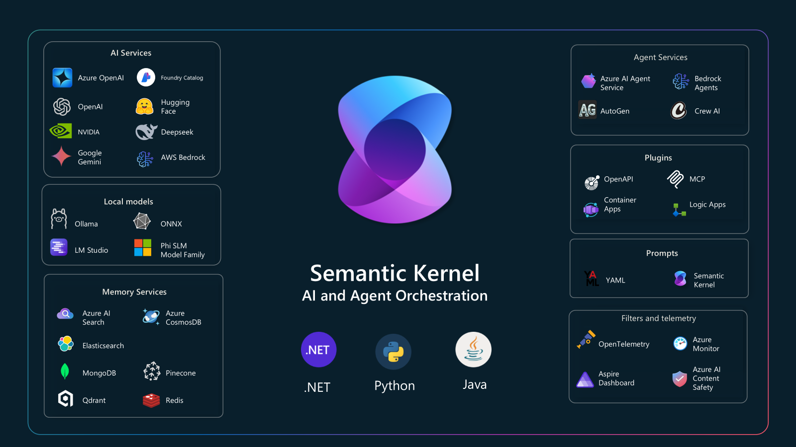

# AIP Maker Day: Semantic Kernel 101



This is the project template for the exercise to create a _Semantic Kernel_ agent as part of **AIP Maker Day: Semantic Kernel 101**

[Detailed exercise instructions have been shared in this _Loop_.](https://microsoft.sharepoint.com/:fl:/s/d7d62e80-5c91-4983-b6e6-99fd6f434c15/EVoJdTVyY4dAtQneMf4X0YUBrkIOXFSj-ITNNdHor4xQsA?e=yGRoWs&nav=cz0lMkZzaXRlcyUyRmQ3ZDYyZTgwLTVjOTEtNDk4My1iNmU2LTk5ZmQ2ZjQzNGMxNSZkPWIhQ3pnR2N1RXBtazJlcjFTSEw0bkxyamZSMnpjR0tuQlBpSlBNUWRhY3lyQW1ENTF6dTVxUlRwWnR6Z2VYU0R4SyZmPTAxWFhFRDQ2SzJCRjJUSzRURFE1QUxLQ082R0g3QlBVTUYmYz0lMkYmZmx1aWQ9MSZhPUxvb3BBcHAmcD0lNDBmbHVpZHglMkZsb29wLXBhZ2UtY29udGFpbmVyJng9JTdCJTIydyUyMiUzQSUyMlQwUlRVSHh0YVdOeWIzTnZablF1YzJoaGNtVndiMmx1ZEM1amIyMThZaUZEZW1kSFkzVkZjRzFyTW1WeU1WTklURFJ1VEhKcVpsSXllbU5IUzI1Q1VHbEtVRTFSWkdGamVYSkJiVVExTVhwMU5YRlNWSEJhZEhwblpWaFRSSGhMZkRBeFdGaEZSRFEyVGxkSlNEZEhSa05IVWsxU1JVdzNWamRVU2pRMVMxZFhWRkUlM0QlMjIlMkMlMjJpJTIyJTNBJTIyZDZiMzA0ODEtZDUyYy00NzgwLWEwNTktY2M1ZmRlMWVmZTk3JTIyJTdE)


### Alternative Path

This exercise is based on using a `ChatCompletionAgent` so that it is able to target the `gpt-4o` model resource shared for **AIP Maker Day** (hosted on _Azure OpenAI Services_).

It is possible to do the exercise with an `AzureAIAgent` (_Foundry Agent_), but you'll need access to a Foundry Project.

Consider the following to complete this exercise using a `AzureAIAgent`:

1. Configuration must define the connection string for a _Foundry Project_.
    ```csharp
    dotnet user-secrets set "AzureAI:ConnectionString" "<foundry project connection string>"
    ```

2. Create an [`AgentsClient`](https://github.com/Azure/azure-sdk-for-net/blob/main/sdk/ai/Azure.AI.Projects/samples/Sample7_Agent_Basics.md) instead of configuring a `Kernel` for chat-completion.

3. Use the `AgentsClient` to either create a new _Foundry Agent_ (`CreateAgentAsync`) or get an existing one (`GetAgentAsync`).

4. Constructing a new `AzureAIAgent` requires both an `AgentClient` and a _Foundry Agent_ definition.


> NOTE: There are a couple type names that are used in both the _Azure AI Projects SDK_ and _Semantic Kernel Agent Framework_, namely `Agent` & `AgentThread`.

