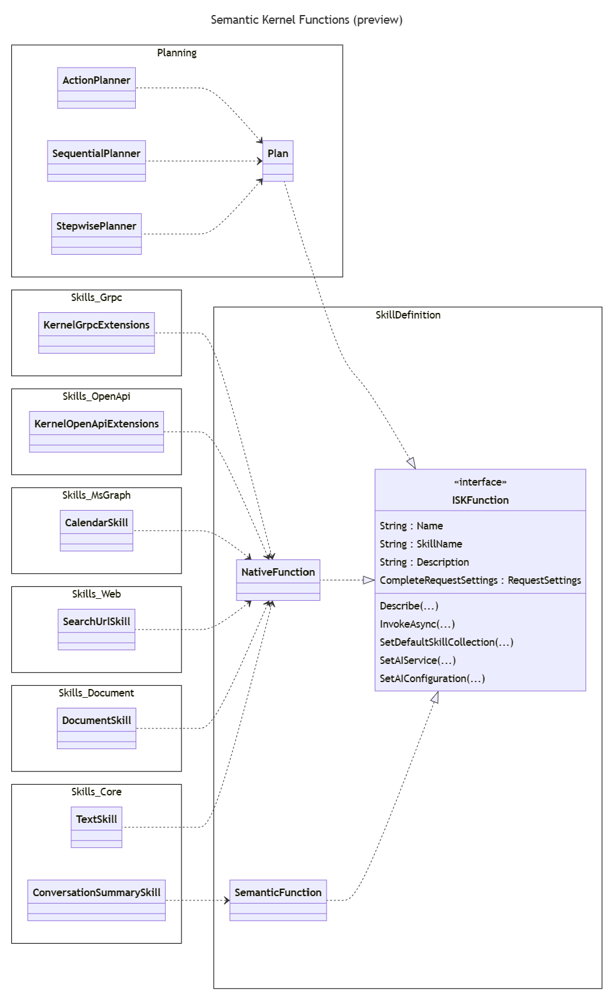
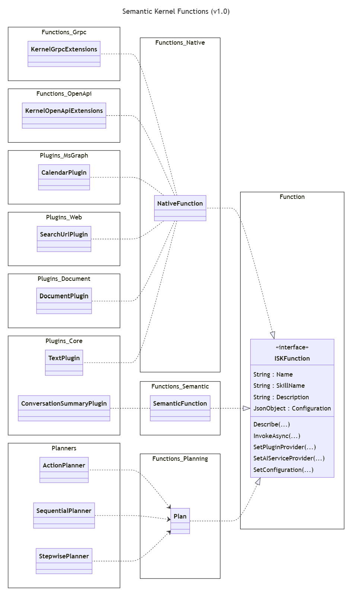

---

# These are optional elements. Feel free to remove any of them

status: proposed
date: {YYYY-MM-DD when the decision was last updated}
deciders: shawncal
consulted: semenshi, dmytrostruk, rbarreto, lemiller
informed: {list everyone who is kept up-to-date on progress; and with whom there is a one-way communication}
---

# DotNet Project Structure for 1.0 Release

## Context and Problem Statement

- Provide a cohesive, well-defined set of assemblies that developers can easily combine based on their needs.
  - Semantic Kernel core should only contain functionality related to AI orchestration
    - Remove prompt template engine and semantic functions
  - Semantic Kernel abstractions should only interfaces, abstract classes and minimal classes to support these
- Remove `Skills` naming from NuGet packages and replace with `Plugins`
  - Clearly distinguish between plugin implementations (`Skills.MsGraph`) and plugin integration (`Skills.OpenAPI`)
- Have consistent naming for assemblies and their root namespaces
  - See [Naming Patterns](#naming-patterns) section for examples of current patterns

### Current Project Structure

```text
SK-dotnet
├── samples/
└── src/
    ├── connectors/
    │   ├── Connectors.AI.OpenAI*
    │   ├── Connectors...
    │   └── Connectors.UnitTests
    ├── extensions/
    │   ├── Planner.ActionPlanner*
    │   ├── Planner.SequentialPlanner*
    │   ├── Planner.StepwisePlanner
    │   ├── TemplateEngine.PromptTemplateEngine*
    │   └── Extensions.UnitTests
    ├── InternalUtilities/
    ├── skills/
    │   ├── Skills.Core
    │   ├── Skills.Document
    │   ├── Skills.Grpc
    │   ├── Skills.MsGraph
    │   ├── Skills.OpenAPI
    │   ├── Skills.Web
    │   └── Skills.UnitTests
    ├── IntegrationTests
    ├── SemanticKernel*
    ├── SemanticKernel.Abstractions*
    ├── SemanticKernel.MetaPackage
    └── SemanticKernel.UnitTests
```

\\* - Means the project is part of the Semantic Kernel meta package

### Project Descriptions

| Project                             | Description |
|-------------------------------------|-------------|
| Connectors.AI.OpenAI                | Azure OpenAI and OpenAI service connectors |
| Connectors...                       | Collection of other AI service connectors, some of which will move to another repository |
| Connectors.UnitTests                | Connector unit tests |
| Planner.ActionPlanner               | Semantic Kernel implementation of an action planner |
| Planner.SequentialPlanner           | Semantic Kernel implementation of a sequential planner |
| Planner.StepwisePlanner             | Semantic Kernel implementation of a stepwise planner |
| TemplateEngine.PromptTemplateEngine | Prompt template engine implementation which is used by Semantic Functions only |
| Extensions.UnitTests                | Extensions unit tests |
| InternalUtilities                   | Internal utilities which are reused by multiple NuGet packages (all internal)  |
| Skills.Core                         | Core set of native functions which are provided to support Semantic Functions |
| Skills.Document                     | Native functions for interacting with Microsoft documents |
| Skills.Grpc                         | Semantic Kernel integration for GRPC based endpoints |
| Skills.MsGraph                      | Native functions for interacting with Microsoft Graph endpoints |
| Skills.OpenAPI                      | Semantic Kernel integration for OpenAI endpoints and reference Azure Key Vault implementation |
| Skills.Web                          | Native functions for interacting with Web endpoints e.g., Bing, Google, File download |
| Skills.UnitTests                    | Skills unit tests |
| IntegrationTests                    | Semantic Kernel integration tests |
| SemanticKernel                      | Semantic Kernel core implementation |
| SemanticKernel.Abstractions         | Semantic Kernel abstractions i.e., interface, abstract classes, supporting classes, ... |
| SemanticKernel.MetaPackage          | Semantic Kernel meta package i.e., a NuGet package that references other required Semantic Kernel NuGet packages |
| SemanticKernel.UnitTests            | Semantic Kernel unit tests |

### Naming Patterns

Below are some different examples of Assembly and root namespace naming that are used in the projects.

```xml
    <AssemblyName>Microsoft.SemanticKernel.Abstractions</AssemblyName>
    <RootNamespace>Microsoft.SemanticKernel</RootNamespace>

    <AssemblyName>Microsoft.SemanticKernel.Core</AssemblyName>
    <RootNamespace>Microsoft.SemanticKernel</RootNamespace>

    <AssemblyName>Microsoft.SemanticKernel.Planning.ActionPlanner</AssemblyName>
    <RootNamespace>Microsoft.SemanticKernel.Planning.Action</RootNamespace>

    <AssemblyName>Microsoft.SemanticKernel.Skills.Core</AssemblyName>
    <RootNamespace>$(AssemblyName)</RootNamespace>
```

### Current Folder Structure

```text
dotnet/
├── samples/
│   ├── ApplicationInsightsExample/
│   ├── KernelSyntaxExamples/
│   └── NCalcSkills/
└── src/
    ├── Connectors/
    │   ├── Connectors.AI.OpenAI*
    │   ├── Connectors...
    │   └── Connectors.UnitTests
    ├── Extensions/
    │   ├── Planner.ActionPlanner
    │   ├── Planner.SequentialPlanner
    │   ├── Planner.StepwisePlanner
    │   ├── TemplateEngine.PromptTemplateEngine
    │   └── Extensions.UnitTests
    ├── InternalUtilities/
    ├── Skills/
    │   ├── Skills.Core
    │   ├── Skills.Document
    │   ├── Skills.Grpc
    │   ├── Skills.MsGraph
    │   ├── Skills.OpenAPI
    │   ├── Skills.Web
    │   └── Skills.UnitTests
    ├── IntegrationTests/
    ├── SemanticKernel/
    ├── SemanticKerne.Abstractions/
    ├── SemanticKernel.MetaPackage/
    └── SemanticKernel.UnitTests/

```

### Semantic Kernel Skills and Functions

This diagram show current skills are integrated with the Semantic Kernel core.

***Note:***

- This is not a true class hierarchy diagram. It show some class relationships and dependencies.
- Namespaces are abbreviated to remove Microsoft.SemanticKernel prefix. Namespaces use `_` rather than `.`.



## Decision Drivers

- Avoid having too many assemblies because of impact of signing these and to reduce complexity
- Follow .Net naming guidelines
  - [Names of Assemblies and DLLs](https://learn.microsoft.com/en-us/dotnet/standard/design-guidelines/names-of-assemblies-and-dlls)
  - [Names of Namespaces](https://learn.microsoft.com/en-us/dotnet/standard/design-guidelines/names-of-namespaces)

## Considered Options

- Option #1: New `planning`, `functions` and `plugins` project areas
- Option #2: Folder naming matches assembly name
- … <!-- numbers of options can vary -->

In all cases the following changes will be made:

- Move non core Connectors to a separate repository
- Merge prompt template engine and semantic functions into a single package

## Decision Outcome

Chosen option: "{title of option 1}", because
{justification. e.g., only option, which meets k.o. criterion decision driver | which resolves force {force} | … | comes out best (see below)}.

Main categories for the projects will be:

1. `Connectors`: ***A connector project allows the Semantic Kernel to connect to AI and Memory services***. Some of the existing connector projects may move to other repositories.
1. `Planners`: ***A planner project provides one or more planner implementations which take an ask and convert it into an executable plan to achieve that ask***. This category will include the current action, sequential and stepwise planners (these could be merged into a single project). Additional planning implementations e.g., planners that generate Powershell or Python code can be added as separate projects.
1. `Functions`: ***A function project that enables the Semantic Kernel to access the functions it will orchestrate***. This category will include:
    1. Semantic functions i.e., prompts executed against an LLM
    1. GRPC remote procedures i.e., procedures executed remotely using the GRPC framework
    1. Open API endpoints i.e., REST endpoints that have Open API definitions executed remotely using the HTTP protocol
1. `Plugins`: ***A plugin project contains the implementation(s) of a Semantic Kernel plugin***. A Semantic Kernel plugin

### Option #1: New `planning`, `functions` and `plugins` project areas

```text
SK-dotnet
├── samples/
└── src/
    ├── connectors/
    │   ├── Connectors.AI.OpenAI*
    │   ├── Connectors.AI.HuggingFace
    │   ├── Connectors.Memory.AzureCognitiveSearch
    │   ├── Connectors.Memory.Qdrant
    │   ├── ...
    │   └── Connectors.UnitTests
    ├── planners/
    │   ├── Planners.Action*
    │   ├── Planners.Sequential*
    │   └── Planners.Stepwise*
    ├── functions/
    │   ├── Functions.Native*
    │   ├── Functions.Semantic*
    │   ├── Functions.Planning*
    │   ├── Functions.Grpc
    │   ├── Functions.OpenAPI
    │   └── Functions.UnitTests
    ├── plugins/
    │   ├── Plugins.Core*
    │   ├── Plugins.Document
    │   ├── Plugins.MsGraph
    │   ├── Plugins.WebSearch
    │   └── Plugins.UnitTests
    ├── InternalUtilities/
    ├── IntegrationTests
    ├── SemanticKernel*
    ├── SemanticKernel.Abstractions*
    ├── SemanticKernel.MetaPackage
    └── SemanticKernel.UnitTests
```

### Changes

| Project                             | Description |
|-------------------------------------|-------------|
| `Functions.Native`                  | Extract native functions from Semantic Kernel core and abstractions. |
| `Functions.Semantic`                | Extract semantic functions from Semantic Kernel core and abstractions. Include the prompt template engine. |
| `Functions.Planning`                | Extract planning from Semantic Kernel core and abstractions. |
| `Functions.Grpc`                    | Old `Skills.Grpc` project |
| `Functions.OpenAPI`                 | Old `Skills.OpenAPI` project |
| `Plugins.Core`                      | Old `Skills.Core` project |
| `Plugins.Document`                  | Old `Skills.Document` project |
| `Plugins.MsGraph`                   | Old `Skills.MsGraph` project |
| `Plugins.WebSearch`                 | Old `Skills.WebSearch` project |

### Semantic Kernel Skills and Functions

This diagram how functions and plugins would be integrated with the Semantic Kernel core.



### Option #2: Folder naming matches assembly name

```text
SK-dotnet
├── samples/
└── src/
    ├── Microsoft.SemanticKernel.Connectors.AI.OpenAI*
    ├── Microsoft.SemanticKernel.Connectors.AI.HuggingFace
    ├── Microsoft.SemanticKernel.Connectors.Memory.AzureCognitiveSearch
    ├── Microsoft.SemanticKernel.Connectors.Memory.Qdrant
    │
    ├── Microsoft.SemanticKernel.Planners*
    │ 
    ├── Microsoft.SemanticKernel.Functions.Prompt|Semantic*
    ├── Microsoft.SemanticKernel.Functions.Grpc
    ├── Microsoft.SemanticKernel.Functions.OpenAPI
    │
    ├── Microsoft.SemanticKernel.Plugins.Core*
    ├── Microsoft.SemanticKernel.Plugins.Document
    ├── Microsoft.SemanticKernel.Plugins.MsGraph
    ├── Microsoft.SemanticKernel.Plugins.Web
    │
    ├── InternalUtilities
    │
    ├── IntegrationTests
    │
    ├── Microsoft.SemanticKernel.Core*
    ├── Microsoft.SemanticKernel.Abstractions*
    └── Microsoft.SemanticKernel.MetaPackage
```

***Note:*** Each project folder contains a `src` and `tests` folder.
