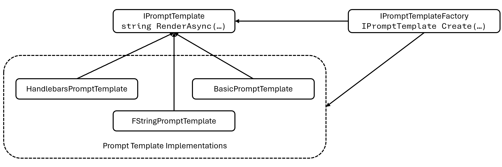

# Custom Prompt Template Formats

## Context and Problem Statement

Semantic Kernel currently supports a custom prompt template language that allows for variable interpolation and function execution.
Semantic Kernel allows for custom prompt template formats to be integrated e.g., prompt templates using [Handlebars](https://handlebarsjs.com/) syntax.

The purpose of this ADR is to describe how a custom prompt template formats will be supported in the Semantic Kernel.

### Current Design

By default the `Kernel` uses the `BasicPromptTemplateEngine` which supports the Semantic Kernel specific template format.

#### Code Patterns

Below is an expanded example of how to create a semantic function from a prompt template string which uses the built-in Semantic Kernel format:

```csharp
IKernel kernel = Kernel.Builder
    .WithPromptTemplateEngine(new BasicPromptTemplateEngine())
    .WithOpenAIChatCompletionService(
        modelId: openAIModelId,
        apiKey: openAIApiKey)
    .Build();

kernel.ImportFunctions(new TimePlugin(), "time");

string templateString = "Today is: {{time.Date}} Is it weekend time (weekend/not weekend)?";
var promptTemplateConfig = new PromptTemplateConfig();
var promptTemplate = new PromptTemplate(templateString, promptTemplateConfig, kernel.PromptTemplateEngine);
var kindOfDay = kernel.RegisterSemanticFunction("KindOfDay", promptTemplateConfig, promptTemplate);

var result = await kernel.RunAsync(kindOfDay);
Console.WriteLine(result.GetValue<string>());
```

We have an extension method `var kindOfDay = kernel.CreateSemanticFunction(promptTemplate);` to simplify the process to create and register a semantic function but the expanded format is shown above to highlight the dependency on `kernel.PromptTemplateEngine`.
Also the `BasicPromptTemplateEngine` is the default prompt template engine and will be loaded automatically if the package is available and not other prompt template engine is specified.

Some issues with this:

1. You need to have a `Kernel` instance to create a semantic function, which is contrary to one of the goals of allow semantic functions to be created once and reused across multiple `Kernel` instances.
1. `Kernel` only supports a single `IPromptTemplateEngine` so we cannot support using multiple prompt templates at the same time.
1. `IPromptTemplateEngine` is stateless and must perform a parse of the template for each render
1. Our semantic function extension methods relay on our implementation of `IPromptTemplate` (i.e., `PromptTemplate`) which stores the template string and uses the `IPromptTemplateEngine` to render it every time. Note implementations of `IPromptTemplate` are currently stateful as they also store the parameters.

#### Performance

The `BasicPromptTemplateEngine` uses the `TemplateTokenizer` to parse the template i.e. extract the blocks.
Then it renders the template i.e. inserts variables and executes functions. Some sample timings for these operations:

| Operation        | Ticks   | Milliseconds |
|------------------|---------|--------------|
| Extract blocks   | 1044427 | 103          |
| Render variables | 168     | 0            |

Sample template used was: `"{{variable1}} {{variable2}} {{variable3}} {{variable4}} {{variable5}}"`

**Note: We will use the sample implementation to support the f-string template format.**

Using `HandlebarsDotNet` for the same use case results in the following timings:

| Operation        | Ticks   | Milliseconds |
|------------------|---------|--------------|
| Compile template | 66277   | 6            |
| Render variables | 4173    | 0            |

**By separating the extract blocks/compile from the render variables operation it will be possible to optimise performance by compiling templates just once.**

#### Implementing a Custom Prompt Template Engine

There are two interfaces provided:

```csharp
public interface IPromptTemplateEngine
{
    Task<string> RenderAsync(string templateText, SKContext context, CancellationToken cancellationToken = default);
}

public interface IPromptTemplate
{
    IReadOnlyList<ParameterView> Parameters { get; }

    public Task<string> RenderAsync(SKContext executionContext, CancellationToken cancellationToken = default);
}
```

A prototype implementation of a handlebars prompt template engine could look something like this:

```csharp
public class HandlebarsTemplateEngine : IPromptTemplateEngine
{
    private readonly ILoggerFactory _loggerFactory;

    public HandlebarsTemplateEngine(ILoggerFactory? loggerFactory = null)
    {
        this._loggerFactory = loggerFactory ?? NullLoggerFactory.Instance;
    }

    public async Task<string> RenderAsync(string templateText, SKContext context, CancellationToken cancellationToken = default)
    {
        var handlebars = HandlebarsDotNet.Handlebars.Create();

        var functionViews = context.Functions.GetFunctionViews();
        foreach (FunctionView functionView in functionViews)
        {
            var skfunction = context.Functions.GetFunction(functionView.PluginName, functionView.Name);
            handlebars.RegisterHelper($"{functionView.PluginName}_{functionView.Name}", async (writer, hcontext, parameters) =>
                {
                    var result = await skfunction.InvokeAsync(context).ConfigureAwait(true);
                    writer.WriteSafeString(result.GetValue<string>());
                });
        }

        var template = handlebars.Compile(templateText);

        var prompt = template(context.Variables);

        return await Task.FromResult(prompt).ConfigureAwait(true);
    }
}
```

**Note: This is just a prototype implementation for illustration purposes only.**

Some issues:

1. The `IPromptTemplate` interface is not used and causes confusion.
1. There is no way to allow developers to support multiple prompt template formats at the same time.


There is one implementation of `IPromptTemplate` provided in the Semantic Kernel core package.
The `RenderAsync` implementation just delegates to the `IPromptTemplateEngine`.
The `Parameters` list get's populated with the parameters defined in the `PromptTemplateConfig` and any missing variables defined in the template.

#### Handlebars Considerations

Handlebars does not support dynamic binding of helpers. Consider the following snippet:

```csharp
HandlebarsHelper link_to = (writer, context, parameters) =>
{
    writer.WriteSafeString($"<a href='{context["url"]}'>{context["text"]}</a>");
};

string source = @"Click here: {{link_to}}";

var data = new
{
    url = "https://github.com/rexm/handlebars.net",
    text = "Handlebars.Net"
};

// Act
var handlebars = HandlebarsDotNet.Handlebars.Create();
handlebars.RegisterHelper("link_to", link_to);
var template = handlebars1.Compile(source);
// handlebars.RegisterHelper("link_to", link_to); This also works
var result = template1(data);
```

Handlebars allows the helpers to be registered with the `Handlebars` instance either before or after a template is compiled.
The optimum would be to have a shared `Handlebars` instance for a specific collection of functions and register the helpers just once.
For use cases where the Kernel function collection may have been mutated we will be forced to create a `Handlebars` instance at render time
and then register the helpers. This means we cannot take advantage of the performance improvement provided by compiling the template.

## Decision Drivers

In no particular order:

* Support creating a semantic function without a `IKernel`instance.
* Support late binding of functions i.e., having functions resolved when the prompt is rendered.
* Support allowing the prompt template to be parsed (compiled) just once to optimize performance if needed.
* Support using multiple prompt template formats with a single `Kernel` instance.
* Provide simple abstractions which allow third parties to implement support for custom prompt template formats.

## Considered Options

* Obsolete `IPromptTemplateEngine` and replace with `IPromptTemplateFactory`.
* 

### Obsolete `IPromptTemplateEngine` and replace with `IPromptTemplateFactory`



Below is an expanded example of how to create a semantic function from a prompt template string which uses the built-in Semantic Kernel format:

```csharp
// Semantic function can be created once
var promptTemplateFactory = new BasicPromptTemplateFactory();
string templateString = "Today is: {{time.Date}} Is it weekend time (weekend/not weekend)?";
var promptTemplateConfig = new PromptTemplateConfig();
// Line below will replace the commented out code
var promptTemplate = promptTemplateFactory.CreatePromptTemplate(templateString, promptTemplateConfig);
var kindOfDay = ISKFunction.CreateSemanticFunction("KindOfDay", promptTemplateConfig, promptTemplate)
// var promptTemplate = new PromptTemplate(promptTemplate, promptTemplateConfig, kernel.PromptTemplateEngine);
// var kindOfDay = kernel.RegisterSemanticFunction("KindOfDay", promptTemplateConfig, promptTemplate);

// Create Kernel after creating the semantic function
// Later we will support passing a function collection to the KernelBuilder
IKernel kernel = Kernel.Builder
    .WithOpenAIChatCompletionService(
        modelId: openAIModelId,
        apiKey: openAIApiKey)
    .Build();

kernel.ImportFunctions(new TimePlugin(), "time");
// Optionally register the semantic function with the Kernel
kernel.RegisterCustomFunction(kindOfDay);

var result = await kernel.RunAsync(kindOfDay);
Console.WriteLine(result.GetValue<string>());
```

**Notes:**

* `BasicPromptTemplateFactory` will be the default implementation and will be automatically provided in `KernelSemanticFunctionExtensions`. Developers will also be able to provide their own implementation.
* The factory uses the new `PromptTemplateConfig.TemplateFormat` to create the appropriate `IPromptTemplate` instance.
* We should look to remove `promptTemplateConfig` as a parameter to `CreateSemanticFunction`. That change is outside of the scope of this ADR.

The `BasicPromptTemplateFactory` and `BasicPromptTemplate` implementations look as follows:

```csharp
public sealed class BasicPromptTemplateFactory : IPromptTemplateFactory
{
    private readonly IPromptTemplateFactory _promptTemplateFactory;
    private readonly ILoggerFactory _loggerFactory;

    public BasicPromptTemplateFactory(IPromptTemplateFactory promptTemplateFactory, ILoggerFactory? loggerFactory = null)
    {
        this._promptTemplateFactory = promptTemplateFactory;
        this._loggerFactory = loggerFactory ?? NullLoggerFactory.Instance;
    }

    public IPromptTemplate? CreatePromptTemplate(string templateString, PromptTemplateConfig promptTemplateConfig)
    {
        if (promptTemplateConfig.TemplateFormat.Equals(PromptTemplateConfig.SEMANTICKERNEL, System.StringComparison.Ordinal))
        {
            return new BasicPromptTemplate(templateString, promptTemplateConfig, this._loggerFactory);
        }
        else if (this._promptTemplateFactory is not null)
        {
            return this._promptTemplateFactory.CreatePromptTemplate(templateString, promptTemplateConfig);
        }

        throw new SKException($"Invalid prompt template format {promptTemplateConfig.TemplateFormat}");
    }
}

public sealed class BasicPromptTemplate : IPromptTemplate
{
    public BasicPromptTemplate(string templateString, PromptTemplateConfig promptTemplateConfig, ILoggerFactory? loggerFactory = null)
    {
        this._loggerFactory = loggerFactory ?? NullLoggerFactory.Instance;
        this._logger = this._loggerFactory.CreateLogger(typeof(BasicPromptTemplate));
        this._templateString = templateString;
        this._promptTemplateConfig = promptTemplateConfig;
        this._parameters = new(() => this.InitParameters());
        this._blocks = new(() => this.ExtractBlocks(this._templateString));
        this._tokenizer = new TemplateTokenizer(this._loggerFactory);
    }

    public IReadOnlyList<ParameterView> Parameters => this._parameters.Value;

    public async Task<string> RenderAsync(SKContext executionContext, CancellationToken cancellationToken = default)
    {
        return await this.RenderAsync(this._blocks.Value, executionContext, cancellationToken).ConfigureAwait(false);
    }

    // Not showing the implementation details
}
```

**Note:**

* The call to `ExtractBlocks` is called lazily once for each prompt template
* The `RenderAsync` doesn't need to extract the blocks every time

## Decision Outcome

Chosen option: "Obsolete `IPromptTemplateEngine` and replace with `IPromptTemplateFactory`", because
addresses the requirements and provides good flexibility for the future.
