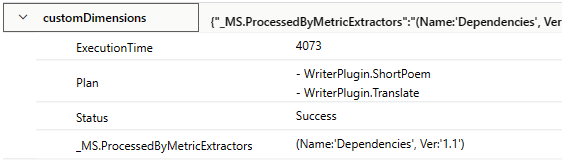
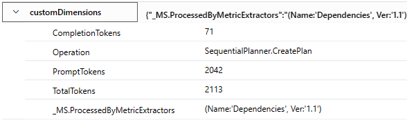
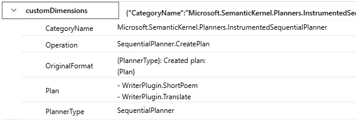

# Planner Telemetry Enhancement

## Context and Problem Statement

It would be extremely beneficial for applications using Semantic Kernel' planning features to be able to continuously monitor the performance of planners and plans.

## Scenarios

Contoso is a company that is developing an AI application using SK.

1. Contoso needs to continuously monitor the token usage of a particular planner, including prompt tokens, completion tokens, and the total tokens.
2. Contoso needs to continuously monitor the time it takes for a particular planner to create a plan.
3. Contoso needs to continuously monitor the success rate of a particular planner in creating a valid plan.
4. Contoso needs to continuously monitor the success rate of a particular plan type being executed successfully.
5. Contoso wants to be able to see the token usage of a particular planner run.
6. Contoso wants to be able to see the time taken to create a plan of a particular planner run.
7. Contoso wants to be able to see the steps in a plan.
8. Contoso wants to be able to see the inputs&outputs of each plan step.
9. Contoso wants to change a few settings that may affect the performance of the planners. They would like to know how the performance will be affected before committing the changes.
10. Contoso wants to update to a new model that is cheaper and faster. They would like to know how the new model performs in planning tasks.

## Out of scope

1. We provide an example on how to send telemetry to Application Insights. Although other telemetry service options are supported technically, we will not cover possible ways of setting them up in this ADR.
2. This ADR does not seek to modify the current instrumentation design in SK.

## Decision Drivers

- The framework should be telemetry service agnostic.
- Enabling and disabling specific telemetry items should require minimum effort.

## Difficulties

- SK currently produces metrics for token usage. However, they are not categorized. Thus, there is no way for developers to know the toke usage used by different operations.

## Considered Options

- Function hooks
  - Inject logic to functions that will get executed before or after a function is invoked.
- Distributed tracing
  - Activity tags & Metrics
    - Use activities to record individual operations.
    - Use tags in activities to record custom information.
    - Use baggage in activities to more easily correlate dependencies.
    - Use metrics to continuously monitor performance.
    - Use tags in metrics to categorize metrics.
  - Logging & Metrics
    - Use logging to record custom information for individual operations.
    - Use metrics to continuously monitor performance.
    - Use tags in metrics to categorize metrics.

## Decision Outcome

TBD

## Validation

Tests can be added to make sure that all the expected telemetry items are in place and of the correct format.

## Description the Options

### Function hooks

Function hooks allow developers to inject logic to kernel that will be executed before or after a function is invoked. Example use cases include logging the function input before a function is invoked, and logging results after the function returns.
For more information, please refer to the following ADRs:

1. [Kernel Hooks Phase 1](./0005-kernel-hooks-phase1.md)
2. [Kernel Hooks Phase 2](./0018-kernel-hooks-phase2.md)

This approach will automatically inject default callbacks that sends telemetry data to a telemetry service for all functions when the feature is turned on.

Pros:

1. Maximum exposure and flexibility to the developers. i.e. App developers can very easily what additional information is needed for individual functions by adding more callbacks.

Cons:

1. Does not use the existing System.Diagnostic framework that has been set up in the kernel. i.e. InstrumentedSKFunction, InstrumentedPlan, and InstrumentedPlanner.
2. Does not provide the full trace detail.
3. Difficult to create a telemetry service agnostic solution.

> Note: With distributed tracing and function hook already set up in SK, it's up to the developers to log additional information as telemetry, provided that the information is available in the hooks.

### Distributed tracing

Distributed tracing is a diagnostic technique that can localize failures and performance bottlenecks within distributed applications. .Net has native support to add distributed tracing in your libraries and .Net libraries are also instrumented to produce distributed tracing information automatically.

For more information, please refer to this document: [.Net distributed tracing](https://learn.microsoft.com/en-us/dotnet/core/diagnostics/)

Overall pros:

1. Native .Net support and the kernel has set this up.
2. Telemetry service agnostic.

Overall cons:

1. Less flexibility for app developers to add custom traces and metrics.

#### Metrics

Pros:

1. Easy to use for continuous monitoring.
2. Has been set up in SK.

Cons: No additional cons identified given the scope of this document.

#### Activity tags & baggage

```csharp
// In the instrumented planner
activity?.AddBaggage("Operation", $"{PlannerType}.CreatePlan");

try
{
  ...
  // If planner runs successfully
  activity?.AddTag("Status", "Success");

  // If it's in debugging mode
  // Due to privacy concerns, we need to make certain telemetry items optional.
  activity?.AddTag("Goal", goal);
  activity?.AddTag("Plan", plan.ToSafePlanString());
  activity?.AddTag("ExecutionTime", duration);
}
catch(...)
{
  // If planner fails
  activity?.AddTag("Status", "Failed");
}
```

```csharp
// In Connectors.AI.OpenAI ClientBase.cs
private static readonly ActivitySource s_activitySource = new(typeof(ClientBase).FullName);

// In internal GetTextResults and GetChatResults calls
using var activity = s_activitySource.StartActivity($"{this.GetType().Name}.GetTextResults");
if (activity?.GetBaggageItem("Operation") is not null)
{
    activity?.AddTag("Operation", activity.GetBaggageItem("Operation"));
}
```

In an application that uses SK and sends telemetry to Application Insights:

```csharp
using var traceProvider = Sdk.CreateTracerProviderBuilder()
  .AddSource("Microsoft.SemanticKernel.*")
  .AddAzureMonitorTraceExporter(options => options.ConnectionString = connectionString)
  .Build();

using var meterProvider = Sdk.CreateMeterProviderBuilder()
  .AddMeter("Microsoft.SemanticKernel.*")
  .AddAzureMonitorMetricExporter(options => options.ConnectionString = connectionString)
  .Build();

using var loggerFactory = LoggerFactory.Create(builder =>
{
  // Add OpenTelemetry as a logging provider
  builder.AddOpenTelemetry(options =>
  {
    options.AddAzureMonitorLogExporter(options => options.ConnectionString = connectionString);
    // Format log messages. This is default to false.
    options.IncludeFormattedMessage = true;
  });
  builder.SetMinimumLevel(MinLogLevel);
});
```

The above produces dependency information similar to the screenshot below:





Pros:

1. Easy to add custom data.
2. Semi-structured data organized by tags.
3. Automatically correlated from parent to chid items. Baggage makes it even easier for querying.

Cons:

1. Everything has to a string.

#### Log

```csharp
this._logger.LogTrace("{PlannerType}: Created plan with details: \n {Plan}", PlannerType, plan.ToPlanString());
```

The above produces trace information similar to the screenshot below:



Cons:

1. More contexture information.

Pros:

1. Logs are modified more frequently.
2. Log configuration will affect what telemetry the libraries produce.
3. More difficult to correlate telemetry items during query time.

## More Information

The current design of the instrumented planner does not allow token usages to be propagated upward for instrumentation. Thus, we need to correlate planner operations and model call operations.
