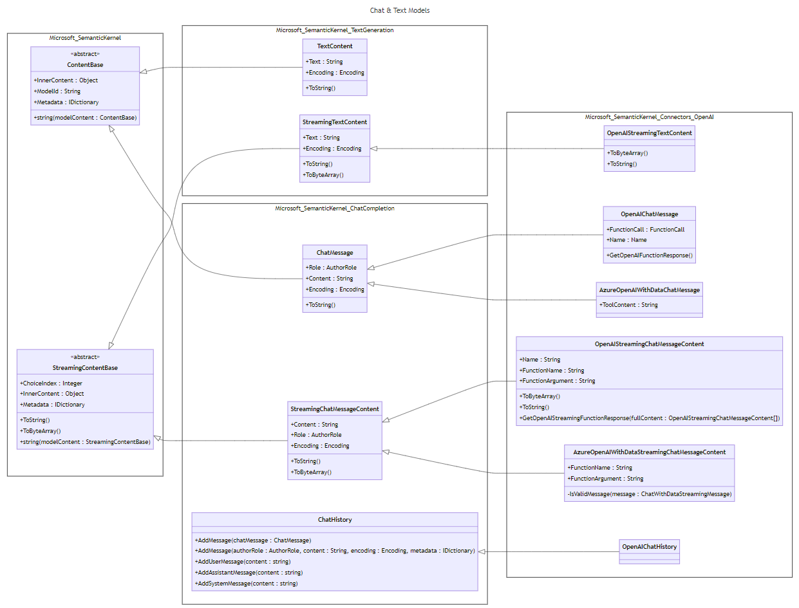

---
# These are optional elements. Feel free to remove any of them.
status: accepted
contact: dmytrostruk
date: 2023-12-08
deciders: SergeyMenshykh, markwallace, rbarreto, mabolan, stephentoub, dmytrostruk
consulted: 
informed: 
---
# Chat Models

## Context and Problem Statement

In latest OpenAI API, `content` property of `chat message` object can accept two types of values `string` or `array` ([Documentation](https://platform.openai.com/docs/api-reference/chat/create)).

We should update current implementation of `ChatMessageContent` class with `string Content` property to support this API.

## Decision Drivers

1. New design should not be coupled to OpenAI API and should work for other AI providers.
2. Naming of classes and properties should be consistent and intuitive.

## Considered Options

Some of the option variations can be combined.

### Option #1: Naming updates and new data type for `chat message content`

Since `chat message content` can be an object now instead of `string`, it requires reserved name for better understanding in domain.

1. `ChatMessageContent` will be renamed to `ChatMessage`. (Same for `StreamingChatMessageContent`).
2. `GetChatMessageContent` methods will be renamed to `GetChatMessage`.
3. New abstract class `ChatMessageContent` that will have property `ChatMessageContentType Type` with values `text`, `image`. (Will be extended with `audio`, `video` in the future).
4. `ChatMessage` will contain collection of `ChatMessageContent` objects `IList<ChatMessageContent> Contents`.
5. There will be concrete implementations of `ChatMessageContent` - `ChatMessageTextContent` and `ChatMessageImageContent`.

New _ChatMessageContentType.cs_

```csharp
public readonly struct ChatMessageContentType : IEquatable<ChatMessageContentType>
{
    public static ChatMessageContentType Text { get; } = new("text");

    public static ChatMessageContentType Image { get; } = new("image");

    public string Label { get; }

    // Implementation of `IEquatable`...
}
```

New _ChatMessageContent.cs_

```csharp
public abstract class ChatMessageContent
{
    public ChatMessageContentType Type { get; set; }

    public ChatMessageContent(ChatMessageContentType type)
    {
        this.Type = type;
    }
}
```

Updated _ChatMessage.cs_:

```csharp
public class ChatMessage : ContentBase
{
    public AuthorRole Role { get; set; }

    public IList<ChatMessageContent> Contents { get; set; }
```

New _ChatMessageTextContent.cs_

```csharp
public class ChatMessageTextContent : ChatMessageContent
{
    public string Text { get; set; }

    public ChatMessageTextContent(string text) : base(ChatMessageContentType.Text)
    {
        this.Text = text;
    }
}
```

New _ChatMessageImageContent.cs_

```csharp
public class ChatMessageImageContent : ChatMessageContent
{
    public Uri Uri { get; set; }

    public ChatMessageImageContent(Uri uri) : base(ChatMessageContentType.Image)
    {
        this.Uri = uri;
    }
}
```

Usage:

```csharp
var chatHistory = new ChatHistory("You are friendly assistant.");

// Construct request
var userContents = new List<ChatMessageContent>
{
    new ChatMessageTextContent("What's in this image?"),
    new ChatMessageImageContent(new Uri("https://link-to-image.com"))
};

chatHistory.AddUserMessage(userContents);

// Get response
var message = await chatCompletionService.GetChatMessageAsync(chatHistory);

foreach (var content in message.Contents)
{
    // Possibility to get content type (text or image).
    var contentType = content.Type;

    // Cast for specific content type
    // Extension methods can be provided for better usability 
    // (e.g. message GetContent<ChatMessageTextContent>()).
    if (content is ChatMessageTextContent textContent)
    {
        Console.WriteLine(textContent);
    }

    if (content is ChatMessageImageContent imageContent)
    {
        Console.WriteLine(imageContent.Uri);
    }
}
```

### Option #2: Avoid renaming and new data type for `chat message content`

Same as Option #1, but without naming changes. In order to differentiate actual `chat message` and `chat message content`:

- `Chat Message` will be `ChatMessageContent` (as it is right now).
- `Chat Message Content` will be `ChatMessageContentItem`.

1. New abstract class `ChatMessageContentItem` that will have property `ChatMessageContentItemType Type` with values `text`, `image`. (Will be extended with `audio`, `video` in the future).
2. `ChatMessageContent` will contain collection of `ChatMessageContentItem` objects `IList<ChatMessageContentItem> Items`.
3. There will be concrete implementations of `ChatMessageContentItem` - `ChatMessageTextContentItem` and `ChatMessageImageContentItem`.

New _ChatMessageContentItemType.cs_

```csharp
public readonly struct ChatMessageContentItemType : IEquatable<ChatMessageContentItemType>
{
    public static ChatMessageContentItemType Text { get; } = new("text");

    public static ChatMessageContentItemType Image { get; } = new("image");

    public string Label { get; }

    // Implementation of `IEquatable`...
}
```

New _ChatMessageContentItem.cs_

```csharp
public abstract class ChatMessageContentItem
{
    public ChatMessageContentItemType Type { get; set; }

    public ChatMessageContentItem(ChatMessageContentItemType type)
    {
        this.Type = type;
    }
}
```

Updated _ChatMessageContent.cs_:

```csharp
public class ChatMessageContent : ContentBase
{
    public AuthorRole Role { get; set; }

    public IList<ChatMessageContentItem> Items { get; set; }
```

New _ChatMessageTextContentItem.cs_

```csharp
public class ChatMessageTextContentItem : ChatMessageContentItem
{
    public string Text { get; set; }

    public ChatMessageTextContentItem(string text) : base(ChatMessageContentType.Text)
    {
        this.Text = text;
    }
}
```

New _ChatMessageImageContent.cs_

```csharp
public class ChatMessageImageContentItem : ChatMessageContentItem
{
    public Uri Uri { get; set; }

    public ChatMessageImageContentItem(Uri uri) : base(ChatMessageContentType.Image)
    {
        this.Uri = uri;
    }
}
```

Usage:

```csharp
var chatHistory = new ChatHistory("You are friendly assistant.");

// Construct request
var userContentItems = new List<ChatMessageContentItem>
{
    new ChatMessageTextContentItem("What's in this image?"),
    new ChatMessageImageContentItem(new Uri("https://link-to-image.com"))
};

chatHistory.AddUserMessage(userContentItems);

// Get response
var message = await chatCompletionService.GetChatMessageContentAsync(chatHistory);

foreach (var contentItem in message.Items)
{
    // Possibility to get content type (text or image).
    var contentItemType = contentItem.Type;

    // Cast for specific content type
    // Extension methods can be provided for better usability 
    // (e.g. message GetContent<ChatMessageTextContentItem>()).
    if (contentItem is ChatMessageTextContentItem textContentItem)
    {
        Console.WriteLine(textContentItem);
    }

    if (contentItem is ChatMessageImageContentItem imageContentItem)
    {
        Console.WriteLine(imageContentItem.Uri);
    }
}
```

### Option #3: Add new property to `ChatMessageContent` - collection of content items

This option will keep `string Content` property as it is, but will add new property - collection of `ContentBase` items.

Updated _ChatMessageContent.cs_

```csharp
public class ChatMessageContent : ContentBase
{
    public AuthorRole Role { get; set; }

    public string? Content { get; set; }

    public ChatMessageContentItemCollection? Items { get; set; }
}
```

New _ChatMessageContentItemCollection.cs_

```csharp
public class ChatMessageContentItemCollection : IList<ContentBase>, IReadOnlyList<ContentBase>
{
    // Implementation of IList<ContentBase>, IReadOnlyList<ContentBase> to catch null values.
}
```

Usage:

```csharp
var chatCompletionService = kernel.GetRequiredService<IChatCompletionService>();

var chatHistory = new ChatHistory("You are a friendly assistant.");

chatHistory.AddUserMessage(new ChatMessageContentItemCollection
{
    new TextContent("What’s in this image?"),
    new ImageContent(new Uri(ImageUri))
});

var reply = await chatCompletionService.GetChatMessageContentAsync(chatHistory);

Console.WriteLine(reply.Content);
```

## Decision Outcome

Option #3 was preferred as it requires small amount of changes to existing hierarchy and provides clean usability for end-user.

Diagram:
