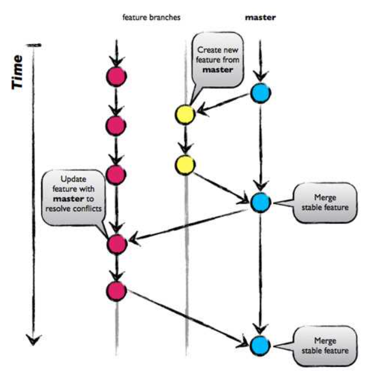
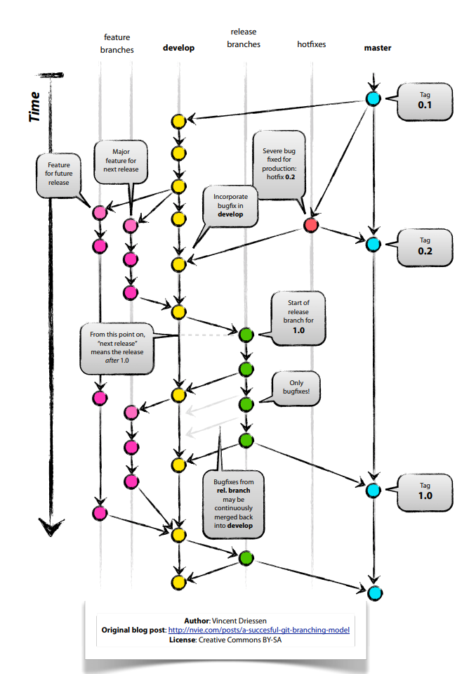
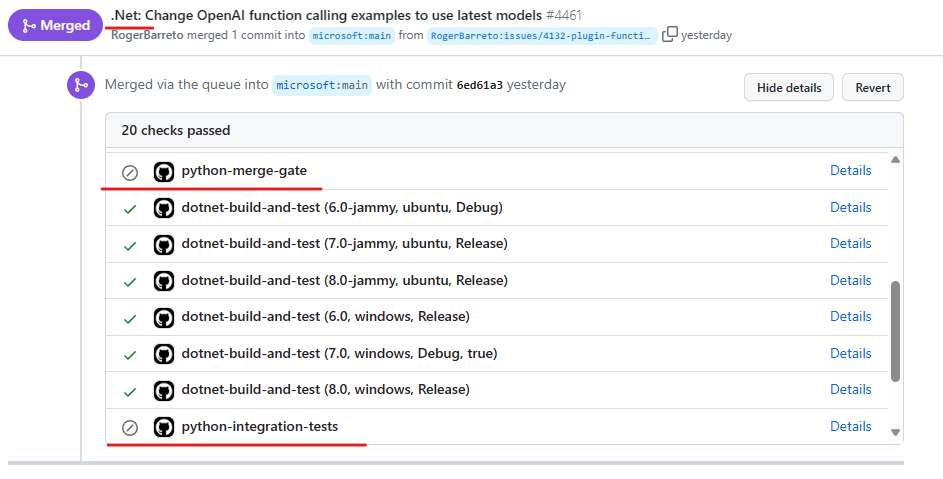

---
# These are optional elements. Feel free to remove any of them.
status: proposed
contact: SergeyMenshykh
date: 2024-01-04
deciders: markwallace-microsoft
consulted: rogerbarreto, dmytrostruk
informed:
---

# SK Branching Strategy

##  Industry-adopted branching strategies
There are several industry-adopted branching strategies for Git, such as GitHub Flow, Git-Flow, and GitLab Flow. However, we will only focus on the two most widely-used ones: GitHub Flow and Git-Flow.

### GitHub Flow
GitHub Flow is a straightforward branching strategy that centres around the 'main' branch. Developers create a new branch for each feature or bugfix, make changes, submit a pull request, and merge the changes back to the 'main' branch. Releases are done directly from the 'main' branch, making this model ideal for projects with continuous integration/deployment. Learn more about [GitHub Flow](https://docs.github.com/en/get-started/quickstart/github-flow).

[Image source](https://www.abtasty.com/blog/git-branching-strategies/)

Pros:
- Straightforward with fewer branches to manage and less merge conflicts.
- No long running development branches.

Cons:
- Not as well organized as Git-Flow.
- The 'main' branch can get cluttered more easily since it functions as both the production and development branch.

### Git-Flow
Git-Flow is a branching strategy that organizes software development around two long-lived main branches, 'main' and 'develop', along with short-lived feature, release, and hotfix branches. Developers work on new features in feature branches, which are then merged into the 'develop' branch. When preparing for a release, to avoid blocking future release features, a release branch is created, and once finalized (testing & bug fixing), it is merged into both 'main' and 'develop'. Hotfix branches in Git Flow are created from the 'main' branch to address critical bug fixes and are subsequently merged back into both the 'main' and 'develop' branches. The actual release(deployable artifact) is done from the 'main' branch that is reflects actual production worthy official releases. Learn more about [Git-Flow](https://nvie.com/posts/a-successful-git-branching-model/).

Pros:
- Clear separation between code under development and production-ready code.
- Efficient release management.

Cons:
- More complex than GitHub Flow, which may be overwhelming for smaller teams or projects that do not require as much structure.
- Less suited for projects that prioritize continuous deployment, as it emphasizes a more controlled release process.
- Not ideal for projects with continuous deployment due to the overhead of managing multiple branches.
- Spaghetti history in Git - [GitFlow considered harmful](https://www.endoflineblog.com/gitflow-considered-harmful)

# SK branching strategies
Today, the SK SDK is available in three languages: .NET, Java and Python. All of them coexist in the same Git repository, organized under corresponding folders. However, the branching strategies for those differ.

For both .NET and Python versions, development takes place in short-lived topic branches that branch off the 'main' branch. These topic branches are merged back into the 'main' branch when features are considered production-ready through PR reviews, unit tests, and integration test runs. Releases are carried out directly from the 'main' branch. This approach aligns with the GitHub Flow branching strategy, with a minor deviation where releases are conducted weekly rather than being continuously deployed.

The Java version of SK adheres to the Git-Flow strategy by being developed in a dedicated development branch. Topic branches are created from the development branch and merged back through pull requests after unit tests and integration test runs. Release branches are also created from the development branch and merged to both the development branch and the 'main' one when a release is considered production-ready. This strategy deviates slightly from vanilla Git-Flow in that release artifacts are generated from release branches rather than from the 'main' branch.

## Decision Drivers  
- The strategy should be easy to implement and maintain without requiring significant investments.
- The strategy should allow for maintaining several releases in parallel if required.
- Ideally, the strategy is intuitive and simple so that everyone familiar with Git can adopt and follow it.
- Ideally, all SK languages are able to adopt and use the same branching strategy.
- Ability to continually deploy new release with minimal overhead.
- Ability to release language versions independently and on different schedules.
- Allow the .Net, Java and Python teams to be able to operate independently.
- Ability to patch a release (for all languages).
- Consolidation of PR's and Issues to simplify the triage and review process.

Another aspect to consider when deciding on a branching strategy for SK is access permissions and action scopes. GitHub does not allow enforcing access restrictions on just a part of a repository, such as a folder. This means that it is not possible to restrict SK .NET contributors from pushing Python PRs, which ideally should be done by the corresponding team. However, GitHub does allow assigning access permissions to a branch, which can be successfully leveraged if the appropriate strategy option is chosen. The similar issue occurs with GitHub's required actions/status checks, which can only be set at the branch level. Considering that development for .NET and Python takes place in the 'main' branch, and status checks are configured per branch rather than per folder, it is not possible to configure separate status checks for .NET and Python PRs. As a result, the same status check runs for both .NET and Python PRs, even though it may not be relevant to a specific language.

Regardless of the chosen strategy, it should be possible to support multiple versions of SK. For example, applying a bug fix or a security patch to released SK v1.1.0 and v2.4.0 should be feasible while working on v3.0.0. One way to achieve this would be to create a release branch for each SK release. So that the required patch/fix can be pushed to the branch and released from it. However, marking released commits with tags should suffice, as it is always possible to create a new branch from a tag retrospectively when needed, if at all. Existing release pipelines should accept a source branch as a parameter, enabling releases from any branch and not only from the 'main' one.

## Considered Options

### Repository per SK language
This option suggests having a separate GitHub repository for each SK language. These repositories can be created under a corresponding organization. Development and releases will follow the GitHub flow, with new features and fixes being developed in topic branches that created from the 'main' branch and eventually merged back.

Pros:
- Each repository will have only language-specific status checks and actions.
- Branch commits and release history will not contain irrelevant commits or releases.
- Utilizes the familiar GitHub Flow without Git-Flow overhead, resulting in a shorter learning curve.
- Access permissions are limited to the specific owning team.

Cons:
- There is an initial overhead in setting up the three repositories.
- There may be potential ongoing maintenance overhead for the three repositories.
- Secrets must be managed across three repositories instead of just one.
- Each repo will have a backlog that will have to be managed separately.

### Branch per SK language
This option involves having a dedicated, language-specific development branch for each SDK language: 'net-development', 'java-development', and 'python-development'. SDK Java is already using this option. Development and releases will follow the GitHub Flow, with new features and fixes being developed in topic branches that are branched off the corresponding language branch and eventually merged back. 

Pros:
- Simple, language specific, status checks, actions and rules configured per language branch.
- Allow only teams that own language-specific branches to push or merge to them, rather than just approving PRs.
- Branch commits history does not contain irrelevant commits.

Cons:
- GitHub release history contains releases for all languages.
- Language-specific branches may not be straightforward to discover/use.

This option has two sub-options that define the way the 'main' branch is used:  
1. The 'main' branch will contain general/common artifacts such as documentation, GitHub actions, and samples. All language folders will be removed from the 'main' branch, and it can be locked to prevent accidental merges.  
2. The 'main' branch will include everything that dev branches have for discoverability purposes. A job/action will be implemented to merge commits from dev branches to the 'main' branch. The number of common artifacts between SK languages should be minimized to reduce the potential for merge conflicts. A solution for the squash merge problem that SK Java is experiencing today should be found before deciding on the sub-option.

The second sub-option is preferred over the first one due to its discoverability benefits. There is no need to select a development branch in the GitHub UI when searching for something in the repository. The 'main' branch is selected by default, and as soon as the latest bits are in the branch, they can be found easily. This intuitive approach is familiar to many, and changing it by requiring the selection of a branch before searching would complicate the search experience and introduce frustration.

### All SK languages in the 'main'
This option assumes maintaining the code for all SK languages - .NET, Java, and Python in the 'main' branch. Development would occur using typical topic branches, while releases would also be made from the 'main' branch. This is the strategy currently adopted by .NET and Python, and corresponds to the GitHub Flow.

Pros:
- All code in one place - the 'main' branch.
- Familiar GitHub Flow, no Git-Flow overhead - shorter learning curve.

Cons:
- Branch commits/release history contains irrelevant commits/releases.
- Complex and irrelevant GitHub status checks/actions.
- PRs can be pushed by non-owner teams.

### Current 'Hybrid' approach
This choice keeps the existing method used by SK. .NET and Python development is done in the 'main' branch using GitHub Flow, while Java development happens in the java-development branch following Git-Flow.

Pros:
- No changes required.
- Each SK language uses a strategy that is convenient for it.

Cons:
- Branch commits/release history contains irrelevant commits/releases.
- Complex and irrelevant GitHub status checks/actions.
- PRs can be pushed by non-owner teams.

## Decision Outcome
Chosen option: "Current 'Hybrid' approach" because it works with minor inefficiencies (such as cluttered release history and multi-language complex actions) and requires no investments now. Later, depending on the team size and the problems the team encounters with the "Current 'Hybrid' approach," we may consider either the 'Repository per SK language' option or the 'Branch per SK language' one.
