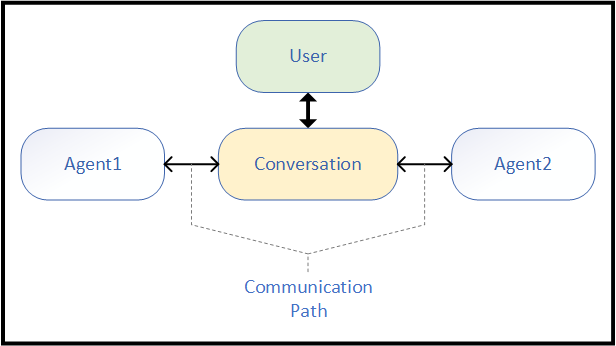
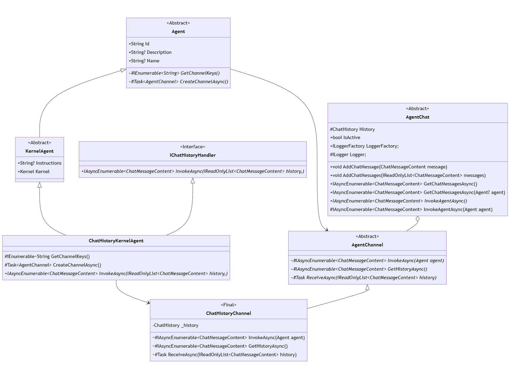
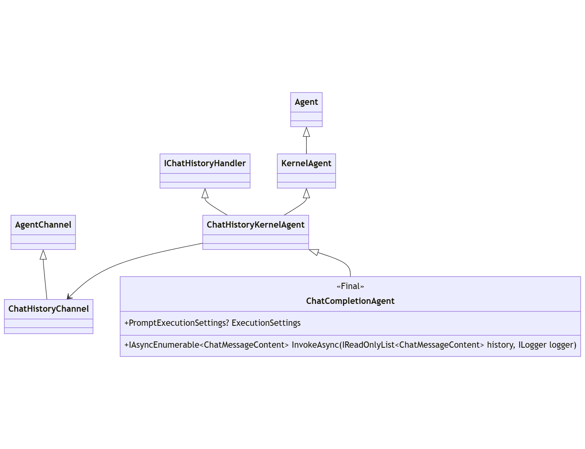
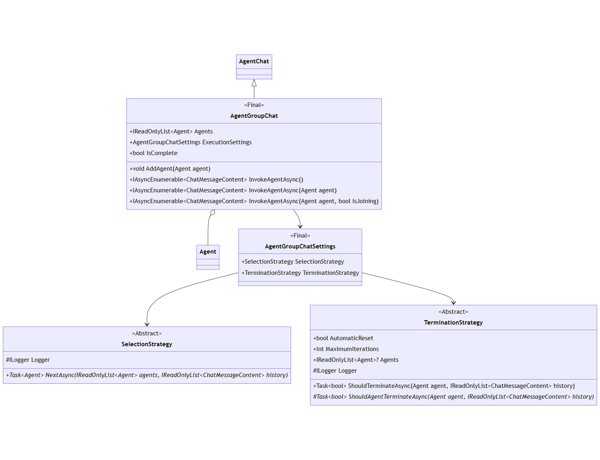

---
# These are optional elements. Feel free to remove any of them.
status: experimental
contact: crickman, SergeyMenshykh
date: 2024-01-24
deciders: markwallace-microsoft, matthewbolanos
consulted: rogerbarreto, dmytrostruk, alliscode
informed:
---

# SK Agents Overview and High Level Design

## **Context and Problem Statement**
Support for the OpenAI Assistant API was published in an experimental `*.Assistants` package that was later renamed to `*.Agents` with the aspiration of pivoting to a more general agent framework.

The initial `Assistants` work was never intended to evolve into a general _Agent Framework_.

This ADR defines that general _Agent Framework_.


## **Agents Overview**
Fundamentally an agent possesses the following characteristics:
- Identity: Allows each agent to be uniquely identified.
- Behavior: The manner in which an agent participates in a conversation
- Interaction: That an agent behavior is in response to other agents or input.

Various agents specializations might include:
- System Instructions: A set of directives that guide the agent's behavior.
- Tools/Functions: Enables the agent to perform specific tasks or actions.
- Settings: Agent specific settings.  For a chat-completion agents this might include LLM settings - such as Temperature, TopP, StopSequence, etc


### **Agent Modalities**
An _Agent_ be of various modalities.  Modalities are asymmetrical with regards abilities and constraints.

- **SemanticKernel - IChatCompletionService**: An _Agent_ based solely on the *SemanticKernel* `IChatCompletionService`.
- **OpenAI Assistants**: A hosted _Agent_ solution supported the _OpenAI Assistant API_ (both OpenAI & Azure OpenAI).
- **Custom**: An custom agent developed by extending the _Agent Framework_.
- **Future**: Yet to be announced, such as a HuggingFace Assistant API (they already have assistants, but yet to publish an API.)


## **Decision Drivers**
- _Agent Framework_ shall provide sufficient abstraction to enable the construction of agents that could utilize potentially any LLM API.
- _Agent Framework_ shall provide sufficient abstraction and building blocks for the most frequent types of agent collaboration. It should be easy to add new blocks as new collaboration methods emerge.
- _Agent Framework_ shall provide building blocks to modify agent input and output to cover various customization scenarios.
- _Agent Framework_ shall align with _SemanticKernel_ patterns: tools, DI, plugins, function-calling, etc.
- _Agent Framework_ shall be extensible so that other libraries can build their own agents and chat experiences.
- _Agent Framework_ shall be as simple as possible to facilitate extensibility.
- _Agent Framework_ shall encapsulate complexity within implementation details, not calling patterns.
- _Agent_ abstraction shall support different modalities (see [Agent Modalities](#Agent-Modalities:) section).
- An _Agent_ of any modality shall be able to interact with an _Agent_ of any other modality.
- An _Agent_ shall be able to support its own modality requirements. (Specialization)
- _Agent_ input and output shall align to SK content type `ChatMessageContent`.


## **Design - Analysis**

Agents participate in a conversation, often in response to user or environmental input.  



In addition to `Agent`, two fundamental concepts are identified from this pattern:

- Nexus: ("Conversation" from diagram) - Vehicle and context for a sequence of agent interactions.
- Channel: ("Communication Path" from diagram) - The protocol with which the agent interacts with the nexus.

> Agents of different modalities must be free to satisfy the requirements presented by their modality.  Formalizing the `Channel` concept provides natural vehicle for this to occur.

These concepts come together to suggest the following generalization:

<!-- %%% NEXUS -->


After iterating with the team over these concepts, this generalization translates into the following high-level definitions:


Class Name|Parent Class|Role|Modality|Note
-|-|-|-|-
Agent|-|Agent|Abstraction|Root agent abstraction
KernelAgent|Agent|Agent|Abstraction|Includes `Kernel` services and plug-ins
AgentChannel|-|Channel|Abstraction|Conduit for an agent's participation in a chat.
AgentChat|-|Chat|Abstraction|Provides core capabilities for agent interactions.
AgentGroupChat|AgentChat|Chat|Utility|Strategy based chat
---


## **Design - Abstractions**

Here the detailed class definitions from the  high-level pattern from the previous section.

Also shown are entities defined as part of the _ChatHistory_ optimization: `IChatHistoryHandler`, `ChatHistoryKernelAgent`, and `ChatHistoryChannel`.
These _ChatHistory_ entities eliminates the requirement for _Agents_ that act on a locally managed `ChatHistory` instance (as opposed to agents managed via remotely hosted frameworks) to implement their own `AgentChannel`.



Class Name|Parent Class|Role|Modality|Note
-|-|-|-|-
Agent|-|Agent|Abstraction|Root agent abstraction
KernelAgent|Agent|Agent|Abstraction|Includes `Kernel` services and plug-ins
ChatHistoryKernelAgent|KernelAgent|Agent|Abstraction|%%%
AgentChannel|-|Channel|Abstraction|Conduit for an agent's participation in a chat.
ChatHistoryChannel|AgentChannel|Channel|Abstraction|%%%
AgentChat|-|Chat|Abstraction|Provides core capabilities for agent interactions.
AgentGroupChat|AgentChat|Chat|Utility|Strategy based chat
---


## **Design - Chat-Completion Agent**

The first concrete agent is `ChatCompletionAgent`.
The `ChatCompletionAgent` implementation is able to integrate with any `IChatCompletionService` implementation.
Since `IChatCompletionService` acts upon `ChatHistory`, this demonstrates how `ChatHistoryKernelAgent` may be simply implemented.

Agent behavior is (naturally) constrained according to the specific behavior of any `IChatCompletionService`. 
For example, a connector that does not support function-calling will likewise not execute any `KernelFunction` as an _Agent_.



Class Name|Parent Class|Role|Modality|Note
-|-|-|-|-
ChatCompletionAgent|ChatHistoryKernelAgent|Agent|SemanticKernel|Fundamental _Agent_ component.
---


## **Design - Group Chat**

`AgentGroupChat` is a concrete `AgentChat` whose behavior is defined by various _Strategies_.



Class Name|Parent Class|Role|Modality|Note
-|-|-|-|-
AgentGroupChat|AgentChat|Chat|Utility|Strategy based chat
AgentGroupChatSettings|-|Config|Utility|%%%
SelectionStrategy|-|Config|Utility|%%%
TerminationStrategy|-|Config|Utility|%%%
---


## **Design - OpenAI Assistant Agent**

The next concrete agent is `OpenAIAssistantAgent`.
This agent is based on the _OpenAI Assistant API_ and implements its own channel as chat history is managed remotely.

<!-- %%% STATIC METHODS -->


Class Name|Parent Class|Role|Modality|Note
-|-|-|-|-
OpenAIAssistantAgent|KernelAgent|Agent|OpenAI Assistant|A functional agent based on _OpenAI Assistant API_
OpenAIAssistantChannel|AgentChannel|Channel|OpenAI Assistant|Channel associated with `OpenAIAssistantAgent`
---

### **OpenAI Assistant API Reference**

- [Assistants Documentation](https://platform.openai.com/docs/assistants)
- [Assistants API](https://platform.openai.com/docs/api-reference/assistants)


## **Design - Aggregator Agent**

In order to support complex calling patterns, `AggregatorAgent` enables one or more agents participating in an `AgentChat` to present as a single logical `Agent`.


Class Name|Parent Class|Role|Modality|Note
-|-|-|-|-
AggregatorAgent|Agent|Agent|Utility|Adapts an `AgentChat` as an `Agent`
AggregatorChannel|AgentChannel|Channel|Utility|`AgentChannel` used by `AggregatorAgent`.
---


## **Usage Patterns**

**1. Agent Instantiation: ChatCompletion**

TBD

```c#
// Start with the Kernel
IKernelBuilder builder = Kernel.CreateBuilder();

// Add any IChatCompletionService
builder.AddOpenAIChatCompletion(...);

// Include desired plugins / functions    
builder.Plugins.Add(...);

// Include desired filters
builder.Filters.Add(...);

// Create the agent
ChatCompletionAgent agent =
    new()
    {
        Instructions = "instructions",
        Name = "name",
        Kernel = builder.Build()
    };
```

**2. Agent Instantiation: OpenAI Assistant**

Since every Assistant action is a call to a REST endpoint, `OpenAIAssistantAgent` is access via static methods:

**Create:**
```c#
// Create config and definition
OpenAIAssistantConfiguration config = new("apikey", "endpoint");
OpenAIAssistantDefinition definition = new()
{
    Instructions = "instructions",
    Name = "naem",
    Model = "gpt-4",
};

// Create the agent
OpenAIAssistantAgent agent =  OpenAIAssistantAgent.CreateAsync(config, definition);
```

**Retrieval:**
```c#
// Create config
OpenAIAssistantConfiguration config = new("apikey", "endpoint");

// Create the agent based on an existing definition
OpenAIAssistantAgent agent =  OpenAIAssistantAgent.RetrieveAsync(config, "agent-id");
```

**Inspection:**
```c#
// Create config
OpenAIAssistantConfiguration config = new("apikey", "endpoint");

// Create the agent based on an existing definition
IAsyncEnumerable<OpenAIAssistantDefinition> definitions = OpenAIAssistantAgent.ListAsync(config;
```

**3. Agent Chat: Explicit**

An _Agent_ may be explicitly selected to respond in an `AgentGroupChat`.

```c#
// Define agents
ChatCompletionAgent agent1 = ...;
OpenAIAssistantAgent agent2 = ...;

// Create chat
AgentGroupChat chat = new();

// Provide input for chat
ChatMessageContent input = new (AuthorRole.User, "input");
await WriteMessageAsync(input);
chat.AddMessage(new ChatMessageContent(AuthorRole.User, input));

// First invoke one agent, then the other, display each response.
await WriteMessagesAsync(chat.InvokeAsync(agent1));
await WriteMessagesAsync(chat.InvokeAsync(agent2));

// The entire history may be accessed.  Agent specific history
// may be transformed from primary history.
await WriteMessagesAsync(chat.GetHistoryAsync());
await WriteMessagesAsync(chat.GetHistoryAsync(agent1));
await WriteMessagesAsync(chat.GetHistoryAsync(agent2));
```

**4. Agent Chat: Multi-Turn**

_Agents_ may also take turns working towards an objective:

```c#
// Define agents
Agent agent1 = ...;
Agent agent2 = ...;
Agent agent3 = ...;

// Create chat with two agents.
AgentGroupChat chat =
    new(agent1, agent2)
    { 
        ExecutionSettings =
        {
            // Chat will continue until it meets the termination criteria.
            TerminationionStrategy = new MyTerminationStrategy(),
        } 
    };

// Provide input for chat
ChatMessageContent input = new (AuthorRole.User, "input");
await WriteMessageAsync(input);
chat.AddMessage(new ChatMessageContent(AuthorRole.User, input));

// Agent may be added to an existing chat
chat.AddAgent(agent3);

// Execute the chat until termination
await WriteMessagesAsync(chat.InvokeAsync());
```


## **Builder Patterns**


```
END
```


---
# REVIEW:

## Agent Customization & Filters
To cover complex agent collaboration scenarios, it might be necessary to modify agents' input and/or output messages as they travel to and from Agents. This may be useful for various scenarios, such as converting agents' message content from one format/type to another. There could be situations when messages should not be propagated to Agents or not added to the collaboration chat. For example, in the scenario above where the PM, designer, and engineer collaborate on a new experience for the TODO app, the PM's behavior could be extended to generate a chat exit signal based on whether the function used by the agent indicates that the new 'Add item' user experience is good enough as POC:

```c#
class AgentCollaborationChat(Agent admin, Agent[] participants)
{
    async Task<AgentMessage[]> StartConversationAsync(AgentMessage[] messages)
    {
        ...
        while (chatExitCondition)
        {
            ...
            var result = await nextAgent.InvokeAsync(chat);
            ...
            chatExitCondition == string.Contains(result.Content, "exit_chat") // The chat can be parameterized with agent condition or callback.
        }
        ...
    }
}

Agent projectManager = new ChatCompletionAgent(name: "Mike", instructions: "You're a PM working on the new TODO app ....", ...);
projectManager.Plugins.AddFromType<UIUsabilityAssessor>()
projectManager = projectManager.PostProcess((reply) => {
    if(reply.IsFunctionCall)
    {
        if(reply.FunctionName == "EvaluateUsability")
        {
            if(reply.FunctionResult.IsCoreFunctionalityAccessible)
            {
                return new [] { new AgentMessage(role: "system", content: "exit_chat") };
            }

            return new [] { new AgentMessage(role: "system", content: "Peter/designer please improve the design so that core functionality is accessible.") };
        }
    }
    return reply;
});

Agent designer = new ChatCompletionAgent(name: "Peter", instructions: "You're a UI/UX designer ....", ...);

Agent engineer = new OpenAIAssistant(name: "Roy", instructions: "You are an engineer with front-end skills ...");

AgentCollaborationChat chat = new(admin: projectManager, participants: new {designer, engineer});

var result = await chat.StartConversationAsync(new[] { new AgentMessage(role: "user", content: "collaborate on a new user experience for the 'Add item' feature.") });
```
Some scenarios can be implemented without filters by just plugins. However, this may require extra hops to LLMs and prompt tuning to have those scenarios working.

Filter examples:
- PostProcess: Accepts an agent and a delegate capable of modifying or replacing messages returned by the agent. It calls the agent and then calls the delegate with the agent's response messages. Finally, it returns the modified messages to the caller.
- PreProcess: Accepts an agent and a delegate capable of modifying or replacing messages to be passed to the agent. It calls the callback to handle the messages and pass the modified messages to the agent. Returns the agent result to the caller.

Each of the filter can be implemented as a decorator pattern that will allow to build agents pipelines/chains: 
```c#
var agent = new ChatCompletionAgent(...)
    .PostProcess((m) => { Console.WriteLine($"Agent response: {m.Content}"); return m; })
    .PreProcess(m => { Console.WriteLine($"User input: {m.Content}"); return m; });

await agent.InvokeAsync(...);

```

SK, today, already has the concept of filters for [prompts](https://github.com/microsoft/semantic-kernel/blob/main/dotnet/src/SemanticKernel.Abstractions/Filters/Prompt/IPromptFilter.cs) and [functions](https://github.com/microsoft/semantic-kernel/blob/main/dotnet/src/SemanticKernel.Abstractions/Filters/Function/IFunctionFilter.cs). Ideally, the same approach should be taken for Agent filters.


