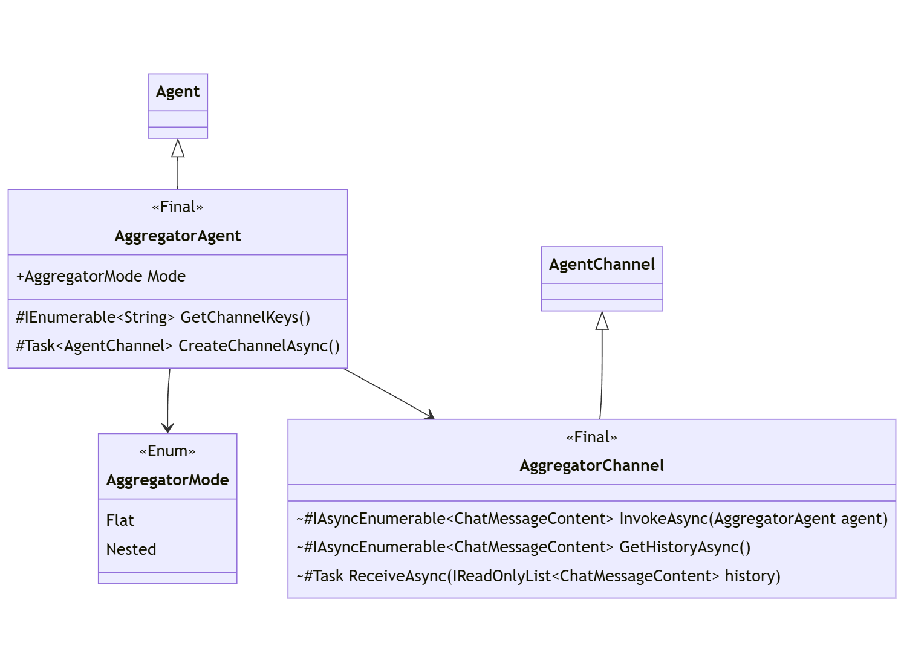

---
# These are optional elements. Feel free to remove any of them.
status: experimental
contact: crickman
date: 2024-01-24
deciders: markwallace-microsoft, matthewbolanos
consulted: rogerbarreto, dmytrostruk, alliscode, SergeyMenshykh
informed:
---

# SK Agents Overview and High Level Design

## **Context and Problem Statement**
Support for the OpenAI Assistant API was published in an experimental `*.Assistants` package that was later renamed to `*.Agents` with the aspiration of pivoting to a more general agent framework.

The initial `Assistants` work was never intended to evolve into a general _Agent Framework_.

This ADR defines that general _Agent Framework_.

An agent is expected to be able to support two interaction patterns:

1. **Direct Invocation ("No Chat"):**

    The caller is able to directly invoke any single agent without any intervening machinery or infrastructure.
    For different agents to take turns in a conversation using direct invocation, the caller is expected to invoke each agent per turn.
    Coordinating interaction between different agent types must also be explicitly managed by the caller.

2. **Agent Chat:**  

    The caller is able to assemble multiple agents to participate in an extended conversation for the purpose of accomplishing a specific goal
    (generally in response to initial or iterative input).  Once engaged, agents may participate in the chat over multiple interactions by taking turns.


## **Agents Overview**
Fundamentally an agent possesses the following characteristics:
- Identity: Allows each agent to be uniquely identified.
- Behavior: The manner in which an agent participates in a conversation
- Interaction: That an agent behavior is in response to other agents or input.

Various agents specializations might include:
- System Instructions: A set of directives that guide the agent's behavior.
- Tools/Functions: Enables the agent to perform specific tasks or actions.
- Settings: Agent specific settings.  For chat-completion agents this might include LLM settings - such as Temperature, TopP, StopSequence, etc


### **Agent Modalities**
An _Agent_ can be of various modalities.  Modalities are asymmetrical with regard to abilities and constraints.

- **SemanticKernel - ChatCompletion**: An _Agent_ based solely on the *SemanticKernel* support for chat-completion (e.g. .NET `ChatCompletionService`).
- **OpenAI Assistants**: A hosted _Agent_ solution supported the _OpenAI Assistant API_ (both OpenAI & Azure OpenAI).
- **Custom**: A custom agent developed by extending the _Agent Framework_.
- **Future**: Yet to be announced, such as a HuggingFace Assistant API (they already have assistants, but yet to publish an API.)


## **Decision Drivers**
- _Agent Framework_ shall provide sufficient abstraction to enable the construction of agents that could utilize potentially any LLM API.
- _Agent Framework_ shall provide sufficient abstraction and building blocks for the most frequent types of agent collaboration. It should be easy to add new blocks as new collaboration methods emerge.
- _Agent Framework_ shall provide building blocks to modify agent input and output to cover various customization scenarios.
- _Agent Framework_ shall align with _SemanticKernel_ patterns: tools, DI, plugins, function-calling, etc.
- _Agent Framework_ shall be extensible so that other libraries can build their own agents and chat experiences.
- _Agent Framework_ shall be as simple as possible to facilitate extensibility.
- _Agent Framework_ shall encapsulate complexity within implementation details, not calling patterns.
- _Agent_ abstraction shall support different modalities (see [Agent Modalities](#agent-modalities) section).
- An _Agent_ of any modality shall be able to interact with an _Agent_ of any other modality.
- An _Agent_ shall be able to support its own modality requirements. (Specialization)
- _Agent_ input and output shall align to SK content type `ChatMessageContent`.


## **Design - Analysis**

Agents participate in a conversation, often in response to user or environmental input.  

<p align="center">
<kbd></kbd>
</p>

In addition to `Agent`, two fundamental concepts are identified from this pattern:

- Conversation - Context for sequence of agent interactions.
- Channel: ("Communication Path" from diagram) - The associated state and protocol  with which the agent interacts with a single conversation.

> Agents of different modalities must be free to satisfy the requirements presented by their modality.  Formalizing the `Channel` concept provides a natural vehicle for this to occur.
For an agent based on _chat-completion_, this means owning and managing a specific set of chat messages (chat-history) and communicating with a chat-completion API / endpoint.
For an agent based on the _Open AI Assistant API_, this means defining a specific _thread_ and communicating with the Assistant API as a remote service.

These concepts come together to suggest the following generalization:

<p align="center">
<kbd></kbd>
</p>


After iterating with the team over these concepts, this generalization translates into the following high-level definitions:

<p align="center">
<kbd></kbd>
</p>


Class Name|Parent Class|Role|Modality|Note
-|-|-|-|-
Agent|-|Agent|Abstraction|Root agent abstraction
KernelAgent|Agent|Agent|Abstraction|Includes `Kernel` services and plug-ins
AgentChannel|-|Channel|Abstraction|Conduit for an agent's participation in a chat.
AgentChat|-|Chat|Abstraction|Provides core capabilities for agent interactions.
AgentGroupChat|AgentChat|Chat|Utility|Strategy based chat
---


## **Design - Abstractions**

Here the detailed class definitions from the  high-level pattern from the previous section are enumerated.

Also shown are entities defined as part of the _ChatHistory_ optimization: `IChatHistoryHandler`, `ChatHistoryKernelAgent`, and `ChatHistoryChannel`.
These _ChatHistory_ entities eliminates the requirement for _Agents_ that act on a locally managed `ChatHistory` instance (as opposed to agents managed via remotely hosted frameworks) to implement their own `AgentChannel`.

<p align="center">
<kbd></kbd>
</p>


Class Name|Parent Class|Role|Modality|Note
-|-|-|-|-
Agent|-|Agent|Abstraction|Root agent abstraction
AgentChannel|-|Channel|Abstraction|Conduit for an agent's participation in an `AgentChat`.
KernelAgent|Agent|Agent|Abstraction|Defines `Kernel` services and plug-ins
ChatHistoryChannel|AgentChannel|Channel|Abstraction|Conduit for agent participation in a chat based on local chat-history.
IChatHistoryHandler|-|Agent|Abstraction|Defines a common part for agents that utilize `ChatHistoryChannel`.
ChatHistoryKernelAgent|KernelAgent|Agent|Abstraction|Common definition for any `KernelAgent` that utilizes a `ChatHistoryChannel`.
AgentChat|-|Chat|Abstraction|Provides core capabilities for an multi-turn agent conversation.
---


## **Design - Chat-Completion Agent**

The first concrete agent is `ChatCompletionAgent`.
The `ChatCompletionAgent` implementation is able to integrate with any `IChatCompletionService` implementation.
Since `IChatCompletionService` acts upon `ChatHistory`, this demonstrates how `ChatHistoryKernelAgent` may be simply implemented.

Agent behavior is (naturally) constrained according to the specific behavior of any `IChatCompletionService`. 
For example, a connector that does not support function-calling will likewise not execute any `KernelFunction` as an _Agent_.

<p align="center">
<kbd></kbd>
</p>

Class Name|Parent Class|Role|Modality|Note
-|-|-|-|-
ChatCompletionAgent|ChatHistoryKernelAgent|Agent|SemanticKernel|Concrete _Agent_ based on a local chat-history.
---


## **Design - Group Chat**

`AgentGroupChat` is a concrete `AgentChat` whose behavior is defined by various _Strategies_.

<p align="center">
<kbd></kbd>
</p>

Class Name|Parent Class|Role|Modality|Note
-|-|-|-|-
AgentGroupChat|AgentChat|Chat|Utility|Strategy based chat
AgentGroupChatSettings|-|Config|Utility|Defines strategies that affect behavior of `AgentGroupChat`.
SelectionStrategy|-|Config|Utility|Determines the order for `Agent` instances to participate in `AgentGroupChat`.
TerminationStrategy|-|Config|Utility|Determines when the `AgentGroupChat` conversation is allowed to terminate (no need to select another `Agent`).
---


## **Design - OpenAI Assistant Agent**

The next concrete agent is `OpenAIAssistantAgent`.
This agent is based on the _OpenAI Assistant API_ and implements its own channel as chat history is managed remotely as an assistant _thread_.

<p align="center">
<kbd></kbd>
</p>

Class Name|Parent Class|Role|Modality|Note
-|-|-|-|-
OpenAIAssistantAgent|KernelAgent|Agent|OpenAI Assistant|A functional agent based on _OpenAI Assistant API_
OpenAIAssistantChannel|AgentChannel|Channel|OpenAI Assistant|Channel associated with `OpenAIAssistantAgent`
OpenAIAssistantDefinition|-|Config|OpenAI Assistant|Definition of an _Open AI Assistant_ provided when enumerating over hosted agent definitions.
---

### **OpenAI Assistant API Reference**

- [Assistants Documentation](https://platform.openai.com/docs/assistants)
- [Assistants API](https://platform.openai.com/docs/api-reference/assistants)

<p>
<kbd></kbd>
</p>


## **Design - Aggregator Agent**

In order to support complex calling patterns, `AggregatorAgent` enables one or more agents participating in an `AgentChat` to present as a single logical `Agent`.

<p align="center">
<kbd></kbd>
</p>

Class Name|Parent Class|Role|Modality|Note
-|-|-|-|-
AggregatorAgent|Agent|Agent|Utility|Adapts an `AgentChat` as an `Agent`
AggregatorChannel|AgentChannel|Channel|Utility|`AgentChannel` used by `AggregatorAgent`.
AggregatorMode|-|Config|Utility|Defines the aggregation mode for `AggregatorAgent`.
---


## **Usage Patterns**

**1. Agent Instantiation: ChatCompletion**

Creating a `ChatCompletionAgent` aligns directly with how a `Kernel` object would be defined with an `IChatCompletionService` for outside of the _Agent Framework_,
with the addition of provide agent specific instructions and identity.

(_dotnet_)
```c#
// Start with the Kernel
IKernelBuilder builder = Kernel.CreateBuilder();

// Add any IChatCompletionService
builder.AddOpenAIChatCompletion(...);

// Include desired plugins / functions    
builder.Plugins.Add(...);

// Include desired filters
builder.Filters.Add(...);

// Create the agent
ChatCompletionAgent agent =
    new()
    {
        Instructions = "instructions",
        Name = "name",
        Kernel = builder.Build()
    };
```

(_python_)
```python
# Start with the Kernel
kernel = Kernel()

# Add any ChatCompletionClientBase
kernel.add_service(AzureChatCompletion(service_id="agent", ...))

# Include desired plugins / functions    
kernel.add_plugin(...)

# Include desired filters (via @kernel.filter decorator)

# Create the agent
agent = ChatCompletionAgent(service_id="agent", kernel=kernel, name="name", instructions="instructions")
```


**2. Agent Instantiation: OpenAI Assistant**

Since every Assistant action is a call to a REST endpoint, `OpenAIAssistantAgent`, top-level operations are realized via static asynchronous factory methods:

**Create:**

(_dotnet_)
```c#
// Start with the Kernel
IKernelBuilder builder = Kernel.CreateBuilder();

// Include desired plugins / functions    
builder.Plugins.Add(...);

// Create config and definition
OpenAIServiceConfiguration config = new("apikey", "endpoint");
OpenAIAssistantDefinition definition = new()
{
    Instructions = "instructions",
    Name = "name",
    Model = "gpt-4",
};

// Create the agent
OpenAIAssistantAgent agent =  
    OpenAIAssistantAgent.CreateAsync(
        builder.Build(),
        config,
        definition);
```

(_python_)
```python
# Start with the Kernel
kernel = Kernel()

# Include desired plugins / functions    
kernel.add_plugin(...)

# Create config and definition
config = OpenAIServiceConfiguration("apikey", "endpoint")
definition = OpenAIAssistantDefinition(instructions="instructions", name="name", model="gpt-4")

agent = OpenAIAssistantAgent.create(kernel=kernel, config=config, definition=definition)
```


**Retrieval:**

(_dotnet_)
```c#
// Start with the Kernel
Kernel kernel = ...;

// Create config
OpenAIServiceConfiguration config = new("apikey", "endpoint");

// Create the agent based on an existing definition
OpenAIAssistantAgent agent =  OpenAIAssistantAgent.RetrieveAsync(kernel, config, "agent-id");
```

(_python_)
```python
# Start with the Kernel
kernel = Kernel()

# Create config
config = OpenAIServiceConfiguration("apikey", "endpoint")

# Create the agent based on an existing definition
agent = OpenAIAssistantAgent.retrieve(kernel = kernel, config=config, agentid="agent-id")
```


**Inspection:**

(_dotnet_)
```c#
// Create config
OpenAIServiceConfiguration config = new("apikey", "endpoint");

// Enumerate defined agents
IAsyncEnumerable<OpenAIAssistantDefinition> definitions = OpenAIAssistantAgent.ListDefinitionsAsync(config);
```

(_python_)
```python
# Create config
config = OpenAIServiceConfiguration("apikey", "endpoint")

# Enumerate defined agents
definitions = await OpenAIAssistantAgent.list_definitions(config=config)
```


**3. Agent Chat: Explicit**

An _Agent_ may be explicitly targeted to respond in an `AgentGroupChat`.

(_dotnet_)
```c#
// Define agents
ChatCompletionAgent agent1 = ...;
OpenAIAssistantAgent agent2 = ...;

// Create chat
AgentGroupChat chat = new();

// Provide input for chat
ChatMessageContent input = new (AuthorRole.User, "input");
await WriteMessageAsync(input);
chat.AddChatMessage(input);

// First invoke one agent, then the other, display each response.
await WriteMessagesAsync(chat.InvokeAsync(agent1));
await WriteMessagesAsync(chat.InvokeAsync(agent2));

// The entire history may be accessed.
// Agent specific history is an adaptaton of the primary history.
await WriteMessagesAsync(chat.GetHistoryAsync());
await WriteMessagesAsync(chat.GetHistoryAsync(agent1));
await WriteMessagesAsync(chat.GetHistoryAsync(agent2));
```

(_python_)
```python
# Define agents
agent1 = ChatCompletionAgent(...)
agent2 = OpenAIAssistantAgent.create(...)

# Create chat
chat = AgentGroupChat()

# Provide input for chat
input = ChatMessageContent(AuthorRole.User, "input")
await write_message(input)
chat.add_chat_message(input)

# First invoke one agent, then the other, display each response.
await write_message(chat.invoke(agent1))
await write_message(chat.invoke(agent2))

# The entire history may be accessed.  
# Agent specific history is an adaptaton of the primary history.
await write_message(chat.get_history())
await write_message(chat.get_history(agent1))
await write_message(chat.get_history(agent2))
```


**4. Agent Chat: Multi-Turn**

_Agents_ may also take multiple turns working towards an objective:

(_dotnet_)
```c#
// Define agents
ChatCompletionAgent agent1 = ...;
OpenAIAssistantAgent agent2 = ...;
ChatCompletionAgent agent3 = ...;

// Create chat with two agents.
AgentGroupChat chat =
    new(agent1, agent2)
    { 
        ExecutionSettings =
        {
            // Chat will continue until it meets the termination criteria.
            TerminationionStrategy = new MyTerminationStrategy(),
        } 
    };

// Provide input for chat
ChatMessageContent input = new(AuthorRole.User, "input");
await WriteMessageAsync(input);
chat.AddChatMessage(input);

// Agent may be added to an existing chat
chat.AddAgent(agent3);

// Execute the chat until termination
await WriteMessagesAsync(chat.InvokeAsync());
```

(_python_)
```python
# Define agents
agent1 = ChatCompletionAgent(...)
agent2 = OpenAIAssistantAgent.create(...)
agent3 = ChatCompletionAgent(...)

// Create chat with two agents.
chat =
    AgentGroupChat(agent1, agent2)
    { 
        execution_settings =
        {
            # Chat will continue until it meets the termination criteria.
            terminationion_strategy = MyTerminationStrategy(),
        } 
    }

# Provide input for chat
input = ChatMessageContent(AuthorRole.User, "input")
await write_message(input)
chat.add_chat_message(input)

# Agent may be added to an existing chat
chat.add_agent(agent3)

# Execute the chat until termination
await write_message(chat.invoke())
```
