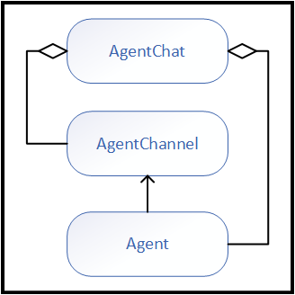

---
# These are optional elements. Feel free to remove any of them.
status: proposed
contact: crickman
date: 2024-01-24
deciders: semenshi, matthewbolanos, markwallace-microsoft,alliscode
informed:
---

# SK Agent Interactions and Architecture

## Context and Problem Statement
- Agent abstraction must adapt to different modalities
- Agent of differing modality must be able to interact in a shared context. (One to many)
- Agent of differing modality must be able to support their own modality requirements. (Specialization)
- Must functionally support with patterns introduced by AutoGen
- Must be extensible
- Must encapsulate complexity within
 implementation details, not calling patterns.

> Note: Desire to establish AutoGen.Net alignment with SemanticKernel not limit to existing AutoGen definitions.

### Agent Modalities:
- **SemanticKernel - IChatCompletionService**: No storage (local history and agent definitions)
- **SemanticKernel - ITextGenerationService**: Not needed / Out of scope (SLM?)
- **Open AI Assistant API**: Remote storage managed by Assistant API (Open AI & Azure Open AI)
- **AutoGen.Net**: Further specialization of the _Agent Architecture_

## Design Concept

Agents participate in a conversation, often in response to user or environmental input.  


In addition to `Agent`, two fundamental concepts are identified from this pattern:

- Nexus: ("Conversation" from diagram) - Vehicle and context for a sequence of agent interactions.
- Channel: ("Communication Path" from diagram) - The protocol with which the agent interacts with the nexus.

> Agents of different modalities must be free to satisfy the requirements presented by their modality.  Formalizing the `Channel` concept provides natural vehicle for this to occur.

These concepts come together to suggest the following generalization:



### Naming Alternatives

Alternative names for *Nexus* and *Channel* concepts (feel free to come-up with your own):

**Nexus**
- Collection
- Chat
- Agency
- Meeting
- Team
- Group

**Channel**
- Protocol
- Connector
- Connection
- Conduit

## Design Details


### Class Dictionary

Class Name|Parent Class|Role|Modality|Note
-|-|-|-|-
Agent|-|Agent|Abstraction|Root agent abstraction
KernelAgent|Agent|Agent|Abstraction|Includes `Kernel` services and plug-ins
NexusAgent|Agent|Agent|Utility|`Agent` adapter based on `AgentNexus`
ChatCompletionAgent|KernelAgent|Agent|SemanticKernel|A functional agent based on `IChatCompletionService`
GptAssistantAgent|KernelAgent|Agent|Assistant API|A functional agent based on *Open AI Assistant API*
AgentChannel|-|Channel|Abstraction|Allows an agent to participate in a nexus.
LocalChannel|AgentChannel|Channel|Utility|Concrete channel for agents based on local chat-history.
GptAssistantChannel|AgentChannel|Channel|Assistant API|Channel associated with `GptAssistantAgent`
AgentNexus|-|Nexus|Abstraction|Provides core capabilities for agent interactions.
AgentChat|AgentNexus|Nexus|Utility|Strategy based nexus
GroupChat|AgentNexus|Nexus|AutoGen.Net|AutoGen.Net nexus implementation

### Usage / Calling Pattern

Let's explore the patterns for creating and using agents.

`AgentChat` is a concrete `AgentNexus` that supports common calling patterns.

> Note: All interaction occurs via the nexus.  There is no need (or ability) to invoke agent directly...ever.

**1. Manual Agent Invocation and History Retrieval**

Nothing prevents the caller from deciding agent invocation order and completion.  Also, the entire history may also be retrieved if desired.

```c#
ChatAgent agent1 = ...; // SK IChatCompletionService
GptAgent agent2 = ...; // Open AI Assistant API
AutoGen.Agent agent3 = ...; // AutoGen based agent

AgentChat chat = new();
await WriteMessagesAsync(chat.InvokeAsync(agent1, "input"));
await WriteMessagesAsync(chat.InvokeAsync(agent2));
await WriteMessagesAsync(chat.InvokeAsync(agent3));

await WriteMessagesAsync(chat.GetHistoryAsync());
await WriteMessagesAsync(chat.GetHistoryAsync(agent2));
```


**2. Multi-turn Agent Invocation**

Invoking agents in a series is based on a selection strategy and capped by a maximum iteration depth.

```c#
var agent1 = ...;
var agent2 = ...;
var agent3 = ...;

AgentChat chat =
    new()
    { 
        ExecutionSettings =
            new()
            {
                MaximumIterations = 9,
                SelectionStrategy = ...,
            } 
    };

// Multi-turn interactions
await WriteMessagesAsync(chat.InvokeAsync("input"));

// Strategy selection with additional agent in unknown position
chat.AddAgent(agent3);
await WriteMessagesAsync(chat.InvokeAsync());

// OR - Adds agent to nexus and force turn
await WriteMessagesAsync(chat.InvokeAsync(agent3));

// OR - Force turn without joining nexus
await WriteMessagesAsync(chat.InvokeAsync(agent3, isJoining: false));
```

**3. Completion Criteria**

A common case is to invoke a series of agent interactions until a goal has been achieved.  Completion may be manually reset to allow invocation to continue.

```c#
var agent1 = ...;
var agent2 = ...;
var agent3 = ...;

AgentChat chat =
    new()
    { 
        ExecutionSettings =
            new()
            {
                CompletionCriteria = ...,
            } 
    };

await WriteMessagesAsync(chat.InvokeAsync(agent1, "input"));
if (!chat.IsComplete) {
    await WriteMessagesAsync(chat.InvokeAsync(agent2));
}
chat.IsComplete = false; // Continue
await WriteMessagesAsync(chat.InvokeAsync(agent3));
```

**4. NexusAgent**

An `AgentNexus` might also act as an `Agent`.  This is realized via the `NexusAgent` class.  Agents within the `AgentNexus` interact in the same context as the outer nexus, but without joining the outer nexus.  (See AutoGen.Net `GroupChatManager`)

```c#
var agent1 = ...;
var agent2 = ...;
var agent3 = ...;

	
AgentChat innerChat = 
	new(agent1, agent2, agent3) 
	{ 
		ExecutionSettings = ... 
	};

var agentX = new NexusAgent(innerChat);

AgentChat outerChat = new();
await WriteMessagesAsync(outerChat.InvokeAsync(agentX, "input"));
```

**5. ChatCompletion Agent**

Creating an agent based on the *SemanticKernel* `IChatCompletionService` interface requires an initialized `Kernel` object:

```c#
    new ChatCompletionAgent(
        CreateKernelWithChatCompletionService(plugin1, plugin2, ...),
        instructions,
        description,
        name,
        new OpenAIPromptExecutionSettings 
        { 
            ToolCallBehavior = ToolCallBehavior.AutoInvokeKernelFunctions 
        });

```

> OPEN: Default to `ToolCallBehavior.AutoInvokeKernelFunctions` for agent?

**6. GPT Assistant Agent**

A `GptAssistantAgent` is also based on a `Kernel` object for function-calling, which may require a `IChatCompletionService` for prompt-functions and also supports `code-interpreter` and `retrieval` tools.

> Note the use of a static factory method to support asynchronous initialization that includes calling the *Assistant API* to create or retrieve an agent definition.

```c#
    await GptAssistantAgent.CreateAsync(
        CreateKernel(plugin1, plugin2, ...),
        GetApiKey(),
        instructions,
        description,
        name,
        enableCoding,
        enableRetrieval);
```


or to retrieve an existing agent:

```c#
    await GptAssistantAgent.GetAsync(
        CreateKernel(plugin1, plugin2, ...),
        GetApiKey(),
        agentId);
```

> OPEN: `ToolCallBehavior` support?

### Building / Implementation Pattern

Let's explore the patterns this design presents to an agent builder.

**1. Any Agent**

The fundamental binding for creating any agent is its `AgentChannel`.  This example shows what might be expected for any agent that supports function calling/plug-ins (based on `KernelAgent`):

```c#
public sealed class CustomAgent : KernelAgent
{
    public override string? Description { get; }
    public override string Id { get; }
    public override string? Name { get; }

    protected internal override Type ChannelType => typeof(CustomChannel);

    protected internal override Task<AgentChannel> CreateChannelAsync(
        AgentNexus nexus,
        CancellationToken cancellationToken)
    {
        return 
            Task.FromResult<AgentChannel>(
                new CustomChannel(nexus, /* Secret sauce */));
    }

    public CustomAgent(Kernel kernel, /* Secret sauce */)
        : base(kernel)
    {
        // Secret sauce
    }
}
```

**2. Local Agent**

An agent that relies solely on local chat-history can bind to the `LocalChannel` class, instead of creating a custom channel.  This example shows the implementation of the ChatCompletionClient:

> Note now the `LocalChannel` accepts the static `InvokeAsync` as a callback which has private access to `agent`.

```c#
public sealed class ChatCompletionAgent : KernelAgent
{
    private readonly PromptExecutionSettings? _executionSettings;

    public override string? Description { get; }
    public override string Id { get; }
    public override string? Name { get; }

    public string? Instructions { get; }

    protected internal override Type ChannelType => 
        typeof(LocalChannel<ChatCompletionAgent>);

    protected internal override Task<AgentChannel> CreateChannelAsync(
        AgentNexus nexus,
        CancellationToken cancellationToken)
    {
        return 
            Task.FromResult<AgentChannel>(
                new LocalChannel<ChatCompletionAgent>(nexus, InvokeAsync));
    }

    private static async IAsyncEnumerable<ChatMessageContent> InvokeAsync(
        ChatAgent agent,
        ChatHistory chat,
        [EnumeratorCancellation] CancellationToken cancellationToken)
    {
        if (!string.IsNullOrWhiteSpace(agent.Instructions))
        {
            chat.AddMessage(AuthorRole.System, agent.Instructions!, name: agent.Name);
        }

        var service = 
            agent.Kernel.GetRequiredService<IChatCompletionService>();

        var messages =
            await service.GetChatMessageContentsAsync(
                chat,
                agent._executionSettings,
                agent.Kernel,
                cancellationToken).ConfigureAwait(false);

        foreach (var message in messages)
        {
            message.Source = new AgentMessageSource(agent.Id).ToJson();

            yield return message;
        }
    }

    public ChatCompletionAgent(
        Kernel kernel,
        string? instructions = null,
        string? description = null,
        string? name = null,
        PromptExecutionSettings? executionSettings = null)
       : base(kernel)
    {
        this.Id = Guid.NewGuid().ToString();
        this.Description = description;
        this.Instructions = instructions;
        this.Name = name;
        this._executionSettings = executionSettings;
    }
}
```

**3. Remote Agent**

An agent based on an API and remote storage introduces a different set of assumptions.  In this case, the `GptAssistantChannel` is doing the hard work.

> Note the internal client and model as well as the asynchronous call to *Assistant API* during during channel initialization.

```c#
public sealed class GptAssistantAgent : KernelAgent
{
    private readonly Assistant _model;
    private readonly AssistantsClient _client;

    public override string? Description => this._model.Description;
    public override string Id => this._model.Id;
    public override string? Name => this._model.Name;
    
    public string? Instructions => this._model.Instructions;

    internal IReadOnlyList<ToolDefinition> Tools => this._model.Tools;

    protected internal override Type ChannelType => typeof(GptAssistantChannel);

    protected internal override async Task<AgentChannel> CreateChannelAsync(
        AgentNexus nexus, 
        CancellationToken cancellationToken)
    {
        var thread =  await this._client.CreateThreadAsync(cancellationToken);

        return new GptAssistantChannel(this._client, thread.Value.Id);
    }

    /// <summary>
    /// Initializes a new instance of the <see cref="GptAgent"/> class.
    /// </summary>
    private GptAssistantAgent(AssistantsClient client, Assistant model, Kernel kernel)
        : base(kernel)
    {
        this._assistant = model;
        this._client = client;
    }
}
```

**4. Custom Channel**

An agent based on an API and remote storage requires a specialized protocol.  The following example provides an outline of the contracts a custom channel must implement.

The method of primary interest is `InvokeAsync`.
This is the `InvokeAsync` that might be concepualized as belonging to the `Agent` contract.  In fact, for the `LocalChannel` case the invoke method is indeed co-located on the agent...incidentally for convenience.  The natural binding for the entry point for agent invocation is actually the `AgentNexus`, which federates invocation via the `AgentChannel`.


> Note: The caller has no visibility into the channel surface area.  These contracts are entirely managed by the `AgentNexus`.

```c#
sealed class GptAssistantChannel : AgentChannel<GptAssistantAgent>
{
    private readonly AssistantsClient _client;
    private readonly string _threadId;

    protected internal override async IAsyncEnumerable<ChatMessageContent> InvokeAsync(
        GptAssistantAgent agent, 
        ChatMessageContent? input, 
        [EnumeratorCancellation] CancellationToken cancellationToken)
    {
        // Use AssistantClient to create and monitor run
        // and enumerate new messages for nexus processing
    }

    protected internal override async Task ReceiveAsync(
        IEnumerable<ChatMessageContent> history,
        CancellationToken cancellationToken)
    {
        // Use AssistantClient to add messages to thread
    }

    protected internal override async IAsyncEnumerable<ChatMessageContent> GetHistoryAsync([EnumeratorCancellation] CancellationToken cancellationToken)
    {
        // Use AssistantClient to retrieve and enumerate thread messages,
        // Should the caller opt to iterate the chat history outside of the
        // invoke method.
    }

    public GptChannel(AssistantsClient client, string threadId)
    {
        this._client = client;
        this._threadId = threadId;
    }
}
```

### Pros:
- Formalizes agent collaboration
- Autogen "parity" w/ chat-concepts
- Viability demonstrated with POC
   
### Cons:
- Deviates from *Autogen* definitions
- TBD
- 

## TBD

- ProxyAgent*
- RetryQueue*
- ChatMessageContent.Name*
- Plugin*
- StreamingKernelContent 
- Middleware (Autogen concept)
- Filters: SK, today, already has the concept of filters for [prompts](https://github.com/microsoft/semantic-kernel/blob/main/dotnet/src/SemanticKernel.Abstractions/Filters/Prompt/IPromptFilter.cs) and [functions](https://github.com/microsoft/semantic-kernel/blob/main/dotnet/src/SemanticKernel.Abstractions/Filters/Function/IFunctionFilter.cs). Ideally, the same approach should be taken for Agent filters.


