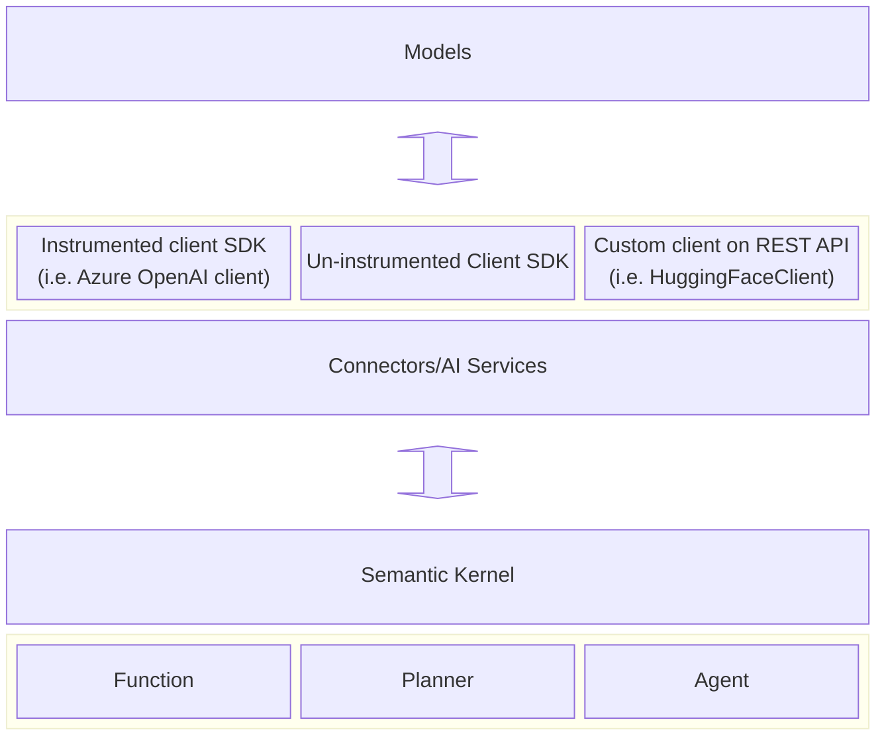

---
# These are optional elements. Feel free to remove any of them.
status: { proposed }
contact: { Tao Chen }
date: { 2024-04-15 }
deciders: {}
consulted: {}
informed: {}
---

# Use standardized vocabulary and specification for observability in Semantic Kernel

## Context and Problem Statement

Observing LLM applications has been a huge ask from customers and the community. This work aims to ensure that SK provides the best developer experience while complying with the industry standards for observability in generative-AI-based applications.

For more information, please refer to this issue: https://github.com/open-telemetry/semantic-conventions/issues/327

### Semantic conventions

The semantic conventions for generative AI are currently in their nascent stage, and as a result, many of the requirements outlined here may undergo changes in the future. Consequently, several features derived from this Architectural Decision Record (ADR) may be considered experimental. It is essential to remain adaptable and responsive to evolving industry standards to ensure the continuous improvement of our system's performance and reliability.

- [Semantic conventions for generative AI](https://github.com/open-telemetry/semantic-conventions/tree/main/docs/gen-ai)
- [Generic LLM attributes](https://github.com/open-telemetry/semantic-conventions/blob/main/docs/attributes-registry/llm.md)

### Telemetry requirements (Experimental)

Based on the initial version, Semantic Kernel should provide the following attributes in activities that represent LLM requests:

> `Activity` is a .Net concept and existed before OpenTelemetry. A `span` is an OpenTelemetry concept that is equivalent to an `Activity`.

- (Required)`gen_ai.system`
- (Required)`gen_ai.request.model`
- (Recommended)`gen_ai.request.max_token`
- (Recommended)`gen_ai.request.temperature`
- (Recommended)`gen_ai.request.top_p`
- (Recommended)`gen_ai.response.id`
- (Recommended)`gen_ai.response.model`
- (Recommended)`gen_ai.response.finish_reasons`
- (Recommended)`gen_ai.response.prompt_tokens`
- (Recommended)`gen_ai.response.completion_tokens`

The following events will be optionally attached to an activity:
| Event name| Attribute(s)|
|---|---|
|`gen_ai.content.prompt`|`gen_ai.prompt`|
|`gen_ai.content.completion`|`gen_ai.completion`|

> The kernel must provide configuration options to disable these events because they may contain PII.
> See the [Semantic conventions for generative AI](https://github.com/open-telemetry/semantic-conventions/tree/main/docs/gen-ai) for requirement level for these attributes.

## Where do we create the activities

It is crucial to establish a clear line of responsibilities, particularly since certain service providers, such as the Azure OpenAI SDK, have pre-existing instrumentation (in which case SK won't need to track LLM requests). Our objective is to position our activities as close to the model level as possible to promote a more cohesive and consistent developer experience.



> Semantic Kernel also supports other types of connectors for memories/vector databases. We will discuss instrumentations for those connectors in a separate ADR.

> Note that this will not change our approaches to [instrumentation for planners](./0025-planner-telemetry-enhancement.md). We may modify or remove some of the meters we created previously, which will introduce breaking changes.

In order to keep the activities as close to the model level as possible, we should keep them at or below the connector level.

### Out of scope

These services will be discuss in the future:

- Memory/vector database services
- Audio to text services (`IAudioToTextService`)
- Embedding services (`IEmbeddingGenerationService`)
- Image to text services (`IImageToTextService`)
- Text to audio services (`ITextToAudioService`)
- Text to image services (`ITextToImageService`)

## Considered Options

- Instrumentation implementations
  - Static class
  - Static member
  - Dependency injection
- Where do we create the activities
  - Add instrumentations at the connector/service level
  - Add instrumentations at the client level

### Instrumentation implementations

#### Static class `ModelDiagnostics`

This class will live under `dotnet\src\InternalUtilities\src\Diagnostics`.

```C#
// Example
namespace Microsoft.SemanticKernel;

internal static class ModelDiagnostics
{
    private static string s_namespace = typeof(ModelDiagnostics).Namespace;
    private static ActivitySource s_activitySource = new ActivitySource(s_namespace);

    public static Activity? StartCompletionActivity(string name, string modelName, string modelProvider, string prompt, PromptExecutionSettings? executionSettings)
    {
        ...
    }

    // Can be used for both non-streaming endpoints and streaming endpoints.
    // For streaming, collect a list of `StreamingTextContent` and concatenate them into a single `TextContent` at the end of the streaming.
    void SetCompletionResponses(Activity? activity, IReadOnlyList<TextContent> completions, CompletionUsage? usage, PromptExecutionSettings? executionSettings)
    {
        ...
    }

    ...
}
```

Example usage

```C#
// In client
public async Task<IReadOnlyList<TextContent>> GenerateTextAsync(
    string prompt,
    PromptExecutionSettings? executionSettings,
    CancellationToken cancellationToken)
{
    using var activity = ModelDiagnostics.StartCompletionActivity(
        $"HuggingFace {this._modelId}",
        this._modelId,
        "HuggingFace",
        prompt,
        executionSettings);

    var completions = ...;
    // Usage can be estimated.
    var usage = ...;

    ModelDiagnostics.SetCompletionResponses(
        activity,
        completions,
        usage,
        executionSettings);

    return completions;
}

// In service
public Task<IReadOnlyList<TextContent>> GetTextContentsAsync(string prompt, PromptExecutionSettings? executionSettings = null, Kernel? kernel = null, CancellationToken cancellationToken = default)
{
    using var activity = ModelDiagnostics.StartCompletionActivity(
        $"HuggingFace {this.AttributesInternal[AIServiceExtensions.ModelIdKey]}",
        this.AttributesInternal[AIServiceExtensions.ModelIdKey],
        "HuggingFace",
        prompt,
        executionSettings);

    var completions = ...;

    // Usage is usually not returned from the clients.
    ModelDiagnostics.SetCompletionResponses(
        activity,
        completions,
        null,
        executionSettings);

    return completions;
}
```

#### Static member of type `ModelDiagnostics` (this is not the static class shown above)

This class will live under `dotnet\src\InternalUtilities\src\Diagnostics`.

```C#
// Example
internal sealed class ModelDiagnostics
{
    private ActivitySource _source;

    // Source name must be unique
    public ModelDiagnostics(string sourceName)
    {
        this._source = new ActivitySource(sourceName);
    }

    public Activity? StartCompletionActivity(string name, string modelName, string modelProvider, string prompt, PromptExecutionSettings? executionSettings)
    {
        ...
    }

    ...

    public void SetCompletionResponses(Activity? activity, IReadOnlyList<TextContent> completions, CompletionUsage? usage, PromptExecutionSettings? executionSettings)
    {
        ...
    }

    ...
}
```

Example usage

```C#
// In client
internal sealed class HuggingFaceClient
{
    ...
    private static readonly string s_namespace = typeof(HuggingFaceClient).Namespace;
    private static readonly ModelDiagnostics s_modelDiagnostics = new ModelDiagnostics(s_namespace);
    ...

    public async Task<IReadOnlyList<TextContent>> GenerateTextAsync(
        string prompt,
        PromptExecutionSettings? executionSettings,
        CancellationToken cancellationToken)
    {
        using var activity = s_modelDiagnostics.StartCompletionActivity(
            $"HuggingFace {this._modelId}",
            this._modelId,
            "HuggingFace",
            prompt,
            executionSettings);

        var completions = ...;
        // Usage can be estimated.
        var usage = ...;

        s_modelDiagnostics.SetCompletionResponses(
            activity,
            completions,
            usage);

        return completions;
    }
}

// In service
public sealed class HuggingFaceTextGenerationService : ITextGenerationService
{
    ...
    private static readonly string s_namespace = typeof(HuggingFaceTextGenerationService).Namespace;
    private static readonly ModelDiagnostics s_modelDiagnostics = new ModelDiagnostics(s_namespace);
    ...

    public Task<IReadOnlyList<TextContent>> GetTextContentsAsync(string prompt, PromptExecutionSettings? executionSettings = null, Kernel? kernel = null, CancellationToken cancellationToken = default)
    {
        using var activity = s_modelDiagnostics.StartCompletionActivity(
            $"HuggingFace {this.AttributesInternal[AIServiceExtensions.ModelIdKey]}",
            this.AttributesInternal[AIServiceExtensions.ModelIdKey],
            "HuggingFace",
            prompt,
            executionSettings);

        var completions = ...;

        // Usage is usually not returned from the clients.
        s_modelDiagnostics.SetCompletionResponses(
            activity,
            completions,
            null,
            executionSettings);

        return completions;
    }
}
```

#### Dependency injection

This class will live under `dotnet\src\InternalUtilities\src\Diagnostics`.

```C#
namespace Microsoft.SemanticKernel;

internal class ModelDiagnostics
{
    private readonly bool _isEventCollectionEnabled;

    private readonly ActivitySource s_activitySource = new ActivitySource(typeof(ModelDiagnostics).Namespace);

    public ModelDiagnostics(bool isEventCollectionEnabled)
    {
        _isEventCollectionEnabled = isEventCollectionEnabled;
    }

    public Activity? StartCompletionActivity(string name, string modelName, string modelProvider, string prompt, PromptExecutionSettings? executionSettings)
    {
        ...
    }

    ...

    public void SetCompletionResponses(Activity? activity, IReadOnlyList<TextContent> completions, CompletionUsage? usage, PromptExecutionSettings? executionSettings)
    {
        ...
    }

    ...
}
```

Example usage

```C#
// In client
internal sealed class HuggingFaceClient
{
    ...
    private readonly ModelDiagnostics? _modelDiagnostics;
    ...

    internal HuggingFaceClient(
        string modelId,
        HttpClient httpClient,
        Uri? endpoint = null,
        string? apiKey = null,
        StreamJsonParser? streamJsonParser = null,
        ModelDiagnostics? modelDiagnostics = null,
        ILogger? logger = null)
    {
        ...
        this._modelDiagnostics = modelDiagnostics;
    }

    public async Task<IReadOnlyList<TextContent>> GenerateTextAsync(
        string prompt,
        PromptExecutionSettings? executionSettings,
        CancellationToken cancellationToken)
    {
        using var activity = this._modelDiagnostics.StartCompletionActivity(
            $"HuggingFace {this._modelId}",
            this._modelId,
            "HuggingFace",
            prompt,
            executionSettings);

        var completions = ...;
        // Usage can be estimated.
        var usage = ...;

        this._modelDiagnostics.SetCompletionResponses(
            activity,
            completions,
            usage);

        return completions;
    }
}

// In service
public sealed class HuggingFaceTextGenerationService : ITextGenerationService
{
    ...
    private readonly ModelDiagnostics? _modelDiagnostics;
    ...

    public HuggingFaceTextGenerationService(
        string model,
        Uri? endpoint = null,
        string? apiKey = null,
        HttpClient? httpClient = null,
        ILoggerFactory? loggerFactory = null,
        ModelDiagnostics? modelDiagnostics = null)
    {
        ...
        this._modelDiagnostics = modelDiagnostics;
        ...
    }

    public Task<IReadOnlyList<TextContent>> GetTextContentsAsync(string prompt, PromptExecutionSettings? executionSettings = null, Kernel? kernel = null, CancellationToken cancellationToken = default)
    {
        using var activity = this._modelDiagnostics.StartCompletionActivity(
            $"HuggingFace {this.AttributesInternal[AIServiceExtensions.ModelIdKey]}",
            this.AttributesInternal[AIServiceExtensions.ModelIdKey],
            "HuggingFace",
            prompt,
            executionSettings);

        var completions = ...;

        // Usage is usually not returned from the clients.
        this._modelDiagnostics.SetCompletionResponses(
            activity,
            completions,
            null,
            executionSettings);

        return completions;
    }
}
```

Dependency injection example

```C#
// This is the way to opt in to include LLM request activities.
public static IKernelBuilder AddModelDiagnostics(this IKernelBuilder builder, bool isEventCollectionEnabled = false)
{
    builder.Services.AddSingleton<ModelDiagnostics>(new ModelDiagnostics(isEventCollectionEnabled));

    return builder;
}

// In HuggingFaceKernelBuilderExtensions
public static IKernelBuilder AddHuggingFaceTextGeneration(
    this IKernelBuilder builder,
    string model,
    Uri? endpoint = null,
    string? apiKey = null,
    string? serviceId = null,
    HttpClient? httpClient = null)
{
    ...

    builder.Services.AddKeyedSingleton<ITextGenerationService>(serviceId, (serviceProvider, _) =>
        new HuggingFaceTextGenerationService(
            model,
            endpoint,
            apiKey,
            HttpClientProvider.GetHttpClient(httpClient, serviceProvider),
            null,
            serviceProvider.GetService<ModelDiagnostics>()
        )
    );

    return builder;
}
```

#### Comparison

All three approaches provide uniform APIs for instrumenting LLM requests. The static class implementation holds the benefit of not requiring changes to the constructors of services and clients. However, it presents difficulties concerning configuration (via `PromptExecutionSettings` which is configured per prompt). The static member approach shares similar challenges, but it permits connectors to generate activities under distinct namespaces, which allows more granular control over Activity telemetry. Conversely, the dependency injection approach enables convenient configuration, albeit necessitating modifications to the constructors, and users must explicitly inject the dependency to activate LLM request tracing even when there are registered listeners.

### Where do we create the activities

#### Connector/AI Service

AI services employ common interfaces and typically feature straightforward implementations, thereby resulting in lower maintenance overhead. Nonetheless, acquiring comprehensive model-related data and complete LLM requests/responses can be challenging within the services.

#### Client

Client implementations may exhibit variations; however, they generally encompass a similar set of methods for text and chat completions. Furthermore, obtaining model data, such as model name and provider, as well as response metadata, including token usage, is more convenient when performed within the clients.

#### Comparison

Clients represent the final layer in the stack through which all kernel operations reach the models. As such, it would be more intuitive to incorporate instrumentation for all LLM requests at the client level. Furthermore, some clients already generate metrics. However, due to the lack of shared interfaces among clients, there will be additional implementation and maintenance overhead.

In contrast, connectors (or AI services) share common interfaces, specifically the `IChatCompletionService` and `ITextGenerationService`. Nevertheless, AI services rely on their underlying clients to execute LLM requests, which could potentially result in inconsistencies where telemetry data originates from different layers in the stack if a client is instrumented (e.g., Azure OpenAI vs. `HuggingFaceTextGenerationService`).

|      | Connectors/Services                                                                                           | Clients                                                                                                          |
| ---- | ------------------------------------------------------------------------------------------------------------- | ---------------------------------------------------------------------------------------------------------------- |
| Pros | 1. Uniform implementation across all services.                                                                | 1. Enhanced intuitiveness regarding the overall data flow.<br>2. Complete model specs and LLM requests/response. |
| Cons | 1. Inconsistencies in the origins of telemetry data.<br>2. Incomplete model specs and LLM requests/responses. | 1. Separate implementations may lead to increased maintenance overhead.                                          |

## Decision Outcome

TBD

## Appendix

### `PromptExecutionSettings`

```C#
public class PromptExecutionSettings
{
    ...
    [JsonPropertyName("is_event_collection_enable")]
    public bool IsEventCollectionEnabled
    {
        get => this._isEventCollectionEnabled;

        set
        {
            this.ThrowIfFrozen();
            this._isEventCollectionEnabled = value;
        }
    }
    ...
    private bool _isEventCollectionEnabled = false;
}
```

### `ModelDiagnostics` (static class)

```C#
private static class ModelDiagnostics
{
    ...
    public static Activity? StartCompletionActivity(string name, string modelName, string modelProvider, ChatHistory chatHistory, PromptExecutionSettings? executionSettings)
    {
        var activity = s_activitySource.StartActivityWithTags(
            name,
            new() {
                new("gen_ai.request.model", modelName),
                new("gen_ai.system", modelProvider),
                ...
            });

        // Chat history is optional as it may contain sensitive data.
        if (executionSettings.IsEventCollectionEnabled)
        {
            activity?.AttachSensitiveDataAsEvent("gen_ai.content.prompt", new() { new("gen_ai.prompt", chatHistory) });
        }

        return activity;
    }
    ...
}
```

### `ModelDiagnostics` (static member)

```C#
internal sealed class ModelDiagnostics
{
    private readonly ActivitySource _source;

    // Source name must be unique
    public ModelDiagnostics(string sourceName)
    {
        this._source = new ActivitySource(sourceName);
    }

    public Activity? StartCompletionActivity(string name, string modelName, string modelProvider, string prompt, PromptExecutionSettings? executionSettings)
    {
        var activity = this._source.StartActivityWithTags(
            name,
            new() {
                new("gen_ai.request.model", modelName),
                new("gen_ai.system", modelProvider),
                ...
            });

        // Chat history is optional as it may contain sensitive data.
        if (executionSettings.IsEventCollectionEnabled)
        {
            activity?.AttachSensitiveDataAsEvent("gen_ai.content.prompt", new() { new("gen_ai.prompt", prompt) });
        }

        return activity;
    }

    ...
}
```

### `ModelDiagnostics` (dependency injection)

```C#
// Example implementation
internal class ModelDiagnostics
{
    ...

    public Activity? StartCompletionActivity(string name, string modelName, string modelProvider, ChatHistory chatHistory, PromptExecutionSettings? executionSettings)
    {
        var activity = s_activitySource.StartActivityWithTags(
            name,
            new() {
                new("gen_ai.request.model", modelName),
                new("gen_ai.system", modelProvider),
                ...
            });

        if (_isEventCollectionEnabled)
        {
            activity?.AttachSensitiveDataAsEvent("gen_ai.content.prompt", new() { new("gen_ai.prompt", chatHistory) });
        }

        return activity;
    }

    ...
}
```

### Extensions

```C#
public static class ActivityExtensions
{
    public static Activity? StartActivityWithTags(this ActivitySource source, string name, List<KeyValuePair<string, object?>> tags)
    {
        return source.StartActivity(
            name,
            ActivityKind.Internal,
            Activity.current?.Context ?? new ActivityContext(),
            tags);
    }

    public static Activity EnrichAfterResponse(this Activity activity, List<KeyValuePair<string, object?>> tags)
    {
        tags.ForEach(tag => {
            activity.SetTag(tag.Key, tag.Value);
        });

        return activity;
    }

    public static Activity AttachSensitiveDataAsEvent(this Activity activity, string name, List<KeyValuePair<string, object?>> tags)
    {
        activity.AddEvent(new ActivityEvent(
            name,
            tags: new ActivityTagsCollection(tags)
        ));

        return activity;
    }
}
```
