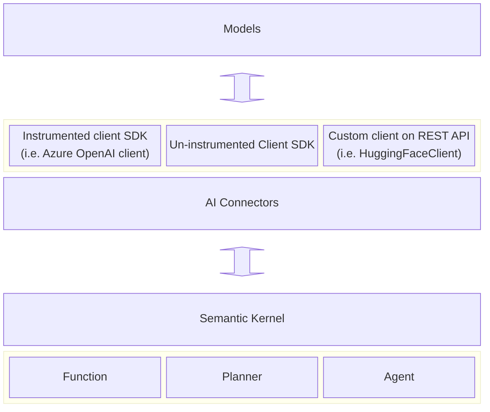

---
# These are optional elements. Feel free to remove any of them.
status: { accepted }
contact: { Tao Chen }
date: { 2024-05-02 }
deciders: { Stephen Toub, Ben Thomas }
consulted: { Stephen Toub, Liudmila Molkova, Ben Thomas }
informed: { Dmytro Struk, Mark Wallace }
---

# Use standardized vocabulary and specification for observability in Semantic Kernel

## Context and Problem Statement

Observing LLM applications has been a huge ask from customers and the community. This work aims to ensure that SK provides the best developer experience while complying with the industry standards for observability in generative-AI-based applications.

For more information, please refer to this issue: https://github.com/open-telemetry/semantic-conventions/issues/327

### Semantic conventions

The semantic conventions for generative AI are currently in their nascent stage, and as a result, many of the requirements outlined here may undergo changes in the future. Consequently, several features derived from this Architectural Decision Record (ADR) may be considered experimental. It is essential to remain adaptable and responsive to evolving industry standards to ensure the continuous improvement of our system's performance and reliability.

- [Semantic conventions for generative AI](https://github.com/open-telemetry/semantic-conventions/tree/main/docs/gen-ai)
- [Generic LLM attributes](https://github.com/open-telemetry/semantic-conventions/blob/main/docs/attributes-registry/gen-ai.md)

### Telemetry requirements (Experimental)

Based on the [initial version](https://github.com/open-telemetry/semantic-conventions/blob/651d779183ecc7c2f8cfa90bf94e105f7b9d3f5a/docs/attributes-registry/gen-ai.md), Semantic Kernel should provide the following attributes in activities that represent individual LLM requests:

> `Activity` is a .Net concept and existed before OpenTelemetry. A `span` is an OpenTelemetry concept that is equivalent to an `Activity`.

- (Required)`gen_ai.system`
- (Required)`gen_ai.request.model`
- (Recommended)`gen_ai.request.max_token`
- (Recommended)`gen_ai.request.temperature`
- (Recommended)`gen_ai.request.top_p`
- (Recommended)`gen_ai.response.id`
- (Recommended)`gen_ai.response.model`
- (Recommended)`gen_ai.response.finish_reasons`
- (Recommended)`gen_ai.response.prompt_tokens`
- (Recommended)`gen_ai.response.completion_tokens`

The following events will be optionally attached to an activity:
| Event name| Attribute(s)|
|---|---|
|`gen_ai.content.prompt`|`gen_ai.prompt`|
|`gen_ai.content.completion`|`gen_ai.completion`|

> The kernel must provide configuration options to disable these events because they may contain PII.
> See the [Semantic conventions for generative AI](https://github.com/open-telemetry/semantic-conventions/tree/main/docs/gen-ai) for requirement level for these attributes.

## Where do we create the activities

It is crucial to establish a clear line of responsibilities, particularly since certain service providers, such as the Azure OpenAI SDK, have pre-existing instrumentation. Our objective is to position our activities as close to the model level as possible to promote a more cohesive and consistent developer experience.



> Semantic Kernel also supports other types of connectors for memories/vector databases. We will discuss instrumentations for those connectors in a separate ADR.

> Note that this will not change our approaches to [instrumentation for planners and kernel functions](./0025-planner-telemetry-enhancement.md). We may modify or remove some of the meters we created previously, which will introduce breaking changes.

In order to keep the activities as close to the model level as possible, we should keep them at the connector level.

### Out of scope

These services will be discuss in the future:

- Memory/vector database services
- Audio to text services (`IAudioToTextService`)
- Embedding services (`IEmbeddingGenerationService`)
- Image to text services (`IImageToTextService`)
- Text to audio services (`ITextToAudioService`)
- Text to image services (`ITextToImageService`)

## Considered Options

- Scope of Activities
  - All connectors, irrespective of the client SDKs used.
  - Connectors that either lack instrumentation in their client SDKs or use custom clients.
  - All connectors, noting that the attributes of activities derived from connectors and those from instrumented client SDKs do not overlap.
- Implementations of Instrumentation
  - Static class
- Switches for experimental features and the collection of sensitive data
  - App context switch

### Scope of Activities

#### All connectors, irrespective of the client SDKs utilized

All AI connectors will generate activities for the purpose of tracing individual requests to models. Each activity will maintain a **consistent set of attributes**. This uniformity guarantees that users can monitor their LLM requests consistently, irrespective of the connectors used within their applications. However, it introduces the potential drawback of data duplication which **leads to greater costs**, as the attributes contained within these activities will encompass a broader set (i.e. additional SK-specific attributes) than those generated by the client SDKs, assuming that the client SDKs are likewise instrumented in alignment with the semantic conventions.

> In an ideal world, it is anticipated that all client SDKs will eventually align with the semantic conventions.

#### Connectors that either lack instrumentation in their client SDKs or utilize custom clients

AI connectors paired with client SDKs that lack the capability to generate activities for LLM requests will take on the responsibility of creating such activities. In contrast, connectors associated with client SDKs that do already generate request activities will not be subject to further instrumentation. It is required that users subscribe to the activity sources offered by the client SDKs to ensure consistent tracking of LLM requests. This approach helps in **mitigating the costs** associated with unnecessary data duplication. However, it may introduce **inconsistencies in tracing**, as not all LLM requests will be accompanied by connector-generated activities.

#### All connectors, noting that the attributes of activities derived from connectors and those from instrumented client SDKs do not overlap

All connectors will generate activities for the purpose of tracing individual requests to models. The composition of these connector activities, specifically the attributes included, will be determined based on the instrumentation status of the associated client SDK. The aim is to include only the necessary attributes to prevent data duplication. Initially, a connector linked to a client SDK that lacks instrumentation will generate activities encompassing all potential attributes as outlined by the LLM semantic conventions, alongside some SK-specific attributes. However, once the client SDK becomes instrumented in alignment with these conventions, the connector will cease to include those previously added attributes in its activities, avoiding redundancy. This approach facilitates a **relatively consistent** development experience for user building with SK while **optimizing costs** associated with observability.

### Instrumentation implementations

#### Static class `ModelDiagnostics`

This class will live under `dotnet\src\InternalUtilities\src\Diagnostics`.

```C#
// Example
namespace Microsoft.SemanticKernel;

internal static class ModelDiagnostics
{
    public static Activity? StartCompletionActivity(
        string name,
        string modelName,
        string modelProvider,
        string prompt,
        PromptExecutionSettings? executionSettings)
    {
        ...
    }

    // Can be used for both non-streaming endpoints and streaming endpoints.
    // For streaming, collect a list of `StreamingTextContent` and concatenate them into a single `TextContent` at the end of the streaming.
    public static void SetCompletionResponses(
        Activity? activity,
        IEnumerable<TextContent> completions,
        int promptTokens,
        int completionTokens,
        IEnumerable<string?>? finishReasons)
    {
        ...
    }

    // Contains more methods for chat completion and other services
    ...
}
```

Example usage

```C#
public async Task<IReadOnlyList<TextContent>> GenerateTextAsync(
    string prompt,
    PromptExecutionSettings? executionSettings,
    CancellationToken cancellationToken)
{
    using var activity = ModelDiagnostics.StartCompletionActivity(
        $"text.generation {this._modelId}",
        this._modelId,
        "HuggingFace",
        prompt,
        executionSettings);

    var completions = ...;
    var finishReasons = ...;
    // Usage can be estimated.
    var promptTokens = ...;
    var completionTokens = ...;

    ModelDiagnostics.SetCompletionResponses(
        activity,
        completions,
        promptTokens,
        completionTokens,
        finishReasons);

    return completions;
}
```

### Switches for experimental features and the collection of sensitive data

#### App context switch

We will introduce two flags to facilitate the explicit activation of tracing LLMs requests:

1. `Microsoft.SemanticKernel.Experimental.EnableModelDiagnostics`
   - Activating will enable the creation of activities that represent individual LLM requests.
2. `Microsoft.SemanticKernel.Experimental.EnableModelDiagnosticsWithSensitiveData`
   - Activating will enable the creation of activities that represent individual LLM requests, with events that may contain PII information.

```C#
// In application code
if (builder.Environment.IsProduction())
{
    AppContext.SetSwitch("Microsoft.SemanticKernel.Experimental.EnableModelDiagnostics", true);
}
else
{
    AppContext.SetSwitch("Microsoft.SemanticKernel.Experimental.EnableModelDiagnosticsWithSensitiveData", true);
}

// Or in the project file
<ItemGroup Condition="'$(Configuration)' == 'Release'">
    <RuntimeHostConfigurationOption Include="Microsoft.SemanticKernel.Experimental.EnableModelDiagnostics" Value="true" />
</ItemGroup>

<ItemGroup Condition="'$(Configuration)' == 'Debug'">
    <RuntimeHostConfigurationOption Include="Microsoft.SemanticKernel.Experimental.EnableModelDiagnosticsWithSensitiveData" Value="true" />
</ItemGroup>
```

## Decision Outcome

Chosen options:

[x] Scope of Activities: **Option 3** - All connectors, noting that the attributes of activities derived from connectors and those from instrumented client SDKs do not overlap.

[x] Instrumentation Implementation: **Option 1** - Static class

[x] Experimental switch: **Option 1** - App context switch

## Appendix

### `AppContextSwitchHelper.cs`

```C#
internal static class AppContextSwitchHelper
{
    public static bool GetConfigValue(string appContextSwitchName)
    {
        if (AppContext.TryGetSwitch(appContextSwitchName, out bool value))
        {
            return value;
        }

        return false;
    }
}
```

### `ModelDiagnostics`

```C#
internal static class ModelDiagnostics
{
    // Consistent namespace for all connectors
    private static readonly string s_namespace = typeof(ModelDiagnostics).Namespace;
    private static readonly ActivitySource s_activitySource = new(s_namespace);

    private const string EnableModelDiagnosticsSettingName = "Microsoft.SemanticKernel.Experimental.GenAI.EnableOTelDiagnostics";
    private const string EnableSensitiveEventsSettingName = "Microsoft.SemanticKernel.Experimental.GenAI.EnableOTelDiagnosticsSensitive";

    private static readonly bool s_enableSensitiveEvents = AppContextSwitchHelper.GetConfigValue(EnableSensitiveEventsSettingName);
    private static readonly bool s_enableModelDiagnostics = AppContextSwitchHelper.GetConfigValue(EnableModelDiagnosticsSettingName) || s_enableSensitiveEvents;

    public static Activity? StartCompletionActivity(string name, string modelName, string modelProvider, string prompt, PromptExecutionSettings? executionSettings)
    {
        if (!s_enableModelDiagnostics)
        {
            return null;
        }

        var activity = s_activitySource.StartActivityWithTags(
            name,
            new() {
                new("gen_ai.request.model", modelName),
                new("gen_ai.system", modelProvider),
                ...
            });

        // Chat history is optional as it may contain sensitive data.
        if (s_enableSensitiveEvents)
        {
            activity?.AttachSensitiveDataAsEvent("gen_ai.content.prompt", new() { new("gen_ai.prompt", prompt) });
        }

        return activity;
    }
    ...
}
```

### Extensions

```C#
internal static class ActivityExtensions
{
    public static Activity? StartActivityWithTags(this ActivitySource source, string name, List<KeyValuePair<string, object?>> tags)
    {
        return source.StartActivity(
            name,
            ActivityKind.Internal,
            Activity.Current?.Context ?? new ActivityContext(),
            tags);
    }

    public static Activity EnrichAfterResponse(this Activity activity, List<KeyValuePair<string, object?>> tags)
    {
        tags.ForEach(tag =>
        {
            if (tag.Value is not null)
            {
                activity.SetTag(tag.Key, tag.Value);
            }
        });
    }

    public static Activity AttachSensitiveDataAsEvent(this Activity activity, string name, List<KeyValuePair<string, object?>> tags)
    {
        activity.AddEvent(new ActivityEvent(
            name,
            tags: new ActivityTagsCollection(tags)
        ));

        return activity;
    }
}
```

> Please be aware that the implementations provided above serve as illustrative examples, and the actual implementations within the codebase may undergo modifications.
