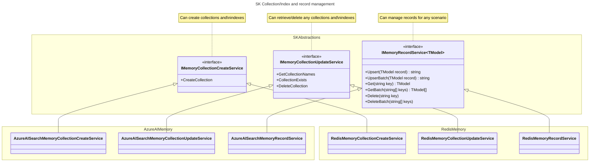

---
# These are optional elements. Feel free to remove any of them.
status: proposed
contact: westey-m
date: 2024-05-01
deciders: sergeymenshykh, markwallace, rbarreto, dmytrostruk, westey-m, matthewbolanos
consulted: stephentoub, dluc
informed: 
---

# Updated Memory Connector Design

## Context and Problem Statement

Semantic Kernel has a collection of connectors to popular Vector databases e.g. Azure AI Search, Chroma, Milvus, ...
Each Memory connector implements a memory abstraction defined by Semantic Kernel and allows developers to easily integrate Vector databases into their applications.
The current abstractions are experimental and the purpose of this ADR is to progress the design of the abstractions so that they can graduate to non experimental status.

### Problems with current design

1. The `IMemoryStore` interface has four responsibilities with different cardinalities.
2. The `IMemoryStore` interface only supports a fixed schema for data storage, retrieval and search, which limits its usability by customers with existing data sets.
2. The `IMemoryStore` implementations are opinionated around key encoding / decoding and collection name sanitization, which limits its usability by customers with existing data sets.

Responsibilities:

|Functional Area|Cardinality|Significance to Semantic Kernel|
|-|-|-|
|Collection/Index create|An implementation per store type and model|Valuable when building a store and adding data|
|Collection/Index list/exists/delete|An implementation per store type|Valuable when building a store and adding data|
|Data Storage and Retrieval|An implementation per store type|Valueble when building a store and adding data|
|Vector Search|An implementation per store type, model and search type|Valuable for RAG scenarios|


### Memory Store Today
```cs
interface IMemoryStore
{
    // Collection / Index Management
    Task CreateCollectionAsync(string collectionName, CancellationToken cancellationToken = default);
    IAsyncEnumerable<string> GetCollectionsAsync(CancellationToken cancellationToken = default);
    Task<bool> DoesCollectionExistAsync(string collectionName, CancellationToken cancellationToken = default);
    Task DeleteCollectionAsync(string collectionName, CancellationToken cancellationToken = default);

    // Data Storage and Retrieval
    Task<string> UpsertAsync(string collectionName, MemoryRecord record, CancellationToken cancellationToken = default);
    IAsyncEnumerable<string> UpsertBatchAsync(string collectionName, IEnumerable<MemoryRecord> records, CancellationToken cancellationToken = default);
    Task<MemoryRecord?> GetAsync(string collectionName, string key, bool withEmbedding = false, CancellationToken cancellationToken = default);
    IAsyncEnumerable<MemoryRecord> GetBatchAsync(string collectionName, IEnumerable<string> keys, bool withVectors = false, CancellationToken cancellationToken = default);
    Task RemoveAsync(string collectionName, string key, CancellationToken cancellationToken = default);
    Task RemoveBatchAsync(string collectionName, IEnumerable<string> keys, CancellationToken cancellationToken = default);

    // Vector Search
    IAsyncEnumerable<(MemoryRecord, double)> GetNearestMatchesAsync(
        string collectionName,
        ReadOnlyMemory<float> embedding,
        int limit,
        double minRelevanceScore = 0.0,
        bool withVectors = false,
        CancellationToken cancellationToken = default);

    Task<(MemoryRecord, double)?> GetNearestMatchAsync(
        string collectionName,
        ReadOnlyMemory<float> embedding,
        double minRelevanceScore = 0.0,
        bool withEmbedding = false,
        CancellationToken cancellationToken = default);
}
```

### Actions

1. The `IMemoryStore` should be split into four different interfaces, one for each responsibility.
2. The **Data Storage and Retrieval** and **Vector Search** areas should allow typed access to data and support any schema that is currently available in the customer's data store.
3. The collection / index create functionality should allow developers to create their own implementations and support creating first party collections for built in functionality. Each implementation would be for a specific schema and data store type.
4. The collection / index list/exists/delete functionality should allow management of any collection regardless of schema. There should be one implementation for each data store type.
5. Remove opinionated behaviors from connectors. The opinionated behavior limits the ability of these connectors to be used with pre-existing vector databases. As far as possible these behaviors should be moved into decorators or be injectable.  Examples of opinionated behaviors:
    1. The AzureAISearch connector encodes keys before storing and decodes them after retrieval since keys in Azure AI Search supports a limited set of characters.
    2. The AzureAISearch connector sanitizes collection names before using them, since Azure AI Search supports a limited set of characters.
    3. The Redis connector prepends the collection name on to the front of keys before storing records and also registers the collection name as a prefix for records to be indexed by the index.

### New Designs

The separation between collection/index management and record management.



How to use your own schema with core sk functionality.

```mermaid
---
title: Chat History Break Glass
---
classDiagram
    note for IMemoryRecordService "Can manage records\nfor any scenario"
    note for IMemoryCollectionCreateService "Can create collections\nan dindexes"
    note for IMemoryCollectionUpdateService "Can retrieve/delete any\ncollections and indexes"
    note for CustomerHistoryMemoryCollectionCreateService "Creates history collections and indices\nusing Customer requirements"
    note for CustomerHistoryMemoryRecordService "Decorator class for IMemoryRecordService that maps\nbetween the customer model to our model"

    namespace SKAbstractions{
        class IMemoryCollectionCreateService{
            <<interface>>
            +CreateCollection
        }

        class IMemoryCollectionUpdateService{
            <<interface>>
            +GetCollectionNames
            +CollectionExists
            +DeleteCollection
        }

        class IMemoryRecordService~TModel~{
            <<interface>>
            +Upsert(TModel record) string
            +Get(string key) TModel
            +Delete(string key) string
        }

        class ISemanticTextMemory{
            <<interface>>
            +SaveInformationAsync()
            +SaveReferenceAsync()
            +GetAsync()
            +DeleteAsync()
            +SearchAsync()
            +GetCollectionsAsync()
        }
    }

    namespace CustomerProject{
        class CustomerHistoryModel{
            +string text
            +float[] vector
            +Dictionary~string, string~ properties
        }

        class CustomerHistoryMemoryCollectionCreateService{
            +CreateCollection
        }

        class CustomerHistoryMemoryRecordService{
            -IMemoryRecordService~CustomerHistoryModel~ _store
            +Upsert(ChatHistoryModel record) string
            +Get(string key) ChatHistoryModel
            +Delete(string key) string
        }
    }

    namespace SKCore{
        class SemanticTextMemory{
            -IMemoryRecordService~ChatHistoryModel~ _MemoryRecordService
            -IMemoryCollectionService _collectionsService
            -ITextEmbeddingGenerationService _embeddingGenerationService
        }

        class ChatHistoryPlugin{
            -ISemanticTextMemory memory
        }

        class ChatHistoryModel{
            +string message
            +float[] embedding
            +Dictionary~string, string~ metadata
        }
    }

    IMemoryCollectionCreateService <|-- CustomerHistoryMemoryCollectionCreateService

    IMemoryRecordService <|-- CustomerHistoryMemoryRecordService
    IMemoryRecordService <.. CustomerHistoryMemoryRecordService
    CustomerHistoryModel <.. CustomerHistoryMemoryRecordService
    ChatHistoryModel <.. CustomerHistoryMemoryRecordService

    ChatHistoryModel <.. SemanticTextMemory
    IMemoryRecordService <.. SemanticTextMemory
    IMemoryCollectionCreateService <.. SemanticTextMemory

    ISemanticTextMemory <.. ChatHistoryPlugin
```



### Vector Store Cross Store support

A comparison of the different ways in which stores implement storage capabilities to help drive decisions:

|Feature|Azure AI Search|Weaviate|Redis|Chroma|FAISS|Pinecone|LLamaIndex|PostgreSql|Qdrant|Milvus|
|-|-|-|-|-|-|-|-|-|-|-|
|Get Item Support|Y|Y|Y|Y||Y||Y|Y|Y|
|Batch Operation Support|Y|Y|Y|Y||Y||||Y|
|Per Item Results for Batch Operations|Y|Y|Y|N||N|||||
|Keys of upserted records|Y|Y|N<sup>3</sup>|N<sup>3</sup>||N<sup>3</sup>||||Y|
|Keys of removed records|Y||N<sup>3</sup>|N||N||||N<sup>3</sup>|
|Retrieval field selection for gets|Y||Y<sup>4<sup>|P<sup>2</sup>||N||Y|Y|Y|
|Include/Exclude Embeddings for gets|P<sup>1</sup>|Y|Y<sup>4,1<sup>|Y||N||P<sup>1</sup>|Y|N|
|Failure reasons when batch partially fails|Y|Y|Y|N||N|||||
|Is Key separate from data|N|Y|Y|Y||Y||N|Y|N|
|Can Generate Ids|N|Y|N|N||Y||Y|N|Y|
|Can Generate Embedding|Not Available Via API yet|Y|N|Client Side Abstraction|||||N||
|Index allows text search|Y|Y|Y|Y (On Metadata by default)||||Y (with TSVECTOR field)|Y|Y|
|Allows filtering|Y|Y|Y (on TAG)|Y (On Metadata by default)||[Y](https://docs.pinecone.io/guides/indexes/configure-pod-based-indexes#selective-metadata-indexing)||Y|Y|Y|
|Allows scalar index field setup|Y|Y|Y|N||Y|||Y|Y|
|Requires scalar index field setup to filter|Y|Y|Y|N||N (on by default for all)|||N|N (can filter without index)|
|Field Differentiation|Fields|Key, Props, Vectors|Key, Fields|Key, Documents, Metadata, Vectors||Key, Metadata, SparseValues, Vectors||Fields|Key, Props(Payload), Vectors|Fields|
|Index to Collection|1 to 1|1 to 1|1 to many|1 to 1|-|1 to 1|-|1 to 1|1 to 1|1 to 1|
|Id Type|String|UUID|string with collection name prefix|string||string|UUID|64Bit Int / UUID / ULID|64Bit Unsigned Int / UUID|Int64 / varchar|
|Supported Vector Types|[Collection(Edm.Byte) / Collection(Edm.Single) / Collection(Edm.Half) / Collection(Edm.Int16) / Collection(Edm.SByte)](https://learn.microsoft.com/en-us/rest/api/searchservice/supported-data-types)|float32|FLOAT32 and FLOAT64|||[Rust f32](https://docs.pinecone.io/troubleshooting/embedding-values-changed-when-upserted)||[single-precision (4 byte float) / half-precision (2 byte float) / binary (1bit) / sparse vectors (4 bytes)](https://github.com/pgvector/pgvector?tab=readme-ov-file#pgvector)|UInt8 / Float32|Binary / Float32 / Float16 / BFloat16 / SparseFloat|
|Supported Distance Functions|[Cosine / dot prod / euclidean dist (l2 norm)](https://learn.microsoft.com/en-us/azure/search/vector-search-ranking#similarity-metrics-used-to-measure-nearness)|[Cosine dist / dot prod / Squared L2 dist / hamming (num of diffs) / manhattan dist](https://weaviate.io/developers/weaviate/config-refs/distances#available-distance-metrics)|[Euclidean dist (L2) / Inner prod (IP) / Cosine dist](https://redis.io/docs/latest/develop/interact/search-and-query/advanced-concepts/vectors/)|[Squared L2 / Inner prod / Cosine similarity](https://docs.trychroma.com/guides#changing-the-distance-function)||[cosine sim / euclidean dist / dot prod](https://docs.pinecone.io/reference/api/control-plane/create_index)||[L2 dist / inner prod / cosine dist / L1 dist / Hamming dist / Jaccard dist](https://github.com/pgvector/pgvector?tab=readme-ov-file#pgvector)|[Dot prod / Cosine sim / Euclidean dist (L2) / Manhattan dist](https://qdrant.tech/documentation/concepts/search/)|[Cosine sim / Euclidean dist / Inner Prod](https://milvus.io/docs/index-vector-fields.md)|
|Supported index types|[Exhaustive KNN / HNSW](https://learn.microsoft.com/en-us/azure/search/vector-search-ranking#algorithms-used-in-vector-search)|[HNSW / Flat / Dynamic](https://weaviate.io/developers/weaviate/config-refs/schema/vector-index)|[HNSW / FLAT](https://redis.io/docs/latest/develop/interact/search-and-query/advanced-concepts/vectors/#create-a-vector-field)|[HNSW not configurable](https://cookbook.chromadb.dev/core/concepts/#vector-index-hnsw-index)||[PGA](https://www.pinecone.io/blog/hnsw-not-enough/)||[HNSW / IVFFlat](https://github.com/pgvector/pgvector?tab=readme-ov-file#indexing)|[HNSW for dense](https://qdrant.tech/documentation/concepts/indexing/#vector-index)|<p>[In Memory: FLAT / IVF_FLAT / IVF_SQ8 / IVF_PQ / HNSW / SCANN](https://milvus.io/docs/index.md)</p><p>[On Disk: DiskANN](https://milvus.io/docs/disk_index.md)</p><p>[GPU: GPU_CAGRA / GPU_IVF_FLAT / GPU_IVF_PQ / GPU_BRUTE_FORCE](https://milvus.io/docs/gpu_index.md)</p>|

Footnotes:
- P = Partial Support
- <sup>1</sup> Only if you have the schema, to select the appropriate fields.
- <sup>2</sup> Supports broad categories of fields only.
- <sup>3</sup> Id is required in request, so can be returned if needed.
- <sup>4</sup> No strong typed support when specifying field list.
- HNSW = Hierarchical Navigable Small World (HNSW performs an [approximate nearest neighbor (ANN)](https://learn.microsoft.com/en-us/azure/search/vector-search-overview#approximate-nearest-neighbors) search)
- KNN = k-nearest neighbors (performs a brute-force search that scans the entire vector space)
- IVFFlat = Inverted File with Flat Compression (This index type uses approximate nearest neighbor search (ANNS) to provide fast searches)
- Weaviate Dynamic = Starts as flat and switches to HNSW if the number of objects exceed a limit
- PGA = [Pinecone Graph Algorithm](https://www.pinecone.io/blog/hnsw-not-enough/)

### Support for different mappers

Mapping between data models and the storage models can also require custom logic depending on the type of data model and storage model involved.

I'm therefore proposing that we allow mappers to be injectable for each `MemoryRecordService` instance. The interfaces for these would vary depending
on the storage models used by each vector store and any unique capabilities that each vector store may have, e.g. qdrant can operate in `single` or
`multiple named vector` modes, which means the mapper needs to know whether to set a single vector or fill a vector map.

In addition to this, we should build first party mappers for each of the vector stores, which will cater for built in, generic models or use metadata to perform the mapping.

### Support for different storage schemas

The different stores vary in many ways around how data is organized.
- Some just store a record with fields on it, where fields can be a key or a data field or a vector and their type is determined at collection creation time.
- Others separate fields by type when interacting with the api, e.g. you have to specify a key explicitly, put metadata into a metadata dictionary and put vectors into a vector array.

I'm proposing that we allow two ways in which to provide the information required to map data between the consumer data model and storage data model.
First is a set of configuration objects that capture the types of each field. Second would be a set of attributes that can be used to decorate the model itself
and can be converted to the configuration objects, allowing a single execution path.
Additional configuration properties can easily be added for each type of field as required, e.g. IsFilterable or IsFullTextSearchable, allowing us to also create an index from
the provided configuration.

Here is what the attributes would look like, plus a sample use case.

```cs
sealed class KeyAttribute : Attribute
{
}
sealed class DataAttribute : Attribute
{
    public bool HasEmbedding { get; set; }
    public string EmbeddingPropertyName { get; set; }
}
sealed class VectorAttribute : Attribute
{
}

public record HotelInfo(
    [property: Key, JsonPropertyName("hotel-id")] string HotelId,
    [property: Data, JsonPropertyName("hotel-name")] string HotelName,
    [property: Data(HasEmbedding = true, EmbeddingPropertyName = "DescriptionEmbeddings"), JsonPropertyName("description")] string Description,
    [property: Vector, JsonPropertyName("description-embeddings")] ReadOnlyMemory<float>? DescriptionEmbeddings);
```

Here is what the configuration objects would look like.

```cs
abstract class Field(string fieldName);

sealed class KeyField(string fieldName): Field(fieldName)
{
}
sealed class DataField(string fieldName): Field(fieldName)
{
    bool HasEmbedding;
    string EmbeddingPropertyName;
}
sealed class VectorField(string fieldName): Field(fieldName)
{
}

sealed class MemoryRecordDefinition
{
    IReadOnlyList<Field> Fields;
}
```

## Decision Drivers

From GitHub Issue:
- API surface must be easy to use and intuitive
- Alignment with other patterns in the SK
- - Design must allow Memory Plugins to be easily instantiated with any connector
- Design must support all Kernel content types
- Design must allow for database specific configuration
- All NFR's to be production ready are implemented
- Basic CRUD operations must be supported so that connectors can be used in a polymorphic manner
- Official Database Clients must be used where available
- Dynamic database schema must be supported
- Dependency injection must be supported
- Azure-ML YAML format must be supported
- Breaking glass scenarios must be supported

Additional:
- Focus on the core value propisition of SK


## Considered Questions

1. Combined collection and record management vs separated.
2. Collection name and key value normalization in decorator or main class.
3. Collection name as method param or constructor param.
4. How to normalize ids across different vector stores where different types are supported.

### Question 1: Combined collection and record management vs separated.

#### Option 1 - Combined collection and record management

```cs
interface IMemoryRecordService<TDataModel>
{
    Task CreateCollectionAsync(CollectionConfig collectionConfig, CancellationToken cancellationToken = default);
    IAsyncEnumerable<string> ListCollectionNamesAsync(CancellationToken cancellationToken = default);
    Task<bool> CollectionExistsAsync(string name, CancellationToken cancellationToken = default);
    Task DeleteCollectionAsync(string name, CancellationToken cancellationToken = default);

    Task UpsertAsync(TDataModel data, CancellationToken cancellationToken = default);
    IAsyncEnumerable<string> UpsertBatchAsync(IEnumerable<TDataModel> dataSet, CancellationToken cancellationToken = default);
    Task<TDataModel> GetAsync(string key, bool withEmbedding = false, CancellationToken cancellationToken = default);
    IAsyncEnumerable<TDataModel> GetBatchAsync(IEnumerable<string> keys, bool withVectors = false, CancellationToken cancellationToken = default);
    Task DeleteAsync(string key, CancellationToken cancellationToken = default);
    Task DeleteBatchAsync(IEnumerable<string> keys, CancellationToken cancellationToken = default);
}

class AzureAISearchMemoryRecordService<TDataModel>(
    Azure.Search.Documents.Indexes.SearchIndexClient client,
    Schema schema): IMemoryRecordService<TDataModel>;

class WeaviateMemoryRecordService<TDataModel>(
    WeaviateClient client,
    Schema schema): IMemoryRecordService<TDataModel>;

class RedisMemoryRecordService<TDataModel>(
    StackExchange.Redis.IDatabase database,
    Schema schema): IMemoryRecordService<TDataModel>;
```

#### Option 2 - Separated collection and record management with opinionated create implementations

```cs

interface IMemoryCollectionService
{
    virtual Task CreateChatHistoryCollectionAsync(string name, CancellationToken cancellationToken = default);
    virtual Task CreateSemanticCacheCollectionAsync(string name, CancellationToken cancellationToken = default);

    IAsyncEnumerable<string> ListCollectionNamesAsync(CancellationToken cancellationToken = default);
    Task<bool> CollectionExistsAsync(string name, CancellationToken cancellationToken = default);
    Task DeleteCollectionAsync(string name, CancellationToken cancellationToken = default);
}

class AzureAISearchMemoryCollectionService: IMemoryCollectionService;
class RedisMemoryCollectionService: IMemoryCollectionService;
class WeaviateMemoryCollectionService: IMemoryCollectionService;

// Customers can inherit from our implementations and replace just the creation scenarios to match their schemas.
class CustomerCollectionsService: AzureAISearchMemoryCollectionService, IMemoryCollectionService;

// We can also create implementations that create indices based on an MLIndex specification.
class MLIndexAzureAISearchMemoryCollectionService(MLIndex mlIndexSpec): AzureAISearchMemoryCollectionService, IMemoryCollectionService;

interface IMemoryRecordService<TDataModel>
{
    Task<TDataModel?> GetAsync(string key, GetRecordOptions? options = default, CancellationToken cancellationToken = default);
    Task DeleteAsync(string key, DeleteRecordOptions? options = default, CancellationToken cancellationToken = default);
    Task<string> UpsertAsync(TDataModel record, UpsertRecordOptions? options = default, CancellationToken cancellationToken = default);
}

class AzureAISearchMemoryRecordService<TDataModel>(): IMemoryRecordService<TDataModel>;
```

#### Option 3 - Separated collection and record management with collection create separate from other operations.

Vector store same as option 2 so not repeated for brevity.

```cs

interface IMemoryCollectionCreateService
{
    virtual Task CreateCollectionAsync(string name, CancellationToken cancellationToken = default);
}

class AzureAISearchChatHistoryCollectionCreateService: IMemoryCollectionCreateService;
class AzureAISearchSemanticCacheCollectionCreateService: IMemoryCollectionCreateService;

// Customers can create their own creation scenarios to match their schemas, but can continue to use our get, does exist and delete class.
class CustomerChatHistoryCollectionCreateService: IMemoryCollectionCreateService;

interface IMemoryCollectionUpdateService
{
    IAsyncEnumerable<string> ListCollectionNamesAsync(CancellationToken cancellationToken = default);
    Task<bool> CollectionExistsAsync(string name, CancellationToken cancellationToken = default);
    Task DeleteCollectionAsync(string name, CancellationToken cancellationToken = default);
}

class AzureAISearchMemoryCollectionUpdateService: IMemoryCollectionUpdateService;
class RedisMemoryCollectionUpdateService: IMemoryCollectionUpdateService;
class WeaviateMemoryCollectionUpdateService: IMemoryCollectionUpdateService;

```

#### Option 4 - Separated collection and record management with collection create separate from other operations, with collection management aggregation class on top.

Variation on option 3. 

```cs

interface IMemoryCollectionCreateService
{
    virtual Task CreateCollectionAsync(string name, CancellationToken cancellationToken = default);
}

interface IMemoryCollectionUpdateService
{
    IAsyncEnumerable<string> ListCollectionNamesAsync(CancellationToken cancellationToken = default);
    Task<bool> CollectionExistsAsync(string name, CancellationToken cancellationToken = default);
    Task DeleteCollectionAsync(string name, CancellationToken cancellationToken = default);
}

// DB Specific Update implementations
class AzureAISearchMemoryCollectionUpdateService: IMemoryCollectionUpdateService;
class RedisMemoryCollectionUpdateService: IMemoryCollectionUpdateService;

// Combined Create + Update Interface
interface IMemoryCollectionService: IMemoryCollectionCreateService, IMemoryCollectionUpdateService {}

// Base abstract class that forwards non-create operations to provided service.
abstract class MemoryCollectionService(IMemoryCollectionUpdateService collectionsUpdateService): IMemoryCollectionService
{
    public abstract Task CreateCollectionAsync(string name, CancellationToken cancellationToken = default);
    public IAsyncEnumerable<string> ListCollectionNamesAsync(CancellationToken cancellationToken = default) { return collectionsUpdateService.ListCollectionNamesAsync(cancellationToken); }
    public Task<bool> CollectionExistsAsync(string name, CancellationToken cancellationToken = default) { return collectionsUpdateService.CollectionExistsAsync(name, cancellationToken); }
    public Task DeleteCollectionAsync(string name, CancellationToken cancellationToken = default) { return collectionsUpdateService.DeleteCollectionAsync(name, cancellationToken); }
}

// Collections service implementations, that inherit from base class, and just adds the different creation implementations.
class AzureAISearchChatHistoryMemoryService(AzureAISearchMemoryCollectionUpdateService updateService): MemoryCollectionService(updateService);
class AzureAISearchSemanticCacheMemoryService(AzureAISearchMemoryCollectionUpdateService updateService): MemoryCollectionService(updateService);
class AzureAISearchMLIndexMemoryService(AzureAISearchMemoryCollectionUpdateService updateService): MemoryCollectionService(updateService);

// Customer collections service implementation, that uses the base Azure AI Search implementation for get, doesExist and delete, but adds it's own creation.
class ContosoProductsMemoryCollectionService(AzureAISearchMemoryCollectionUpdateService updateService): MemoryCollectionService(updateService);

```

#### Option 5 - Separated collection and record management with collection create separate from other operations, with overall aggregation class on top.

Same as option 3 / 4, plus:

```cs

interface IMemoryService : IMemoryCollectionCreateService, IMemoryCollectionService, IMemoryRecordService
{    
}

// Create a static factory that produces one of these, so only the interface is public, not the class.
internal class CombinedMemoryService<TDataModel>(IMemoryCollectionCreateService creation, IMemoryCollectionService collections, IMemoryRecordService<TDataModel> records): IMemoryService
{
}

```

#### Decision Outcome

Chosen option: 4 + 5.

- Collection create and configuration varies considerably across different schemas, even for the same database, but also varies by database type.
- Collection list, exists and delete is the same across different schemas, but varies by database type.
- Vector storage, even with custom schemas can be supported using a single implementation per database type.
- We will therefore need to support multiple collection create service implementations per store type, a single collection update service implementation per store type, and a single vector store implementation per store type.
- At the same time we can layer interfaces on top that allow easy combined access to collection and record management.


###  Question 2: Collection name and key value normalization in store, decorator or via injection.

#### Option 1 - Normalization in main record service

- Pros: Simple
- Cons: The normalization needs to vary separately from the record service, so this will not work

```cs
    public class AzureAISearchMemoryRecordService<TDataModel> : IMemoryRecordService<TDataModel>
    {
        ...

        // On input.
        var normalizedCollectionName = this.NormalizeCollectionName(collectionName);
        var encodedId = AzureAISearchMemoryRecord.EncodeId(key);

        ...

        // On output.
        DecodeId(this.Id)

        ...
    }
```

#### Option 2 - Normalization in decorator

- Pros: Allows normalization to vary separately from the record service.
- Pros: No code executed when no normalization required.
- Pros: Easy to package matching encoders/decoders together.
- Pros: Easier to obsolete encoding/normalization as a concept.
- Cons: Need to implement the full MemoryRecordService interface.
- Cons: Hard to have a generic implementation that can work with any model, without either changing the data in the provided object on upsert or doing cloning in an expensive way.

```cs
    new KeyNormalizingAISearchMemoryRecordService<MyModel>(
        "keyField",
         new AzureAISearchMemoryRecordService<MyModel>(...));
```

#### Option 3 - Normalization via optional function parameters to record service constructor

- Pros: Allows normalization to vary separately from the record service.
- Pros: No need to implement the full MemoryRecordService interface.
- Pros: Can modify values on serialization without changing the incoming record, if supported by DB SDK.
- Cons: Harder to package matching encoders/decoders together.

```cs
public class AzureAISearchMemoryRecordService<TDataModel>(StoreOptions options);

public class StoreOptions
{
    public Func<string, string>? EncodeKey { get; init; }
    public Func<string, string>? DecodeKey { get; init; }
    public Func<string, string>? SanitizeCollectionName { get; init; }
}
```

### Option 4 - Normalization via custom mapper

If developer wants to change any values they can do so by creating a custom mapper.

- Cons: Developer needs to implement a mapper if they want to do normalization.
- Cons: Developer cannot change collection name as part of the mapping.
- Pros: No new extension points required to support normalization.
- Pros: Developer can change any field in the record.

#### Decision Outcome

Chosen option 3, since it is similar to how we are doing mapper injection and would also work well in python.

Option 1 won't work because if e.g. the data was written using another tool, it may be unlikely that it was encoded using the same mechanism as supported here
and therefore this functionality may not be appropriate. The developer should have the ability to not use this functionality or
provide their own encoding / decoding behavior.

###  Question 3: Collection name as method param or via constructor or either

#### Option 1 - Collection name as method param

```cs
public class MyMemoryStore()
{
    public async Task<TDataModel?> GetAsync(string collectionName, string key, GetRecordOptions? options = default, CancellationToken cancellationToken = default);
}
```

#### Option 2 - Collection name via constructor

```cs
public class MyMemoryStore(string defaultCollectionName)
{
    public async Task<TDataModel?> GetAsync(string key, GetRecordOptions? options = default, CancellationToken cancellationToken = default);
}
```

#### Option 3 - Collection name via either

```cs
public class MyMemoryStore(string defaultCollectionName)
{
    public async Task<TDataModel?> GetAsync(string key, GetRecordOptions? options = default, CancellationToken cancellationToken = default);
}

public class GetRecordOptions
{
    public string CollectionName { get; init; };
}
```

#### Decision Outcome

Chosen option 3, to allow developers more choice.

### Question 4: How to normalize ids across different vector stores where different types are supported.

#### Option 1 - Take a string and convert to a type that was specified on the constructor

```cs
public async Task<TDataModel?> GetAsync(string key, GetRecordOptions? options = default, CancellationToken cancellationToken = default)
{
    var convertedKey = this.keyType switch
    {
        KeyType.Int => int.parse(key),
        KeyType.GUID => Guid.parse(key)
    }

    ...
}
```

- No additional overloads are required over time so no breaking changes.
- Most data types can easily be represented in string form and converted to/from it.

#### Option 2 - Take an object and cast to a type that was specified on the constructor.

```cs
public async Task<TDataModel?> GetAsync(object key, GetRecordOptions? options = default, CancellationToken cancellationToken = default)
{
    var convertedKey = this.keyType switch
    {
        KeyType.Int => key as int,
        KeyType.GUID => key as Guid
    }

    if (convertedKey is null)
    {
        throw new InvalidOperationException($"The provided key must be of type {this.keyType}")
    }

    ...
}

```

- No additional overloads are required over time so no breaking changes.
- Any data types can be represented as object.

#### Option 3 - Multiple overloads where we convert where possible, throw when not possible.

```cs
public async Task<TDataModel?> GetAsync(string key, GetRecordOptions? options = default, CancellationToken cancellationToken = default)
{
    var convertedKey = this.keyType switch
    {
        KeyType.Int => int.Parse(key),
        KeyType.String => key,
        KeyType.GUID => Guid.Parse(key)
    }
}
public async Task<TDataModel?> GetAsync(int key, GetRecordOptions? options = default, CancellationToken cancellationToken = default)
{
    var convertedKey = this.keyType switch
    {
        KeyType.Int => key,
        KeyType.String => key.ToString(),
        KeyType.GUID => throw new InvalidOperationException($"The provided key must be convertible to a GUID.")
    }
}
public async Task<TDataModel?> GetAsync(GUID key, GetRecordOptions? options = default, CancellationToken cancellationToken = default)
{
    var convertedKey = this.keyType switch
    {
        KeyType.Int => throw new InvalidOperationException($"The provided key must be convertible to an int.")
        KeyType.String => key.ToString(),
        KeyType.GUID => key
    }
}
```

- Additional overloads are required over time if new key types are found on new connectors, causing breaking changes.
- You can still call a method that causes a runtime error, when the type isn't supported.

#### Option 4 - Add key type as generic to interface

```cs
interface IMemoryRecordService<TDataModel, TKeyType>
{
    Task<TDataModel?> GetAsync(TKeyType key, GetRecordOptions? options = default, CancellationToken cancellationToken = default);
}

class AzureAISearchMemoryRecordService<TDataModel, TKeyType>: IMemoryRecordService<TDataModel, TKeyType>
{
    public AzureAISearchMemoryRecordService()
    {
        // Check if TKeyType matches the type of the field marked as a key on TDataModel and throw if they don't match.
        // Also check if keytype is one of the allowed types for Azure AI Search and throw if it isn't.
    }
}

```

- No runtime issues after construction.
- More cumbersome interface.

#### Decision Outcome

Chosen option 4, since it is forwards compatible with any complex key types we may need to support but still allows
each implementation to hardcode allowed key types if the vector db only supports certain key types.

## Roadmap

### Record Management

1. Release RecordService public interface and implementations for Azure AI Search, Qdrant and Redis.
2. Add support for registering record services with SK container to allow automatic dependency injection.
3. Add RecordService implementations for remaining stores.

### Collection Management

4. Release Collection Management public interface and implementations for Azure AI Search, Qdrant and Redis.
5. Add support for registering collection management with SK container to allow automatic dependency injection.
6. Add Collection Management implementations for remaining stores.

### Collection Creation

7. Release Collection Creation public interface.
8. Create cross db collection creation config that supports common functionality, and per daatabase implementation that supports this configuration.
9. Add support for registering collection creation with SK container to allow automatic dependency injection.

### First Party Memory Features and well known model support

10. Add model and mappers for legacy SK MemoryStore interface, so that consumers using this has an upgrade path to the new memory storage stack.
11. Add model and mappers for popular loader systems, like Kernel Memory or LlamaIndex.
11. Explore adding first party implementations for common scenarios, e.g. semantic caching. Specfics TBD.

### Cross Cutting Requirements

Need the following for all features:

- Unit tests
- Integration tests
- Samples, including:
  - Usage scenario for collection and record management using custom model and configured collection creation.
  - A simple consumption example like semantic caching, specfics TBD.
  - Adding your own collection creation implementation.
  - Adding your own custom model mapper.
- Documentation, including:
  - How to create models and annotate/describe them to use with the storage system.
  - How to define configuration for creating collections using common create implementation.
  - How to use record and collection management apis.
  - How to implement your own collection create implementation for break glass scenario.
  - How to implement your own mapper.
  - How to upgrade from the current storage system to the new one.
