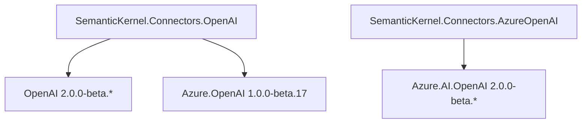
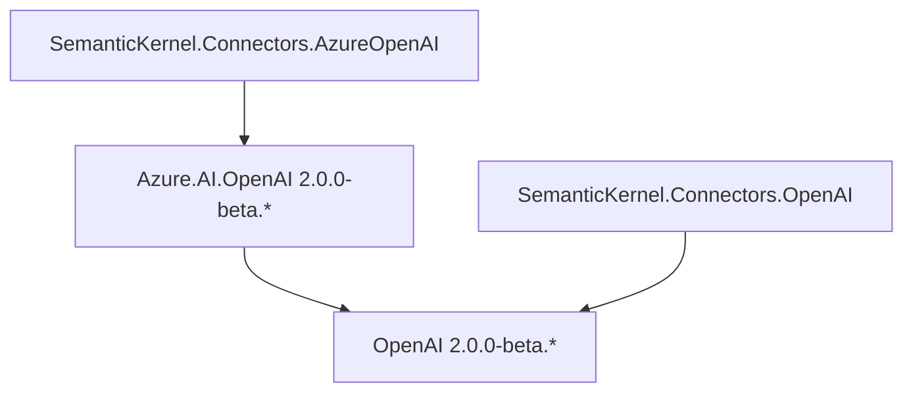

---
# These are optional elements. Feel free to remove any of them.
status: approved
contact: rogerbarreto
date: 2024-06-24
deciders: rogerbarreto, matthewbolanos, markwallace-microsoft, sergeymenshykh
consulted: stephentoub, dmytrostruk
---

# OpenAI and Azure Connectors Naming and Structuring

## Context and Problem Statement

It has recently been announced that OpenAI and Azure will each have their own dedicated SDKs for accessing their services. Previously, there was no official SDK for OpenAI, and our OpenAI Connector relied solely on the Azure SDK client for access.

With the introduction of the official OpenAI SDK, we now have access to more up-to-date features provided by OpenAI, making it advantageous to use this SDK instead of the Azure SDK.

Additionally, it has become clear that we need to separate the OpenAI connector into two distinct targets: one for OpenAI and another for Azure OpenAI. This separation will enhance code clarity and facilitate a better understanding of the usage of each target.

## Decision Drivers

- Update our connectors to use latest versions of OpenAI and Azure SDKs.
- Minimize or eliminate any breaking changes for developers currently using the existing OpenAI connector.
- Changes made should be be future proof.

## Versioning

Although current `Azure.AI.OpenAI` and `OpenAI` SDK packages have its major versions updated (2.0.0), that change does not represent a `SemanticKernel` major breaking change. Any of the alternative options provided below take in consideration the that the new updated version of `SemanticKernel.Connectors.OpenAI` and `SemanticKernel.Connectors.AzureOpenAI` will be a minor version bump `1.N+1.0` for all SemanticKernel packages.

### Meta Package Strategy

Currently the `Microsoft.SemanticKernel` package is a meta package that includes both `SemanticKernel.Core` and `SemanticKernel.Connectors.OpenAI`, with the new changes a new project will be added to the meta package `SemanticKernel.Connectors.AzureOpenAI` that will include the new Azure OpenAI connector.

## Documentation (Upgrade Path)

A documentation guidance and samples/examples will be created to guide on how to upgrade from the current OpenAI connector to the new when needed.

## OpenAI SDK limitations

The new OpenAI SDK introduce some limitations that need to be considered and potentially can introduce breaking changes if not remediated by our internal implementation.

- #### ⚠️ No support for multiple results (Choices) per request.

  **Remediation**: Internally make the multiple requests and combine them.
  **No remediation**: Breaking change removing `ResultsPerPrompt` from `OpenAIPromptExecutionSettings`.

- #### ⚠️ Text Generation modality is not supported.

  **Remediation**: Internally provide a HttpClient to be used against `gpt-3.5-turbo-instruct` for text generation modality. Same way was done for `TextToImage`, `AudioToText` service modalities.
  **No remediation**: Breaking change removing any specific `TextGeneration` service implementations, this change don't impact `ChatCompletion` services that may still being used as `ITextGenerationService` implementations.

## Improvements

This also represents an opportunity to improve the current OpenAI connector by introducing the `Configuration` pattern to allow more flexibility and control over the services and their configurations.

```csharp
// Before
builder.AddAzureOpenAIChatCompletion(deploymentName, endpoint, apiKey, httpClient);
// After
builder.AddAzureOpenAIChatCompletion(new
{
    DeploymentName = modelId;
    Endpoint = endpoint;
    ApiKey = apiKey;
});
```

```csharp
// Before
builder.AddAzureOpenAIChatCompletion(deploymentName, openAIClient, serviceId, modelId)
// After
builder.AddAzureOpenAIChatCompletion(new
{
    DeploymentName = deploymentName;
    ServiceId = serviceId;
    ModelId = modelId;
}, openAIClient);
```

## Potential Dependency Conflicts

Since `SemanticKernel.Connectors.AzureOpenAI` and `SemanticKernel.Connectors.OpenAI` share same `OpenAI 2.0.0` dependency, if the vestion of `OpenAI 2.0.0` differ on each, that may create conflict when both connector packages are used together in a project.

If this happens:

1. Before updating our OpenAI connector package we will get in touch with `Azure.AI.OpenAI` team to align on the ETAs for their update.

2. Investigate if the most recent `OpenAI` package when used with a `Azure.AI.OpenAI` that initially was targeting an older version of `OpenAI` SDK will not cause any breaking changes or conflicts.

3. If There are conflicts and their ETA is small we may keep the `OpenAI` dependency on our `SemanticKernel.Connectors.OpenAI` similar to Azure's for a short period of time, otherwise we will evaluate moving forward with the `OpenAI` dependency version upgrade.

## Considered Options

- Option 1 - Merge New and Legacy (Slow transition for independent connectors).
- Option 2 - Independent Connectors from Start.
- Option 3 - Keep OpenAI and Azure in the same connector (As is).

## Option 1 - Merge New and Legacy (Slow transition for independent connectors).

This is the least breaking approach where we keep the current legacy OpenAI and AzureOpenAI APIs temporarily in the connector using last Azure SDK `Azure.AI.OpenAI 1.0.0-beta.17` and add new OpenAI specific APIs using the new `OpenAI 2.0.0-beta.*` SDK package.

This approach also implies that a new connector will be created on a second moment for Azure OpenAI services specifically fully dependent on the latest `Azure.AI.OpenAI 2.0.0-beta.*` SDK package.

In a later stage we will deprecate all the OpenAI and Azure legacy APIs in the `SemanticKernel.Connectors.OpenAI` namespace and remove Azure SDK `Azure.AI.OpenAI 1.0.0-beta.17` and those APIs in a future release, making the OpenAI Connector fully dedicated for OpenAI services only depending on with the `OpenAI 2.0.0-beta.*` dependency.



The new `Options` pattern we be used as an improvement as well as a measure to avoid breaking changes with the legacy APIs.

Following this change the `SemanticKernel.Connectors.OpenAI` and a new `SemanticKernel.Connectors.AzureOpenAI` connector will be created for Azure specific services, using the new Azure SDK `Azure.AI.OpenAI 2.0.0-beta.*` with all new APIs using the options approach.

### Phases of the transition

- **Phase 1**: Add new OpenAI SDK APIs to the current OpenAI connector and keep the Azure OpenAI APIs using the last Azure SDK.
- **Phase 2**:
  - Create a new connector for Azure OpenAI services using the new Azure SDK
  - Deprecate all Azure OpenAI APIs in the `OpenAI` connector pointing to new `AzureOpenAI` connector
  - Remove Azure SDK dependency from the OpenAI connector.
  - Add `AzureOpenAI` connector to the `Microsoft.SemanticKernel` meta package.
- **Phase 3**: Deprecate all legacy `OpenAI APIs` in the `OpenAI` connector pointing to new `Options` APIs.
- **Phase 4**: Remove all legacy APIs from the OpenAI connector.

### Impact

Pros:

- Minimal breaking changes for developers using the current OpenAI connector.
- Clear separation of concerns between OpenAI and Azure OpenAI connectors.

Cons:

- Since `SemanticKernel.Connectors.AzureOpenAI` and `SemanticKernel.Connectors.OpenAI` share a same dependency of different versions, both packages cannot be used in the same project and a strategy will be needed when deploying both connectors.
- Added dependency for both `Azure OpenAI 1.0-beta17` and `OpenAI 2.0-beta1`.

### Dependency Management Strategies

1. Use only one of the connectors in the same project, some modifications will be needed to accommodate `Concepts` and other projects that shares OpenAI and AzureOpenAI examples.
2. Hold AzureOpenAI connector implementation until we are ready to break (exclude) all Azure APIs in OpenAI connector.
3. Deploy a new project with a new namespace for `Azure.AI.OpenAI.Legacy 1.0.0-beta.17` and update our `SemanticKernel.Connectors.OpenAI` to use this new namespace to avoid version clashing on the `Azure.AI.OpenAI` namespace.

## Option 2 - Independent Connectors from Start.

This option is focused on creating fully independent connectors for OpenAI and Azure OpenAI services since the start with all breaking changes needed to achieve that.



Impact:

- All `Azure` related logic will be removed from `SemanticKernel.Connectors.OpenAI` to avoid any clashes with same names introduced in the new `SemanticKernel.Connectors.AzureOpenAI` as well as sending a congruent message to developers that the OpenAI connector is focused on OpenAI services only moving forward.

### Impact

Pros:

- Clear separation of concerns between OpenAI and Azure OpenAI connectors.
- Small breaking changes for developers focused on OpenAI specific APIs.
- Faster transition to the new OpenAI SDK and Azure OpenAI SDK.

Cons:

- Large breaking changes for developers using the current OpenAI connector for Azure.
- [Potential Dependency Conflicts](#potential-dependency-conflicts) may arise if the `Azure.AI.OpenAI` team does not update their package.

## Option 3 - Keep OpenAI and Azure in the same connector (As is).

This option is fully focused in the least impact possible, combining both Azure and OpenAI SDK dependencies in one single connector following the same approach as the current connector.

Changes:

1. Update all current OpenAI specific services and client to use new OpenAI SDK
2. Update Azure specific services and client to use the latest Azure OpenAI SDK.
3. Optionally add `Options` pattern new APIs to the connector services and deprecate old ones.

### Impact

Pros:

- Minimal breaking changes for developers using the current OpenAI connector.
- The breaking changes will be limited on how we tackle the points mentioned in the [OpenAI SDK limitations](#openai-sdk-limitations) above.
- Will not have a dependency conflict between `Azure.AI.OpenAI` and `OpenAI` SDKs.

Cons:

- We will be limited on the OpenAI SDK version that is used by the latest `Azure.AI.OpenAI` package, which may not be the latest version available.
- When using direct Azure or OpenAI specific services developers don't expect to see other provider specific services in their pool of options and dependencies.

## Decision Outcome

### Option 2 - Independent Connectors from Start.

This option is the faster approach on transitioning to a potential 1.0 general availability of `OpenAI` SDK.

This also option provides a clear separation of concerns between OpenAI and Azure OpenAI connectors from the start.

Prevents any confusion sending a clear message on our intentions on splitting `OpenAI` and `AzureOpenAI` components away.

#### OpenAI SDK limitations:

- [Multiple results](#openai-sdk-limitations): **Do not remediate**.
- [Text Generation modality is not supported](#openai-sdk-limitations): **Do not remediate**.
