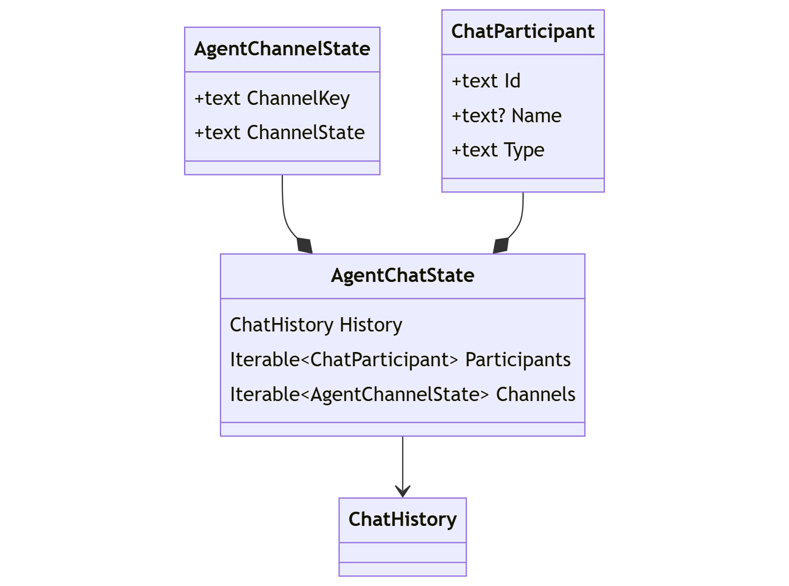

# `AgentChat` Serialization / Deserialization

## Context and Problem Statement
Users of the _Agent Framework_ are unable to store and later retrieve conversation state when using an `AgentChat` to coordinate `Agent` interactions.  This limits the ability for an agent conversation to single use as it must be maintained with memory of the process that initiated the conversation.

Formalizing a mechanism that supports serialization and deserialization of any `AgentChat` class provides an avenue to capture and restore state across multiple sessions as well as compute boundaries.

#### Goals
- **Capture & Restore Primary Chat History**: The primary `AgentChat` history must be captured and restored for full fidelity.
- **Capture & Restore Channel State**: In addition to the primary chat history, the state for each `AgentChannel` within the `AgentChat` must be captured and restored.
- **Capture Agent Metadata**: Capturing the agent Identifier, Name, and Type upon serialization provides a guidance on how to restore the the `AgentChat` during deserialization.


#### Non-Goals
- **Manage agent definition:** An `Agent` definition shall not be captured as part of the conversation state.  `Agent` instances will not be produced when deserializing the state of an `AgentChat` class.
- **Manage secrets or api-keys:** Secrets / api-keys are required when producing an `Agent` instance.  Managing this type of sensitive data is out-of-scope due to security considerations.


## Issues

- Serialized `ChatHistory` must be equivalent across platforms / languages for interoperability

## Cases
When restoring an `AgentChat`, the application must also re-create the `Agent` instances participating in the chat (outside of the control of the deserialization process).  This creates the opportunity for the following cases:

#### 1. **Equivalent:** All of the original agent types (channels) available in the restored chat.
This shall result in a full-fidelity restoration of of the original chat.

|Source Chat|Target Chat|
|---|---|
|`ChatCompletionAgent`|`ChatCompletionAgent`|
|`OpenAIAssistantAgent`|`OpenAIAssistantAgent`|
|`ChatCompletionAgent` & `OpenAIAssistantAgent`|`ChatCompletionAgent` & `OpenAIAssistantAgent`|

#### 2. **Enhanced:** Additional original agent types (channels) available in the restored chat.
This shall also result in a full-fidelity restoration of of the original chat.
Any new agent type (channel) will synchronize to the chat once restored (identical to adding a new agent type to a chat that is progress).

|Source Chat|Target Chat|
|---|---|
|`ChatCompletionAgent`|`ChatCompletionAgent` & `OpenAIAssistantAgent`|
|`OpenAIAssistantAgent`|`ChatCompletionAgent` & `OpenAIAssistantAgent`|

#### 3. **Reduced:** A subset of original agent types (channels) available in the restored chat.
This shall also result in a full-fidelity restoration of of the original chat to the available channels.  Introduction of a missing agent type (channel) post restoration will
synchronize the channel to the current chat (identical to adding a new agent type to a chat that is progress).

|Source Chat|Target Chat|
|---|---|
|`ChatCompletionAgent` & `OpenAIAssistantAgent`|`ChatCompletionAgent`|
|`ChatCompletionAgent` & `OpenAIAssistantAgent`|`OpenAIAssistantAgent`|

#### 4. **Empty:** No agents available in the restored chat.
This shall result in an immediate exception (fail-fast) in order to strongly indicate that
the chat has not been restored.  The chat may have agents added in order to attempt a successful restoration, or utilized on its own.  That is, the `AgentChat` instance isn't invalidated.

#### 5. **Invalid:** Chat has already developed history or channels state.
This shall result in an immediate exception (fail-fast) in order to strongly indicate that
the chat has not been restored.  The chat may continue to be utilized as the `AgentChat` instance isn't invalidated.

#### Notes:

> Once restored, additional `Agent` instances may join the `AgentChat`, no different from any `AgentChat` instance.


## Analysis

#### Relationships:

The relationships between any `AgentChat`, the `Agent` instances participating in the conversation, and the associated `AgentChannel` conduits are illustrated in the following diagram:

<p align="center">
<kbd></kbd>
</p>

While an `AgentChat` manages a primary `ChatHistory`, each `AgentChannel` manages how that history is adapted to the specific `Agent` modality.  For instance, an `AgentChannel` for an `Agent` based on the Open AI Assistant API tracks the associated _thread-id_.  Whereas a `ChatCompletionAgent` manages an adapted `ChatHistory` instance of its own.

This implies that logically the `AgentChat` state must retain the primary `ChatHistory` in addition to the appropriate state for each `AgentChannel`:


#### Logical State:

These relationships translate into the following logical state definition:

<p align="center">
<kbd></kbd>
</p>


#### Serialized State:

```javascript 
{
     // Serialized ChatHistory
    "history": [
        { "role": "user", "items": [ /* ... */ ] },
        { "role": "assistant", "name": "John", "items": [ /* ... */ ] },
        // ...
    ],
     // Serialized Participants
    "participants": [
        {
            "id": "01b6a120-7fef-45e2-aafb-81cf4a90d931",
            "name": "John",
            "type": "ChatCompletionAgent"
        },
        // ...
    ],
     // Serialized AgentChannel state
    "channels": [
        {
            "channelkey": "Vdx37EnWT9BS+kkCkEgFCg9uHvHNw1+hXMA4sgNMKs4=",
            "channelstate": "...",  // Serialized state for an AgentChannel
        },
        // ...
    ]
}
```


## Options

#### 1. JSON Serializer:

A dominant serialization pattern is to use the dotnet `JsonSerializer`.  This is the approach relied upon by the _Semantic Kernel_ content types.

**Serialize Example:**

(_dotnet_)
```c#
// Create the agents
ChatCompletionAgent agent1 = ...;
OpenAIAssistantAgent agent2 = ...;

// Create the agent-chat
AgentGroupChat chat = new(agent1, agent2);

// Serialize the chat object to JSON
string chatState = JsonSerializer.Serialize(chat);
```

(_python_)
```python
# Create the agents
agent1 = ChatCompletionAgent(...)
agent2 = OpenAIAssistantAgent(...)

# Create the agent-chat
chat = AgentGroupChat(agent1, agent2)

# Serialize the chat to JSON
chat_state = chat.model_dump()
```

**Deserialize Example:**

(_dotnet_)
```c#
// Deserialize JSON
AgentGroupChat chat = JsonSerializer.Deserialize<AgentGroupChat>(chatState);
```

(_python_)
```python
# Deserialize JSON
def agent_group_chat_decoder(obj) -> AgentGroupChat:
    pass
    
chat = json.loads(chat_state, object_hook=agent_group_chat_decoder)
```

**Pro:**
- Doesn't require knowledge of a serialization pattern specific to the _Agent Framework_.

**Con:**
- Both `AgentChat` nor `AgentChannel` are designed as a service classes, not _data transfer objects_ (DTO's).  Implies disruptive refactoring. (Think: complete re-write)
- Requires caller to address complexity to support serialization of unknown `AgentChannel` and `AgentChat` subclasses.
- Limits ability to post process when restoring chat (e.g. channel synchronization).
- Absence of `Agent` instances in deserialization interferes with ability to restore any `AgentChannel`.


#### 2. `AgentChat` Serializer: 

Introducing a serializer with specific knowledge of `AgentChat` contracts enables the ability to streamline serialization and deserialization.

(_dotnet_)
```c#
class AgentChatSerializer
{
    // Captures chat state to the provided stream
    static async Task SerializeAsync(AgentChat chat, Stream stream)

    // Reads chat state from the provided stream and returns serializer
    static async Task<AgentChatSerializer> DeserializeAsync(AgentChat chat, Stream stream)

    // Provides list of participants
    IReadOnlyList<ChatParticipant> GetParticipants();

    // Restores the chat state
    Task RestoreAsync(AgentChat chat);
}
```

(_python_)
```python
class AgentChatSerializer:

    # Captures chat state to the provided stream
    @staticmethod
    async def serialize(chat: AgentChat, stream);
        pass

    # Reads chat state from the provided stream and returns serializer
    @staticmethod
    async def deserialize(chat: AgentChat, stream) -> AgentChatSerializer:
        pass

    # Provides list of participants
    def get_participants(self) -> list[ChatParticipant]:
        pass

    # Restores the chat state
    async def restore(self, chat: AgentChat):
        pass
```

**Pro:**
- Able to clearly define the chat-state, separate from the chat _service_ requirements.
- Support any `AgentChat` and `AgentChannel` subclass.
- Ability to support post processing when restoring chat (e.g. channel synchronization).
- Allows any `AgentChat` to be properly initialized prior to deserialization.
- Allows for inspection of `ChatParticipant` metadata.

**Con:**
- Require knowledge of a serialization pattern specific to the _Agent Framework_.

**Serialize Example:**

(_dotnet_)
```c#
// Create agents
ChatCompletionAgent agent1 = ...;
OpenAIAssistantAgent agent2 = ...;

// Create agent-chat
AgentGroupChat chat = new(agent1, agent2);

// Initiate conversation
await chat.InvokeAsync();

// Initialize the serialization stream
async using Stream stream = ...;

// Capture agent-chat
await AgentChatSerializer.SerializeAsync(chat, stream);
```

(_python_)
```python
# Create agents
agent1 = ChatCompletionAgent(...)
agent2 = OpenAIAssistantAgent(...)

# Create agent-chat
chat = AgentGroupChat(agent1, agent2)

# Initiate conversation
await chat.invoke()

# Initialize the serialization stream
async with ... as stream:

# Capture agent-chat
await AgentChatSerializer.serialize(chat, stream)
```

**Deserialize Example:**

(_dotnet_)
```c#
// Create agents
ChatCompletionAgent agent1 = ...;
OpenAIAssistantAgent agent2 = ...;

Dictionary<string, Agent> agents =
    new()
    {
        { agent1.Id, agent1 },
        { agent2.Id, agent2 },
    }

// Initialize the deserialization stream
async using Stream stream = ...;
AgentChatSerializer serializer = AgentChatSerializer.Deserialize(stream);

// Create agent-chat
AgentGroupChat chat = new();

// Restore agents
foreach (ChatParticipant participant in serializer.GetParticipants())
{
    chat.AddAgent(agents[participant.Id]);
}

// Restore chat
serializer.Deserialize(chat);

// Continue chat
await chat.InvokeAsync();
```

(_python_)
```python
# Create agents
agent1 = ChatCompletionAgent(...)
agent2 = OpenAIAssistantAgent(...)

agents = {
    agent1.id: agent1,
    agent2.id: agent2,
}

# Initialize the serialization stream
async with ... as stream:
serializer = await AgentChatSerializer.serialize(stream)

# Create agent-chat
chat = AgentGroupChat(agent1, agent2)

# Restore agents
for participant in serializer.get_participants():
    chat.add_agent(agents[participant.id])
    
# Restore agent-chat
await serializer.deserialize(chat)

# Continue chat
await chat.invoke();
```

#### 3. Encoded State 

This option is identical to the second option; however, each discrete state is base64 encoded to discourage modification / manipulation of the captured state.

**Pro:**
- Discourages ability to inspect and modify.

**Con:**
- Obscures ability to inspect.
- Still able to decode to inspect and modify.

**Serialized State:**
```javascript
{
    "history": "VGhpcyBpcyB0aGUgcHJpbWFyeSBjaGF0IGhpc3Rvcnkg...",
    "participants": [
        {
            "aId37EnWT9BS+kkCkEgFCg9uHvHNw1+hXMA4sgNMKs4...",
            // ...
        },
    ],
    "channels": [
        {
            "channelkey": "Vdx37EnWT9BS+kkCkEgFCg9uHvHNw1+hXMA4sgNMKs4=",
            "channelstate": "VGhpcyBpcyBhZ2VudCBjaGFubmVsIHN0YXRlIGV4YW1wbG..."
        },
        // ...
    ]
}
```


## Outcome

TBD