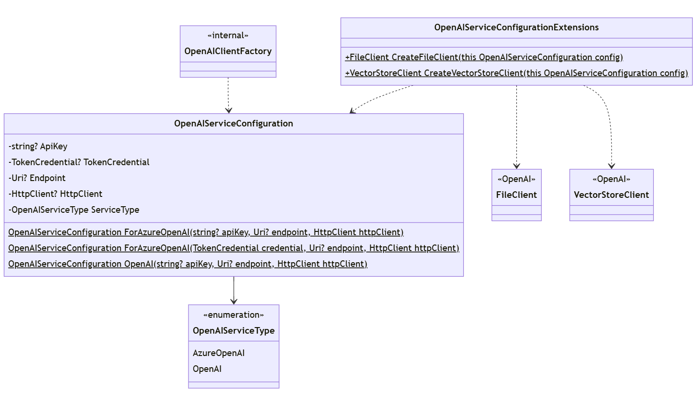

# Agent Framework - Assistant V2 Migration

## Context and Problem Statement

TBD

### Open Issues
- **Tool Constraints:** In Progress
- **Streaming:** To be addressed as a discrete feature
- **Polling:** Associate with execution settings?

## Design

### Configuration Classes

TBD

#### Service Configuration

TBD

<kbd></kbd>

#### Assistant Definition

TBD

<kbd></kbd>

#### Assistant Invocation Settings

TBD

<kbd></kbd>

#### Thread Creation Settings

TBD

<kbd></kbd>

### Agent Implementation

TBD

<kbd></kbd>

TBD

|Method Name|Description|
---|---
Create|TBD
ListDefinitions|TBD
Retrieve|TBD
CreateThread|TBD
DeleteThread|TBD
AddChatMessage|TBD
GetThreadMessages|TBD
Delete|TBD
Invoke|TBD
GetChannelKeys|TBD
CreateChannel|TBD

### Vector Store Support

TBD

<kbd></kbd>

### Class Inventory
TBD

|Class Name|Description|
---|---
OpenAIAssistantAgent|TBD
OpenAIAssistantChannel|TBD
OpenAIAssistantDefinition|TBD
OpenAIAssistantExecutionSettings|TBD
OpenAIAssistantInvocationSettings|TBD
OpenAIServiceConfiguration|TBD
OpenAIVectorStore|TBD
OpenAIVectorStoreBuilder|TBD