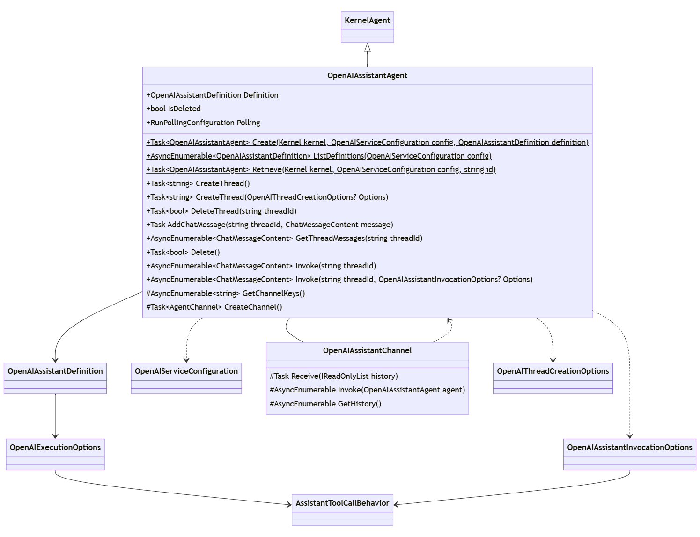

# Agent Framework - Assistant V2 Migration

## Context and Problem Statement

Open AI has release the _Assistants V2_ API.  This builds on top of the V1 _assistant_ concept, but also invalidates certain V1 features.  In addition, the _dotnet_ API that supports _Assistant V2_ features is entirely divergent on the `Azure.AI.OpenAI.Assistants` SDK that is currently in use.

### Open Issues
- **Tool Constraints:** In Progress
- **Streaming:** To be addressed as a discrete feature
- **Polling:** Associate with execution settings?

## Design

Migrating to Assistant V2 API is a breaking change to the existing package due to:
- Class definition changes
- Underlying capability differences (e.g. `file-search` vs `retrieval`)
- Underlying V2 SDK is version incompatible with V1 (`OpenAI` and `Azure.AI.OpenAI`)

### Configuration Classes

Specific configuration/setttings classes are introduced to support the ability to define assistant behavior at each of the supported articulation points (i.e. _assistant_, _thread_, & _run_).

#### Service Configuration

The `OpenAIServiceConfiguration` defines how to connect to a specific remote service, whether it be OpenAI, Azure, or proxy.  This eliminates the need to define multiple overloads for each call site that results in a connection to the remote API service (i.e. create a _client)_.

> Note: This was previously named `OpenAIAssistantConfiguration`, but is not necessarily assistant specific.

<kbd></kbd>

#### Assistant Definition

The `OpenAIAssistantDefinition` was previously used only when enumerating a list of stored agents.  It has been evolved to also be used as input for creating and agent and exposed as a discrete property on the `OpenAIAssistantAgent` instance.

This includes optional _execution_settings_ for defining default _run_ behavior.  Since these execution settings are not part of the remote assistant definition, they are persisted in the assistant metadata for when an existing agent is retrieved.

<kbd></kbd>

#### Assistant Invocation Settings

When invoking an `OpenAIAssistantAgent` directly (no-chat), settings that only apply to a discrete run may be specified.  These settings are defined as `OpenAIAssistantInvocationSettings`.

<kbd></kbd>

#### Thread Creation Settings

When invoking an `OpenAIAssistantAgent` directly (no-chat), a thread must be explicitly managed.  When doing so, thread specific settings may be specified.  These settings are defined as `OpenAIThreadCreationSettings`.

<kbd></kbd>

### Agent Implementation

The `OpenAIAssistant` agent is roughly equivalent to its V1 form save for:

- Supports settings for _assistant_, _thread_, and _run_
- Agent definition shifts to `Definition` property

<kbd></kbd>

The following table describes the purpose of diagramed methods on the `OpenAIAssistantAgent`.

|Method Name|Description|
---|---
**Create**|Create a new assistant agent
**ListDefinitions**|List existing assistant definitions
**Retrieve**|Retrieve an existing assistant
**CreateThread**|Create an assistant thread
**DeleteThread**|Delete an assistant thread
**AddChatMessage**|Add a message to an assistant thread
**GetThreadMessages**|Retrieve all messages from an assistant thread
**Delete**|Delete the assistant agent's definition (puts agent into a terminal state)
**Invoke**|Invoke the assistant agent (no chat)
**GetChannelKeys**|Inherited from `Agent`
**CreateChannel**|Inherited from `Agent`

### Vector Store Support

_Vector Store_ support is provided in order to enable usage of the `file-search` tool.  While the _playground_ and API support implicit creation of a vector-store when providing only a list of file identifiers, the _Agent Framework_ encourages creation of vector-store separate from the agent lifecycle.

<kbd></kbd>

### Class Inventory
This section provides an overview / inventory of all the public surface area described in this ADR.

|Class Name|Description|
---|---
**OpenAIAssistantAgent**|An `Agent` based on the Open AI Assistant API
**OpenAIAssistantChannel**|An 'AgentChannel' for `OpenAIAssistantAgent` (associated with a _thread-id_.)
**OpenAIAssistantDefinition**|All of the metadata / definition for an Open AI Assistant.  Unable to use the _Open AI API_ model due to implementation constraints (constructor not public).
**OpenAIAssistantExecutionSettings**|Setting that affect the _run_, but defined globally for the agent/assistant.
**OpenAIAssistantInvocationSettings**|Settings bound to a discrete run, used for direct (no chat) invocation.
**OpenAIServiceConfiguration**|Describes the service connection and used to create the `OpenAIClient`
**OpenAIVectorStore**|Used to query and manipulate a vector-store.  Also supports listing available vector-stores (static).
**OpenAIVectorStoreBuilder**|Supports creation of an vector-store.

### Run Processing

The heart of supporting an _assistant_ agent is creating and processing a `Run`.

A `Run` is effectively a discrete _assistant_ interaction on a `Thread` (or conversation).

- https://platform.openai.com/docs/api-reference/runs
- https://platform.openai.com/docs/api-reference/run-steps

This `Run` processing is implemented as internal logic within the _OpenAI Agent Framework_ that is outlined here:

Initiate processing using: 

- `agent` -> `OpenAIAssistantAgent`
- `client` -> `AssistantClient`
- `threadid` -> `string`
- `settings` -> `OpenAIAssistantInvocationSettings` (optional)

Perform processing:

- Verify `agent` not deleted
- Define `RunCreationOptions`
- Create the `run` (based on `threadid` and `agent.Id`)
- Process the run:

    do

    - Poll `run` status until is not _queued_, _in-progress_, or _cancelling_
    - Throw if `run` status is _expired_, _failed_, or _cancelled_
    - Query `steps` for `run`

    - if `run` status is _requires-action_
        
        - process function `steps`

        - post function results

    - foreach (`step` is completed)

        - if (`step` is tool-call) generate and yield tool content

        - else if (`step` is message) generate and yield message content

    while (`run` status is not completed)

