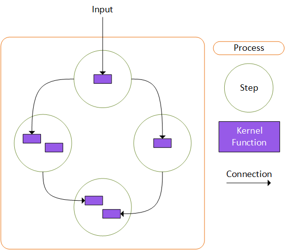

---
# These are optional elements. Feel free to remove any of them.
status: proposed
contact: bentho
date: September 20, 2024
deciders: bentho, markwallace, estenori, crickman, eavanvalkenburg, evchaki
consulted: bentho, markwallace, estenori, crickman, eavanvalkenburg, evchaki, mabolan
informed: SK-3P-FTE
---

# Business Process execution with Semantic Kernel

## Context and Problem Statement

Enterprises are built on business processes. Our enterprise customers have told us time and time again that they need help automating these processes with AI.

The high level structure of a business process can be modeled as:

- Starts with external event
- A collection of structured activities or tasks
- A defined sequence of these tasks that produces a service or product that adds value
- Serves a business goal

Some examples of a business process

## Decision Drivers

- Customers should be able to leverage their existing investments in Sematic Kernel.
- Customers should be able to leverage their existing investments in infrastructure.
- Customers should be able to collaborate with their business process peers to build up composable processes.
- Customers should be able to use AI to enhance and streamline the steps within their business processes.
- Customers should be able to control the process flow in a defined and repeatable way.
- Processes should be able to support short lived transient business processes as well as long lived business processes.
- Processes should be able to be run locally, deployed as a single process or or deployed to a distributed service.
- Processes should be able to run and debug locally without additional software or infrastructure.
- Regulated Customers should be able to audit currently running or completed processes end to end.

## Considered Options

**_Options #1 - Build existing samples on top of existing workflow frameworks_**:

**_Options #2 - Build SK Process library within an existing workflow framework_**:

**_Options #3 - Build SK Process library with a custom build workflow engine_**:

**_Options #4 - Build platform agnostic SK Process library with connectors for existing workflow frameworks_**:

## Decision Outcome

**_Chosen option - #4_**: Build platform agnostic SK Process library with connectors for existing workflow frameworks, because
this is the only option that allows customers to leverage their existing investments in Semantic Kernel, leverage investments in their existing infrastructure, and allows Semantic Kernel to stay out of the business of building distributed workflow engines.

### Components of the Process library

Starting from the ground up, the components of a processes are:

1.  **_KernelFunctions_**: The same KernelFunctions that our customers already know and use. Nothing new here.
1.  **_Steps_**: Steps group one ore more KernelFunctions together into an object with optional user defined state. A step represents one unit of work within a process. Steps make the output of their work visible to other steps in the process by emitting events. This event based structure allows steps to be created without needing to know which process they are used in, allowing them to be reusable across multiple processes.
1.  **_Process_**: A process groups multiple Steps together and defines the way that outputs flow from step to step. The process provides methods that allow the developer to define the routing of events that are emitted by steps by specifying the steps and associated KernelFunctions that should receive the event.



Let's look at the code required to create a simple process.

#### Step1 - Define the Steps:

Steps are required to inherit from the abstract `KernelStepBase` type which allows for optional implementation of activation and deactivation lifecycle methods.

```csharp
// Define UserInputStep with no state
public class UserInputStep : KernelStepBase
{
    public override ValueTask ActivateAsync()
    {
        return ValueTask.CompletedTask;
    }

    [KernelFunction()]
    public string GetUserInput(string userMessage)
    {
        return $"User: {userMessage}";
    }
}

```

The `UserInputStep` shown above is the minimum implementation of a step with 1 KernelFunction and no state management. The code in this step does not explicitly emit any events, however, execution of the `PrintUserMessage` will automatically emit an event indicating either the success of the execution with an associated result, or the failure of the execution with an associated error.

Let's create a second step to take the use input and get a response from an LLM. This step will be stateful so that it can maintain an instance of `ChatHistory`. First define the class to use for tracking state:

```csharp
public class ChatBotState
{
    public ChatHistory ChatMessages { get; set; } = new();
}

```

Next define the step:

```csharp
// Define ChatBotResponseStep with state of type ChatBotState
public class ChatBotResponseStep : KernelStepBase<ChatBotState>
{
    private readonly Kernel _kernel;
    internal ChatBotState? _state;

    public ChatBotResponseStep(Kernel kernel)
    {
        _kernel = kernel;
    }

    public override ValueTask ActivateAsync(ChatBotState state)
    {
        _state = state;
        _state.ChatMessages ??= new();
        return ValueTask.CompletedTask;
    }

    [KernelFunction()]
    public async Task GetChatResponse(KernelStepContext context, string userMessage)
    {
        _state!.ChatMessages.Add(new(AuthorRole.User, userMessage));
        IChatCompletionService chatService = _kernel.Services.GetRequiredService<IChatCompletionService>();
        ChatMessageContent response = await chatService.GetChatMessageContentAsync(_state.ChatMessages);
        if (response != null)
        {
            _state.ChatMessages.Add(response!);
        }

        // emit event: assistantResponse
        context.PostEvent(new CloudEvent { Id = ChatBotEvents.AssistantResponseGenerated, Data = response });
    }
}

```

The `ChatBotResponseStep` is a bit more realistic than `UserInputStep` and show the following features:

**_State management_**: The first thing to notice is that the state object is automatically created by the Process and injected into the `ActivateAsync` method. The Process will automatically persist the state object immediately after successful execution of any of the step's KernelFunctions. Processes use JSON serialization to persist and rehydrate state objects so we require that these types have a default constructor and only contain objects that are JSON serializable.

**_Step Context_**: The `GetChatResponse` KernelFunction has an argument of type `KernelStepContext` which is automatically provided by the Process. This object provides functionality that allow the step to explicitly emit events such as `ChatBotEvents.AssistantResponseGenerated` in this case. The step context can also provide functionality for advances scenarios such as dynamically adding new steps to the process.

**_Cloud Events_**: Events in Steps and Processes make use of [Cloud Events](https://github.com/cloudevents/spec). Cloud Events provide an open source and industry standard specification for describing event data in common formats to provide interoperability across services, platforms and systems. This will allow Processes to emit/receive event to/from external systems without requiring custom connectors or mapping middleware.

#### Step2 - Define the Process:

Now that we have our steps defined, we can move on to defining our process. The first thing to do is to add the steps to the process...

```csharp

KernelProcess process = new("ChatBot");

var userInputStep = process.AddStepFromType<UserInputStep>(isEntryPoint: true);
var responseStep = process.AddStepFromType<ChatBotResponseStep>();

```

The two steps steps created above have been added to our new `ChatBot` process and the `UserInputStep` has been declared as the entry point. This means that any events received by the process will be forwarded to this step. Now we need to define the flow of our process by describing which actions are triggered by events from our steps.

```csharp

// When the userInput step completes, send the output to the llm response step
userInputStep
    .OnFunctionResult(nameof(UserInputStep.GetUserInput))
    .SendOutputTo(responseStep, nameof(ChatBotResponseStep.GetChatResponse), "userMessage");

```

In the code above, `userInputStep.OnFunctionResult(nameof(UserInputStep.GetUserInput))` selects the event that is emitted by the process on successful execution of the `GetUserInput` KernelFunction in the step instance referenced by `userInputStep`. It then returns a builder type object that provides actions based on the context. In this case the `SendOutputTo(responseStep, nameof(ChatBotResponseStep.GetChatResponse), "userMessage")` action is used to forward the event data to the `userMessage` parameter of the `GetChatResponse` KernelFunction on the step instance referenced by `responseStep`.

One of the key takeaways here is that events emitted by a given step can be selected and forwarded to **_a specific parameter of a specific KernelFunction_** within another step. Event data sent to parameters of KernelFunctions are queued until all of the required parameters of the function have received input, at which point the function will be invoked.

#### Step 3 - Get output from the Process:

Now that we've defined our process, we would like to inspect the final result that it produces. In many cases the result of the process will be written to a database or queue or some other internal system and that's all that's needed. In some cases however, such as in the case of a process running in a server as the result of a synchronous REST call, there is a need to extract the result from the finished process so that i can be returned to the caller. In these cases handler functions can be registered on the process to be triggered by a specific event.

Let's wire up the process above to run a handler function when the `ChatBotResponseStep` step completes.

```csharp

process.OnEvent(ChatBotEvents.AssistantResponseGenerated).Run((CloudEvent e) =>
{
    result = (int)e.Data!;
    Console.WriteLine($"Result: {result}");
});

```

## Validation

{describe how the implementation of/compliance with the ADR is validated. E.g., by a review or an ArchUnit test}

## More Information

CodeGen info here

{You might want to provide additional evidence/confidence for the decision outcome here and/or
document the team agreement on the decision and/or
define when this decision when and how the decision should be realized and if/when it should be re-visited and/or
how the decision is validated.
Links to other decisions and resources might appear here as well.}
