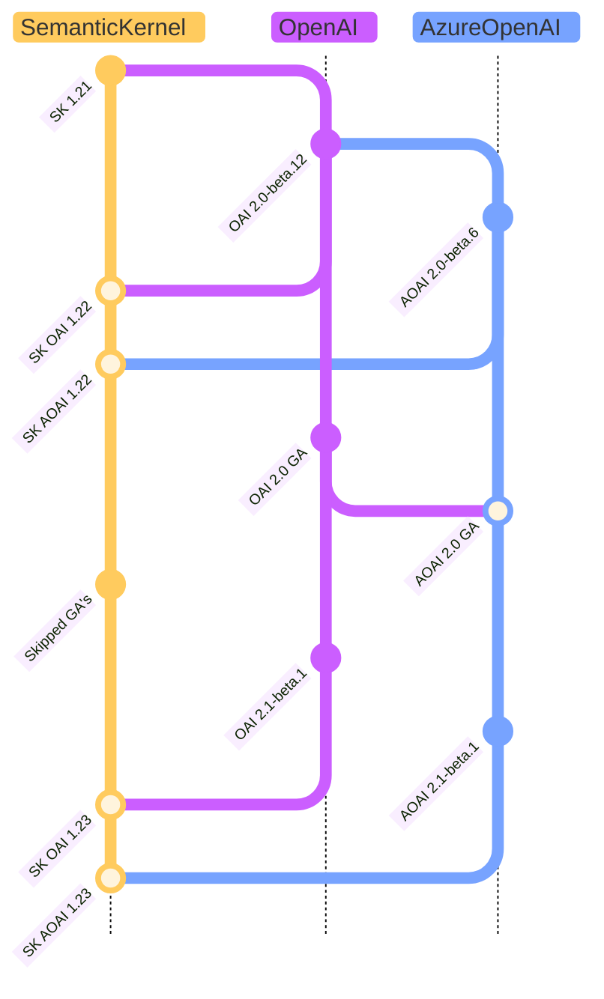
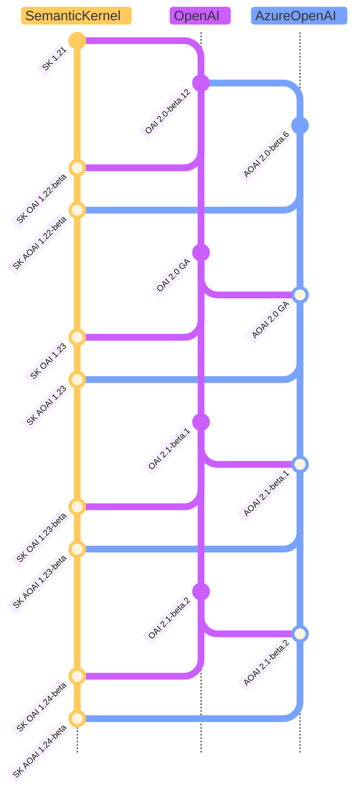
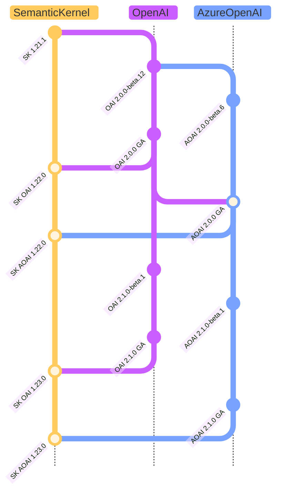

---
# These are optional elements. Feel free to remove any of them.
status: accepted
contact: rogerbarreto
date: 2024-10-03
deciders: sergeymenshykh, markwallace, rogerbarreto, westey-m, dmytrostruk, evchaki
consulted: crickman
---

# Connectors Versioning Strategy for Underlying SDKs

## Context and Problem Statement

This week (01-10-2024) OpenAI and Azure OpenAI released their first stable version and we need to bring some options ahead of us regarding how to move forward with the versioning strategy for the next releases of `OpenAI` and `AzureOpenAI` connectors which will also set the path moving forward with other connectors and providers versioning strategies.

This ADR brings different options how we can move forward thinking on the impact on the users and also how to keep a clear message on our strategy.

Currently, Azure Open AI GA package against what we were expecting choose remove many of the features previously available in preview packages from their first GA version.

This also requires us to rethink how we are going to proceed with our strategy for the following versions of our connectors.

| Name                | SDK NameSpace   | Semantic Kernel NameSpace                       |
| ------------------- | --------------- | ----------------------------------------------- |
| OpenAI (OAI)        | OpenAI          | Microsoft.SemanticKernel.Connectors.OpenAI      |
| Azure OpenAI (AOAI) | Azure.AI.OpenAI | Microsoft.SemanticKernel.Connectors.AzureOpenAI |

## Decision Drivers

- Minimize the impact of customers
- Allow customers to use either GA or Beta versions of OpenAI and Azure.AI.OpenAI packages
- Keep a clear message on our strategy
- Keep the compatibility with the previous versions
- Our package versioning should make it clear which version of OpenAI or Azure.AI.OpenAI packages we depend on
- Follow the Semantic Kernel versioning strategy in a way that accommodates well with other SDK version strategies.

## Considered Options

1. **Keep As-Is** - Target only preview packages.
2. **Preview + GA versioning** (Create a new version (GA + pre-release) side by side of the Azure OpenAI and OpenAI Connectors).
3. **Stop targeting preview packages**, only target GA packages moving forward.

## 1. Keep As-Is - Target only preview packages

This option will keep the current strategy of targeting only preview packages, which will keep the compatibility with the previous versions and new GA targeting versions and pipelines for our customers. This option has the least impact on our users and our pipeline strategy.

Today all customers that are already using Azure OpenAI Connector have their pipelines configured to use the preview packages.

Pros:

- No changes in strategy. (Least impact on customers)
- Keep the compatibility with the previous versions and new GA targeting versions and pipelines.
- Compatible with our previous strategy of targeting preview packages.
- Azure and OpenAI SDKs will always be in sync with new GA versions, allowing us to keep the targeting preview with the latest GA patches.

Cons:

- There won't be a SK connector version that targets a stable GA package for OpenAI or AzureOpenAI.
- New customers that understand and target GA only available features and also have a strict requirement for dependent packages to be also GA will not be able to use the SK connector. (We don't have an estimate but this could be very small compared to the number of customers that are already OK on using the preview Azure SDK OpenAI SDK available for the past 18 months)
- Potential unexpected breaking changes introduced by OpenAI and Azure.AI.OpenAI beta versions that eventually we might be passing on due to their dependency.

## 2. Preview + GA versioning

This option we will introduce pre-release versions of the connectors:

1. General Available (GA) versions of the connector will target a GA version of the SDK.
2. Pre-release versions of the connector will target a pre-release versions of the SDK.

This option has some impact for customers that were targeting strictly only GA packages on their pipeline while using preview features that are not available anymore on underlying SDK GA versions.

All preview only functionalities not available in the SDK will be Annotate in Semantic kernel connectors with an Experimental `SKEXP0011` dedicated identifier attribute, to identify and clarify the potential impact when attempting to move to a `GA` package.
Those annotations will be removed as soon as they are officially supported on the GA version of the SDK.

Pros:

- We send a clear message moving forward regarding what Azure and OpenAI consider stable and what is not, exposing only stable features from those SDKs in what we previously were considering as GA available features.
- New customers that have a strict requirement for dependent packages to be also GA will be able to use the SK connector.
- We will be able to have preview versions of Connectors for new features that are not yet GA without impacting the GA versions of the Connectors.

Cons:

- This change our strategy for versioning, needing to some clear clarification and communication for the first releases to mitigate impact or smooth the transition.
- Customers that were using `OpenAI` and `AzureOpenAI` preview only features available in previous SK GA packages will need to update their pipelines to target only future SK pre-release versions.
- Small Overhead to maintain two versions of the connectors.

### Version and Branching Strategy

Create a special release branch for the targeted `GA` version of the connector, keeping it in the record for that release with all modifications/removal that all the other projects need to make to work with the stable release this will be also a important guideline on where and when to add/remove the `SKEXP0011` exceptions from API's samples.

We will follow our own version cadence with the addition of `beta` prefix for `beta` versions of the underlying SDKs.

| Seq | OpenAI Version | Azure OpenAI Version | Semantic Kernel Version1 | Branch          |
| --- | -------------- | -------------------- | ----------------------------------- | --------------- |
| 1   | 2.0.0          | 2.0.0                | 1.25.0                              | releases/1.25.0 |
| 2   | 2.1.0-beta.1   | 2.1.0-beta.1         | 1.26.0-beta                         | main            |
| 3   | 2.1.0-beta.3   | 2.1.0-beta.2         | 1.27.0-beta                         | main            |
| 4   | No changes     | No changes           | 1.27.1-beta**2**         | main            |
| 5   | 2.1.0          | 2.1.0                | 1.28.0                              | releases/1.28.0 |
| 6   | 2.2.0-beta.1   | 2.1.0-beta.1         | 1.29.0-beta                         | main            |

1. Versions apply for the **Connectors packages** and the **Semantic Kernel meta package**.
2. No changes on the SDKs but other minor changes to Semantic Kernel code base that needed a version update.

### Optional Smoothing Transition

In the intend to smooth the transition and mitigate impact on customers using preview features on SK GA packages straight away we would provide a notice period where we give the time for customers adapt to the `preview` vs `GA` future releases of the connector packages. While for the notice duration we would maintain our strategy with the **Keep As-Is** option before shifting to the **Preview + GA versioning** option.

## 3. Stop targeting preview packages

> [!WARNING]
> This option is not recommended but needs to be considered.

This option will stop targeting preview packages, being strict with our 1.0 GA strategy, not exposing our customers to non-GA SDK features.

As big features like Azure Assistants are still in preview, this option will have a big impact on our customers if they were targeting Agent frameworks and other important features that are not yet General Available. Described in [here](https://github.com/Azure/azure-sdk-for-net/releases/tag/Azure.AI.OpenAI_2.0.0)

> Assistants, Audio Generation, Batch, Files, Fine-Tuning, and Vector Stores are not yet included in the GA surface; they will continue to be available in preview library releases and the originating Azure OpenAI Service api-version labels.

Pros:

- As we have been only deploying GA versions of the connector, strictly we would be following a responsible GA only approach with GA SK packages not exposing customers to preview features as GA features at all.

Cons:

- Big impact on customers that are targeting preview features with no option to resort to a preview version of the connector.
- This strategy will render the use of the Semantic Kernel with Assistants and any other preview feature in Azure impractical.

## Decision Outcome

Chosen option: **Keep as is**

As the current AI landscape for SDK is a fast changing environment, we need to be able be update and at the same time avoid as much as possible mix our current versioning strategy also minimizing the impact on customers. We decided on **Keep As-Is** option for now, and we may reconsider **Preview + GA versioning** option in the future when that decision doesn't bring big impact of lack of important functionality already used by our customer base.
