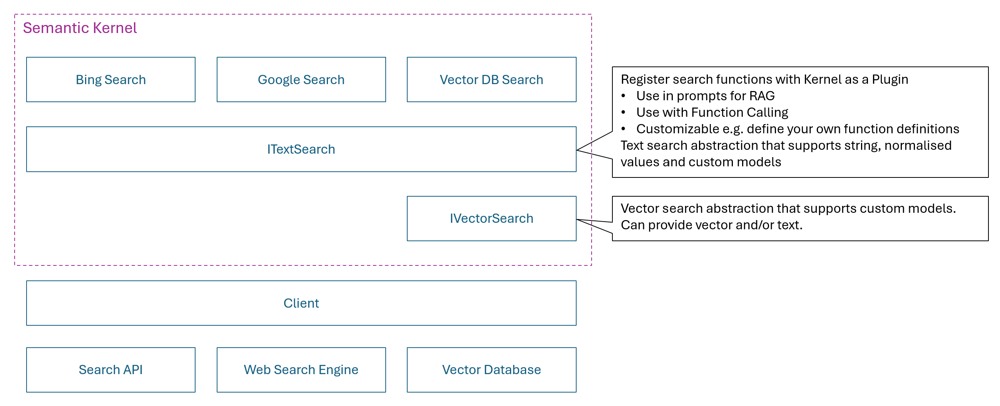
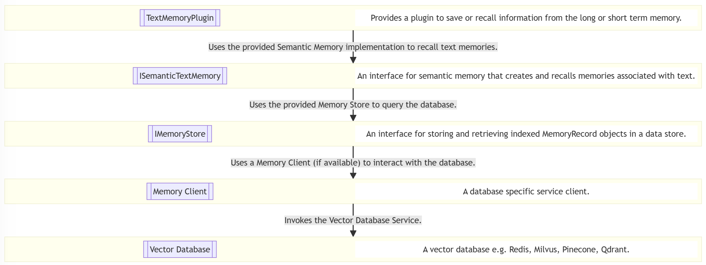
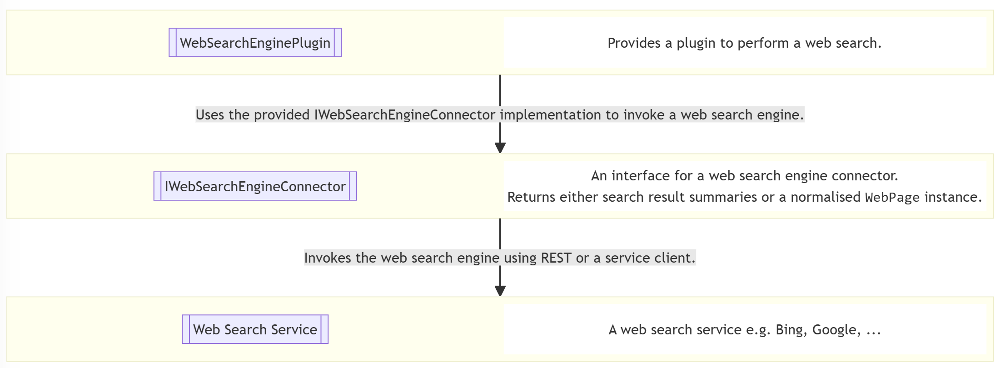

---
# These are optional elements. Feel free to remove any of them.
status: proposed
contact: markwallace
date: 2024-08-21
deciders: sergeymenshykh, markwallace, rbarreto, dmytrostruk, westey
consulted: stephentoub, matthewbolanos, shrojans 
informed: 
---

# Text Search Abstraction

## Context and Problem Statement

Semantic Kernel has support for searching using popular Vector databases e.g. Azure AI Search, Chroma, Milvus and also Web search engines e.g. Bing, Google.
There are two sets of abstractions and plugins depending on whether the developer wants to perform search against a Vector database or a Web search engine.
The current abstractions are experimental and the purpose of this ADR is to progress the design of the abstractions so that they can graduate to non experimental status.

There are two main use cases we need to support:

1. Enable Prompt Engineers to easily insert grounding information in prompts i.e. support for Retrieval-Augmented Generation scenarios.
2. Enable Developers to register search plugins which can be called by the LLM to retrieve additional data it needs to respond to a user ask i.e. support for Function Calling scenarios.

What both of these scenarios have in common is that we need to generate a `KernelPlugin` from a search service and register it for use with the `Kernel`.

### Retrieval-Augmented Generation Scenarios

Retrieval-Augmented Generation (RAG) is a process of optimizing the output of an LLM, so it references authoritative data which may not be part of its training data when generating a response. This reduce the likelihood of hallucinations and also enables the provision of citations which the end user can use to independently verify the response from the LLM. RAG works by retrieving additional data that is relevant to the use query and then augment the prompt with this data before sending to the LLM.

Consider the following sample where the top Bing search results are included as additional data in the prompt.

```csharp
// Create a kernel with OpenAI chat completion
IKernelBuilder kernelBuilder = Kernel.CreateBuilder();
kernelBuilder.AddOpenAIChatCompletion(
        modelId: TestConfiguration.OpenAI.ChatModelId,
        apiKey: TestConfiguration.OpenAI.ApiKey,
        httpClient: httpClient);
Kernel kernel = kernelBuilder.Build();

// Create a text search using the Bing search service
var textSearch = new BingTextSearch(new(TestConfiguration.Bing.ApiKey));

// Build a text search plugin with Bing search service and add to the kernel
var searchPlugin = textSearch.CreateKernelPluginWithTextSearch("SearchPlugin");
kernel.Plugins.Add(searchPlugin);

// Invoke prompt and use text search plugin to provide grounding information
var query = "What is the Semantic Kernel?";
KernelArguments arguments = new() { { "query", query } };
Console.WriteLine(await kernel.InvokePromptAsync("{{SearchPlugin.Search $query}}. {{$query}}", arguments));
```

This example works as follows:

1. Create a `BingTextSearch` which can perform Bing search queries.
2. Wrap the `BingTextSearch` as a plugin which can be called when rendering a prompt.
3. Insert a call to the plugin which performs a search using the user query.
4. The prompt will be augmented with the abstract from the top search results.

**Note:** In this case the abstract from the search result is the only data included in the prompt.
The LLM should use this data if it considers it relevant but there is no feedback mechanism to the user which would allow
them to verify the source of the data.

The following sample shows a solution to this problem.

```csharp
// Create a kernel with OpenAI chat completion
IKernelBuilder kernelBuilder = Kernel.CreateBuilder();
kernelBuilder.AddOpenAIChatCompletion(
        modelId: TestConfiguration.OpenAI.ChatModelId,
        apiKey: TestConfiguration.OpenAI.ApiKey,
        httpClient: httpClient);
Kernel kernel = kernelBuilder.Build();

// Create a text search using the Bing search service
var textSearch = new BingTextSearch(new(TestConfiguration.Bing.ApiKey));

// Build a text search plugin with Bing search service and add to the kernel
var searchPlugin = textSearch.CreateKernelPluginWithGetSearchResults("SearchPlugin");
kernel.Plugins.Add(searchPlugin);

// Invoke prompt and use text search plugin to provide grounding information
var query = "What is the Semantic Kernel?";
string promptTemplate = @"
{{#with (SearchPlugin-GetSearchResults query)}}  
  {{#each this}}  
    Name: {{Name}}
    Value: {{Value}}
    Link: {{Link}}
    -----------------
  {{/each}}  
{{/with}}  

{{query}}

Include citations to the relevant information where it is referenced in the response.
";

KernelArguments arguments = new() { { "query", query } };
HandlebarsPromptTemplateFactory promptTemplateFactory = new();
Console.WriteLine(await kernel.InvokePromptAsync(
    promptTemplate,
    arguments,
    templateFormat: HandlebarsPromptTemplateFactory.HandlebarsTemplateFormat,
    promptTemplateFactory: promptTemplateFactory
));
```

This example works as follows:

1. Create a `BingTextSearch` which can perform Bing search queries and convert the response into a normalized format.
2. The normalized format is a Semantic Kernel abstraction called `TextSearchResult` which includes a name, value and link for each search result.
3. Wrap the `BingTextSearch` as a plugin which can be called when rendering a prompt.
4. Insert a call to the plugin which performs a search using the user query.
5. The prompt will be augmented with the name, value and link from the top search results.
6. The prompt also instructs the LLM to include citations to the relevant information in the response.

An example response would look like this:

```
The Semantic Kernel (SK) is a lightweight and powerful SDK developed by Microsoft that integrates Large Language Models (LLMs) such as OpenAI, Azure OpenAI, and Hugging Face with traditional programming languages like C#, Python, and Java ([GitHub](https://github.com/microsoft/semantic-kernel)). It facilitates the combination of natural language processing capabilities with pre-existing APIs and code, enabling developers to add large language capabilities to their applications swiftly ([What It Is and Why It Matters](https://techcommunity.microsoft.com/t5/microsoft-developer-community/semantic-kernel-what-it-is-and-why-it-matters/ba-p/3877022)).

The Semantic Kernel serves as a middleware that translates the AI model's requests into function calls, effectively bridging the gap between semantic functions (LLM tasks) and native functions (traditional computer code) ([InfoWorld](https://www.infoworld.com/article/2338321/semantic-kernel-a-bridge-between-large-language-models-and-your-code.html)). It also enables the automatic orchestration and execution of tasks using natural language prompting across multiple languages and platforms ([Hello, Semantic Kernel!](https://devblogs.microsoft.com/semantic-kernel/hello-world/)).

In addition to its core capabilities, Semantic Kernel supports advanced functionalities like prompt templating, chaining, and planning, which allow developers to create intricate workflows tailored to specific use cases ([Architecting AI Apps](https://devblogs.microsoft.com/semantic-kernel/architecting-ai-apps-with-semantic-kernel/)).

By describing your existing code to the AI models, Semantic Kernel effectively marshals the request to the appropriate function, returns results back to the LLM, and enables the AI agent to generate a final response ([Quickly Start](https://learn.microsoft.com/en-us/semantic-kernel/get-started/quick-start-guide)). This process brings unparalleled productivity and new experiences to application users ([Hello, Semantic Kernel!](https://devblogs.microsoft.com/semantic-kernel/hello-world/)).

The Semantic Kernel is an indispensable tool for developers aiming to build advanced AI applications by seamlessly integrating large language models with traditional programming frameworks ([Comprehensive Guide](https://gregdziedzic.com/understanding-semantic-kernel-a-comprehensive-guide/)).
```

**Note:** In this case there is a link to the relevant information so the end user can follow the links to verify the response.

The next sample shows an alternative solution that uses Bing Text Search and the built-in result type.

```csharp
// Create a kernel with OpenAI chat completion
IKernelBuilder kernelBuilder = Kernel.CreateBuilder();
kernelBuilder.AddOpenAIChatCompletion(
        modelId: TestConfiguration.OpenAI.ChatModelId,
        apiKey: TestConfiguration.OpenAI.ApiKey,
        httpClient: httpClient);
Kernel kernel = kernelBuilder.Build();

// Create a text search using the Bing search service
var textSearch = new BingTextSearch(new(TestConfiguration.Bing.ApiKey));

// Build a text search plugin with Bing search service and add to the kernel
var searchPlugin = textSearch.CreateKernelPluginWithGetBingWebPages("SearchPlugin");
kernel.Plugins.Add(searchPlugin);

// Invoke prompt and use text search plugin to provide grounding information
var query = "What is the Semantic Kernel?";
string promptTemplate = @"
{{#with (SearchPlugin-GetBingWebPages query)}}  
  {{#each this}}  
    Name: {{Name}}
    Snippet: {{Snippet}}
    Link: {{DisplayUrl}}
    Date Last Crawled: {{DateLastCrawled}}
    -----------------
  {{/each}}  
{{/with}}  

{{query}}

Include citations to and the date of the relevant information where it is referenced in the response.
";
KernelArguments arguments = new() { { "query", query } };
HandlebarsPromptTemplateFactory promptTemplateFactory = new();
Console.WriteLine(await kernel.InvokePromptAsync(
    promptTemplate,
    arguments,
    templateFormat: HandlebarsPromptTemplateFactory.HandlebarsTemplateFormat,
    promptTemplateFactory: promptTemplateFactory
));
```

This example works as follows:

1. Create a `BingTextSearch` which can perform Bing search queries.
2. The default format is a Bing specific class called `BingWebPage` which includes a name, snippet, display url and date last crawled for each search result.
3. Wrap the `BingTextSearch` as a plugin which can be called when rendering a prompt.
4. Insert a call to the plugin which performs a search using the user query.
5. The prompt will be augmented with the name, snippet, display url and date last crawled from the top search results.
6. The prompt also instructs the LLM to include citations to and date of the relevant information in the response.

An example response would look like this:

```
Semantic Kernel is an open-source development kit designed to facilitate the integration of advanced AI models into existing C#, Python, or Java codebases. It serves as an efficient middleware that enables rapid delivery of enterprise-grade AI solutions (Microsoft Learn, 2024-08-14).

One of the standout features of Semantic Kernel is its lightweight SDK, which allows developers to blend conventional programming languages with Large Language Model (LLM) AI capabilities through prompt templating, chaining, and planning (Semantic Kernel Blog, 2024-08-10).

This AI SDK uses natural language prompting to create and execute semantic AI tasks across multiple languages and platforms, offering developers a simple yet powerful programming model to add large language capabilities to their applications in a matter of minutes (Microsoft Developer Community, 2024-08-13).

Semantic Kernel also leverages function calling—a native feature of most LLMs—enabling the models to request specific functions to fulfill user requests, thereby streamlining the planning process (Microsoft Learn, 2024-08-14).

The toolkit is versatile and extends support to multiple programming environments. For instance, Semantic Kernel for Java is compatible with Java 8 and above, making it accessible to a wide range of Java developers (Semantic Kernel Blog, 2024-08-14).

Additionally, Sketching an architecture with Semantic Kernel can simplify business automation using models from platforms such as OpenAI, Azure OpenAI, and Hugging Face (Semantic Kernel Blog, 2024-08-14).

For .NET developers, Semantic Kernel is highly recommended for working with AI in .NET applications, offering a comprehensive guide on incorporating Semantic Kernel into projects and understanding its core concepts (Microsoft Learn, 2024-08-14).

Last but not least, Semantic Kernel has an extension for Visual Studio Code that facilitates the design and testing of semantic functions, enabling developers to efficiently integrate and test AI models with their existing data (GitHub, 2024-08-14).

References:
- Microsoft Learn. "Introduction to Semantic Kernel." Last crawled: 2024-08-14.
- Semantic Kernel Blog. "Hello, Semantic Kernel!" Last crawled: 2024-08-10.
- Microsoft Developer Community. "Semantic Kernel: What It Is and Why It Matters." Last crawled: 2024-08-13.
- Microsoft Learn. "How to quickly start with Semantic Kernel." Last crawled: 2024-08-14.
- Semantic Kernel Blog. "Introducing Semantic Kernel for Java." Last crawled: 2024-08-14.
- Microsoft Learn. "Semantic Kernel overview for .NET." Last crawled: 2024-08-14.
- GitHub. "microsoft/semantic-kernel." Last crawled: 2024-08-14.
```

In the previous samples a snippet of text from the web page is used as the relevant information. The url to the full page content is also available so the full page could be downloaded and used. There may be other search implementations that don't include any relevant information and just include a link, this next examples shows how to handle this case.

```csharp
// Build a text search plugin with Bing search service and add to the kernel
var searchPlugin = KernelPluginFactory.CreateFromFunctions("SearchPlugin", null, [CreateGetFullWebPages(textSearch)]);
kernel.Plugins.Add(searchPlugin);

// Invoke prompt and use text search plugin to provide grounding information
var query = "What is the Semantic Kernel?";
string promptTemplate = @"
{{#with (SearchPlugin-GetFullWebPages query)}}  
  {{#each this}}  
    Name: {{Name}}
    Value: {{Value}}
    Link: {{Link}}
    -----------------
  {{/each}}  
{{/with}}  

{{query}}

Include citations to the relevant information where it is referenced in the response.
";
KernelArguments arguments = new() { { "query", query } };
HandlebarsPromptTemplateFactory promptTemplateFactory = new();
Console.WriteLine(await kernel.InvokePromptAsync(
    promptTemplate,
    arguments,
    templateFormat: HandlebarsPromptTemplateFactory.HandlebarsTemplateFormat,
    promptTemplateFactory: promptTemplateFactory
));
```

In this sample we call `BingSearchExample.CreateGetFullWebPagesOptions(textSearch)` to create the options that define the search plugin.

The code for this method looks like this:

```csharp
private static KernelFunction CreateGetFullWebPages(ITextSearch<BingWebPage> textSearch, BasicFilterOptions? basicFilter = null)
{
    async Task<IEnumerable<TextSearchResult>> GetFullWebPagesAsync(Kernel kernel, KernelFunction function, KernelArguments arguments, CancellationToken cancellationToken)
    {
        arguments.TryGetValue("query", out var query);
        if (string.IsNullOrEmpty(query?.ToString()))
        {
            return [];
        }

        var parameters = function.Metadata.Parameters;

        arguments.TryGetValue("count", out var count);
        arguments.TryGetValue("skip", out var skip);
        SearchOptions searchOptions = new()
        {
            Count = (count as int?) ?? 2,
            Offset = (skip as int?) ?? 0,
            BasicFilter = basicFilter
        };

        var result = await textSearch.SearchAsync(query.ToString()!, searchOptions, cancellationToken).ConfigureAwait(false);
        var resultList = new List<TextSearchResult>();

        using HttpClient client = new();
        await foreach (var item in result.Results.WithCancellation(cancellationToken).ConfigureAwait(false))
        {
            string? value = item.Snippet;
            try
            {
                if (item.Url is not null)
                {
                    value = await client.GetStringAsync(new Uri(item.Url), cancellationToken);
                    value = ConvertHtmlToPlainText(value);
                }
            }
            catch (HttpRequestException)
            {
            }

            resultList.Add(new() { Name = item.Name, Value = value, Link = item.Url });
        }

        return resultList;
    }

    var options = new KernelFunctionFromMethodOptions()
    {
        FunctionName = "GetFullWebPages",
        Description = "Perform a search for content related to the specified query. The search will return the name, full web page content and link for the related content.",
        Parameters =
        [
            new KernelParameterMetadata("query") { Description = "What to search for", IsRequired = true },
            new KernelParameterMetadata("count") { Description = "Number of results", IsRequired = false, DefaultValue = 2 },
            new KernelParameterMetadata("skip") { Description = "Number of results to skip", IsRequired = false, DefaultValue = 0 },
        ],
        ReturnParameter = new() { ParameterType = typeof(KernelSearchResults<string>) },
    };

    return KernelFunctionFactory.CreateFromMethod(GetFullWebPagesAsync, options);
}
```

The custom `CreateGetFullWebPages` will result in a search plugin with a single function called `GetFullWebPages`, this method works as follows:

1. It uses the `BingTextSearch` instances for retrieve the top pages for the specified query.
2. For each web page is reads the full HTML content using the url and then converts in to a plain text representation.

Here's an example of what the response will look like:

```
    The Semantic Kernel (SK) is an open-source development kit from Microsoft designed to facilitate the integration of large language models (LLMs) into AI applications. It acts as middleware, enabling the rapid development of enterprise-grade solutions by providing a flexible, modular, and extensible programming model that supports multiple languages like C#, Python, and Java [^1^][^4^].

### Key Features:

1. **AI Service Integration**:
   - The Semantic Kernel supports popular AI models from providers like OpenAI, Azure OpenAI, and Hugging Face. It abstracts the complexity of these services, making it easier to integrate them into applications using traditional programming languages [^1^][^3^][^5^].
   
2. **Extensibility and Modularity**:
   - Semantic Kernel leverages plugins and OpenAPI specifications to integrate seamlessly with existing codebases. This enables developers to maximize their current investments while extending functionalities through connectors and new AI capabilities [^1^][^2^][^5^].

3. **Orchestrating AI Tasks**:
   - Semantic Kernel uses "planners" to orchestrate the execution of functions, prompts, and API calls as needed. The planners coordinate multi-step processes to fulfill complex tasks based on a user's request, using predefined or dynamic execution plans [^2^][^7^].

4. **Memory and Context Management**:
   - It employs various types of memory such as local storage, key-value pairs, and vector (or semantic) search to maintain the context of interactions. This helps in preserving coherence and relevance in the outputs generated by the AI models [^8^].

5. **Responsible AI and Observability**:
   - The toolkit includes built-in logging, telemetry, and filtering support to enhance security and enable responsible AI deployment at scale. This ensures adherence to ethical guidelines and helps monitor the AI agents’ performance [^1^][^4^].

6. **Flexible Integration with Traditional Code**:
   - Developers can create native functions and semantic functions using SQL and other data manipulation techniques to extend the capabilities of the Semantic Kernel. This hybrid integration of AI and conventional code supports complex, real-world applications [^6^].

### Practical Uses:

- **Chatbots and Conversational Agents**:
   - By combining natural language prompting with API capabilities, Semantic Kernel allows the creation of intelligent chatbots that can interact dynamically with users [^6^].
   
- **Automation of Business Processes**:
   - AI agents built with SK can automate various business operations by interpreting natural language requests and executing corresponding actions through API integrations [^2^].

- **Enhanced Search and Data Retrieval**:
   - By using semantic memory and vector databases, SK facilitates advanced search functionalities that go beyond simple keyword matching, providing more accurate and contextually relevant search results [^8^].

### Getting Started:

Developers can get started with Semantic Kernel by following quick start guides and tutorials available on Microsoft Learn and GitHub [^3^][^4^][^5^].

For more detailed information, visit the official [Microsoft Learn page](https://learn.microsoft.com/en-us/semantic-kernel/overview/) or the [GitHub repository](https://github.com/microsoft/semantic-kernel).

[^1^]: [Introduction to Semantic Kernel | Microsoft Learn](https://learn.microsoft.com/en-us/semantic-kernel/overview/)
[^2^]: [Semantic Kernel: What It Is and Why It Matters | Microsoft Tech Community](https://techcommunity.microsoft.com/t5/microsoft-developer-community/semantic-kernel-what-it-is-and-why-it-matters/ba-p/3877022)
[^3^]: [How to quickly start with Semantic Kernel | Microsoft Learn](https://learn.microsoft.com/en-us/semantic-kernel/get-started/quick-start-guide)
[^4^]: [Understanding the kernel in Semantic Kernel | Microsoft Learn](https://learn.microsoft.com/en-us/semantic-kernel/concepts/kernel)
[^5^]: [Hello, Semantic Kernel! | Semantic Kernel](https://devblogs.microsoft.com/semantic-kernel/hello-world/)
[^6^]: [How to Get Started using Semantic Kernel .NET | Semantic Kernel](https://devblogs.microsoft.com/semantic-kernel/how-to-get-started-using-semantic-kernel-net/)
[^7^]: [Understanding Semantic Kernel](https://valoremreply.com/post/understanding-semantic-kernel/)
[^8^]: [Semantic Kernel: A bridge between large language models and your code | InfoWorld](https://www.infoworld.com/article/2338321/semantic-kernel-a-bridge-between-large-language-models-and-your-code.html)
```

**Note:** The token usage increases significantly if the full web pages are used.
In the above example the total token count is `26836` compared to `1081` if snippets of the web page are used.


### Function Calling Scenarios

Function calling allows you to connect LLMs to external tools and systems.
This capability can be used to enable an LLM to retrieve relevant information it needs in order to return a response to a user query.
In the context of this discussion we want to allow an LLM to perform a search to return relevant information.
We also want to enable developers to easily customize the search operations to improve the LLMs ability to retrieve the most relevant information.

We need to support the following use cases:

1. Enable developers to adapt an arbitrary text search implementation to be a search plugin which can be called by an LLM to perform searches.
   - Search results can be returned as text, or in a normalized format, or is a proprietary format associated with the text search implementation.
1. Enable developers to easily customize the search plugin, typical customizations will include:
   - Alter the search function metadata i.e. name, description, parameter details
   - Alter which search function(s) are included in the plugin
   - Alter the search function(s) behavior

Consider the following sample where the LLM can call Bing search to help it respond to the user ask.

```csharp
// Create a kernel with OpenAI chat completion
IKernelBuilder kernelBuilder = Kernel.CreateBuilder();
kernelBuilder.AddOpenAIChatCompletion(
        modelId: TestConfiguration.OpenAI.ChatModelId,
        apiKey: TestConfiguration.OpenAI.ApiKey,
        httpClient: httpClient);
Kernel kernel = kernelBuilder.Build();

// Create a search service with Bing search service
var textSearch = new BingTextSearch(new(TestConfiguration.Bing.ApiKey));

// Build a text search plugin with Bing search service and add to the kernel
var searchPlugin = textSearch.CreateKernelPluginWithTextSearch("SearchPlugin");
kernel.Plugins.Add(searchPlugin);

// Invoke prompt and use text search plugin to provide grounding information
OpenAIPromptExecutionSettings settings = new() { ToolCallBehavior = ToolCallBehavior.AutoInvokeKernelFunctions };
KernelArguments arguments = new(settings);
Console.WriteLine(await kernel.InvokePromptAsync("What is the Semantic Kernel?", arguments));
```

This example works as follows:

1. Create a BingTextSearch which can perform Bing search queries.
1. Wrap the BingTextSearch as a plugin which can be advertised to the LLM.
1. Enable automatic function calling, which allows the LLM to call Bing search to retrieve relevant information.

**Note:** The `TextSearchKernelPluginFactory.CreateFromTextSearch` factory method is used to create the search plugin.
This method will create a plugin with a `Search` function which returns the search results as a collection of `string` instances.

An example response would look like this:

```
The Semantic Kernel is an open-source development kit aimed at integrating the latest AI models into various programming languages, such as C#, Python, or Java. It serves as a middleware enabling rapid delivery of enterprise-grade AI solutions. Key features and capabilities of the Semantic Kernel include:

1. **Function Call Planning**: It leverages function calling—a native feature of most large language models (LLMs)—to allow these models to request specific functions to satisfy user requests.

2. **Semantic Function Design**: The Semantic Kernel extension for Visual Studio Code simplifies the design and testing of semantic functions, providing an interface for creating and evaluating these functions with existing models and data.

3. **Programming Model**: It introduces a programming model that combines conventional programming languages with AI "prompts" through prompt templating, chaining, and planning capabilities.

4. **Multi-Language Support**: Compatible with programming in languages like C#, Python, and Java, ensuring broad accessibility and flexibility.

5. **AI Agent Creation**: Facilitates building AI agents that can call existing code, thus automating business processes using models from OpenAI, Azure OpenAI, Hugging Face, and more.

The Semantic Kernel helps developers quickly add large language capabilities to their applications, allowing the creation of smart, adaptable systems that can naturally interact with human users.
```

**Note:** In this case the abstract from the search result is the only data included in the prompt. The LLM should use this data if it considers it relevant but there is no feedback mechanism to the user which would allow them to verify the source of the data.

The following sample shows a solution to this problem.

```csharp
// Create a kernel with OpenAI chat completion
IKernelBuilder kernelBuilder = Kernel.CreateBuilder();
kernelBuilder.AddOpenAIChatCompletion(
        modelId: TestConfiguration.OpenAI.ChatModelId,
        apiKey: TestConfiguration.OpenAI.ApiKey,
        httpClient: httpClient);
Kernel kernel = kernelBuilder.Build();

// Create a search service with Bing search service
var textSearch = new BingTextSearch(new(TestConfiguration.Bing.ApiKey));

// Build a text search plugin with Bing search service and add to the kernel
var searchPlugin = textSearch.CreateKernelPluginWithGetSearchResults("SearchPlugin");
kernel.Plugins.Add(searchPlugin);

// Invoke prompt and use text search plugin to provide grounding information
OpenAIPromptExecutionSettings settings = new() { ToolCallBehavior = ToolCallBehavior.AutoInvokeKernelFunctions };
KernelArguments arguments = new(settings);
Console.WriteLine(await kernel.InvokePromptAsync("What is the Semantic Kernel? Include citations to the relevant information where it is referenced in the response.", arguments));
```

There is just one change in the sample, the plugin is created using the `TextSearchKernelPluginFactory.CreateFromTextSearchResults` factory method.
This method will create a plugin with a `Search` function which returns a collection of `TextSearchResult` instances which in turn will contain a link which can be used to provide a citation.

An example response would look like this:

```
    The Semantic Kernel is an open-source software development kit (SDK) that facilitates the integration of advanced AI models into applications. It allows developers to harness the power of large language models (LLMs) for building innovative AI solutions. Semantic Kernel supports C#, Python, and Java, and it emphasizes security, modularity, and flexibility, making it suitable for enterprise-grade applications.

Key Features:
1. **Integration of AI Models**: Semantic Kernel enables developers to incorporate AI models from platforms such as OpenAI and Hugging Face into their codebase. This allows for creating powerful AI agents that can automate a variety of tasks.

2. **Semantic Functions**: The SDK provides tools to design and test semantic functions. These functions facilitate natural language processing capabilities in applications, allowing for more intuitive user interactions ([GitHub - microsoft/semantic-kernel](https://github.com/microsoft/semantic-kernel)).

3. **Comprehensive Documentation and Guides**: Detailed guides and documentation are available to help developers get started quickly. They cover everything from installing the SDK to building AI agents and creating robust AI solutions ([Introduction to Semantic Kernel | Microsoft Learn](https://learn.microsoft.com/en-us/semantic-kernel/overview/), [How to quickly start with Semantic Kernel | Microsoft Learn](https://learn.microsoft.com/en-us/semantic-kernel/get-started/quick-start-guide)).

4. **Support for Enterprise Applications**: The kernel is designed to provide enterprise-grade services and plugins, ensuring scalability and robustness for large and complex applications ([Architecting AI Apps with Semantic Kernel | Semantic Kernel](https://devblogs.microsoft.com/semantic-kernel/architecting-ai-apps-with-semantic-kernel/)).

5. **Integration with Popular Tools**: Semantic Kernel can be seamlessly integrated with conventional programming languages and popular development environments, providing tools to extend functionalities with minimal effort ([GitHub - microsoft/semantic-kernel](https://github.com/microsoft/semantic-kernel)).

For more detailed information, the following sources can be referenced:
- [Introduction to Semantic Kernel | Microsoft Learn](https://learn.microsoft.com/en-us/semantic-kernel/overview/)
- [Semantic Kernel documentation | Microsoft Learn](https://learn.microsoft.com/en-us/semantic-kernel/)
- [GitHub - microsoft/semantic-kernel](https://github.com/microsoft/semantic-kernel)

These resources offer comprehensive insights into using the Semantic Kernel to leverage AI technology effectively in software development.
```

The next sample shows how a developer can customize the configuration of the search plugin.

```csharp
// Create a kernel with OpenAI chat completion
IKernelBuilder kernelBuilder = Kernel.CreateBuilder();
kernelBuilder.AddOpenAIChatCompletion(
        modelId: TestConfiguration.OpenAI.ChatModelId,
        apiKey: TestConfiguration.OpenAI.ApiKey,
        httpClient: httpClient);
Kernel kernel = kernelBuilder.Build();

// Create a search service with Bing search service
var textSearch = new BingTextSearch(new(TestConfiguration.Bing.ApiKey));

// Build a text search plugin with Bing search service and add to the kernel
var basicFilter = new BasicFilterOptions().Equality("site", "devblogs.microsoft.com");
var searchPlugin = KernelPluginFactory.CreateFromFunctions("SearchPlugin", "Search Microsoft Dev Blogs site", [textSearch.CreateGetSearchResults(basicFilter)]);
kernel.Plugins.Add(searchPlugin);

// Invoke prompt and use text search plugin to provide grounding information
OpenAIPromptExecutionSettings settings = new() { ToolCallBehavior = ToolCallBehavior.AutoInvokeKernelFunctions };
KernelArguments arguments = new(settings);
Console.WriteLine(await kernel.InvokePromptAsync("What is the Semantic Kernel? Include citations to the relevant information where it is referenced in the response.", arguments));
```

This sample provides a description for the search plugin i.e., in this case we only want to search the Microsoft Developer Blogs site and also the options for creating the plugin. The options allow the search plugin function definition(s) to be specified i.e., in this case we want to use a default search function that includes a basic filter which specifies the only site to include is `devblogs.microsoft.com`.

An example response would look like this and you will note that all of the citations are from `devblogs.microsoft.com`:

```
The Semantic Kernel (SK) is a lightweight Software Development Kit (SDK) that facilitates the integration of conventional programming languages like C# and Python with the latest advancements in Large Language Models (LLM) AI, such as prompt templating, chaining, and planning capabilities. It enables the building of AI solutions that can leverage models from platforms like OpenAI, Azure OpenAI, and Hugging Face ([Hello, Semantic Kernel!](https://devblogs.microsoft.com/semantic-kernel/hello-world/)).

Semantic Kernel is incredibly versatile, allowing developers to create advanced AI applications by incorporating AI agents into their applications. These agents can interact with code, automate business processes, and manage multiple LLMs with ease. The framework also supports pre-built features like planners to simplify orchestration and is fully compatible with .NET Dependency Injection abstractions ([Build AI Applications with ease using Semantic Kernel](https://devblogs.microsoft.com/semantic-kernel/build-ai-applications-with-ease-using-semantic-kernel-and-net-aspire/), [How to Get Started using Semantic Kernel .NET](https://devblogs.microsoft.com/semantic-kernel/how-to-get-started-using-semantic-kernel-net/)).

For more information and the latest updates from the Semantic Kernel team, you can visit their [official blog](https://devblogs.microsoft.com/semantic-kernel/).
```

In the previous example the site has hard coded. It is also possible to allow the LLM to extract the site from the user query. In the example below a custom search function is created which includes an additional argument to allow the LLM to set the site.

```csharp
// Create a kernel with OpenAI chat completion
IKernelBuilder kernelBuilder = Kernel.CreateBuilder();
kernelBuilder.AddOpenAIChatCompletion(
        modelId: TestConfiguration.OpenAI.ChatModelId,
        apiKey: TestConfiguration.OpenAI.ApiKey,
        httpClient: httpClient);
Kernel kernel = kernelBuilder.Build();

// Create a search service with Bing search service
var textSearch = new BingTextSearch(new(TestConfiguration.Bing.ApiKey));

// Build a text search plugin with Bing search service and add to the kernel
var searchPlugin = KernelPluginFactory.CreateFromFunctions("SearchPlugin", "Search Microsoft Dev Blogs site", [CreateSearchBySite(textSearch)]);
kernel.Plugins.Add(searchPlugin);

// Invoke prompt and use text search plugin to provide grounding information
OpenAIPromptExecutionSettings settings = new() { ToolCallBehavior = ToolCallBehavior.AutoInvokeKernelFunctions };
KernelArguments arguments = new(settings);
Console.WriteLine(await kernel.InvokePromptAsync("What is the Semantic Kernel? Only include results from devblogs.microsoft.com. Include citations to the relevant information where it is referenced in the response.", arguments));
```

The code below shows how the custom search function is created.

- The `KernelFunction` includes an additional optional parameter called `site`
- If the `site` parameter is provided a `BasicFilterOptions` instance is created which will cause Bing to return responses only from that site
- A custom function description and parameter description are provided to help the LLM in using this method.

```csharp
private static KernelFunction CreateSearchBySite(ITextSearch<BingWebPage> textSearch, BasicFilterOptions? basicFilter = null, MapSearchResultToString? mapToString = null)
{
    async Task<IEnumerable<BingWebPage>> SearchAsync(Kernel kernel, KernelFunction function, KernelArguments arguments, CancellationToken cancellationToken)
    {
        arguments.TryGetValue("query", out var query);
        if (string.IsNullOrEmpty(query?.ToString()))
        {
            return [];
        }

        var parameters = function.Metadata.Parameters;

        arguments.TryGetValue("count", out var count);
        arguments.TryGetValue("skip", out var skip);
        arguments.TryGetValue("site", out var site);
        BasicFilterOptions? basicFilter = null;
        if (string.IsNullOrEmpty(site?.ToString()))
        {
            basicFilter = new BasicFilterOptions().Equality("site", site?.ToString()!);
        }
        SearchOptions searchOptions = new()
        {
            Count = (count as int?) ?? 2,
            Offset = (skip as int?) ?? 0,
            BasicFilter = basicFilter
        };

        var result = await textSearch.SearchAsync(query?.ToString()!, searchOptions, cancellationToken).ConfigureAwait(false);
        return await result.Results.ToListAsync(cancellationToken).ConfigureAwait(false);
    }

    var options = new KernelFunctionFromMethodOptions()
    {
        FunctionName = "Search",
        Description = "Perform a search for content related to the specified query and optionally from the specified domain.",
        Parameters =
        [
            new KernelParameterMetadata("query") { Description = "What to search for", IsRequired = true },
            new KernelParameterMetadata("count") { Description = "Number of results", IsRequired = false, DefaultValue = 2 },
            new KernelParameterMetadata("skip") { Description = "Number of results to skip", IsRequired = false, DefaultValue = 0 },
            new KernelParameterMetadata("site") { Description = "Only return results from this domain", IsRequired = false, DefaultValue = 2 },
        ],
        ReturnParameter = new() { ParameterType = typeof(KernelSearchResults<string>) },
    };

    return KernelFunctionFactory.CreateFromMethod(SearchAsync, options);
}
```

## Decision Drivers

- An AI must be able to perform searches with a search plugin and get back results with the following types:
   1. Simple string value.
   2. Normalized value including a name, content and link.
   3. Data model supported by the underlying search implementation.
- Application developers should be able to easily add a search plugin using a search connector with minimal lines of code (ideally one).
- Application developers must be able to provide connector specific settings.
- Application developers must be able to set required information e.g. `IndexName` for search providers.
- Application developers must be able to support custom schemas for search connectors. No fields should be required.
- Community developers must be able to easily create a new search connector.
- Community developers must be able to easily create a new search connector return type that inherits from `KernelSearchResults` (alternate suggestion `SearchResultContent`).
- The design must be flexible to support future requirements and different search modalities.
- Application developers must to be able to override the semantic descriptions of the search function(s) per instance registered via settings / inputs.
- Search service developers must be able to define the attributes of the search method (e.g., name, description, input names, input descriptions, return description).

Expect these to be handled by Vector search

- Application developers must be able to optionally define the execution settings of an embedding service with a default being provided by the Kernel.
- Application developers must be ab able to import a vector DB search connection using an ML index file.

### Future Requirements

- An AI can perform search with filters using a search plugin. This will require a Connector Dev to implement a search interface that accepts a Filter object.
- Connector developers can decide which search filters are given to the AI by “default”.
- Application developers can override which filters the AI can use via search settings.
- Application developers can set the filters when they create the connection.

### Search Abstractions

The diagram below shows the layering in the proposed design. From the bottom up these are:

- We aim to support an arbitrary search service, which could be a Web search, Vector DB search or a proprietary implementation.
- There will be a client API layer. Note we are **not** trying to provide a search abstraction to normalize this layer.
- We are defining an `IVectorSearch` abstraction which will allow us to perform searches against multiple Vector databases. This will be covered in a separate ADR.
- The focus for this ADR is the `ITextSearch` abstraction which is being designed to support the use cases described earlier in this document.
- We will provide a number of implementations of the `ITextSearch` abstraction e.g., Bing, Google, Vector DB's. The final list is TBD.



## Considered Options

1. Define `ITextSearch<T>` abstraction with single `Search` method and implementations check type
2. Define `ITextSearch<T>` abstraction with single `Search` method and implementations implement what they support
3. Define `ITextSearch<T>` abstraction with multiple search methods
4. Define `ITextSearch` abstraction with multiple search methods and additional methods on implementations
5. Define `ITextSearch` and `ITextSearch<T>` abstractions

## Decision Outcome

Chosen option: "Define `ITextSearch` abstraction with multiple search methods and additional methods on implementations", because
it meets the requirements, allows for type safe methods, can support arbitrary object responses and simplifies the implementation burden for developers implementing the abstraction.

<!-- This is an optional element. Feel free to remove. -->

## Pros and Cons of the Options

### 1. Define `ITextSearch<T>` abstraction with single `Search` method and implementations check type

Abstraction would look like this:

```csharp
public interface ITextSearch<T> where T : class
{
  public Task<KernelSearchResults<T>> SearchAsync(string query, SearchOptions? searchOptions = null, CancellationToken cancellationToken = default);
}
```

Implementation would look like this:

```csharp
public class BingTextSearch<T> : ITextSearch<T> where T : class
{
  public async Task<KernelSearchResults<T>> SearchAsync(string query, SearchOptions? searchOptions = null, CancellationToken cancellationToken = default)
  {
    // Retrieve Bing search results

    if (typeof(T) == typeof(string))
    {
       // Convert to string (custom mapper is supported)
    }
    else if (typeof(T) == typeof(TextSearchResult))
    {
       // Convert to TextSearchResult (custom mapper is supported)
    }
    else if (typeof(T) == typeof(BingWebPage))
    {
      // Return Bing search results
    }
  }
}
```

**Note:** Custom mappers are specified when the `BingTextSearch` instance is created

For Vector Store the implementation would look like:

```csharp
public sealed class VectorTextSearch<T> : ITextSearch<T> where T : class
{
  public async Task<KernelSearchResults<T>> SearchAsync(string query, SearchOptions? searchOptions = null, CancellationToken cancellationToken = default)
  {
    // Retrieve Vector Store search results

    if (typeof(T) == typeof(string))
    {
       // Convert to string (custom mapper is supported)
    }
    else if (typeof(T) == typeof(TextSearchResult))
    {
       // Convert to TextSearchResult (custom mapper is required)
    }
    else
    {
      // Return search results
    }
  }
}
```

- Good, because can support custom types for `VectorTextSearch`
- Neitral, because type checking required for each invocation
- Bad, because not clear what return types are supported by an implementation

### 2. Define `ITextSearch<T>` abstraction with single `Search` method and implementations implement what they support

Abstraction would look like this:

```csharp
public interface ITextSearch<T> where T : class
{
  public Task<KernelSearchResults<T>> SearchAsync(string query, SearchOptions? searchOptions = null, CancellationToken cancellationToken = default);
}
```

Implementation would look like this:

```csharp
public sealed class BingTextSearch : ITextSearch<string>, ITextSearch<TextSearchResult>, ITextSearch<BingWebPage>
{
  /// <inheritdoc/>
  async Task<KernelSearchResults<TextSearchResult>> ITextSearch<TextSearchResult>.SearchAsync(string query, SearchOptions? searchOptions, CancellationToken cancellationToken)
  {
    // Retrieve Bing search results and convert to TextSearchResult
  }

  /// <inheritdoc/>
  async Task<KernelSearchResults<BingWebPage>> ITextSearch<BingWebPage>.SearchAsync(string query, SearchOptions? searchOptions, CancellationToken cancellationToken)
  {
    // Retrieve Bing search results
  }

  /// <inheritdoc/>
  async Task<KernelSearchResults<string>> ITextSearch<string>.SearchAsync(string query, SearchOptions? searchOptions, CancellationToken cancellationToken)
  {
    // Retrieve Bing search results and convert to string
  }
}
```

For Vector Store the implementation would still look like:

```csharp
public sealed class VectorTextSearch<T> : ITextSearch<T> where T : class
{
  public async Task<KernelSearchResults<T>> SearchAsync(string query, SearchOptions? searchOptions = null, CancellationToken cancellationToken = default)
  {
    // Retrieve Vector Store search results

    if (typeof(T) == typeof(string))
    {
       // Convert to string (custom mapper is supported)
    }
    else if (typeof(T) == typeof(TextSearchResult))
    {
       // Convert to TextSearchResult (custom mapper is required)
    }
    else
    {
      // Return search results
    }
  }
}
```

- Good, because separates the implementation for each return type where possible
- Good, because it can be made clear what types are supported by an implementation
- Bad, because you need to downcast

### 3. Define `ITextSearch<T>` abstraction with multiple search methods

Abstraction would look like this:

```csharp
public interface ITextSearch<T> where T : class
{
  public Task<KernelSearchResults<string>> SearchAsync(string query, SearchOptions? searchOptions = null, CancellationToken cancellationToken = default);

  public Task<KernelSearchResults<TextSearchResult>> GetTextSearchResultsAsync(string query, SearchOptions? searchOptions = null, CancellationToken cancellationToken = default);

  public Task<KernelSearchResults<T>> GetSearchResultsAsync(string query, SearchOptions? searchOptions = null, CancellationToken cancellationToken = default);
}
```

Implementation could look like this:

```csharp
public sealed class BingTextSearch : ITextSearch<BingWebPage>
{
  public async Task<KernelSearchResults<BingWebPage>> GetSearchResultsAsync(string query, SearchOptions? searchOptions, CancellationToken cancellationToken)
  {
    // Retrieve Bing search results
  }

  public async Task<KernelSearchResults<TextSearchResult>> GetTextSearchResultsAsync(string query, SearchOptions? searchOptions, CancellationToken cancellationToken)
  {
    // Retrieve Bing search results and convert to TextSearchResult
  }

  public async Task<KernelSearchResults<string>> SearchAsync(string query, SearchOptions? searchOptions, CancellationToken cancellationToken)
  {
    // Retrieve Bing search results and convert to string
  }
}
```

**Note:** This option would not be extensible i.e., to add support for Bing News search results we would have to add a new `BingNewTextSearch` implementation.

For Vector Store the implementation would look like:

```csharp
public sealed class VectorTextSearch<T> : ITextSearch<T> where T : class
{
  public Task<KernelSearchResults<T>> GetSearchResultsAsync(string query, SearchOptions? searchOptions, CancellationToken cancellationToken)
  {
    // Retrieve Vector Store search results
  }

  public Task<KernelSearchResults<TextSearchResult>> GetTextSearchResultsAsync(string query, SearchOptions? searchOptions, CancellationToken cancellationToken)
  {
    // Retrieve Vector Store search results and convert to TextSearchResult
  }

  public Task<KernelSearchResults<string>> SearchAsync(string query, SearchOptions? searchOptions, CancellationToken cancellationToken)
  {
    // Retrieve Vector Store search results and convert to string
  }
}
```

**Note:** This option would be extensible i.e., we can support custom record types in the underlying Vector Store implementation but developers will have to deal with run time exceptions if the type of record they specify is not supported.

- Good, because there are separate methods for each type
- Bad, because in the above BingTextSearch sample no additional types can be added
- Bad, because not clear what types are supported

### 4. Define `ITextSearch` abstraction with multiple search methods and additional methods on implementations

Abstraction would look like this:

```csharp
public interface ITextSearch
{
  public Task<KernelSearchResults<string>> SearchAsync(string query, SearchOptions? searchOptions = null, CancellationToken cancellationToken = default);

  public Task<KernelSearchResults<TextSearchResult>> GetTextSearchResultsAsync(string query, SearchOptions? searchOptions = null, CancellationToken cancellationToken = default);
}
```

Implementation could look like this:

```csharp
public sealed class BingTextSearch : ITextSearch
{
  public async Task<KernelSearchResults<TextSearchResult>> GetTextSearchResultsAsync(string query, SearchOptions? searchOptions, CancellationToken cancellationToken)
  {
    // Retrieve Bing search results and convert to TextSearchResult
  }

  public async Task<KernelSearchResults<string>> SearchAsync(string query, SearchOptions? searchOptions, CancellationToken cancellationToken)
  {
    // Retrieve Bing search results and convert to string
  }

  public async Task<KernelSearchResults<BingWebPage>> GetWebPagesAsync(string query, SearchOptions? searchOptions, CancellationToken cancellationToken)
  {
    // Retrieve Bing search results
  }
}
```

**Note:** This option would be extensible i.e., to add support for Bing News search results we would just have to add a new method to `BingTextSearch`.

For Vector Store the implementation would look like:

```csharp
public sealed class VectorTextSearch<T> : ITextSearch where T : class
{
  public Task<KernelSearchResults<T>> GetSearchResultsAsync(string query, SearchOptions? searchOptions, CancellationToken cancellationToken)
  {
    // Retrieve Vector Store search results
  }

  public Task<KernelSearchResults<TextSearchResult>> GetTextSearchResultsAsync(string query, SearchOptions? searchOptions, CancellationToken cancellationToken)
  {
    // Retrieve Vector Store search results and convert to TextSearchResult
  }

  public Task<KernelSearchResults<string>> SearchAsync(string query, SearchOptions? searchOptions, CancellationToken cancellationToken)
  {
    // Retrieve Vector Store search results and convert to string
  }
}
```

**Note:** This option would be extensible i.e., we can support custom record types in the underlying Vector Store implementation but developers will have to deal with run time exceptions if the type of record they specify is not supported.

- Good, because there are separate methods for each type
- Good, because support for additional types can be added
- Good, because this will be easier to implement in Python
- Bad, abstraction is limited to just including support for `string` and `TextSearchResult`

### 5. Define `ITextSearch` and `ITextSearch<T>` abstractions

Start with the `ITextSearch` abstraction and extend to include `ITextSearch<T>` as needed.

- Good, separate methods for each type
- Good, support for additional types can be added
- Good, additional abstraction using generics can be added when and if needed

## More Information

### Current Design

The current design for search is divided into two implementations:

1. Search using a Memory Store i.e. Vector Database
1. Search using a Web Search Engine

In each case a plugin implementation is provided which allows the search to be integrated into prompts e.g. to provide additional context or to be called from a planner or using auto function calling with a LLM.

#### Memory Store Search

The diagram below shows the layers in the current design of the Memory Store search functionality.



#### Web Search Engine Integration

The diagram below shows the layers in the current design of the Web Search Engine integration.



The Semantic Kernel currently includes experimental support for a `WebSearchEnginePlugin` which can be configured via a `IWebSearchEngineConnector` to integrate with a Web Search Services such as Bing or Google. The search results can be returned as a collection of string values or a collection of `WebPage` instances.

- The `string` values returned from the plugin represent a snippet of the search result in plain text.
- The `WebPage` instances returned from the plugin are a normalized subset of a complete search result. Each `WebPage` includes:
  - `name` The name of the search result web page
  - `url` The url of the search result web page
  - `snippet` A snippet of the search result in plain text

The current design doesn't support breaking glass scenario's or using custom types for the response values.

One goal of this ADR is to have a design where text search is unified into a single abstraction and a single plugin can be configured to perform web based searches or to search a vector store.