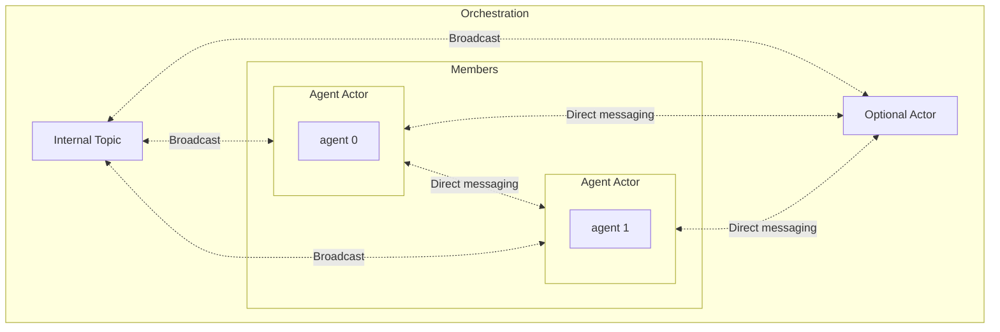
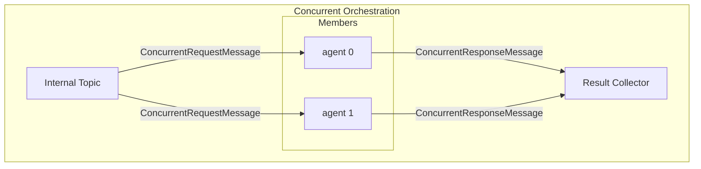
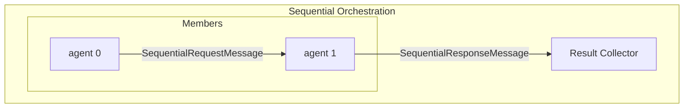
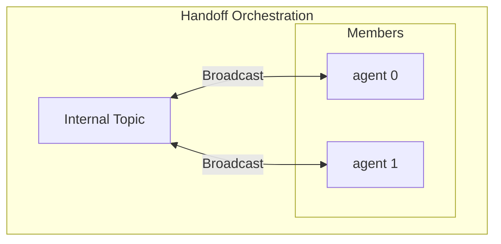
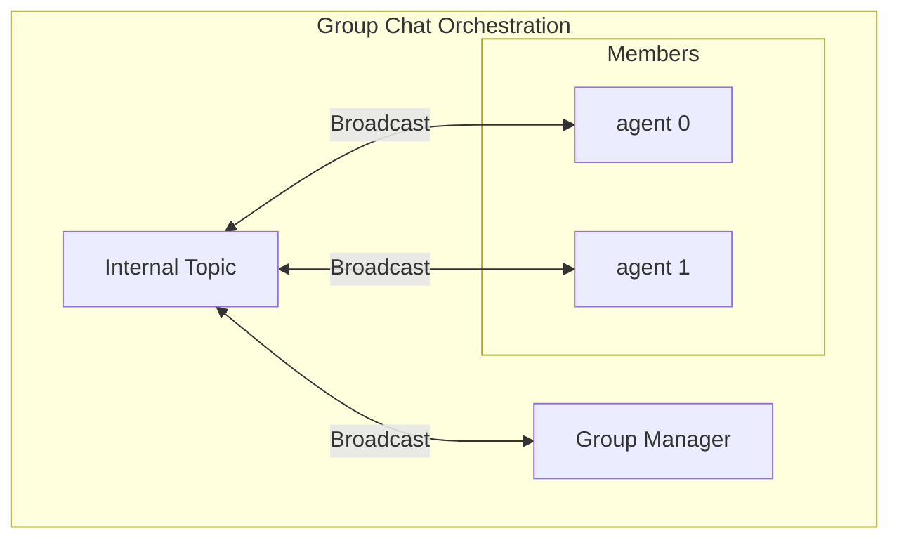

---
# These are optional elements. Feel free to remove any of them.
status: { proposed }
contact: { Tao Chen }
date: { 2025-04-30 }
deciders: { Ben Thomas, Mark Wallace }
consulted: { Chris Rickman, Evan Mattson, Jack Gerrits, Eric Zhu }
informed: {}
---

# Multi-agent Orchestration

## Context

The industry is moving up the stack to build more complex systems using LLMs. From interacting with foundation models to building RAG systems, and now creating single AI agents to perform more complex tasks, the desire for a multi-agent system is growing.

With the recent GA of the Semantic Kernel Agent Framework, which offers a [stable agent abstraction/APIs](https://github.com/microsoft/semantic-kernel/blob/main/python/semantic_kernel/agents/agent.py) and support for multiple agent services such as OpenAI Assistant and Chat Completion services, we are now able to build on top of it to create multi-agent systems. This will allow our customers to unlock even more complex scenarios.

In addition, the recent collaboration with the AutoGen team that resulted in the shared agent runtime abstraction allowed us to leverage their work as the foundation on which we can build our framework.

## Problem Statement

The current state of the Semantic Kernel Agent Framework is limited to single agents, i.e. agents cannot work collaboratively to solve user requests. We need to extend it to support multi-agent orchestration, which will allow our customers to unlock more possibilities using Semantic Kernel agents. Please refer to the [Considerations](#considerations) section to see success criteria for this proposal.

## Background Knowledge

### Terminology

Before we dive into the details, let's clarify some terminologies that will be used throughout this document.

| **Term**                                                                                                             | **Definition**                                                                             |
| -------------------------------------------------------------------------------------------------------------------- | ------------------------------------------------------------------------------------------ |
| **Actor**                                                                                                            | An entity in the runtime that can send and receive messages.                               |
| **[Runtime](https://microsoft.github.io/autogen/stable/user-guide/core-user-guide/core-concepts/architecture.html)** | Facilitates the communication between actors and manages the states and lifecycle of them. |
| **Runtime Abstraction**                                                                                              | An abstraction that provides a common interface for different runtime implementations.     |
| **Agent**                                                                                                            | A Semantic Kernel agent.                                                                   |
| **Orchestration**                                                                                                    | Contains actors and rules on how they will interact with each others.                      |

> We are using the term "actor" to avoid confusion with the term "agent" used in the Semantic Kernel Agent Framework. You may see the name "actor" used interchangeably with "agent" in the runtime documentation. To learn more about "actor"s in software design, please refer to: <https://en.wikipedia.org/wiki/Actor_model>.

> You may hear the term "pattern" in other contexts. "Pattern" is almost semantically identical to "orchestration" where the latter implies the management and execution of patterns. You can also think of "patterns" as types of "orchestrations". For example, "concurrent orchestration" is a type of orchestration that follows the concurrent pattern.

### The shared runtime abstraction from AutoGen

> The runtime abstraction serves as the foundational layer for the system. A basic understanding of the runtime is recommended. For more details, refer to the [AutoGen Core User Guide](https://microsoft.github.io/autogen/stable/user-guide/core-user-guide/index.html).

The AutoGen team has built a runtime abstraction (along with an in-process runtime implementation) that supports pub-sub communication between actors in a system. We have had the opportunity to leverage this work, which led to a shared agent runtime abstraction which Semantic Kernel will depend on.

Depending on the actual runtime implementation, actors can be local or distributed. Our agent framework is **not** tied to a specific runtime implementation, a.k.a **runtime agnostic**.

## Considerations

### Orchestrations

The first version of the multi-agent orchestration framework will provide a set of pre-built orchestrations that cover the most common patterns listed below. As time goes on, we will add more orchestrations based on customer feedback and will allow customers to easily create their own orchestrations using the building blocks provided by the framework.

| **Orchestrations** | **Description**                                                                                                                                                                                     |
| ------------------ | --------------------------------------------------------------------------------------------------------------------------------------------------------------------------------------------------- |
| **Concurrent**     | Useful for tasks that will benefit from independent analysis from multiple agents.                                                                                                                  |
| **Sequential**     | Useful for tasks that require a well-defined step-by-step approach.                                                                                                                                 |
| **Handoff**        | Useful for tasks that are dynamic in nature and don't have a well-defined step-by-step approach.                                                                                                    |
| **GroupChat**      | Useful for tasks that will benefit from inputs from multiple agents and a highly configurable conversation flow.                                                                                    |
| **Magentic One**   | GroupChat like with a planner based manager. Inspired by [Magentic One](https://www.microsoft.com/en-us/research/articles/magentic-one-a-generalist-multi-agent-system-for-solving-complex-tasks/). |

> Please see [Appendix A](#appendix-a-pre-built-orchestrations) for a more detailed descriptions of the pre-built orchestrations.

Using an orchestration should be as simple as the following:

```python
agent_1 = ChatCompletionAgent(...)
agent_2 = ChatCompletionAgent(...)

group_chat = GroupChatOrchestration(members=[agent_1, agent_2], manager=RoundRobinGroupChatManager())

# The runtime can be a context manager for better resource management and developer experience.
# We may also consider using a factory to create a default runtime instance.
runtime = InProcessRuntime()
runtime.start()

orchestration_result = await group_chat.invoke(task="Hello world", runtime=runtime)
result = await orchestration_result.get(timeout=20)
print(result)

await runtime.stop_when_idle()
```

### Application responsibilities

- The lifecycle of a runtime instance should be managed by the application and should be external to any orchestrations.
- Orchestrations require a runtime instance only when they are invoked, not when they are created.

### Graph-like structure with lazy evaluation

We should consider an orchestration as a template that describes how the agents will interact with each other similar to a directed graph. The actual execution of the orchestration should be done by the runtime. Therefore, the followings must be true:

- Actors are registered to the runtime before execution starts, not when the orchestration is created.
- The runtime is responsible for creating the actors and managing their lifecycle.

### Independent & isolated invocations

An orchestration can be invoked multiple times and each invocation should be independent and isolated from each other. Invocations can also share the same runtime instance. This will require us to define clear invocation boundaries to avoid collisions, such as actor names or IDs.

For example, in the following code snippet, the `task_1` and `task_2` are independent and don't share any context:

```python
agent_1 = ChatCompletionAgent(...)
agent_2 = ChatCompletionAgent(...)

group_chat = GroupChatOrchestration(members=[agent_1, agent_2], manager=RoundRobinGroupChatManager())

runtime = InProcessRuntime()
runtime.start()

task_1 = await group_chat.invoke(task=TASK_1, runtime=runtime)
task_2 = await group_chat.invoke(task=TASK_2, runtime=runtime)

result_1 = await task_1.get(timeout=20)
result_2 = await task_2.get(timeout=20)

await runtime.stop_when_idle()
```

### Support structured input and output types

We need the orchestrations to accept structured inputs and return structured outputs, so that they will be easier to work with from a code perspective. This will also make it easier for developers to work with orchestrations that are not chat-based (although internally the agents will still be chat-based).

## Out of Scope

- The runtime implementation is out of scope for this proposal.
- Topics mentioned in the [Open Discussions](#open-discussions) section will not be addressed in the initial implementation of the multi-agent orchestration framework. However, we will keep them in mind for future iterations and we should leave enough room for future extensions.

## Proposals

> Code snippets shown are not complete but they provide enough context to understand the proposal.

### Building blocks

| **Component**            | **Details**                                                                                                          |
| ------------------------ | -------------------------------------------------------------------------------------------------------------------- |
| **Agent actor**          | - Semantic Kernel agent <br> - Agent context: thread and history                                                     |
| **Data transform logic** | - Provide hooks to transform the input/output of the orchestration from/to custom types.                             |
| **Orchestration**        | - Consists of multiple agent actors and other optional orchestration-specific actors.                                |
| **Optional actors**      | - Other actors that are not agent actors. <br> - For example, a group manager actor in the group chat orchestration. |



#### Agent Actor

This is a wrapper around a Semantic Kernel agent so that the agent can send and receive messages from the runtime. The `AgentActorBase` will inherit the [`RoutedAgent`](https://microsoft.github.io/autogen/stable/reference/python/autogen_core.html#autogen_core.RoutedAgent) class:

```python
class AgentActorBase(RoutedAgent):
    """A agent actor for multi-agent orchestration running on Agent runtime."""

    def __init__(self, agent: Agent) -> None:
        """Initialize the agent container.

        Args:
            agent (Agent): An agent to be run in the container.
        """
        self._agent = agent
        self._agent_thread = None
        # Chat history to temporarily store messages before the agent thread is created
        self._chat_history = ChatHistory()

        RoutedAgent.__init__(self, description=agent.description or "Semantic Kernel Agent")
```

Orchestrations will have their own agent actor that extends the `AgentActorBase` because each orchestration can have its own set of message handlers.

> To learn more about messages and message handlers, please refer to the [AutoGen documentation](https://microsoft.github.io/autogen/stable/user-guide/core-user-guide/framework/message-and-communication.html).

For example, for the group chat orchestration, the agent actor will look like this:

```python
class GroupChatAgentActor(AgentActorBase):
    """An agent actor for agents that process messages in a group chat."""

    @message_handler
    async def _handle_start_message(self, message: GroupChatStartMessage, ctx: MessageContext) -> None:
        """Handle the initial message(s) provided by the user."""
        ...

    @message_handler
    async def _handle_response_message(self, message: GroupChatResponseMessage, ctx: MessageContext) -> None:
        """Handle the response message from other agents in the group chat."""
        ...

    @message_handler
    async def _handle_request_message(self, message: GroupChatRequestMessage, ctx: MessageContext) -> None:
        """Handle the request message from the group manager."""
        ...
```

Agent actors in other orchestrations will handle different message types or different number of message types. This proposal doesn't make any restrictions on how agent actors interact with each other inside an orchestration, i.e. rules are defined by individual orchestrations.

#### Data Transform Logic

The signature of the data transform logic will be as follows:

```python
DefaultTypeAlias = ChatMessageContent | list[ChatMessageContent]

TIn = TypeVar("TIn", default=DefaultTypeAlias)
TOut = TypeVar("TOut", default=DefaultTypeAlias)

input_transform: Callable[[TIn], Awaitable[DefaultTypeAlias] | DefaultTypeAlias]
output_transform: Callable[[DefaultTypeAlias], Awaitable[TOut] | TOut]
```

`TIn` denotes the type of input the orchestration will take, while `TOut` denotes the type of output the orchestration will return to the caller. We will use `ChatMessageContent` and `list[ChatMessageContent]` as the default types. This means that the orchestration will accept a single chat message or a list of chat messages as input and return a single chat message or a list of chat messages as output.

> We can offer a set of default transforms to improve the developer quality of life. We can also have LLMs that automatically perform the transforms given the types.

#### Orchestration

An orchestration is simply a collection of Semantic Kernel agents and the rules that govern how they will interact with each other. Concrete implementations have to provide logic for how to start and prepare an invocation of the orchestration. "Preparing" an invocation simply means registering the actors with the runtime and setting up the communication channels between them based on the orchestration type.

```python
class OrchestrationBase(ABC, Generic[TIn, TOut]):
    def __init__(
        self,
        members: list[Agent],
        input_transform: Callable[[TIn], Awaitable[DefaultTypeAlias] | DefaultTypeAlias]
        | None = None,
        output_transform: Callable[[DefaultTypeAlias], Awaitable[TOut] | TOut] | None = None,
    ) -> None:
        """Initialize the orchestration base.

        Args:
            members (list[Agent]): The list of agents or orchestrations to be used.
            input_transform (Callable | None): A function that transforms the external input message.
            output_transform (Callable | None): A function that transforms the internal output message.
        """
        ...

    async def invoke(
        self,
        task: str | DefaultTypeAlias | TIn,
        runtime: AgentRuntime,
    ) -> OrchestrationResult:
        """Invoke the orchestration and return an result immediately which can be awaited later.

        The runtime is supplied by the application at invocation time, not at creation time.
        Orchestrations are runtime-agnostic and can be used with any runtime that implements the runtime abstraction.
        """
        orchestration_result = OrchestrationResult[TOut]()

        async def result_callback(result: DefaultTypeAlias) -> None:
            """Callback function that is called when the result is ready."""
            ...

        ...

        # This unique topic type is used to isolate the invocation from others.
        internal_topic_type = uuid.uuid4().hex

        await self._prepare(runtime, internal_topic_type, result_callback)

        ...

        await self._start(runtime, internal_topic_type, orchestration_result.cancellation_token)

        return orchestration_result

    @abstractmethod
    async def _start(
        self,
        runtime: AgentRuntime,
        internal_topic_type: str,
        cancellation_token: CancellationToken,
    ) -> None:
        ...

    @abstractmethod
    async def _prepare(
        self, runtime: AgentRuntime,
        internal_topic_type: str,
        result_callback: Callable[[DefaultTypeAlias], Awaitable[None]] | None = None,
    ) -> str:
        ...
```

When using the orchestration, the user will can optionally set `TIn` and `TOut` and provide the input and output transforms. For example, in Python, the user can do the following:

```python
class MyTypeA:
    pass

class MyTypeB:
    pass

sequential_orchestration = SequentialOrchestration[MyTypeA, MyTypeB](
    members=[agent_0, agent_1],
    input_transform=input_transform_func,
    output_transform=output_transform_func,
)
```

And depending on the language, we can offer defaults so that only advanced users will need to set `TIn` and `TOut`. For example, in Python, we can do the following:

```python
DefaultTypeAlias = ChatMessageContent | list[ChatMessageContent]

TIn = TypeVar("TIn", default=DefaultTypeAlias)
TOut = TypeVar("TOut", default=DefaultTypeAlias)
```

And in .Net, we can do the following:

```csharp
public class SequentialOrchestration<TIn, TOut> : AgentOrchestration<TIn, TOut>
{
    ...
}

public sealed class SequentialOrchestration : SequentialOrchestration<ChatMessageContent, ChatMessageContent>
{
    ...
}
```

The orchestration result will be represented as such:

```python
class OrchestrationResult(KernelBaseModel, Generic[TOut]):

    value: TOut | None = None
    event: asyncio.Event = Field(default_factory=lambda: asyncio.Event())
    cancellation_token: CancellationToken = Field(default_factory=lambda: CancellationToken())

    async def get(self, timeout: float | None = None) -> TOut:
        """Get the result of the invocation.

        Args:
            timeout (float | None): The timeout in seconds. If None, wait indefinitely.

        Raises:
            TimeoutError: If the timeout is reached before the result is ready.
            RuntimeError: If the invocation is cancelled.

        Returns:
            TOut: The result of the invocation.
        """
        ...

    def cancel(self) -> None:
        """Cancel the invocation.

        This method will cancel the invocation and set the cancellation token.
        Actors that have received messages will continue to process them, but no new messages will be processed.
        """
        ...
```

## Open Discussions

The following items are important topics we need to consider and need further discussion. However, they shouldn't block the initial implementation of the multi-agent orchestration framework.

### State management

Definitions for `resume` and `restart` before proceeding:

- **Resume**: The process is still active but at an idle state waiting for some events to continue. The runtime resumes the process from the idle state.
- **Restart**: The process is no longer running. It has been stopped manually or errors had occurred. The orchestration can be restarted from scratch, or from a previous checkpoint. Restarting is idempotent, meaning that the orchestration can be restarted multiple times from the same checkpoint without side effects on the orchestration, runtime, and agents.

Orchestrations can be long-running, hours, days, and even years. And they can be short-lived, minutes or seconds or less. The states of an orchestration can mean the following:

- An actively running orchestration that is in an idle state waiting for user input or other events to continue.
- An orchestration that has entered an error state.
- etc.

**Resuming** from an idle state will be handled by the runtime. The runtime is responsible for saving the state of the actors and rehydrating them when the orchestration is resumed.

Another type of states are the agents' conversational context. There is active work on agent **threads** and **memories**, and we should consider how these concepts fit into the framework. Ideally, we want the ability to **restart** an orchestration on some existing agent context. Please refer to [Agent context](#agent-context) for further discussion.

### Agent context

We mentioned in the [State management](#state-management) section that orchestrations do not manage the state of the agents, while we do want to support the ability to invoke/restart an orchestration on some existing agent context. This means that we need to have a way to provide the state of the agents to the orchestrations.

An option is to have a context provider that provides agent contexts given an agent ID. The context provider will be attached to the agent actors for the agent actor to retrieve and update contexts. Each new invocation of an orchestration will return a text representation (see [Support declarative orchestrations](#support-declarative-orchestrations)) of the orchestration, which can be used to rehydrate the orchestration.

### Error handling

We need a clear story for customers on how to handle errors in the runtime. The runtime is managed by the application. Orchestrations will not be able to capture errors that happen in the runtime and actor level.

The `in_process` runtime currently have a flag `ignore_unhandled_exceptions` which by default is set to `True` and can be set at construction time. Setting this flag to `False` will cause the runtime to stop and raise if an exception occurs during the execution.

It will get more complicated when we have distributed runtimes. We should also consider retries and idempotency at the runtime level.

### Human in the loop

Human-in-the-loop is a critical component in autonomous systems. We need to consider how to support human-in-the-loop in the multi-agent orchestration framework.

- Support cancellation of an invocation
- Notify the user of important events
- Support distributed use cases. For example, the client may live on a different system than the orchestration.

> The group chat orchestration has an experimental feature that allows input from users. Please refer to the [Group Chat Orchestration](#group-chat-orchestration) section for more details.

### Composition

Composition allows users to take existing orchestrations and use them to build more powerful orchestrations. Think of replacing an agent in an orchestration with another orchestration. This will unlock more complex scenarios with less effort. However, this comes with challenges, including:

- The handling of mismatched input and output types of orchestrations.
- The communication between actors and orchestrations.
- The handling of the lifecycle of the orchestrations that is inside another orchestration.
- The propagation of events from an orchestration that is nested inside another orchestration.
- Simplicity of use: user don't have to understand the inner workings of the orchestrations to use them.
- Simplicity of implementation: developers can create new orchestrations with the same building blocks as the existing orchestrations.

### Distributed orchestrations

Although orchestrations are not tied to a specific runtime, we need to understand how actors and orchestrations will be distributed if a runtime allows distribution. The following questions need to be answered:

- Actor registrations happen locally on the same machine with the runtime via a factory. Does the factory need to be distributed?
- How will the runtime handle distributed actor failures?
- How will the runtime handle the cancellation of an invocation of an orchestration that is distributed?
- How will the result of an invocation be returned via a callback function or some other mechanism if the orchestration is distributed?

### Support declarative orchestrations

Declarative orchestrations provide a low-code solution for users. We are already working on declarative agents, and we can leverage that work to create declarative orchestrations.

### Guardrails

Safety is also a priority. A powerful orchestration may accomplish a lot of things, but it may also do a lot of harm. We need to consider how to implement guardrails in the multi-agent orchestration framework, similar to what OpenAI has in their [agent SDK](https://openai.github.io/openai-agents-python/guardrails/).

- Should we have guardrails in the orchestration level?
- Should we have guardrails in the actor level?
- Should we have guardrails in the agent level?

### Observability

SK being an enterprise solution, we should also consider observability.

### A middle layer before the runtime for additional security and safety

We can consider adding a layer before the runtime that standardize all messages between actors for the following benefits:

- Built-in idempotency & retries: the standardized message type carries id, causation_id, retry_count, ttl, which can enable deterministic deduplication, causal graphs for telemetry, and safe redelivery.
- First-class observability: standardized message fields can map 1:1 to OpenTelemetry attributes for traceability and metrics on every hop.
- Persistence/rehydration: standardized messages can be serialized to storage and deserialized as needed.
- Guardrails: the uniform wrapper allows policy/guardrail checks to be centralized in the runtime, so no payload reaches an agent unchecked.

## Appendix A: Pre-built orchestrations

### Concurrent Orchestration

The concurrent orchestration works in the following steps:

1. The orchestration is invoked with a task.
2. The orchestration broadcasts the task to all actors.
3. Actors start processing the task and send the result to the result collector.
4. The result collector collects the results and when the expected number of results are received, it calls a callback function to signal the end of the orchestration.



### Sequential Orchestration

The sequential orchestration works in the following steps:

1. The orchestration is invoked with a task.
2. The orchestration sends the task to the first actor.
3. The first actor processes the task and sends the result to the next actor.
4. The last actor processes the result and sends the result to the result collector.
5. The result collector calls a callback function to signal the end of the orchestration.



### Handoff Orchestration

The handoff orchestration works in the following steps:

1. The orchestration is invoked with a task.
2. The orchestration sends the task to all actors.
3. The orchestration sends a "request to speak" message to the first actor.
4. The first actor processes the task, broadcast the conversation context, and decides if it needs to delegate the task to another actor.
5. If the first actor decides to delegate the task, it sends a "request to speak" message to the other actor.
6. The other actor processes the task and decides if it needs to delegate the task to another actor.
7. The process continues until the last actor decides that the task is complete and calls a callback function to signal the end of the orchestration.



### Group Chat Orchestration

The group chat orchestration works in the following steps:

1. The orchestration is invoked with a task.
2. The orchestration sends the task to all actors.
3. The orchestration sends the task to the group manager, which will trigger the group chat manager to start the orchestration.
4. The group manager decides the state of the conversation from one of the following:
   - Request User Input -> calls a callback function and waits for user input.
   - Terminate
   - Next Actor
5. If the conversation needs to continue, the group manager picks the next actor and sends a "request to speak" message to the actor.
6. The actor processes the request and broadcasts the response to the internal topic.
7. All other actors receive the response and add the response to their conversation context.
8. The group manager receives the response and continues from step 4.
9. If the conversation is over, the group manager retrieves a result and calls a callback function to signal the end of the orchestration.



The group chat manager is responsible for managing the conversation flow. It will have the following responsibilities:

```python
class GroupChatManager(KernelBaseModel, ABC):
    """A group chat manager that manages the flow of a group chat."""

    user_input_func: Callable[[ChatHistory], Awaitable[str]] | None = None

    @abstractmethod
    async def should_request_user_input(self, chat_history: ChatHistory) -> bool:
        raise NotImplementedError

    @abstractmethod
    async def should_terminate(self, chat_history: ChatHistory) -> bool:
        raise NotImplementedError

    @abstractmethod
    async def select_next_agent(self, chat_history: ChatHistory, participant_descriptions: dict[str, str]) -> str:
        raise NotImplementedError

    @abstractmethod
    async def filter_results(self, chat_history: ChatHistory) -> ChatMessageContent:
        raise NotImplementedError
```

### Magentic One Orchestration

Magentic one is a group chat-like orchestration with a special group manager. Refer to the [Magentic One blog](https://www.microsoft.com/en-us/research/articles/magentic-one-a-generalist-multi-agent-system-for-solving-complex-tasks/) or [paper](https://www.microsoft.com/en-us/research/wp-content/uploads/2024/11/MagenticOne.pdf) for more details.
