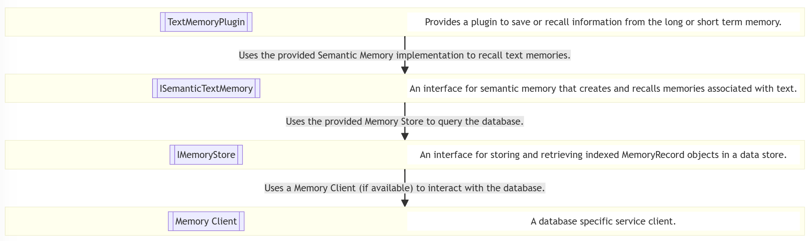

---
# These are optional elements. Feel free to remove any of them.
status: proposed
contact: markwallace
date: {YYYY-MM-DD when the decision was last updated}
deciders: sergeymenshykh, markwallace, rbarreto, dmytrostruk, westey
consulted: 
informed: stephentoub, matthewbolanos
---

# Text Search Service 

## Context and Problem Statement

{Describe the context and problem statement, e.g., in free form using two to three sentences or in the form of an illustrative story.
You may want to articulate the problem in form of a question and add links to collaboration boards or issue management systems.}

## Decision Drivers

- An AI must be able to perform searches with a search plugin and get back “results” of type `T`.
- Application developers should be able to easily add a search plugin using a search connector with minimal lines of code (ideally one).
- Application developers must be able to provide connector specific settings.
- Application developers must be able to set required information e.g. `IndexName` for search providers.
- Application developers must to be able to override the semantic descriptions of the search function(s) per instance registered via settings / inputs.
- Application developers must be able to optionally define the execution settings of an embedding service with a default being provided by the Kernel.
- Application developers must be able to support custom schemas for search connectors. No fields should be required.
- Search service developers must be able to easily create a new search service that returns type `T`.
- Search service developers must be able to easily create a new search connector return type that inherits from `SearchResultContent`.
- Search service developers must be able to define the attributes of the search method (e.g., name, description, input names, input descriptions, return description).
- Application developers must be ab able to import a vector DB search connection using an ML index file.
- The design must be flexible to support future requirements and different search modalities.

### Future Requirements

- An AI can perform search with filters using a search plugin to get back “results” of type T. This will require a Connector Dev to implement a search interface that accepts a Filter object.
- Connector developers can decide which search filters are given to the AI by “default”.
- Application developers can override which filters the AI can use via search settings.
- Application developers can set the filters when they create the connection.

### Current Design

## Considered Options

- {title of option 1}
- {title of option 2}
- {title of option 3}
- … <!-- numbers of options can vary -->

## Decision Outcome

Chosen option: "{title of option 1}", because
{justification. e.g., only option, which meets k.o. criterion decision driver | which resolves force {force} | … | comes out best (see below)}.

<!-- This is an optional element. Feel free to remove. -->

### Consequences

- Good, because {positive consequence, e.g., improvement of one or more desired qualities, …}
- Bad, because {negative consequence, e.g., compromising one or more desired qualities, …}
- … <!-- numbers of consequences can vary -->

<!-- This is an optional element. Feel free to remove. -->

## Validation

{describe how the implementation of/compliance with the ADR is validated. E.g., by a review or an ArchUnit test}

<!-- This is an optional element. Feel free to remove. -->

## Pros and Cons of the Options

### {title of option 1}

<!-- This is an optional element. Feel free to remove. -->

{example | description | pointer to more information | …}

- Good, because {argument a}
- Good, because {argument b}
<!-- use "neutral" if the given argument weights neither for good nor bad -->
- Neutral, because {argument c}
- Bad, because {argument d}
- … <!-- numbers of pros and cons can vary -->

### {title of other option}

{example | description | pointer to more information | …}

- Good, because {argument a}
- Good, because {argument b}
- Neutral, because {argument c}
- Bad, because {argument d}
- …

<!-- This is an optional element. Feel free to remove. -->

## More Information

{You might want to provide additional evidence/confidence for the decision outcome here and/or
document the team agreement on the decision and/or
define when this decision when and how the decision should be realized and if/when it should be re-visited and/or
how the decision is validated.
Links to other decisions and resources might appear here as well.}
