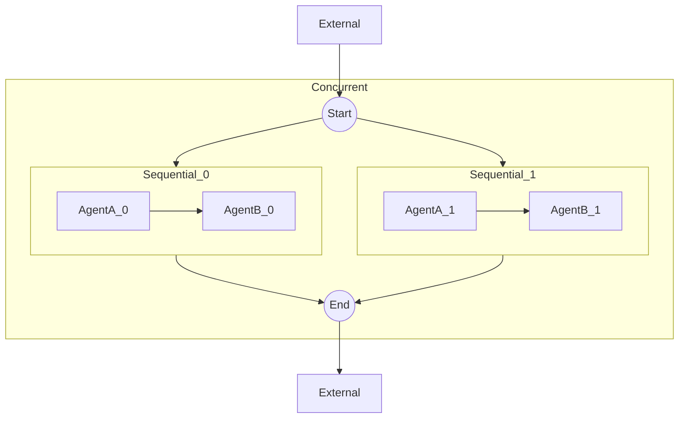
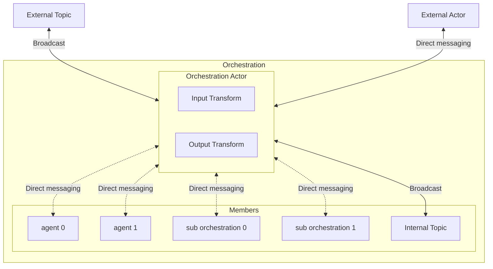

---
# These are optional elements. Feel free to remove any of them.
status: { proposed }
contact: { }
date: { 2025-04-11 }
deciders: { }
consulted: { }
informed: { }
---

# Multi-agent Orchestration

> Items marked with an asterisk (*) are not yet fully fleshed out and need further research.

## Context

The industry is moving up the stack to build more complex systems using LLMs. From interacting with foundation models to building RAG systems, and now creating AI agents to perform more complex tasks, the desire for a multi-agent framework is growing.

With the recent GA of the Semantic Kernel Agent Framework, we are now able to build on top of it to create a multi-agent orchestration framework. This will allow our customers to unlock even more complex scenarios and use cases.

In addition, with the collaboration with the AutoGen team and the shared runtime abstractions, we can leverage the work done in AutoGen to build a multi-agent orchestration framework more rapidly.

## Problem Statement

The current state of the Semantic Kernel Agent Framework is limited to single agents. We need to build a multi-agent orchestration framework to allow our customers to build more complex systems using Semantic Kernel agents.

### Terminology

| **Term**   | **Definition**                                                                                     |
|------------|-----------------------------------------------------------------------------------------------------|
| **Agent**  | A Semantic Kernel agent.                                                                            |
| **Actor**  | An AutoGen agent that can send and receive messages from the runtime.                               |
| **Runtime**| Facilitates the communication between actors and manages the lifecycle of the actors.               |

### AutoGen shared runtime abstractions

The AutoGen team has built a runtime abstraction that supports pub-sub communication between actors in a system. We have had the opportunity to leverage this work, which led to a shared runtime abstraction that our framework will depend on.

With the shared runtime abstraction, our framework will support local and distributed use cases.

## Considerations

### Support the ability to create custom multi-agent orchestrations

Our framework should provide a set of build blocks for customers to create more advanced orchestrations for their specific use cases using the same building blocks we use to build the pre-built orchestrations.

### Pre-built orchestrations

We should provide a list of pre-built orchestrations that cover all common patterns. These orchestrations will be built using the same building blocks we provide to our customers to build their own orchestrations.

| **Orchestrations**       | **Description**                                                                                                                                                                                                                     |
|--------------------|---------------------------------------------------------------------------------------------------------------------------------------------------------------------------------------------|
| **Concurrent**     | - Consists of multiple actors that run in parallel. <br> - Tasks are broadcasted to all actors. <br> - The results are collected and returned to the caller when all actors finish. <br> - The order of the results is not guaranteed. |
| **Sequential**     | - Consists of multiple actors that run in sequence. <br> - The output of the previous actor is the input of the next actor. <br> - The result is collected and returned to the caller when the last actor finishes.                  |
| **Handoff**        | - Consists of multiple actors. <br> - The actors can decide the next actor to send the task to. <br> - The full context (conversation) of the previous actor is passed to the next actor. <br> - Human-in-the-loop may be supported. <br> - The result is collected and returned to the caller when the orchestration finishes. |
| **GroupChat**      | - Consists of multiple actors. <br> - A group manager actor is responsible for managing the state of the group chat. <br> - **Key Features:** <br> &nbsp;&nbsp;&nbsp;&nbsp;- User input: Requests input from the user. <br> &nbsp;&nbsp;&nbsp;&nbsp;- Termination: Ends when a termination condition is met, and results are returned. <br> &nbsp;&nbsp;&nbsp;&nbsp;- Next actor: Decides the next actor to invoke. <br> - Human-in-the-loop must be supported. <br> - The result is collected and returned to the caller when the orchestration finishes. |
| **Magentic One**   | - Group chat-like orchestration with unique features. <br> - Inspired by [Magentic One](https://www.microsoft.com/en-us/research/articles/magentic-one-a-generalist-multi-agent-system-for-solving-complex-tasks/).                  |

### Runtime

- Orchestration should only depend upon the runtime abstraction.
- The runtime is provided when the orchestration is invoked, not when the orchestration is created.
- The runtime lifecycle is managed by the application (external to the orchestration).
- Multiple orchestrations can share the same runtime instance (orchestration boundaries).

### Graph-like structure with lazy evaluation

- An orchestration is a template for how a group of Semantic Kernel agents will be able to interact with each other within predefined boundaries.
- Actors and child orchestrations are registered in the runtime before execution starts, not when the orchestration is created.
- The runtime is responsible for executing the graph and managing the lifecycle of the actors and orchestrations. This is provided by the runtime abstraction.

### Support nested orchestrations

Support for nesting patterns is critical for the framework, as it allows for more complex orchestrations to be built using simpler orchestrations.

Example:



> The two orchestration actors in the diagram are the same actor. The two external actors are the same actor. Separating them is just for a cleaner diagram.

> Some details are omitted in the two sequential orchestrations for clarity, for example, the orchestration actor are not shown.

The above is a simple example that shows what a nested multi-agent orchestration looks like. This orchestration contains two sequential orchestrations that run in a concurrent orchestration.

### Orchestration invocation paradigms

- Direct invocation: the orchestration is invoked directly by the user.
- Indirect invocation: the orchestration actor receives a message from another actor within a parent orchestration.
- State management
  - Orchestration states are not shared between invocations.
  - Explore the usage of agent memory to retain context between invocations.

### Save states of the agents in an orchestration and rehydration

- Being able to save the state of the orchestration process while waiting for user input and restore it later when user provides input for scalability
- Recursively save the state of all agents and child orchestrations, including threads, chat history, and context from the root orchestration

## Decisions

### Building blocks

| **Component**         | **Details**                                                                                                                                                                                                                     |
|------------------------|-----------------------------------------------------------------------------------------------------------------------------------------------------------------------------------------|
| **Agent actor**       | - Semantic Kernel agent <br> - Agent thread <br> - Support for streaming?                                                                                                                                                       |
| **Data transform logic** | - Provide hooks to transform the input and output of the orchestration to **custom types** and for nesting orchestrations.                                                                                                     |
| **Orchestration actor** | - Broadcast messages to an external topic (e.g., the result of the orchestration) <br> - Send directly to an actor external to the orchestration (e.g., the result of the orchestration) <br> - Receive messages from an external topic (e.g., the start of the orchestration) <br> - Receive messages from an actor external to the orchestration (e.g., the start of the orchestration) |
| **Orchestration**     | - Consists of one orchestration actor and multiple agent actors and other orchestrations. <br> - Support for streaming?                                                                                                         |

An orchestration can have multiple agent actors and child orchestrations, but only one orchestration actor (depending on the implementation, there can also be one actor to receive messages and one actor to send messages).

> Input and output transform logic are critical pieces in more advanced orchestrations.



#### Agent Actor

This is essentially a wrapper around a Semantic Kernel agent so that it can send and receive messages from the runtime.

> Please note that an agent actor implementation is tightly coupled with the orchestration. For example, a concurrent orchestration will have a different agent actor implementation than a sequential orchestration. This is because the interactions between the actors are different in each orchestration.

#### Data Transform Logic

The data transform logic is highly configurable and is required by all orchestrations.

> We can offer a set of default transforms to improve the developer quality of life.

In the base abstraction, we will have the following:

```python
input_transform: Callable[[TExternalIn], Awaitable[TInternalIn] | TInternalIn]
output_transform: Callable[[TInternalOut], Awaitable[TExternalOut] | TExternalOut]
```

`TExternalIn` denotes the type of input the orchestration will receive. `TInternalIn` denotes the type of input the orchestration is actually expecting. `TInternalOut` denotes the type of output the orchestration will produce. `TExternalOut` denotes the type of output the orchestration will return to the caller. `TExternalIn` and `TInternalIn` can be the same type, but they are not required to be. The same applies to `TExternalOut` and `TInternalOut`.

#### Orchestration Actor

This is the actor that will be responsible for relaying messages. This is also the representative of an orchestration when it's nested inside another orchestration. The data transforms happen in this actor so it must hold the input and output transforms:

```python
class OrchestrationActorBase(
    BaseAgent,
    Generic[TExternalIn, TInternalIn, TInternalOut, TExternalOut],
):
    ...

    @abstractmethod
    async def _handle_orchestration_input_message(
        self,
        message: TExternalIn,
        ctx: MessageContext,
    ) -> None:
        """Handle the orchestration input message."""
        pass

    @abstractmethod
    async def _handle_orchestration_output_message(
        self,
        message: TInternalOut,
        ctx: MessageContext,
    ) -> None:
        """Handle the orchestration output message."""
        pass
```

> `BaseAgent` is an AutoGen abstraction that provides the basic functionality for sending and receiving messages. Derived classes must implement the `on_message_impl` method to handle incoming messages.

#### Orchestration

Given the transform logic shapes and the actor abstractions defined above, we can create the base orchestration abstraction.

```python
class OrchestrationBase(
    ABC,
    Generic[TExternalIn, TInternalIn, TInternalOut, TExternalOut],
):
    ... 

    async def invoke(self, runtime: AgentRuntime, ...) -> OrchestrationResult:
        """Invoke the orchestration and return an result immediately which can be awaited later.

        The runtime is supplied by the application at invocation time, not at creation time.
        Orchestrations are runtime-agnostic and can be used with any runtime that implements the runtime abstraction.
        """
        ...

    async def prepare(self, runtime: AgentRuntime, ...) -> str:
        """Register actors and return the orchestration actor id.

        Use when the orchestration is nested inside another orchestration. The parent orchestration will call this method to prepare the internal actors with the runtime and add necessary subscriptions according to the orchestration.
        """
        ...

    @abstractmethod
    async def _start(self, runtime: AgentRuntime, ...) -> None:
        """Start the orchestration."""
        ...

    @abstractmethod
    async def _prepare(self, runtime: AgentRuntime, internal_topic_type: str, ...) -> str:
        """Register actors and return the orchestration actor id.

        The internal topic type is an unique identifier that is used to isolate the invocations of the orchestrations.
        All agent actors internal to the orchestration will be bound to this topic.
        """
        ...
```

Concrete implementations of the orchestration will set `TInternalIn` and `TInternalOut`. For example,

```python
class SequentialOrchestration(OrchestrationBase[TExternalIn, SequentialRequestMessage, SequentialResultMessage, TExternalOut]):
    ...
```

### Nesting orchestrations

The internal communication between actors within an orchestration depends on the specific orchestration type. This means the `TInternalIn` and `TInternalOut` types will vary for each orchestration. However, input and output transforms provide a seamless way to "bridge" different orchestrations, enabling them to work together.

For example, in the nested orchestration shown in [Support nested orchestrations](#support-nested-orchestrations), two sequential orchestrations are embedded within a concurrent orchestration. To enable this, the sequential orchestrations must accept the same input type as the concurrent orchestration actor and produce the same output type. This is achieved by defining the sequential orchestration as follows:

```python
sequential_orchestration = SequentialOrchestration[ConcurrentRequestMessage, ConcurrentResponseMessage](
  ...,
  input_transform=...,
  output_transform=...,
)
```

Here’s how it works:

1. The orchestration actor in the sequential orchestration listens for messages of type `ConcurrentRequestMessage`.
2. It uses the `input_transform` to convert these messages into `SequentialRequestMessage` for internal processing.
3. Once the sequential orchestration completes, the orchestration actor receives a `SequentialResultMessage`.
4. It then applies the `output_transform` to convert the result into a `ConcurrentResponseMessage` and outputs it.

This approach ensures that different orchestrations can interoperate smoothly, even when their internal message types differ.

#### Future Discussions

### Human in the loop

- Keep the user in the loop and allow them to intervene in the orchestration process
- How would this work for a RestAPI/distributed system?
- How would this work for an orchestration or an agent that is nested inside another orchestration?
  - Does the signal need to bubble up to the root orchestration?
  - Other possibilities?

### Distributed orchestrations

- Registrations happen locally at which the runtime is running even when the agents are remote.
- Can nested orchestrations be distributed?
- Can agents factories be distributed?
- If registration occurs per invocation, how to register remote orchestrations/agents?

### Support declarative orchestrations*

- Create orchestrations using a declarative syntax (e.g., JSON, YAML)
- Support for declarative Semantic Kernel agents

### Guardrails*

- In the orchestration level?
- In the agent level?
