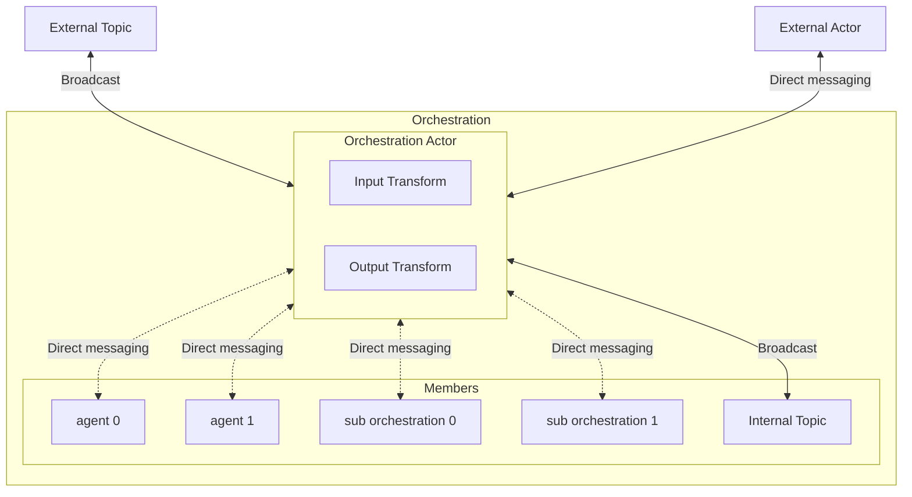
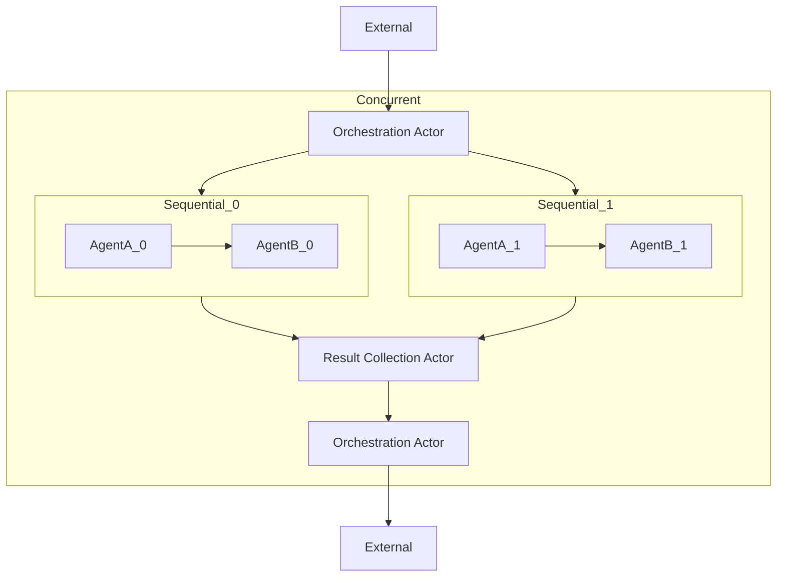
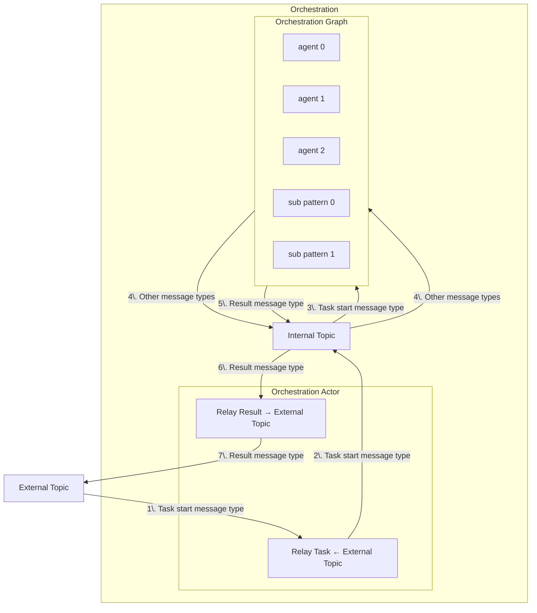
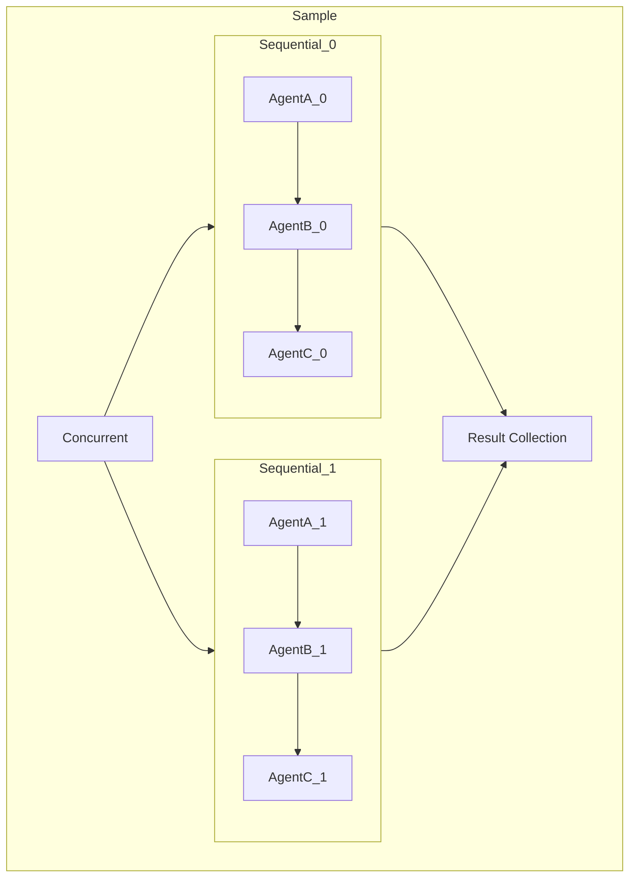

---
# These are optional elements. Feel free to remove any of them.
status: { proposed }
contact: { }
date: { 2025-04-11 }
deciders: { }
consulted: { }
informed: { }
---

# Multi-agent Orchestration

> Items marked with an asterisk (*) are not yet fully fleshed out and need further research.

## Context

The industry is moving up the stack to build more complex systems using LLMs. From interacting with foundation models to building RAG systems, and now creating AI agents to perform more complex tasks, the desire for a multi-agent framework is growing.

With the recent GA of the Semantic Kernel Agent Framework, we are now able to build on top of it to create a multi-agent orchestration framework. This will allow our customers to unlock even more complex scenarios and use cases.

In addition, with the collaboration with the AutoGen team and the shared runtime abstractions, we can leverage the work done in AutoGen to build a multi-agent orchestration framework more rapidly.

## Problem Statement

The current state of the Semantic Kernel Agent Framework is limited to single agents. We need to build a multi-agent orchestration framework to allow our customers to build more complex systems using multiple agents.

### AutoGen shared runtime abstractions

The AutoGen team has built a runtime that supports pub-sub communication between actors in a system. We have had the opportunity to leverage this work, which led to a shared runtime abstraction that our framework will depend on.
With the shared runtime abstraction, our framework will support local and distributed use cases.

## Considerations

### Out-of-the-box orchestrations

| **Orchestrations**       | **Description**                                                                                                                                                                                                                     |
|--------------------|---------------------------------------------------------------------------------------------------------------------------------------------------------------------------------------------|
| **Concurrent**     | - Consists of multiple actors that run in parallel.   - Tasks are broadcasted to all actors.   - The results are collected and returned to the caller when all actors finish.   - The order of the results is not guaranteed. |
| **Sequential**     | - Consists of multiple actors that run in sequence.   - The output of the previous actor is the input of the next actor.   - The result is collected and returned to the caller when the last actor finishes.                  |
| **Handoff**        | - Consists of multiple actors.   - The actors can decide the next actor to send the task to.   - The full context (conversation) of the previous actor is passed to the next actor.   - Human-in-the-loop may be supported.   - The result is collected and returned to the caller when the orchestration finishes. |
| **GroupChat**      | - Consists of multiple actors.   - A group manager actor is responsible for managing the state of the group chat.   - **Key Features:**   &nbsp;&nbsp;&nbsp;&nbsp;- User input: Requests input from the user.   &nbsp;&nbsp;&nbsp;&nbsp;- Termination: Ends when a termination condition is met, and results are returned.   &nbsp;&nbsp;&nbsp;&nbsp;- Next actor: Decides the next actor to invoke.   - Human-in-the-loop must be supported.   - The result is collected and returned to the caller when the orchestration finishes. |
| **Magentic One**   | - Group chat-like orchestration with unique features.   - Inspired by [Magentic One](https://www.microsoft.com/en-us/research/articles/magentic-one-a-generalist-multi-agent-system-for-solving-complex-tasks/).                  |

### Support the ability to create custom multi-agent orchestrations

Our framework should support customers to create more advanced orchestrations for their specific use cases using the same building blocks we use to build the out-of-the-box orchestrations.

#### Building blocks

| **Component**         | **Details**                                                                                                                                                                                                                     |
|------------------------|-----------------------------------------------------------------------------------------------------------------------------------------------------------------------------------------|
| **Agent actor**       | - Semantic Kernel agent   - Agent thread   - Support for streaming?                                                                                                                                                       |
| **Orchestration actor** | - Broadcast messages to an external topic (e.g., the result of the orchestration)   - Send directly to an actor external to the orchestration (e.g., the result of the orchestration)   - Receive messages from an external topic (e.g., the start of the orchestration)   - Receive messages from an actor external to the orchestration (e.g., the start of the orchestration) |
| **Orchestration**     | - Consists of one orchestration actor and multiple agent actors and other orchestrations.   - Support for streaming?                                                                                                         |
| **Data transform logic** | - Provide hooks to transform the input and output of the orchestration to custom types and for nesting orchestrations.                                                                                                     |

An orchestration can have multiple agent actors and child orchestrations, but only one orchestration actor.

#### Runtime

- Orchestration should only depend upon the runtime abstraction
- The runtime is provided when the orchestration is invoked, not when the orchestration is created.
- The runtime lifecycle is managed by the application (external to the orchestration).
- Multiple orchestrations can share the same runtime instance (orchestration boundaries).

### Graph-like structure with lazy evaluation

- An orchestration is simply a definition of a directed graph of actors and orchestrations.
- Actors and child orchestrations are registered in the runtime before execution starts.
- The runtime is responsible for executing the graph and managing the lifecycle of the actors and orchestrations.

Example:

> The two orchestration actors in the diagram are the same actor. The two external actors are the same actor. Separating them is just for a cleaner diagram.

The above is a simple example that shows what a multi-agent orchestration looks like. This orchestration contains two sequential orchestrations that run in parallel.
The actors are registered with the runtime whose lifetime is managed by the runtime, not the application.

### Orchestration invocation paradigms

- Direct invocation: the orchestration is invoked directly by the user.
- Indirect invocation: the orchestration actor receives a message from another actor within a parent orchestration.
- State management
  - Orchestrations are stateless.
  - Use memory in Semantic Kernel agents to store extracted user context for future invocations.

## Brainstorming

- Support ability to allow devs to create custom multi-agent orchestrations
  - Well-defined building blocks for custom orchestrations
    - Abstractions
      - Actor
        - Agent actor (there can be multiple in an orchestration)
          - agent
          - agent thread
          - chat history
        - Orchestration actor (there can be only one in an orchestration)
          - Broadcast messages to an external topic (e.g. the result of the orchestration)
          - Send directly to an actor external to the orchestration (e.g. the result of the orchestration)
          - Receive messages from an external topic (e.g. the start of the orchestration)
          - Receive messages from an actor external to the orchestration (e.g. the start of the orchestration)
      - Orchestration
        - streaming
        - internal topic: for isolating actors from the other orchestration invocations
      - Data transitions logic
        - Provide hooks to transform the input and output of the orchestration.
        - Each orchestration has its own input and output. When the orchestration are nested, the input of the
          orchestration could be different from the output of another actor in the orchestration. Same for the
          output of the orchestration, the output of the orchestration could be different from the input of
          another actor in the orchestration.

- Use those building blocks to build out-of-the-box orchestrations
  - Built-in patterns
    - Concurrent
      - Consist of multiple actors that run in parallel.
      - Tasks are broadcasted to all actors.
      - The results are collected and returned to the caller when all actors finish.
      - The order of the results is not guaranteed.
    - Sequential
      - Consist of multiple actors that run in sequence.
      - The output of the previous actor is the input of the next actor.
      - The result is collected and returned to the caller when the last actor finishes.
    - Handoff
      - Consist of multiple actors.
      - An actor decides the next actor to send the task to.
      - The full context (conversation) of the previous actor is passed to the next actor.
      - Human-in-the-loop may be supported.
      - The result is collected and returned to the caller when the orchestration finishes.
    - GroupChat
      - Magentic

- Support multiple invocation paradigms
  - One pattern can be invoked multiple times*?
    - Stateless patterns: each invocation is independent
    - Stateful patterns: future invocations have context from previous invocations
    - Both?
  - Patterns are graph-like structures with "lazy eval"

- Completion of patterns
  - Result collection: how to extract the result of a pattern?
  - Non-blocking: return immediately and broadcast result when the pattern finishes
  - Blocking: wait for the pattern to finish and return the result

- Input to patterns
  - a list of tasks (string?) with a context object that contains additional attributes

- Support arbitrary user-defined output types
  - User can define what object a pattern will output at the end
  - Nested pattern: output of a pattern is the input of another

- Support nested patterns
  - Pattern abstraction: same invocation signature
  - Patterns to take SK agents and patterns as child nodes

- Patterns should only depend upon the runtime abstraction
  - The runtime must be provided when the pattern is invoked.
  - The runtime lifecycle is managed by the application (external to the pattern).
  - Should a runtime instance be shared between patterns that are supposed to be independent?

- Distribution*
  - Can nested patterns be distributed?
  - Can agents factories be distributed?
  - If registration occurs per invocation, how to register remote orchestrations/agents?
    - Instance-scoped
    - Invocation-scoped

- Runtime registration
  - Agents
    - Register the agents and patterns in the runtime before the execution starts, as oppose to when the pattern is created.
  - Topics
    - Add subscriptions to the runtime before the execution starts.
  - Make sure no collisions
  - Remove registrations and subscriptions from the runtime after the execution finishes to avoid name collisions.

- Human in the loop
  - Keep the user in the loop and allow them to intervene in the orchestration process
  - How would this work for a RestAPI/distributed system?
  - How would this work for a pattern that is nested inside another pattern?
    - Does the signal need to bubble up to the root pattern?
    - Other possibilities?

- Save states of the agents in a pattern and rehydration
  - Being able to save the state of the orchestration process while waiting for user input and restore it later when user provides input for scalability
  - Recursively save the state of all agents and child patterns, including threads, chat history, and context from the root pattern

- Support declarative patterns*
  - The orchestration graph

- Guardrails*
  - In the orchestration level?
  - In the agent level?

## Building blocks

### Diagram

