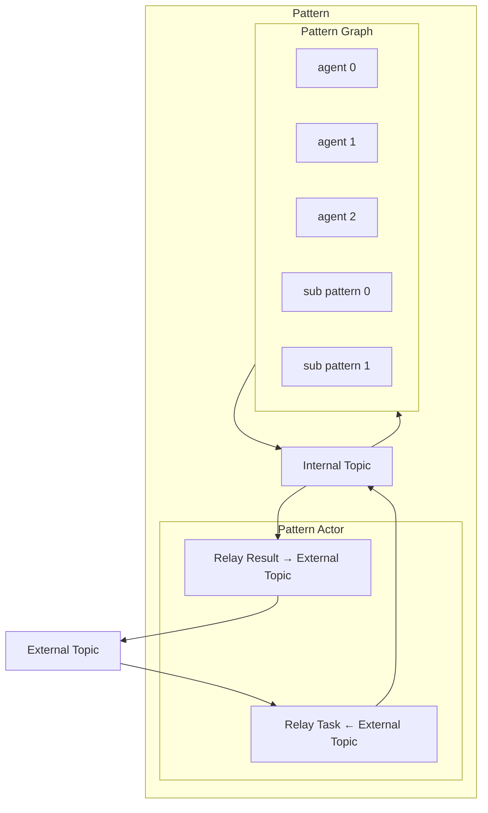

# Multi-agent Orchestration

> Items marked with an asterisk (*) are not yet fully fleshed out and need further research.

## Brainstorming

- Support ability to allow devs to create custom patterns for orchestrating multiple SK agents
  - Well-defined building blocks for custom patterns
    - Abstractions
      - Wrapper
        - Naming: container?, actor?
        - agent
        - agent thread
        - chat history
        - internal topic type: for isolating the agent from the other patterns
          - is the scope per pattern or per invocation?
        - streaming
      - Orchestration
        - Internal orchestration agent
          - Capture results from the agents
          - Relay messages

- Use those building blocks to build out-of-the-box patterns
  - Built-in patterns
    - Concurrent (Broadcast)
    - Sequential (Handoff\*)
    - GroupChat
      - Magentic
      - Swarm
    - ReAct (GroupChat?)

- Support multiple invocation paradigms
  - One pattern can be invoked multiple times*?
    - Stateless patterns: each invocation is independent
    - Stateful patterns: future invocations have context from previous invocations
    - Both?
  - Patterns are graph-like structures with "lazy eval"

- Completion of patterns
  - Result collection: how to extract the result of a pattern?
  - Non-blocking: return immediately and broadcast result when the pattern finishes
  - Blocking: wait for the pattern to finish and return the result

- Input to patterns
  - a list of tasks (string?) with a context object that contains additional attributes

- Support arbitrary user-defined output types
  - User can define what object a pattern will output at the end
  - Nested pattern: output of a pattern is the input of another

- Support nested patterns
  - Pattern abstraction: same invocation signature
  - Patterns to take SK agents and patterns as child nodes

- Patterns should only depend upon the runtime abstraction
  - The runtime must be provided when the pattern is invoked.
  - The runtime lifecycle is managed by the application (external to the pattern).
  - Should a runtime instance be shared between patterns that are supposed to be independent?

- Distribution*
  - Can nested patterns be distributed?
  - Can agents factories be distributed?
  - If registration occurs per invocation, how to register remote orchestrations/agents?
    - Instance-scoped
    - Invocation-scoped

- Runtime registration
  - Agents
    - Register the agents and patterns in the runtime before the execution starts, as oppose to when the pattern is created.
  - Topics
    - Add subscriptions to the runtime before the execution starts.
  - Make sure no collisions
  - Remove registrations and subscriptions from the runtime after the execution finishes to avoid name collisions.

- Human in the loop
  - Keep the user in the loop and allow them to intervene in the orchestration process
  - How would this work for a RestAPI/distributed system?
  - How would this work for a pattern that is nested inside another pattern?
    - Does the signal need to bubble up to the root pattern?
    - Other possibilities?

- Save states of the agents in a pattern and rehydration
  - Being able to save the state of the orchestration process while waiting for user input and restore it later when user provides input for scalability
  - Recursively save the state of all agents and child patterns, including threads, chat history, and context from the root pattern

- Support declarative patterns*
  - The orchestration graph

- Guardrails*
  - In the orchestration level?
  - In the agent level?

## Building blocks

### Diagram

