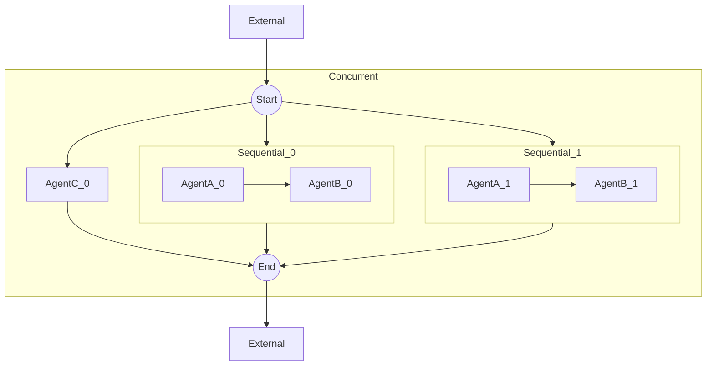
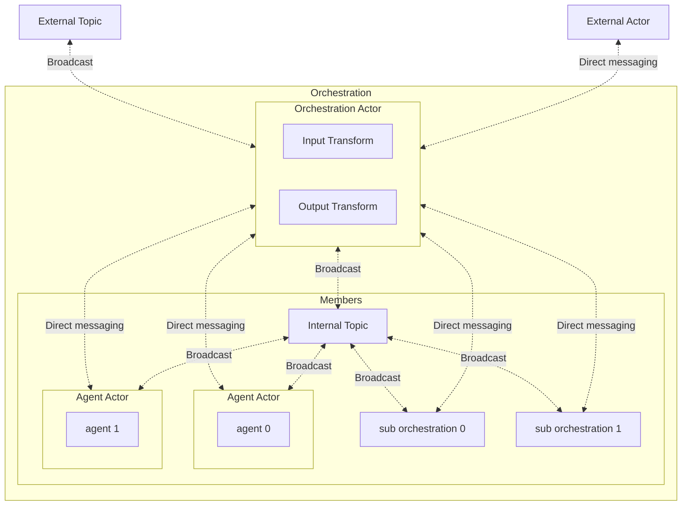
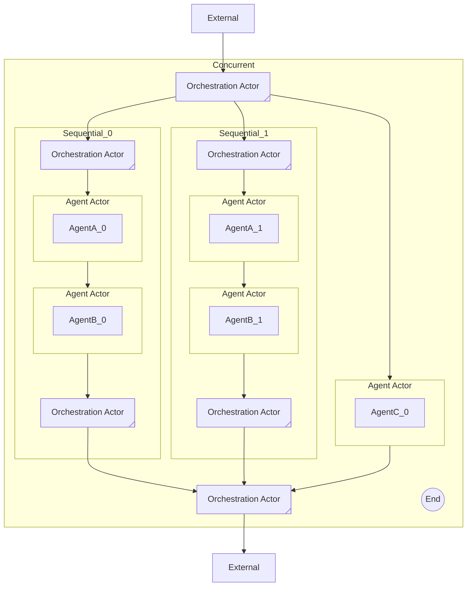

---
# These are optional elements. Feel free to remove any of them.
status: { proposed }
contact: { }
date: { 2025-04-11 }
deciders: { }
consulted: { }
informed: { }
---

# Multi-agent Orchestration

## Context

The industry is moving up the stack to build more complex systems using LLMs. From interacting with foundation models to building RAG systems, and now creating single AI agents to perform more complex tasks, the desire for a multi-agent system is growing.

With the recent GA of the Semantic Kernel Agent Framework, which offers a stable agent abstraction and support for multiple agent services, we are now able to build on top of it to create multi-agent systems. This will allow our customers to unlock even more complex scenarios.

In addition, the recent collaboration with the AutoGen team that resulted in the shared agent runtime abstraction allowed us to leverage their work as the foundation on which we can build our framework.

## Problem Statement

The current state of the Semantic Kernel Agent Framework is limited to single agents. We need to extend it to support multi-agent orchestration, which will allow our customers to unlock more possibilities using Semantic Kernel agents.

## Background Knowledge

### Terminology

Before we dive into the details, let's clarify some terminologies that will be used throughout this document.

| **Term**   | **Definition**                                                                                     |
|------------|-----------------------------------------------------------------------------------------------------|
| **Actor**  | An AutoGen agent that can send and receive messages from the runtime.                               |
| **Runtime**| Facilitates the communication between actors and manages the states and lifecycle of the actors.    |
| **Agent**  | A Semantic Kernel agent.                                                                            |
| **Orchestration** | Contains actors and rules on how they will interact with each others.                        |

> We are using the term "actor" for AutoGen to avoid confusion with the term "agent" used in the Semantic Kernel Agent Framework. The name "actor" is also used interchangeably with "agent" in the AutoGen documentation. To learn more about "actor"s in software design, please refer to: https://en.wikipedia.org/wiki/Actor_model.

> You may hear the term "pattern" in other contexts. "Pattern" is almost semantically identical to "orchestration" where the latter implies the management and execution of patterns. You can also think of "patterns" as types of "orchestrations". For example, "concurrent orchestration" is a type of orchestration that follows the concurrent pattern.

### The AutoGen shared runtime abstraction

> The runtime abstraction serves as the foundational layer for the system. A basic understanding of how orchestrations interact with the runtime is recommended. For more details, refer to the [AutoGen Core User Guide](https://microsoft.github.io/autogen/stable/user-guide/core-user-guide/index.html).

The AutoGen team has built a agent runtime abstraction that supports pub-sub communication between actors in a system. We have had the opportunity to leverage this work, which led to a shared agent runtime abstraction which Semantic Kernel will depend on.

Depending on the actual runtime implementation, actors can be local or distributed. Our agent framework is **not** tied to a specific runtime implementation, aka runtime agnostic.

### Messages

Actors communicate via messages. The runtime is responsible for routing messages to the correct actor(s). In essence, messages define the internal contract of an orchestration. For example, actors in the concurrent orchestration will communicate by `ConcurrentRequestMessage`, `ConcurrentResponseMessage`, and `ConcurrentResultMessage` types, while actors in the sequential orchestration will use the `SequentialRequestMessage` and `SequentialResultMessage` types.

It will a best practice for orchestration developers will need to define the messages for their orchestrations, uniquely identifiable via namespaces or class names, to avoid unexpected collisions, even when the message data structures are the same.

### Targeted audience

The extension of the current Semantic Kernel Agent framework is targeted at two types of developers:

- **Orchestration developers**: Developers who will create orchestrations using the framework.
- **Orchestration consumers**: Developers who will use the orchestrations created by orchestration developers.

It is possible that the same developer will be both an orchestration developer and an orchestration consumer.

## Considerations

### Pre-built orchestrations and custom orchestrations

To help people get started quickly, we should provide a list of pre-built orchestrations that cover common patterns.

| **Orchestrations**       | **Description**                                                                                                                                                                                                                     |
|--------------------|---------------------------------------------------------------------------------------------------------------------------------------------------------------------------------------------|
| **Concurrent**     | - Consists of multiple actors that run in parallel. <br> - Tasks are broadcasted to all actors. <br> - The results are collected and returned to the caller when all actors finish. <br> - The order of the results is not guaranteed. |
| **Sequential**     | - Consists of multiple actors that run in sequence. <br> - The output of the previous actor is the input of the next actor. <br> - The result is collected and returned to the caller when the last actor finishes.                  |
| **Handoff**        | - Consists of multiple actors. <br> - The actors can decide the next actor to send the task to. <br> - The full context (conversation) of the previous actor is passed to the next actor. <br> - Human-in-the-loop may be supported. <br> - The result is collected and returned to the caller when the orchestration finishes. |
| **GroupChat**      | - Consists of multiple actors. <br> - A group manager actor is responsible for managing the state of the group chat. <br> - **Key Features:** <br> &nbsp;&nbsp;&nbsp;&nbsp;- User input: Requests input from the user. <br> &nbsp;&nbsp;&nbsp;&nbsp;- Termination: Ends when a termination condition is met, and results are returned. <br> &nbsp;&nbsp;&nbsp;&nbsp;- Next actor: Decides the next actor to invoke. <br> - Human-in-the-loop must be supported. <br> - The result is collected and returned to the caller when the orchestration finishes. |
| **Magentic One**   | - Group chat-like orchestration with unique features. <br> - Inspired by [Magentic One](https://www.microsoft.com/en-us/research/articles/magentic-one-a-generalist-multi-agent-system-for-solving-complex-tasks/).                  |

> Please see Appendix A for a more detailed descriptions of the pre-built orchestrations.

Using an orchestration should be as simple as the following:

```python
agent_1 = ChatCompletionAgent(...)
agent_2 = ChatCompletionAgent(...)

group_chat = GroupChatOrchestration(members=[agent_1, agent_2])

runtime = SingleThreadedAgentRuntime()
runtime.start()

task = await group_chat.invoke(task="Hello world", runtime=runtime)
result = await task.result

await runtime.stop_when_idle()
```

> This document uses Python as the primary language for examples. However, the concepts are not language-specific and can be applied to other languages as well.

We should also provide a set of building blocks for customers to create more advanced orchestrations for their specific needs. These building blocks will be the same building blocks we use to build the pre-built orchestrations.

### Application responsibilities

- The lifecycle of an runtime instance should be managed by the application and should be external to any orchestrations.
- Orchestrations require a runtime instance only when they are invoked, not when they are created.

### Graph-like structure with lazy evaluation

We should consider an orchestration as a template that describes how the agents will interact with each other similar to a directed graph. The actual execution of the orchestration should be done by the runtime. Therefore, the followings must be true:

- Actors are registered to the runtime before execution starts, not when the orchestration is created.
- The runtime is responsible for creating the actors and managing their lifecycle.

### Independent & Isolated invocations

An orchestration can be invoked multiple times and each invocation should be independent and isolated from each other. Invocations can also share the same runtime instance. This will require us to define clear invocation boundaries to avoid collisions, such as actor names or IDs.

For example, in the following code snippet, the `task_1` and `task_2` are independent and don't share any context:

```python
agent_1 = ChatCompletionAgent(...)
agent_2 = ChatCompletionAgent(...)

group_chat = GroupChatOrchestration(members=[agent_1, agent_2])

runtime = SingleThreadedAgentRuntime()
runtime.start()

task_1 = await group_chat.invoke(task=TASK_1, runtime=runtime)
task_2 = await group_chat.invoke(task=TASK_2, runtime=runtime)

await runtime.stop_when_idle()
```

### Support nested orchestrations

Support for nesting orchestrations is a critical feature, as it allows for more complex orchestrations to be built using simpler orchestrations.

Example:



> The two external nodes represent the same object external to the concurrent orchestration. Separating them is just for a cleaner diagram.

The above shows a simple nested orchestration that has two sequential orchestrations and an agent in the concurrent orchestration. By providing a way to nest orchestrations, our customers can create larger, more complex orchestrations using existing ones that fit their needs.

### Support structured input and output types

It will be useful for orchestrations to accept structured inputs and return structured outputs. Chat messages may not be sufficient to represent complex inputs and outputs, and structured data is generally easier to work with from a code perspective. This will become more obvious as orchestrations become more complex. In addition, nested orchestrations will benefit from structured inputs and outputs, because the data flow between orchestrations will be easier to manage.

> Types must be serializable.

### State management

Orchestrations can be long-running, hours, days, and even years. And they can be short-lived, minutes or seconds or less. The states of an orchestration can mean the following:

- An actively running orchestration that is in a state that waits for user input or other events to continue.
- An orchestration that enters an error state.
- etc.

There are also other types of states to consider, such as the agents' conversational context. There is an active discussion on agent **threads** and **memories**, and we should consider how these concepts fit into the framework. Ideally, we want the ability to invoke/restart an orchestration on some existing agent context.

## Proposals

> Code snippets shown are not complete but they provide enough context to understand the proposal.

### Building blocks

| **Component**         | **Details**                                                                                                                                                                                                                     |
|------------------------|-----------------------------------------------------------------------------------------------------------------------------------------------------------------------------------------|
| **Agent actor**       | - Semantic Kernel agent <br> - Agent context                                                                                        |
| **Data transform logic** | - Provide hooks to transform the input and output of the orchestration to **custom types** and for nesting orchestrations.                                                                                                     |
| **Orchestration actor** | - Broadcast messages to an external topic (e.g., the result of the orchestration) <br> - Send directly to an actor external to the orchestration (e.g., the result of the orchestration) <br> - Receive messages from an external topic (e.g., the start of the orchestration) <br> - Receive messages from an actor external to the orchestration (e.g., the start of the orchestration) |
| **Orchestration**     | - Consists of one orchestration actor and multiple agent actors and other orchestrations.|



To support structured input&output types and nesting, this proposal heavily relies on generics, which provides enough flexibility to build complex orchestrations while keeping the system relatively simple. We will also offer a set of defaults and overloads to make it easy for users who don't need the full flexibility.

#### Agent Actor

This is a wrapper around a Semantic Kernel agent so that it can send and receive messages from the runtime. We will have a base class that wraps a Semantic Kernel agent and inherits from [`RoutedAgent`](https://microsoft.github.io/autogen/stable/reference/python/autogen_core.html#autogen_core.RoutedAgent):

```python
class AgentActorBase(RoutedAgent):
    """A agent actor for multi-agent orchestration running on Agent runtime."""

    def __init__(self, agent: Agent) -> None:
        """Initialize the agent container.

        Args:
            agent (Agent): An agent to be run in the container.
        """
        self._agent = agent
        self._agent_thread = None
        RoutedAgent.__init__(self, description=agent.description or "Semantic Kernel Agent")
```

Orchestrations will have their own implementations of the agent actor because each orchestration can have its own message types (explained in [Messages](#messages)).

For example, for the group chat orchestration, the agent actor will look like this:

```python
class GroupChatAgentActor(AgentActorBase):
    """An agent actor for agents that process messages in a group chat."""

    @message_handler
    async def _on_group_chat_reset(self, message: GroupChatResetMessage, ctx: MessageContext) -> None:
        ...

    @message_handler
    async def _on_group_chat_message(self, message: GroupChatResponseMessage, ctx: MessageContext) -> None:
        ...

    @message_handler
    async def _on_request_to_speak(self, message: GroupChatRequestMessage, ctx: MessageContext) -> None:
        ...
```

Agent actors in another orchestration will handle different message types or different number of message types. This proposal doesn't make any restrictions on how agent actors interact with each other inside an orchestration.

#### Data Transform Logic

The signature of the data transform logic will be as follows:

```python
input_transform: Callable[[TExternalIn], Awaitable[TInternalIn] | TInternalIn]
output_transform: Callable[[TInternalOut], Awaitable[TExternalOut] | TExternalOut]
```

`TExternalIn` denotes the type of input the orchestration will receive. `TInternalIn` denotes the type of input the orchestration expects. `TInternalOut` denotes the type of output the orchestration will produce. `TExternalOut` denotes the type of output the orchestration will return to the caller. `TExternalIn` and `TInternalIn` can be the same type, but they are not required to be. The same applies to `TExternalOut` and `TInternalOut`.

Derived classes will set `TInternalIn` and `TInternalOut` while orchestration consumers will set `TExternalIn` and `TExternalOut`.

> We can offer a set of default transforms to improve the developer quality of life. We can also have LLMs that automatically perform the transforms given the types.

#### Orchestration Actor

This is the actor that will be responsible for relaying messages. The data transforms happen in this actor so it must hold the input and output transforms:

```python
class OrchestrationActorBase(
    BaseAgent,
    Generic[TExternalIn, TInternalIn, TInternalOut, TExternalOut],
):
    ...

    @override
    async def on_message_impl(self, message: Any, ctx: MessageContext) -> None:
        if isinstance(message, self._external_input_message_type):
            if inspect.isawaitable(self._input_transform):
                transition_message = await self._input_transform(message)
            else:
                transition_message = self._input_transform(message)
            await self._handle_orchestration_input_message(transition_message, ctx)
        elif isinstance(message, self._internal_output_message_type):
            await self._handle_orchestration_output_message(message, ctx)

    @abstractmethod
    async def _handle_orchestration_input_message(
        self,
        message: TExternalIn,
        ctx: MessageContext,
    ) -> None:
        """Handle the orchestration input message."""
        pass

    @abstractmethod
    async def _handle_orchestration_output_message(
        self,
        message: TInternalOut,
        ctx: MessageContext,
    ) -> None:
        """Handle the orchestration output message."""
        pass
```

> `BaseAgent` is an AutoGen abstraction that provides the basic functionality for sending and receiving messages. Derived classes must implement the `on_message_impl` method to handle incoming messages.

#### Orchestration

An orchestration is simply a collection of Semantic Kernel agents and child orchestrations. Concrete implementations have to provide logic for how to start and prepare the orchestration. "Preparing" an orchestration simply means registering the actors with the runtime and setting up the communication channels between them based on the orchestration type.

```python
class OrchestrationBase(
    ABC,
    Generic[TExternalIn, TInternalIn, TInternalOut, TExternalOut],
):
    def __init__(
        self,
        members: list[Union[Agent, "OrchestrationBase"]],
    ) -> None:
        """Initialize the orchestration base."""
        self._members = members

    async def invoke(self, runtime: AgentRuntime, ...) -> OrchestrationResult:
        """Invoke the orchestration and return an result immediately which can be awaited later.

        The runtime is supplied by the application at invocation time, not at creation time.
        Orchestrations are runtime-agnostic and can be used with any runtime that implements the runtime abstraction.
        """
        ...

    async def prepare(self, runtime: AgentRuntime, ...) -> str:
        """Register actors and return the orchestration actor id.

        Use when the orchestration is nested inside another orchestration. The parent orchestration will call this method to prepare the internal actors with the runtime and add necessary subscriptions according to the orchestration.
        """
        ...

    @abstractmethod
    async def _start(self, runtime: AgentRuntime, ...) -> None:
        """Start the orchestration."""
        ...

    @abstractmethod
    async def _prepare(self, runtime: AgentRuntime, internal_topic_type: str, ...) -> str:
        """Register actors and return the orchestration actor id.

        The internal topic type is an unique identifier that is used to isolate the invocations of the orchestrations.
        All agent actors internal to the orchestration will be bound to this topic.
        """
        ...
```

Concrete implementations will set `TInternalIn` and `TInternalOut`. For example,

```python
class SequentialOrchestration(OrchestrationBase[TExternalIn, SequentialRequestMessage, SequentialResultMessage, TExternalOut]):
    ...
```

When using the orchestration, the user will only need to set `TExternalIn` and `TExternalOut`:

```python
sequential_orchestration = SequentialOrchestration[ConcurrentRequestMessage, ConcurrentResponseMessage](
    members=[agent_0, agent_1],
    input_transition=input_transition_func,
    output_transition=output_transition_func,
)
```

And depending on the language, we can offer defaults so that only advanced users will need to set `TExternalIn` and `TExternalOut`. For example, in Python, we can do the following:

```python
TExternalIn = TypeVar("TExternalIn", default=SequentialRequestMessage)
TExternalOut = TypeVar("TExternalOut", default=SequentialResultMessage)
```

And in .Net, we can do the following:

```csharp
public class SequentialOrchestration<TExternalIn, TExternalOut>
    : AgentOrchestration<TExternalIn, SequentialRequestMessage, SequentialResultMessage, TExternalOut>
{
    ...
}

public sealed class SequentialOrchestration : SequentialOrchestration<SequentialRequestMessage, SequentialResultMessage>
{
    ...
}
```

### Nesting orchestrations

As mentioned above, the internal communication between actors within an orchestration depends on the specific orchestration type. This means the `TInternalIn` and `TInternalOut` can vary for each orchestration. However, input and output transforms provide a seamless way to "bridge" different orchestrations, enabling them to work together.

For example, in the nested orchestration shown in [Support nested orchestrations](#support-nested-orchestrations), two sequential orchestrations are embedded within the concurrent orchestration. To enable this, the sequential orchestrations must accept the same input type as the concurrent orchestration actor and produce the same output type. This is achieved by defining the sequential orchestration as follows:

```python
sequential_orchestration = SequentialOrchestration[ConcurrentRequestMessage, ConcurrentResponseMessage](
  ...,
  input_transform=...,
  output_transform=...,
)
```

Here’s how it works:

1. The orchestration actor in the sequential orchestration listens for messages of type `ConcurrentRequestMessage`.
2. It uses the `input_transform` to convert these messages into `SequentialRequestMessage` for internal processing.
3. Once the sequential orchestration completes, the orchestration actor receives a `SequentialResultMessage`.
4. It then applies the `output_transform` to convert the result into a `ConcurrentResponseMessage` and outputs it.

This approach ensures that different orchestrations can interoperate smoothly, even when their internal message types differ.

In nested orchestrations, the orchestration actor also acts as a message broker between its orchestrations and the parent orchestration, because orchestrations have invocation boundaries, as explained in [Independent & Isolated invocations](#independent--isolated-invocations), requiring internal actors to be isolated from external actors. A more detailed diagram of the one shown in [Support nested orchestrations](#support-nested-orchestrations) is shown below:



#### Open Discussions

The following items are important topics we need to consider and need further discussion. However, they shouldn't block the initial implementation of the multi-agent orchestration framework.

### Agent context

We mentioned in the [State management](#state-management) section that orchestrations do not manage the state of the agents, while we do want to support the ability to invoke/restart an orchestration on some existing agent context. This means that we need to have a way to provide the state of the agents to the orchestrations.

An option is to have a context provider that provides agent contexts given an agent ID. The context provider will be attached to the agent actors for the agent actor to retrieve and update contexts. Each new invocation of an orchestration will return a text representation (see [Support declarative orchestrations](#support-declarative-orchestrations)) of the orchestration, which can be used to rehydrate the orchestration.

### Human in the loop

Human-in-the-loop is a critical in any autonomous system. We need to consider how to support human-in-the-loop in the multi-agent orchestration framework.

- Support cancellation of an invocation
- Notify the user of important events
- Support distributed use cases. For example, the client may live on a different system than the orchestration.
- Support nested orchestrations. For example, a nested orchestration may request human input.

### Distributed orchestrations

Although orchestrations are not tied to a specific runtime, we need to understand how actors and orchestrations will be distributed if a runtime allows distribution. The following questions need to be answered:

- Actor registrations happen locally on the same machine with the runtime via a factory. Does the factory need to be distributed?
- Can nested orchestrations be distributed?
- How will the runtime handle actor failures?

### Support declarative orchestrations

Declarative orchestrations provide a low-code solution for orchestration consumers. We are already working on declarative agents, and we can leverage this work to create declarative orchestrations.

### Guardrails

Safety is also a priority. A powerful orchestration may accomplish a lot of things, but it may also do a lot of harm. We need to consider how to implement guardrails in the multi-agent orchestration framework, similar to what OpenAI has in their [agent SDK](https://openai.github.io/openai-agents-python/guardrails/).

- Should we have guardrails in the orchestration level?
- Should we have guardrails in the actor level?
- Should we have guardrails in the agent level?

### Observability

SK being an enterprise solution, we should also consider observability.

## Appendix A: Pre-built orchestrations

### Concurrent Orchestration


### Sequential Orchestration


### Handoff Orchestration

WIP

### Group Chat Orchestration


The group chat orchestration works according to the following rules:

1. The group manager decides the next actor to speak based on the conversation context and by sending a direct "request to speak" message to the next actor.
2. The group manager decides when the orchestration ends by user-defined criteria and returns the result to the orchestration actor.
3. Actors are not allowed to speak to each other directly.
4. Actors are not allowed to speak unless requested by the group manager.
5. All actors and the group manager subscribe to the internal topic to receive "response" messages from other actors. Whenever the group manager receives a "response" message, it triggers the next iteration.
6. Each actors maintains a copy of the conversation context and they are not shared.

### Magentic One Orchestration

Magentic one is a group chat-like orchestration with a special group manager. Refer to the [Magentic One blog](https://www.microsoft.com/en-us/research/articles/magentic-one-a-generalist-multi-agent-system-for-solving-complex-tasks/) or [paper](https://www.microsoft.com/en-us/research/wp-content/uploads/2024/11/MagenticOne.pdf) for more details.
