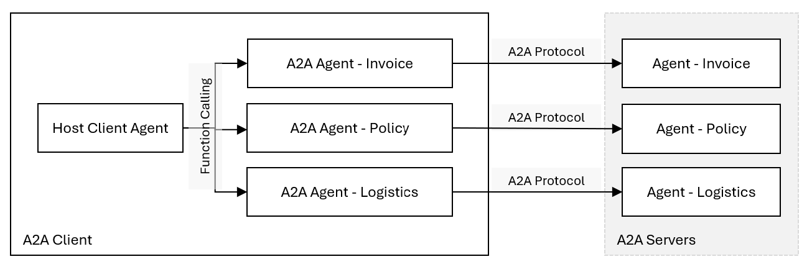
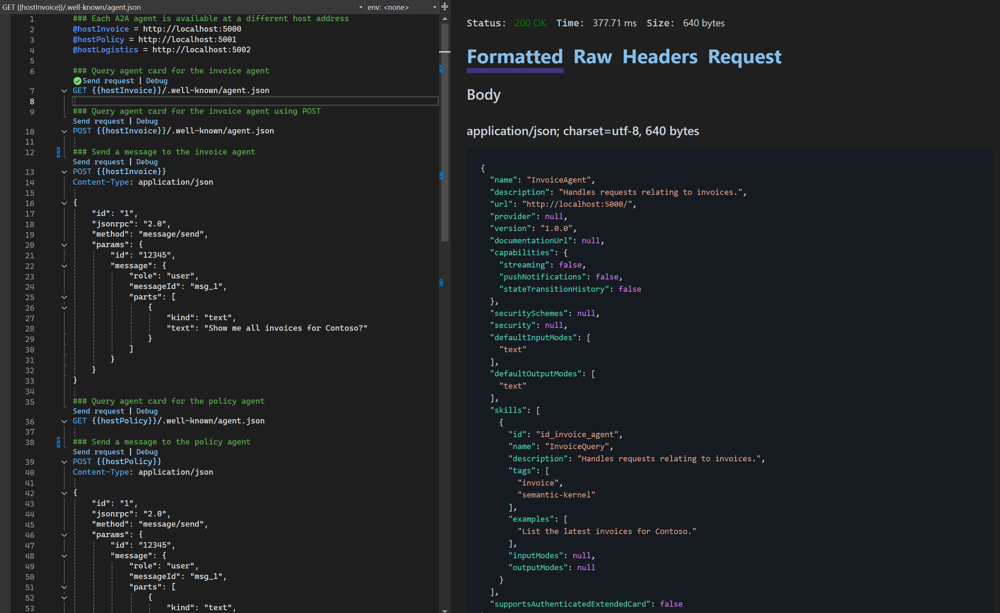
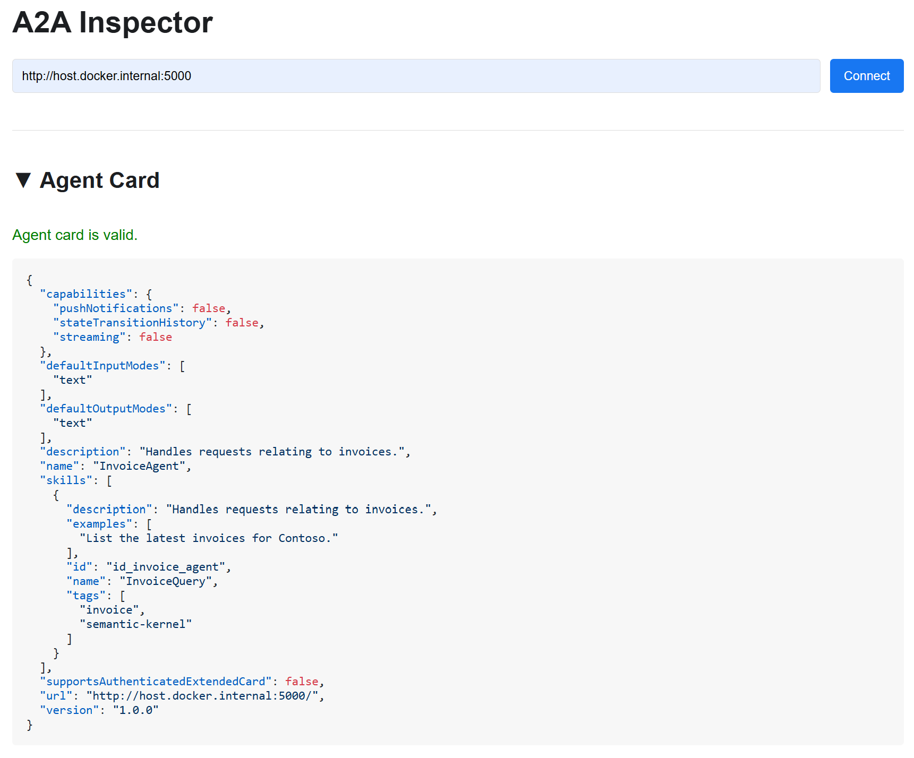
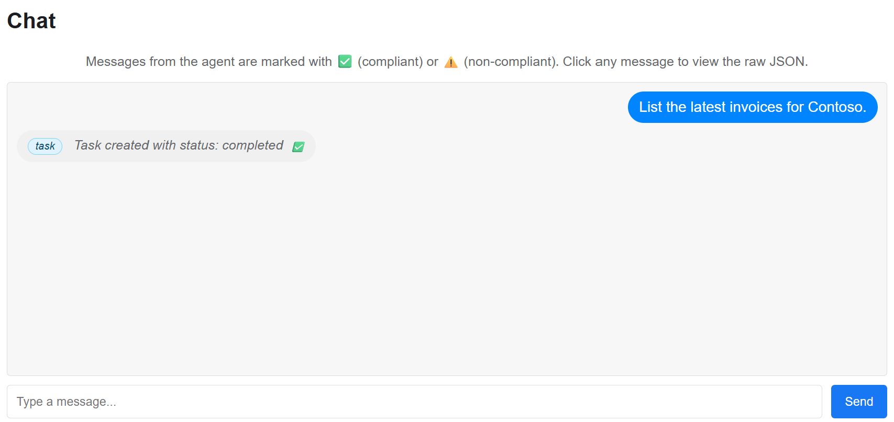
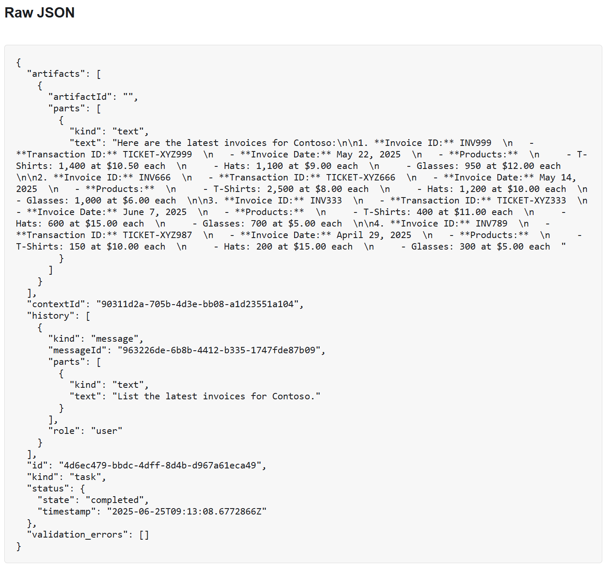

# A2A Client and Server samples

> **Warning**
> The [A2A protocol](https://google.github.io/A2A/) is still under development and changing fast.
> We will try to keep these samples updated as the protocol evolves.

These samples are built with [SharpA2A.Core](https://www.nuget.org/packages/SharpA2A.Core) and demonstrate:

1. Creating an A2A Server which makes an agent available via the A2A protocol.
2. Creating an A2A Client with a command line interface which invokes agents using the A2A protocol.

The demonstration has two components:

1. `A2AServer` - You will run three instances of the server to correspond to three A2A servers each providing a single Agent i.e., the Invoice, Policy and Logistics agents.
2. `A2AClient` - This represents a client application which will connect to the remote A2A servers using the A2A protocol so that it can use those agents when answering questions you will ask.



## Configuring Secrets or Environment Variables

The samples can be configured to use chat completion agents or Azure AI agents.

### Configuring for use with Chat Completion Agents

Provide your OpenAI API key via .Net secrets

```bash
dotnet user-secrets set "A2AClient:ApiKey" "..."
```

Optionally if you want to use chat completion agents in the server then set the OpenAI key for the server to use.

```bash
dotnet user-secrets set "A2AServer:ApiKey" "..."
```

Use the following commands to run each A2A server:

```bash
cd A2AServer
dotnet run --urls "http://localhost:5000;https://localhost:5010" --agentType "invoice"
```

```bash
cd A2AServer
dotnet run --urls "http://localhost:5001;https://localhost:5011" --agentType "policy"
```

```bash
cd A2AServer
dotnet run --urls "http://localhost:5002;https://localhost:5012" --agentType "logistics"
```

### Configuring for use with Azure AI Agents

You must create the agents in an Azure AI Foundry project and then provide the project endpoint and agents ids. The instructions for each agent are as follows:

- Invoice Agent
    ```
    You specialize in handling queries related to invoices.
    ```
- Policy Agent
    ```
    You specialize in handling queries related to policies and customer communications.

    Always reply with exactly this text:

    Policy: Short Shipment Dispute Handling Policy V2.1

    Summary: "For short shipments reported by customers, first verify internal shipment records
    (SAP) and physical logistics scan data (BigQuery). If discrepancy is confirmed and logistics data
    shows fewer items packed than invoiced, issue a credit for the missing items. Document the
    resolution in SAP CRM and notify the customer via email within 2 business days, referencing the
    original invoice and the credit memo number. Use the 'Formal Credit Notification' email
    template."
    ```
- Logistics Agent
    ```
    You specialize in handling queries related to logistics.

    Always reply with exactly:

        Shipment number: SHPMT-SAP-001
        Item: TSHIRT-RED-L
        Quantity: 900"
    ```

```bash
dotnet user-secrets set "A2AServer:Endpoint" "..."
```

Use the following commands to run each A2A server

```bash
cd A2AServer
dotnet run --urls "http://localhost:5000;https://localhost:5010" --agentId "<Invoice Agent Id>" --agentType "invoice"
```

```bash
cd A2AServer
dotnet run --urls "http://localhost:5001;https://localhost:5011" --agentId "<Policy Agent Id>" --agentType "policy"
```

```bash
cd A2AServer
dotnet run --urls "http://localhost:5002;https://localhost:5012" --agentId "<Logistics Agent Id>" --agentType "logistics"
```

### Testing the Agents using the Rest Client

This sample contains a (.http file)[https://learn.microsoft.com/aspnet/core/test/http-files?view=aspnetcore-9.0] which can be used to test the agent.

1. In Visual Studio open (./A2AServer/A2AServer.http)[./A2AServer/A2ASerever.http]
1. There are two sent requests for each agent, e.g., for the invoice agent:
    1. Query agent card for the invoice agent
        `GET {{hostInvoice}}/.well-known/agent.json`
    1. Send a message to the invoice agent
        ```
        POST {{hostInvoice}}
        Content-Type: application/json

        {
            "id": "1",
            "jsonrpc": "2.0",
            "method": "message/send",
            "params": {
                "id": "12345",
                "message": {
                    "role": "user",
                    "messageId": "msg_1",
                    "parts": [
                        {
                            "kind": "text",
                            "text": "Show me all invoices for Contoso?"
                        }
                    ]
                }
            }
        }
        ```

Sample output from the request to display the agent card:



Sample output from the request to send a message to the agent via A2A protocol:


### Testing the Agents using the A2A Inspector

The A2A Inspector is a web-based tool designed to help developers inspect, debug, and validate servers that implement the Google A2A (Agent-to-Agent) protocol. It provides a user-friendly interface to interact with an A2A agent, view communication, and ensure specification compliance.

For more information go (here)[https://github.com/a2aproject/a2a-inspector].

Running the (inspector with Docker)[https://github.com/a2aproject/a2a-inspector?tab=readme-ov-file#option-two-run-with-docker] is the easiest way to get started.

1. Navigate to the A2A Inspector in your browser: (http://127.0.0.1:8080/)[http://127.0.0.1:8080/]
1. Enter the URL of the Agent you are running e.g., (http://host.docker.internal:5000)[http://host.docker.internal:5000]
1. Connect to the agent and the agent card will be displayed and validated.
1. Type a message and send it to the agent using A2A protocol.
    1. The response will be validated automatically and then displayed in the UI.
    1. You can select the response to view the raw json.

Agent card after connecting to an agent using the A2A protocol:



Sample response after sending a message to the agent via A2A protocol:



Raw JSON response from an A2A agent:



### Configuring Agents for the A2A Client

The A2A client will connect to remote agents using the A2A protocol.

By default the client will connect to the invoice, policy and logistics agents provided by the sample A2A Server.

These are available at the following URL's:

- Invoice Agent: http://localhost:5000/ 
- Policy Agent: http://localhost:5001/ 
- Logistics Agent: http://localhost:5002/

If you want to change which agents are using then set the agents url as a space delimited string as follows:

```bash
dotnet user-secrets set "A2AClient:AgentUrls" "http://localhost:5000/;http://localhost:5001/;http://localhost:5002/"
```

## Run the Sample

To run the sample, follow these steps:

1. Run the A2A server's using the commands shown earlier
2. Run the A2A client:
    ```bash
    cd A2AClient
    dotnet run
    ```  
3. Enter your request e.g. "Customer is disputing transaction TICKET-XYZ987 as they claim the received fewer t-shirts than ordered."
4. The host client agent will call the remote agents, these calls will be displayed as console output. The final answer will use information from the remote agents. The sample below includes all three agents but in your case you may only see the policy and invoice agent.

Sample output from the A2A client:

```
A2AClient> dotnet run
info: A2AClient[0]
      Initializing Semantic Kernel agent with model: gpt-4o-mini

User (:q or quit to exit): Customer is disputing transaction TICKET-XYZ987 as they claim the received fewer t-shirts than ordered.

Calling Agent InvoiceAgent with arguments:
      query: TICKET-XYZ987
      instructions: Investigate the transaction details for TICKET-XYZ987 and verify the number of t-shirts ordered versus the number received.

Response from Agent InvoiceAgent:
    The invoice associated with the transaction ID TICKET-XYZ987 is for the company Contoso. It was issued on June 18, 2025. The products in the invoice include 150 T-Shirts priced at $10.00 each, 200 Hats priced at $15.00 each, and 300 Glasses priced at $5.00 each. If you need more details or a copy of the invoice, please let me know!

Calling Agent LogisticsAgent with arguments:
      query: TICKET-XYZ987
      instructions: Check the shipping details for TICKET-XYZ987, specifically the quantity of t-shirts dispatched to confirm if fewer t-shirts were sent.

Response from Agent LogisticsAgent:
    Shipment number: SHPMT-SAP-001
    Item: TSHIRT-RED-L
    Quantity: 900

Calling Agent PolicyAgent with arguments:
      query: TICKET-XYZ987
      instructions: Review the policy regarding disputes and claims related to shipment discrepancies, especially concerning t-shirts.

Response from Agent PolicyAgent:
    Policy: Short Shipment Dispute Handling Policy V2.1

    Summary: "For short shipments reported by customers, first verify internal shipment records
    (SAP) and physical logistics scan data (BigQuery). If discrepancy is confirmed and logistics data
    shows fewer items packed than invoiced, issue a credit for the missing items. Document the
    resolution in SAP CRM and notify the customer via email within 2 business days, referencing the
    original invoice and the credit memo number. Use the 'Formal Credit Notification' email
    template."

Agent: Here's the investigation result for transaction TICKET-XYZ987:

1. **Invoice Details**: The invoice for transaction TICKET-XYZ987 indicates that 150 t-shirts were ordered.

2. **Shipment Details**: The logistics records show that a total of 900 t-shirts were dispatched under the shipment number SHPMT-SAP-001.

There seems to be a significant discrepancy between the number of t-shirts ordered and the number shipped. According to the Short Shipment Dispute Handling Policy, the next steps are as follows:

1. **Confirm Discrepancy**: Since the logistics data confirms that 900 t-shirts were packed, it is necessary to check if this aligns with the customer's claim.

2. **Issue Credit**: If the customer is indeed correct and fewer items were actually received compared to what was invoiced, you would need to issue a credit for the missing items.

3. **Document Resolution**: Ensure to document the resolution in SAP CRM.

4. **Notify the Customer**: Notify the customer via email within 2 business days, using the 'Formal Credit Notification' email template, and reference both the original invoice and the credit memo number.

Please let me know if you would like to proceed with any specific action!

User (:q or quit to exit):
```