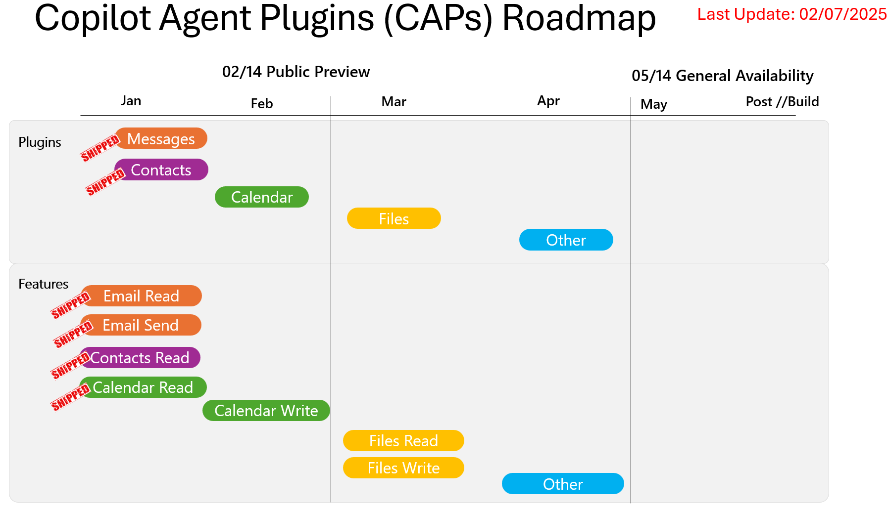
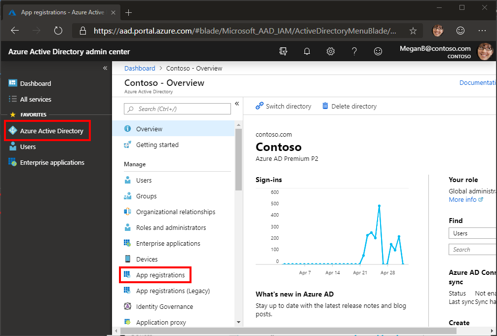
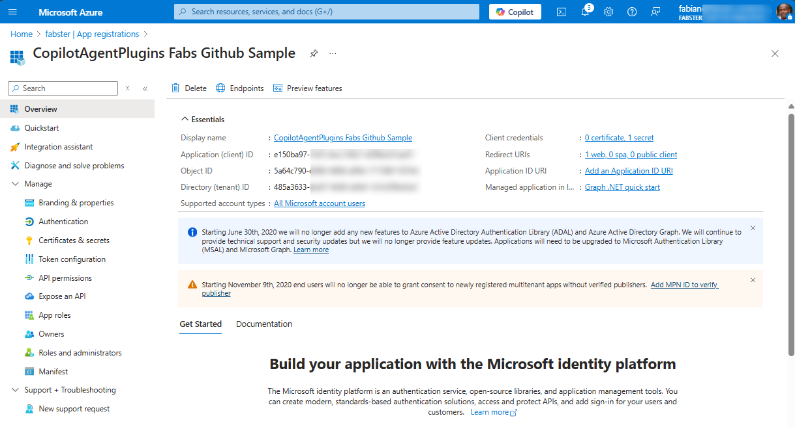
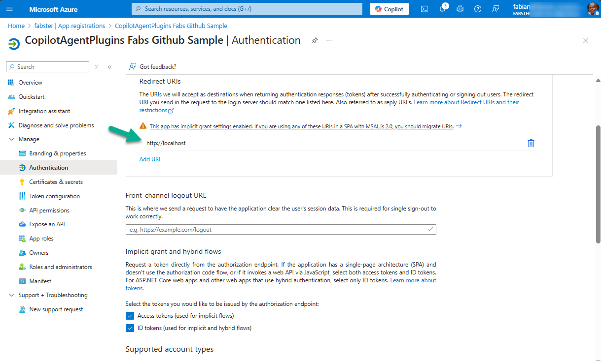
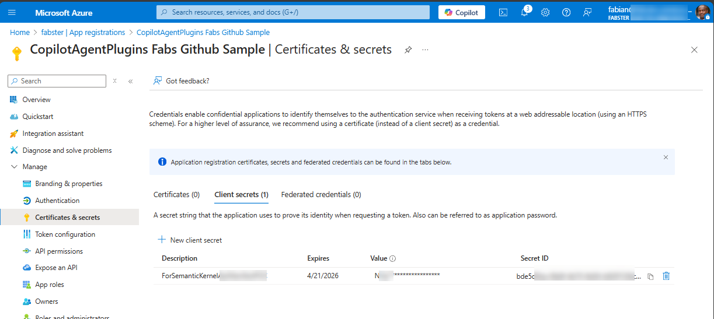
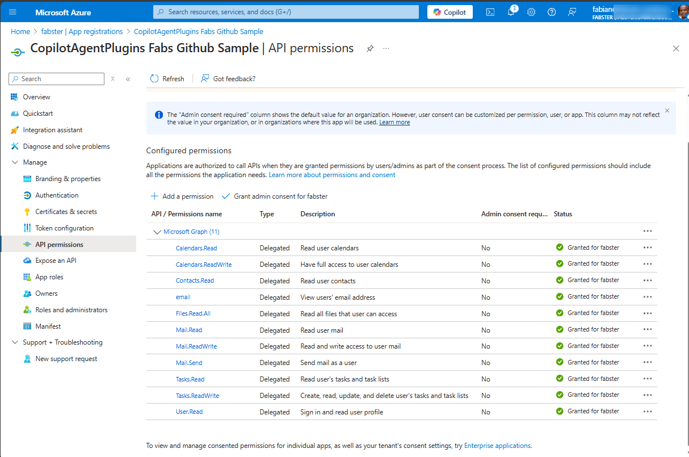

# Copilot Agent Plugins Sample for Semantic Kernel

Sample created and managed by [Fabian G. Williams](https://github.com/fabianwilliams), Principal Product Manager, Microsoft.  We believe that Copilot Agent Plugins (CAPs) empowers developers to effortlessly build AI-driven solutions by transforming natural language into seamless CRUD actions using Microsoft Graph and Semantic Kernel, thus revolutionizing the way we **developers** interact with Microsoft 365 data and innovate.

## Watch the Videos

### Why use Copilot Agent Plugins?
[](https://aka.ms/m365caps-videointro)

### Live Demo of CAPs in Action
[](https://aka.ms/m365caps-videodemo)

## CAPS Public Roadmap

Our timelines may be subject to changes, at this time our current GA release cycles are



What to get going? Start your journey below! 

## Use the CopilotAgentPluginDemoSample application to use and create Plugins for Gen AI experiences in Microsoft 365

### Prerequisites

- A Entra ID/ AAD administrator account capable of registering an Application. You can get a development tenant for free by joining the [Microsoft 365 Developer Program](https://developer.microsoft.com/microsoft-365/dev-program).
- [Visual Studio Code](https://code.visualstudio.com/)
- [Semantic Kernel](https://github.com/microsoft/semantic-kernel).

### How the sample application works

The sample has the following features:

- This is a Console Application. The user will open a terminal and issue a command "dotnet run demo" or "dotnet run demo --debug" for debug mode. 
- The user will then be presented with options to leverage platforms of "AzureOpenAI", "OpenAI", or locally with "Ollama" where the LLM is hosted.
- The user will then determine which Plugins they would like to load for this sample. As of this writing there are 4 available, Contacts, Messages, Calendar, and DriveItems.
- Once loaded the user will then have options to inspect the Manifest, Plugins, or run a prompt using the "Execute a Goal" option.
- The user will enter a prompt that satisfies one or more of the plugins they loaded.
- If a Auth token is not present, the user will be prompted to sign in with their Microsoft 365 account. This demonstrates how to use delegated authentication to run on a user's behalf.
- The users prompt is reasoned over and a result is returned with a description of the actions taken or data retrieved. This demonstrates how to use app can reason over Microsoft 365 data and synthesize a response or take an action on the users behalf.
- The user then has the option to issue another prompt load additional plugins, or exit the application.

## Setting up the sample

1. Register a Microsoft Identity platform application, and give it the right permissions.
1. Create an applications.Development.json file that fits with the pattern in the sample applications.json file that is included in the sample

### Register a Microsoft Identity platform application

#### Choose the tenant where you want to create your app

1. Sign in to the [Azure Active Directory admin center](https://aad.portal.azure.com) using either a work or school account.
1. If your account is present in more than one Azure AD tenant:
    1. Select your profile from the menu on the top right corner of the page, and then **Switch directory**.
    1. Change your session to the Azure AD tenant where you want to create your application.

#### Register the app

This sample for demonstration purposes uses a [Device Code Authentication flow](https://learn.microsoft.com/en-us/entra/identity-platform/msal-authentication-flows#device-code), however you may choose an Authentication Flow that suits your specific scenario. You will need to adjust the Authentication class "BearerAuthenticationProviderWithCancellationToken.cs" if you do so, in order for the sample to work as-is. 

1. Select **Azure Active Directory** in the left-hand navigation, then select [App registrations](https://go.microsoft.com/fwlink/?linkid=2083908) under **Manage**.

    

1. In creating a  **New Application**.Ensure the below values are set appropriately according to your Authentication Flow. The below is for device code.

    - Provide an appropriate name for your sample and copy down the **Application(client)ID** as well as the  **Directory(tenant)ID** and save them for later.

    

    - Set **Supported account types** to **Accounts in this organizational directory only**. This ensures that your App only will authenticate users from this tenant only.
    - Under **Redirect URI**, ensure the value is set to `http://localhost`.

    

1. In **Certificates & secrets** under **Manage**. Select the **New client secret** button. Enter a value in **Description** and select one of the options for **Expires** and select **Add**.

1. Copy the **Value** of the new secret **before** you leave this page. It will never be displayed again. Save the value for later.

    

1. Under **API permissions** under **Manage**.

1. In the list of pages for the app, select **API permissions**, then select **Add a permission**.

1. In this sample we selected the delegated permissions you see below. In order for the hand rolled plugins to work, at a minimum you will need to ensure that the Mail, Calendar, Files, and Contacts are selected as shown, with at least Read Permissions.

1. Make sure that the **Microsoft APIs** tab is selected, then select **Microsoft Graph**.

1. Select **Application permissions**, then find and enable your desired permissions.

    > **Note:** To create subscriptions for other resources you need to select different permissions as documented [here](https://docs.microsoft.com/graph/api/subscription-post-subscriptions#permissions)

1. Select **Grant admin consent for `name of your organization`** and **Yes**. This grants consent to the permissions of the application registration you just created to the current organization.

    


### Update appsettings Development File

1. Rename the [appsettings.json](CopilotAgentPluginsDemoSample/appsettings.json) file to `appsettings.Development.json`. Open the file in Visual Studio code or any text editor.

1. Update the following values.

    - `TenantId`: set to the tenant ID from your app registration
    - `ClientId`: set to the client ID from your app registration
    - `ClientSecret`: set to the client secret from your app registration
    - `RedirectUri`: set to the http://localhost
    - `OpenAI`: if you are using OpenAI as your LLM provider ensure that the
    - `ApiKey` : is filled out
    - `ModelId` : is filled out
    - `AzureOpenAI` : if you are using AzureOpenAI as your LLM provider ensure that the
    - `ChatModelId` : is filled out
    - `ChatDeploymentName` : is filled out
    - `Endpoint` : is filled out
    - `ApiKey` : is filled out

### Start the application

Open the repository with Visual Studio Code. Open a **New Terminal** and type.

To run without Debug Mode type:

```shell
dotnet run demo
```

To run with Debug Mode type:

```shell
dotnet run demo --debug
```

Then follow the instructions provided.

## Troubleshooting

See the dedicated [troubleshooting page](./TROUBLESHOOTING.md).

## Questions and comments

We'd love to get your feedback about the Copilot Agent Plugins sample for Semantic Kernel. You can send your questions and suggestions to us in the [Issues](https://github.com/microsoft/semantic-kernel/issues) section of this repository.

Questions about Microsoft Graph in general should be posted to [Microsoft Q&A](https://docs.microsoft.com/answers/products/graph). Make sure that your questions or comments are tagged with the relevant Microsoft Graph tag.

## Additional resources

- [Microsoft Graph documentation](https://docs.microsoft.com/graph)