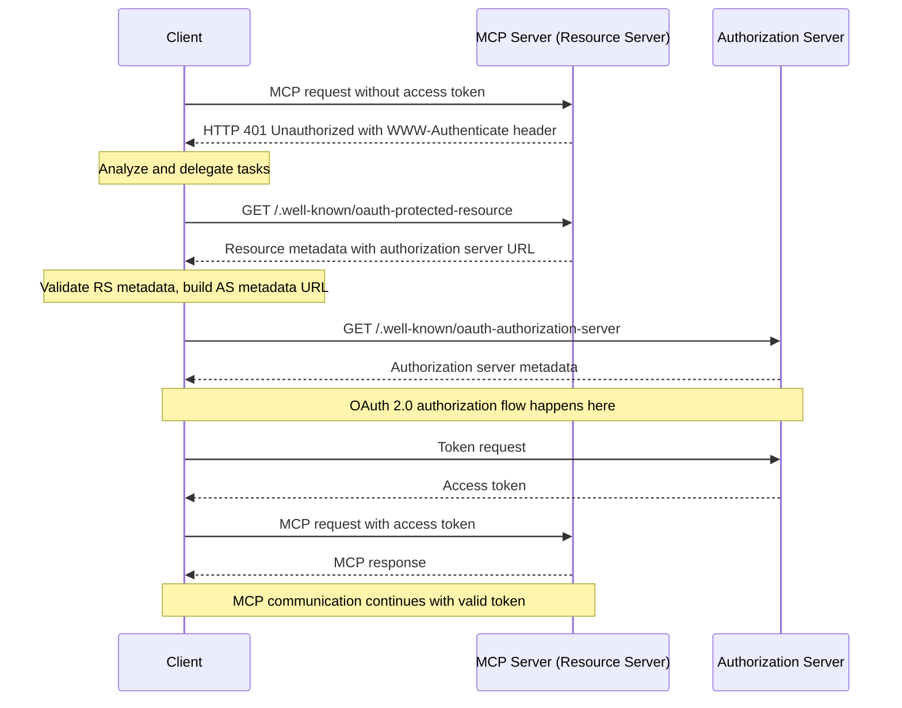

# Model Context Protocol Sample

This example demonstrates how to use tools from a protected Model Context Protocol server with Semantic Kernel.

MCP is an open protocol that standardizes how applications provide context to LLMs.

For information on Model Context Protocol (MCP) please refer to the [documentation](https://modelcontextprotocol.io/introduction).

The sample shows:

1. How to connect to a protected MCP Server using  OAuth 2.0 authentication
1. How to implement a custom OAuth authorization flow with browser-based authentication
1. Retrieve the list of tools the MCP Server makes available
1. Convert the MCP tools to Semantic Kernel functions so they can be added to a Kernel instance
1. Invoke the tools from Semantic Kernel using function calling

## Installing Prerequisites

- A self-signed certificate to enable HTTPS use in development, see [dotnet dev-certs](https://learn.microsoft.com/en-us/dotnet/core/tools/dotnet-dev-certs)
- .NET 10.0 or later
- A running TestOAuthServer (for OAuth authentication), see [Start the Test OAuth Server](https://github.com/modelcontextprotocol/csharp-sdk/tree/main/samples/ProtectedMCPClient#step-1-start-the-test-oauth-server)
- A running ProtectedMCPServer (for MCP services), see [Start the Protected MCP Server](https://github.com/modelcontextprotocol/csharp-sdk/tree/main/samples/ProtectedMCPClient#step-2-start-the-protected-mcp-server)
 
## Configuring Secrets or Environment Variables

The example requires credentials to access OpenAI.

If you have set up those credentials as secrets within Secret Manager or through environment variables for other samples from the solution in which this project is found, they will be re-used.

### To set your secrets with Secret Manager

```text
cd dotnet/samples/Demos/ModelContextProtocolPluginAuth

dotnet user-secrets init

dotnet user-secrets set "OpenAI:ChatModelId" "..."
dotnet user-secrets set "OpenAI:ApiKey" "..."
 "..."
```

### To set your secrets with environment variables

Use these names:

```text
# OpenAI
OpenAI__ChatModelId
OpenAI__ApiKey
```

## Setup and Running

### Step 1: Start the Test OAuth Server

First, you need to start the TestOAuthServer which provides OAuth authentication:

```bash
cd <MCP CSHARP-SDK>\tests\ModelContextProtocol.TestOAuthServer
dotnet run --framework net8.0
```

The OAuth server will start at `https://localhost:7029`

### Step 2: Start the Protected MCP Server

Next, start the ProtectedMCPServer which provides the weather tools:

```bash
cd <MCP CSHARP-SDK>\samples\ProtectedMCPServer
dotnet run
```

The protected server will start at `http://localhost:7071`

### Step 3: Run the ModelContextProtocolPluginAuth sample

Finally, run this client:

```bash
dotnet run
```

## What Happens

1. The client attempts to connect to the protected MCP server at `http://localhost:7071`
2. The server responds with OAuth metadata indicating authentication is required
3. The client initiates OAuth 2.0 authorization code flow:
   - Opens a browser to the authorization URL at the OAuth server
   - Starts a local HTTP listener on `http://localhost:1179/callback` to receive the authorization code
   - Exchanges the authorization code for an access token
4. The client uses the access token to authenticate with the MCP server
5. The client lists available tools and calls the `GetAlerts` tool for New York state

The following diagram outlines an example OAuth flow:



## OAuth Configuration

The client is configured with:
- **Client ID**: `demo-client`
- **Client Secret**: `demo-secret` 
- **Redirect URI**: `http://localhost:1179/callback`
- **OAuth Server**: `https://localhost:7029`
- **Protected Resource**: `http://localhost:7071`

## Available Tools

Once authenticated, the client can access weather tools including:
- **GetAlerts**: Get weather alerts for a US state
- **GetForecast**: Get weather forecast for a location (latitude/longitude)

## Troubleshooting

- Ensure the ASP.NET Core dev certificate is trusted.
  ```
  dotnet dev-certs https --clean
  dotnet dev-certs https --trust
  ```
- Ensure all three services are running in the correct order
- Check that ports 7029, 7071, and 1179 are available
- If the browser doesn't open automatically, copy the authorization URL from the console and open it manually
- Make sure to allow the OAuth server's self-signed certificate in your browser