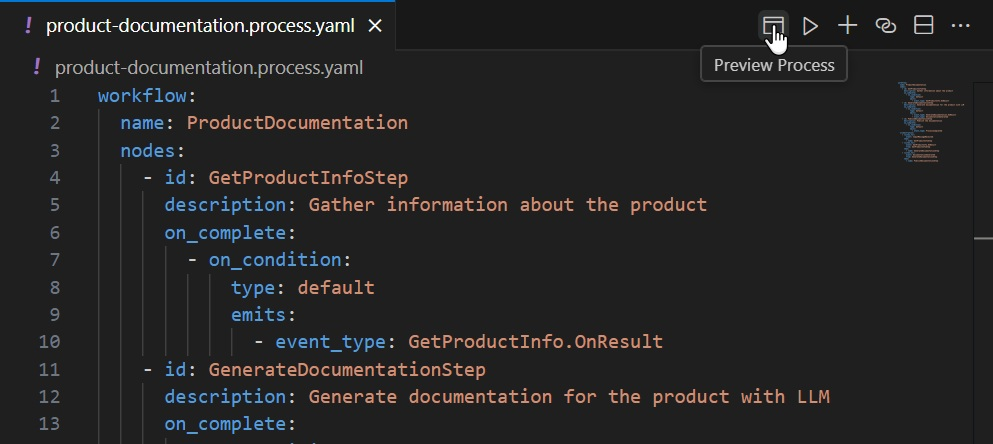
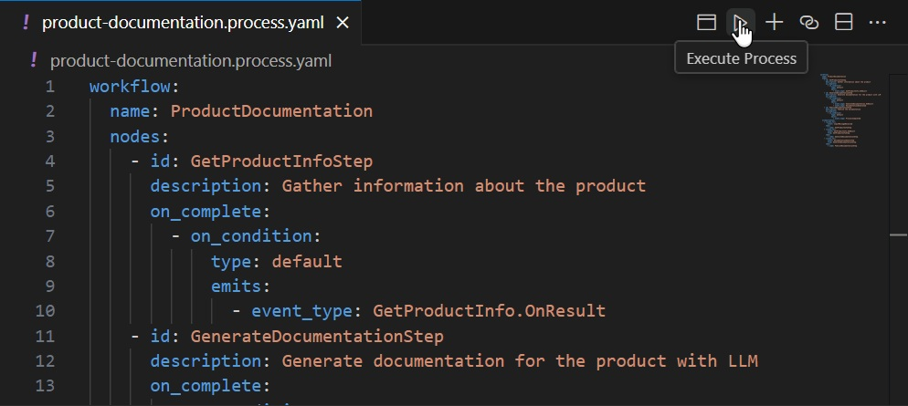

# Process Framework: Product Documentation application example

This project example demonstrates how to define, preview, and execute a process of generating product documentation.

Note: it is recommended to work with this example using [Semantic Kernel Tools](https://marketplace.visualstudio.com/items?itemName=ms-semantic-kernel.semantic-kernel) VS Code extension.

## Prerequisites

- Install [.NET 8](https://dotnet.microsoft.com/download/dotnet/8.0).

## Setup

1. Open a terminal in the project directory.
2. Run `dotnet build` command to build the logic of the process nodes.

## Getting Started

1. Open the [product-documentation.process.yaml](./product-documentation.process.yaml) file in VS Code to start working with processes.

## Features

### Preview a Process

To preview a process:
- Open the [product-documentation.process.yaml](./product-documentation.process.yaml) file.
- Click the **Preview Process** button in the top bar of the process file.

### Execute a Process

To execute a process:
- Open the [product-documentation.process.yaml](./product-documentation.process.yaml) file.
- Click the **Execute Process** button in the top bar of the process file.

### Process Node Logic

- The source code for each process node's logic is located in the [Steps](./Steps/) folder.
- Explore this folder to review or modify the logic for individual process steps.

## Reporting Issues

If you encounter any issues or have suggestions, please report them on our [GitHub repository](https://github.com/microsoft/semantic-kernel).
