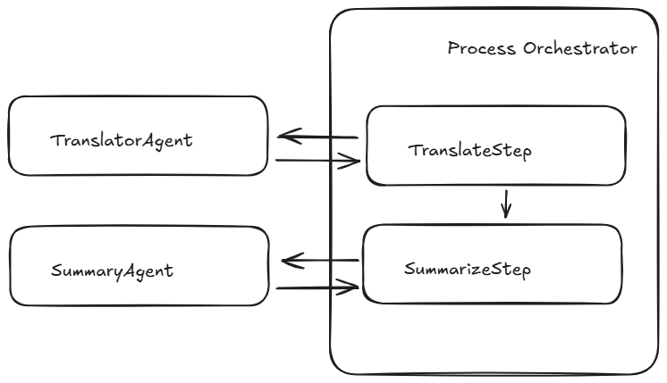
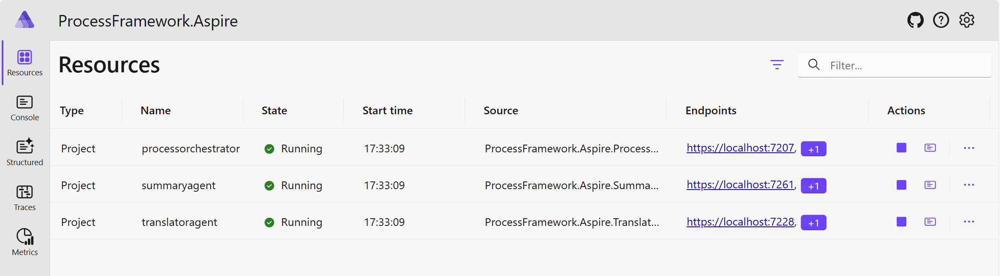
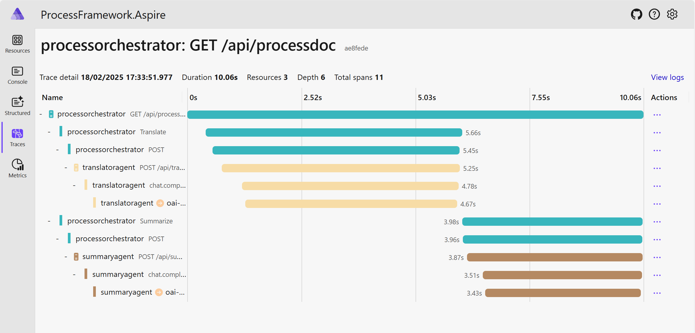
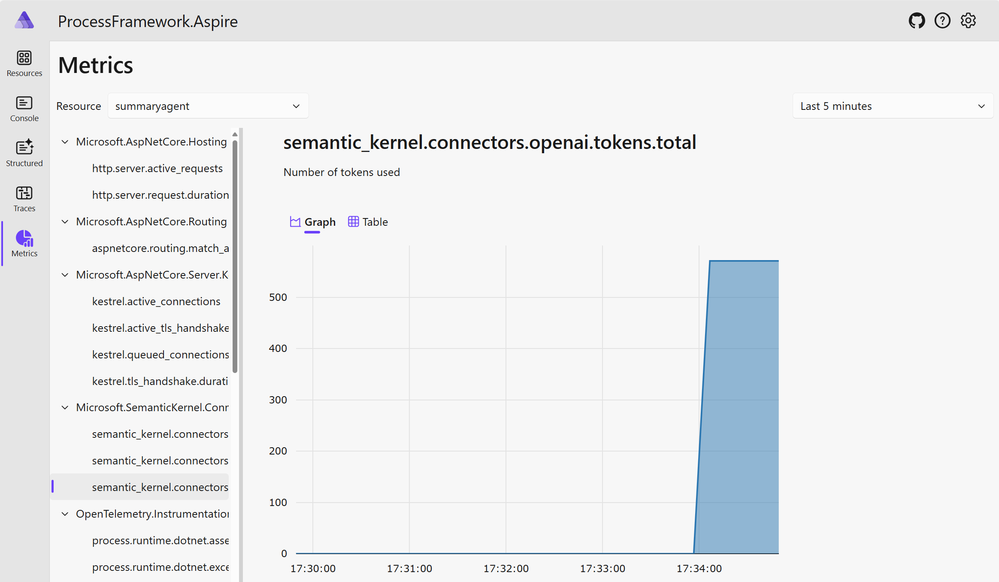

# Process Framework with .NET Aspire

This demo illustrates how the [Semantic Kernel Process Framework](https://learn.microsoft.com/semantic-kernel/overview) can be integrated with [.NET Aspire](https://learn.microsoft.com/dotnet/aspire/get-started/aspire-overview). The Process Framework enables the creation of business processes based on events, where each process step may invoke an agent or execute native code.

In the demo, agents are defined as **external services**. Each process step issues an HTTP request to call these agents, allowing .NET Aspire to trace the process using **OpenTelemetry**. Furthermore, because each agent is a standalone service, they can be restarted independently via the .NET Aspire developer dashboard.

## Architecture

The business logic of this sample is straightforward: it defines a process that translates text from English and subsequently summarizes it.



## What is .NET Aspire?

.NET Aspire is a set of tools, templates, and packages for building observable, production ready apps. .NET Aspire is delivered through a collection of NuGet packages that bootstrap or improve common challenges in modern app development.
Key features include:

- Dev-Time Orchestration: provides features for running and connecting multi-project applications, container resources, and other dependencies for local development environments.
- Integrations: offers standardized NuGet packages for frequently used services such as Redis and Postgres, with standardized interfaces ensuring they consistent and seamless connectivity.
- Tooling: includes project templates and tools for Visual Studio, Visual Studio Code, and the .NET CLI to help creating and interacting with .NET Aspire projects.

.NET Aspire orchestration assists with the following concerns:

- App composition: specify the .NET projects, containers, executables, and cloud resources that make up the application.
- Service Discovery and Connection String Management: automatically injects the right connection strings, network configurations, and service discovery information to simplify the developer experience.

### Running with .NET Aspire

To run this sample with .NET Aspire, clone the repository and execute the following commands:

```bash
cd scr/ProcessFramework.Aspire/ProcessFramework.Aspire.AppHost
dotnet run
```

A dashboard will then be displayed in the browser, similar to this:


By invoking the `ProcessOrchestrator` service, the process can be started. A predefined request is available in [`ProcessFramework.Aspire.ProcessOrchestrator.http``](./ProcessFramework.Aspire/ProcessFramework.Aspire.ProcessOrchestrator/ProcessFramework.Aspire.ProcessOrchestrator.http).

This will generate a trace in the Aspire dashboard that looks like this:


Additionally, the metrics for each agent can be monitored in the Metrics tab:
