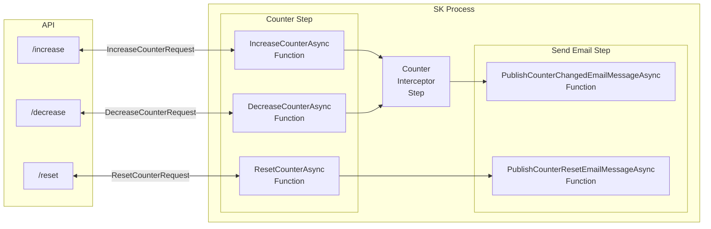
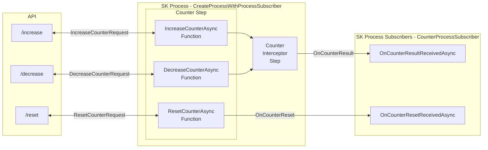

# Process With Cloud Events Demo

This demo contains an ASP.NET core API that showcases the use of cloud events using SK Processes Steps and SK Process with Event Subscribers.


For more information about Semantic Kernel Processes, see the following documentation:

## Semantic Kernel Processes

- [Overview of the Process Framework (docs)](https://learn.microsoft.com/semantic-kernel/frameworks/process/process-framework)
- [Getting Started with Processes (samples)](../../GettingStartedWithProcesses/)

## Demo

### Process: Counter with Cloud Events

#### Steps

##### Counter Step

A simple counter has 3 main functionalities:

- Increase count
- Decrease count
- Reset count (set counter to 0)

To achieve this behavior the SK Stateful Step `Processes/Steps/CounterStep.cs` was created. 
On every request it stores that state that can be used to restore the state on the next request.

##### Counter Interceptor Step

This step works as a filter that only passes the counter value if it is a multiple of `multipleOf` else passes a null value.

##### Send Email Step

This step sends an email if receiving a not nullable int value to the same email used on log in.

#### Processes

##### Process With Cloud Steps



Cloud events related logic is encapsulated in a step.

**Breakdown**

- When building the process Kernel used in the SK Process, the cloud event client has to be passed to the Kernel. 

- When using `Microsoft Graph`, after completing the [Microsoft Graph Setup](./#microsoft-graph-setup), To achieve the proper setup the following is needed:

    1. The specific service (`GraphServiceClient` in this case) needs to be added to the Services that are used by the kernel of the process:

        ```C#
        internal Kernel BuildKernel(GraphServiceClient? graphClient = null)
        {
            var builder = Kernel.CreateBuilder();
            if (graphClient != null)
            {
                builder.Services.AddSingleton<GraphServiceClient>(graphClient);
            }
            return builder.Build();
        }
        ```
    2. Since now all steps have access to the configured kernel, inside a step, it now can make use of the service by doing:
        ```C#
        var graphClient = kernel.GetRequiredService<GraphServiceClient>();
        ```

##### Process With Cloud Process Subscribers

Cloud events related logic is encapsulated in SK Event Subscribers.


**Breakdown**

- When building the process Kernel used in the SK Process, the cloud event client has to be passed to the Event Subscribers. 

- When using `Microsoft Graph`, after completing the [Microsoft Graph Setup](./#microsoft-graph-setup), the Event Subscribers can be linked by doing:
    1. Creating an enum that contains the process events of interest.
        ```C#
        public enum CounterProcessEvents
        {
            IncreaseCounterRequest,
            DecreaseCounterRequest,
            ResetCounterRequest,
            OnCounterReset,
            OnCounterResult
        }
        ```
    2. On the existing process, adding which events can be accessed externally using `EmitAsProcessEvent(<eventName>)`:
        ```C#
        var processBuilder = new ProcessBuilder<CounterProcessEvents>("CounterWithProcessSubscriber");
    
        ...

        processBuilder
            .OnInputEvent(processBuilder.GetEventName(CounterProcessEvents.IncreaseCounterRequest))
            .SendEventTo(new ProcessFunctionTargetBuilder(counterStep, functionName: CounterStep.Functions.IncreaseCounter));

        processBuilder
            .OnInputEvent(processBuilder.GetEventName(CounterProcessEvents.DecreaseCounterRequest))
            .SendEventTo(new ProcessFunctionTargetBuilder(counterStep, functionName: CounterStep.Functions.DecreaseCounter));

        processBuilder
            .OnInputEvent(processBuilder.GetEventName(CounterProcessEvents.ResetCounterRequest))
            .SendEventTo(new ProcessFunctionTargetBuilder(counterStep, functionName: CounterStep.Functions.ResetCounter));

        ...

        counterStep
            .OnFunctionResult(CounterStep.Functions.ResetCounter)
            .EmitAsProcessEvent(processBuilder.GetProcessEvent(CounterProcessEvents.OnCounterReset))
            .SendEventTo(new ProcessFunctionTargetBuilder(counterInterceptorStep));

        counterInterceptorStep
            .OnFunctionResult(CounterInterceptorStep.Functions.InterceptCounter)
            .EmitAsProcessEvent(processBuilder.GetProcessEvent(CounterProcessEvents.OnCounterResult));
        ```
    3. Create a `KernelProcessEventsSubscriber` based class that with the `ProcessEventSubscriber` attributes to link specific process events to specific methods to execute.
        ```C#
        public class CounterProcessSubscriber : KernelProcessEventsSubscriber<CounterProcessEvents>
        {
            [ProcessEventSubscriber(CounterProcessEvents.OnCounterResult)]
            public async Task OnCounterResultReceivedAsync(int? counterResult)
            {
                if (!counterResult.HasValue)
                {
                    return;
                }

                try
                {
                    var graphClient = this.ServiceProvider?.GetRequiredService<GraphServiceClient>();
                    var user = await graphClient.Me.GetAsync();
                    var graphEmailMessage = this.GenerateEmailRequest(counterResult.Value, user!.Mail!, subject: "The counter has changed");
                    await graphClient?.Me.SendMail.PostAsync(graphEmailMessage);
                }
                catch (Exception e)
                {
                    throw new KernelException($"Something went wrong and couldn't send email - {e}");
                }
            }
        }
        ```
    4. Link the `KernelProcessEventsSubscriber` based class (example: `CounterProcessSubscriber`) to the process builder.
        ```C#
        processBuilder.LinkEventSubscribersFromType<CounterProcessSubscriber>(serviceProvider);
        ```

### Setup

#### Microsoft Graph Setup

##### Create an App Registration in Azure Active Directory

1. Go to the [Azure Portal](https://portal.azure.com/).
2. Select the Azure Active Directory service.
3. Select App registrations and click on New registration.
4. Fill in the required fields and click on Register.
5. Copy the Application **(client) Id** for later use.
6. Save Directory **(tenant) Id** for later use..
7. Click on Certificates & secrets and create a new client secret. (Any name and expiration date will work)
8. Copy the **client secret** value for later use.
9. Click on API permissions and add the following permissions:
   - Microsoft Graph
     - Delegated permissions
       - OpenId permissions
         - email
         - profile
         - openid
         - User.Read
         - Mail.Send (Necessary for sending emails from your account)

##### Set Secrets using .NET [Secret Manager](https://learn.microsoft.com/en-us/aspnet/core/security/app-secrets)

```powershell
dotnet user-secrets set "AzureEntraId:TenantId" " ... your tenant id ... "
dotnet user-secrets set "AzureEntraId:ClientId" " ... your client id ... "

# App Registration Authentication
dotnet user-secrets set "AzureEntraId:ClientSecret" " ... your client secret ... "
# OR User Authentication (Interactive)
dotnet user-secrets set "AzureEntraId:InteractiveBrowserAuthentication" "true"
dotnet user-secrets set "AzureEntraId:RedirectUri" " ... your redirect uri ... "
```