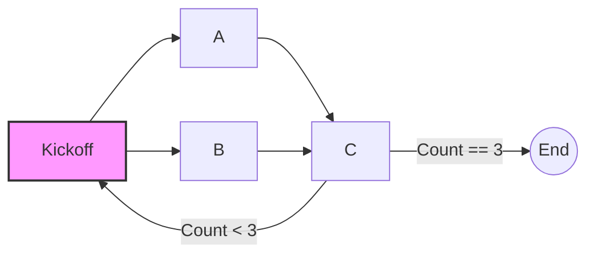

# Semantic Kernel Processes in Dapr

This demo contains an asp.net core API service that uses Dapr to run a Semantic Kernel Process. Dapr is a portable, event-driven runtime that can simplify the process of building resilient, stateful application that run the cloud and / or edge. Dapr is a natural fit for hosting Semantic Kernel Processes and allows your processes to scale as large as you need them to be without sacrificing performance, or reliability.

For more information about Semantic Kernel Processes and Dapr, see the following documentation:

#### Semantic Kernel Processes

- [Overview of the Process Framework (docs)](https://learn.microsoft.com/semantic-kernel/frameworks/process/process-framework)
- [Getting Started with Processes (samples)](../../GettingStartedWithProcesses/)

#### Dapr

- [Dapr documentation](https://docs.dapr.io/)
- [Dapr Actor documentation](https://v1-10.docs.dapr.io/developing-applications/building-blocks/actors/)
- [Dapr local development](https://docs.dapr.io/getting-started/install-dapr-selfhost/)

## RUnning the Demo

Before running this Demo, make sure to configure Dapr for local development following the links above. The Dapr containers must be running for this demo application to run.



1. Build and run the sample. Running the Dapr service locally can be done using the Dapr Cli or with the Dapr VS Code extension. The VS Code extension is the recommended approach if you want to debug the code as it runs.
1. When the service is up, it will expose a single API in localhost port 5000. You can call this API by pointing a web browser to [http://localhost:5000/processes/123](http://localhost:5000/processes/1234)

## Understanding the Code

This demo shows how Dapr and Semantic Kernel Processes can be integrated into an ASP.Net Core Web Api with the following steps:

- Create a new ASP.Net web API project.
- Add the required Semantic Kernel and Dapr packages to your project:

  **_Semantic Kernel Packages_**

  - `dotnet add package Microsoft.SemanticKernel --version 1.24.0`
  - `dotnet add package Microsoft.SemanticKernel.Process.Core --version 1.24.0-alpha`
  - `dotnet add package Microsoft.SemanticKernel.Process.Runtime.Dapr --version 1.24.0-alpha`

  **_Dapr Packages_**

  - `dotnet add package Dapr.Actors.AspNetCore --version 1.14.0`

- Configure `program.cs` to use Dapr and the Process framework:
  ```csharp
  // Configure Dapr
  builder.Services.AddActors(static options =>
  {
      // Register the actors required to run Processes
      options.AddProcessActors();
  });
  ```
- Build and run a Process as you normally would. For this Demo we run a simple example process from with a Controller's action method in response to a GET request. [See here](./Controllers/ProcessController.cs).
