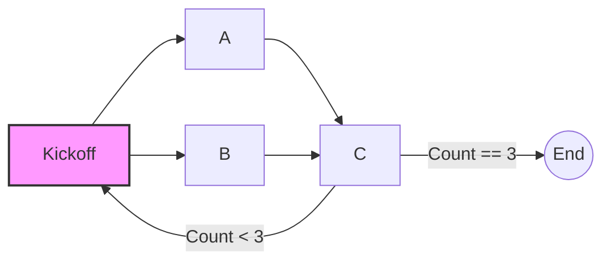

# Semantic Kernel Processes in Dapr

This demo contains an ASP.NET core API that uses Dapr to run a Semantic Kernel Process. Dapr is a portable, event-driven runtime that can simplify the process of building resilient, stateful application that run in the cloud and/or edge. Dapr is a natural fit for hosting Semantic Kernel Processes and allows you to scale your processes in size and quantity without sacrificing performance, or reliability.

For more information about Semantic Kernel Processes and Dapr, see the following documentation:

#### Semantic Kernel Processes

- [Overview of the Process Framework (docs)](https://learn.microsoft.com/semantic-kernel/frameworks/process/process-framework)
- [Getting Started with Processes (samples)](../../GettingStartedWithProcesses/)

#### Dapr

- [Dapr documentation](https://docs.dapr.io/)
- [Dapr Actor documentation](https://v1-10.docs.dapr.io/developing-applications/building-blocks/actors/)
- [Dapr local development](https://docs.dapr.io/getting-started/install-dapr-selfhost/)

## Running the Demo

Before running this Demo, make sure to configure Dapr for local development following the links above. The Dapr containers must be running for this demo application to run.



1. Build and run the sample. Running the Dapr service locally can be done using the Dapr Cli or with the Dapr VS Code extension. The VS Code extension is the recommended approach if you want to debug the code as it runs.
1. When the service is up and running, it will expose a single API in localhost port 5000.

#### Invoking the process:

1. Open a web browser and point it to [http://localhost:5000/processes/1234](http://localhost:5000/processes/1234) to invoke a new process with `Id = "1234"`
1. You should see console output from the running service with logs that match the following:

```csharp
##### Kickoff ran.
##### AStep ran.
##### BStep ran.
##### CStep activated with Cycle = '1'.
##### CStep run cycle 2.
##### Kickoff ran.
##### AStep ran.
##### BStep ran.
##### CStep run cycle 3 - exiting.
```

Now refresh the page in your browser to run the same processes instance again. Now the logs should look like this:

```csharp
##### Kickoff ran.
##### AStep ran.
##### BStep ran.
##### CStep run cycle 3 - exiting.
```

Notice that the logs from the two runs are not the same. In the first run, the processes has not been run before and so it's initial
state came from what we defined in the process:

**_First Run_**

- `CState` is initialized with `Cycle = 1` which is the initial state that we specified while building the process.
- `CState` is invoked a total of two times before the terminal condition of `Cycle >= 3` is reached.

In the second run however, the process has persisted state from the first run:

**_Second Run_**

- `CState` is initialized with `Cycle = 3` which is the final state from the first run of the process.
- `CState` is invoked only once and is already in the terminal condition of `Cycle >= 3`.

If you create a new instance of the process with `Id = "ABCD"` by pointing your browser to [http://localhost:5000/processes/ABCD](http://localhost:5000/processes/ABCD), you will see the it will start with the initial state as expected.

## Understanding the Code

Below are the key aspects of the code that show how Dapr and Semantic Kernel Processes can be integrated into an ASP.Net Core Web Api:

- Create a new ASP.Net web API project.
- Add the required Semantic Kernel and Dapr packages to your project:

  **_Semantic Kernel Packages_**

  - `dotnet add package Microsoft.SemanticKernel --version 1.24.0`
  - `dotnet add package Microsoft.SemanticKernel.Process.Core --version 1.24.0-alpha`
  - `dotnet add package Microsoft.SemanticKernel.Process.Runtime.Dapr --version 1.24.0-alpha`

  **_Dapr Packages_**

  - `dotnet add package Dapr.Actors.AspNetCore --version 1.14.0`

- Configure `program.cs` to use Dapr and the Process framework:
  ```csharp
  // Configure Dapr
  builder.Services.AddActors(static options =>
  {
      // Register the actors required to run Processes
      options.AddProcessActors();
  });
  ```
- Build and run a Process as you normally would. For this Demo we run a simple example process from with a Controller's action method in response to a GET request. [See Controller here](./Controllers/ProcessController.cs).
