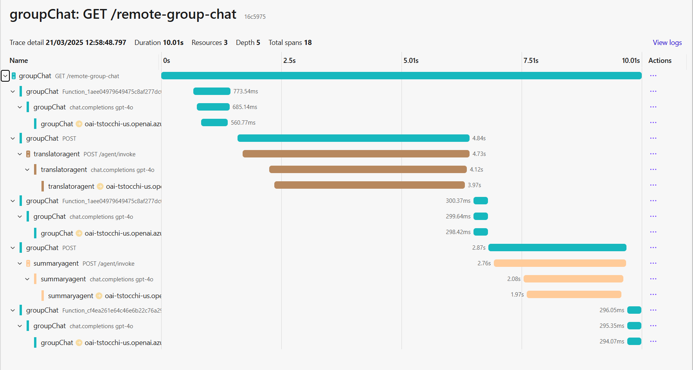
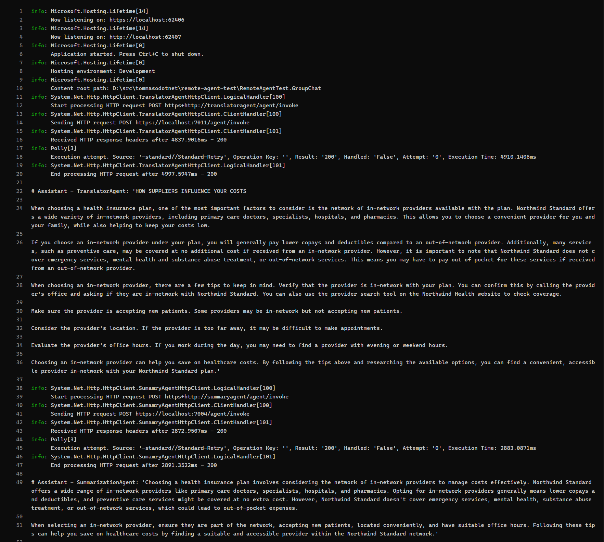

# Remote Chat Completion Agent Test

This repo shows how we could implement a [`RemoteChatCompletionAgent`](./RemoteChatCompletionAgentDemo.GroupChat/RemoteChatCompletionAgent.cs) that can be used to interact with a remote Semantic Kernel `ChatCompletionAgent`.

The new type [`RemoteChatCompletionAgent`](./RemoteChatCompletionAgentDemo.GroupChat/RemoteChatCompletionAgent.cs) implements the `ChatHistoryKernelAgent` methods using a custom HTTP client to send requests to an API that hosts the `ChatCompletionAgent` functionality. This allows us to use the same interface as the local `ChatCompletionAgent`, but with the added benefit of being able to interact with a remote service.

## Benefits of having a remote agent
- **Polyglot Support**: The remote agent can be implemented with different programming languages and frameworks, allowing for better integration and support for different platforms.
- **Reusability**: The remote agent can be reused across different applications and services, allowing for better code reuse and maintainability.
- **Scalability**: The remote agent can be hosted on a powerful server, allowing for more complex computations and larger models.
- **Resource Management**: The remote agent can be managed and monitored more easily, allowing for better resource allocation and usage tracking.
- **Security**: The remote agent can be secured and monitored more easily, allowing for better protection of sensitive data and computations.
- **Cost Efficiency**: The remote agent can be hosted on a pay-as-you-go basis, allowing for better cost management and resource allocation.
- **Flexibility**: The remote agent can be updated and maintained more easily, allowing for better support for new features and improvements.

## Details about the sample

I am using an `AgentGroupChat` to show how to use different remote agents togethere in the same chat. It's a useful use case. Since the`RemoteChatCompletionAgent` extends the type `ChatHistoryKernelAgent`, it can be used in the same way as the local agent.

In this simple Group Chat, we have two agents:
- `TranslatorAgent`: this agent translates the text to English. [Program.cs](./RemoteChatCompletionAgentDemo.TranslatorAgent/Program.cs)
- `SummaryAgent`: this agent summarize the text. [Program.cs](./RemoteChatCompletionAgentDemo.SummaryAgent/Program.cs)

The Group Chat will call the `TranslatorAgent` first, and then the `SummaryAgent`.

I am also using [.NET Aspire]https://learn.microsoft.com/en-us/dotnet/aspire/get-started/aspire-overview) to have all the different microservices start and run together. I am also leveraging the .NET Service Discovery to have the correct endpoints for each agent.

.NET Aspire is not required. It just make it easier to run the sample and monitoring all the different microservices. You can run the `RemoteChatCompletionAgent` in any .NET application.

## How to run the example

1. Configure the OpenAI integration for .NET Aspire according to the [documentation](https://learn.microsoft.com/en-us/dotnet/aspire/azureai/azureai-openai-integration?tabs=dotnet-cli#connect-to-an-existing-azure-openai-service).

Note that you can use either DefaultAzureCredentials or API Keys for authentication.

Using DefaultAzureCredentials:

```json
{
  "ConnectionStrings": {
    "openAiConnectionName": "https://{account_name}.openai.azure.com/"
  }
}
```

Using API Keys:

```json
{
  "ConnectionStrings": {
    "openAiConnectionName": "Endpoint=https://{account_name}.openai.azure.com/;Key={api_key};"
  },
}
```

2. Run the sample

```bash
cd RemoteAgentTest.AppHost
dotnet run
```

3. Invoke the AgentGroupChat via http:

```
http://localhost:{PORT}/remote-group-chat
```

You will see Traces for the request, showing that the Group Chat is actually calling each remote agent as intructed.



The output of the Group Chat can be seen in the `groupChat` service logs:

