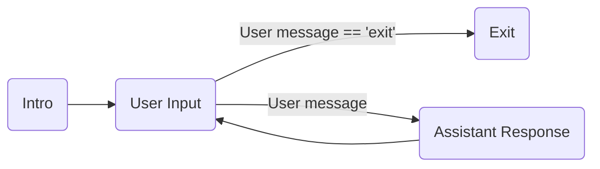
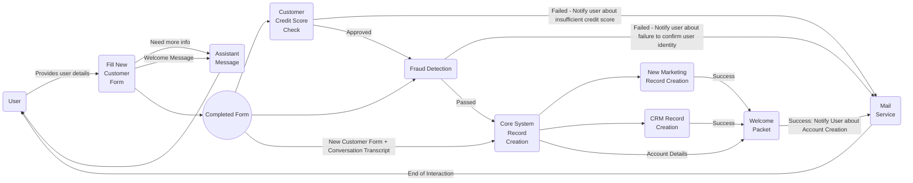
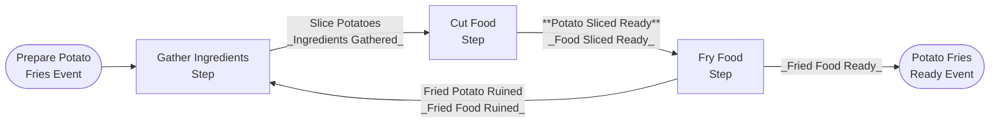
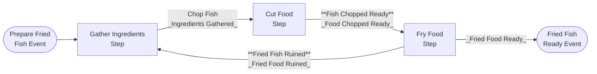
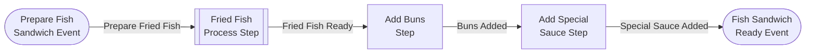
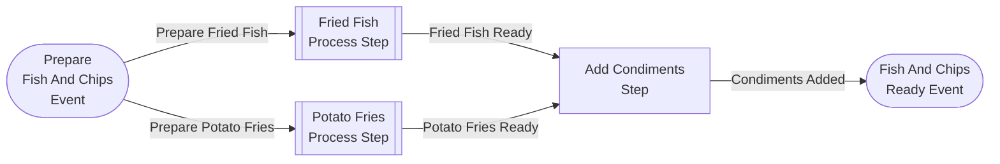
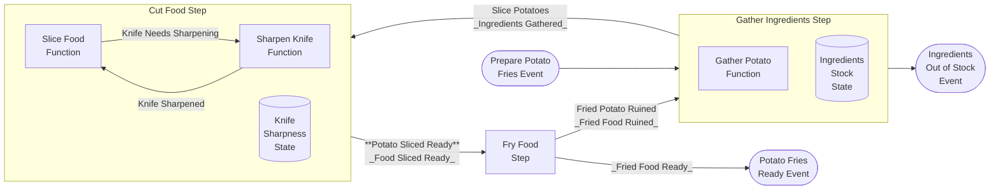
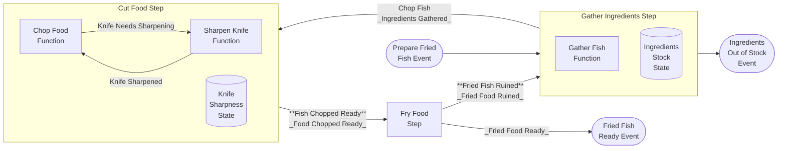
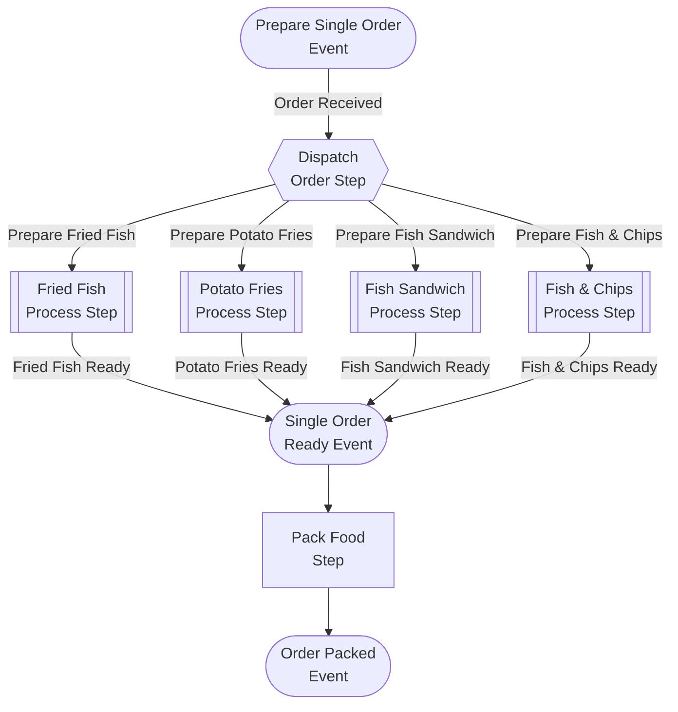
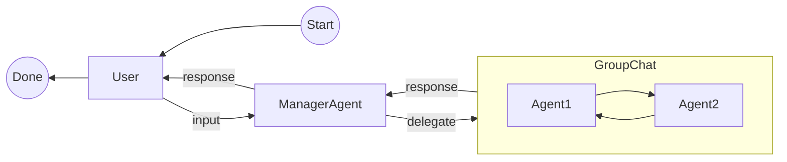

# Semantic Kernel Processes - Getting Started

This project contains a step by step guide to get started with  _Semantic Kernel Processes_.


#### NuGet:
- [Microsoft.SemanticKernel.Process.Abstractions](https://www.nuget.org/packages/Microsoft.SemanticKernel.Process.Abstractions)
- [Microsoft.SemanticKernel.Process.Core](https://www.nuget.org/packages/Microsoft.SemanticKernel.Process.Core)
- [Microsoft.SemanticKernel.Process.LocalRuntime](https://www.nuget.org/packages/Microsoft.SemanticKernel.Process.LocalRuntime)

#### Sources
- [Semantic Kernel Processes - Abstractions](https://github.com/microsoft/semantic-kernel/tree/main/dotnet/src/Experimental/Process.Abstractions)
- [Semantic Kernel Processes - Core](https://github.com/microsoft/semantic-kernel/tree/main/dotnet/src/Experimental/Process.Core)
- [Semantic Kernel Processes - LocalRuntime](https://github.com/microsoft/semantic-kernel/tree/main/dotnet/src/Experimental/Process.LocalRuntime)

The examples can be run as integration tests but their code can also be copied to stand-alone programs.

## Examples

The getting started with agents examples include:

Example|Description
---|---
[Step01_Processes](https://github.com/microsoft/semantic-kernel/blob/main/dotnet/samples/GettingStartedWithProcesses/Step01/Step01_Processes.cs)|How to create a simple process with a loop and a conditional exit
[Step02_AccountOpening](https://github.com/microsoft/semantic-kernel/blob/main/dotnet/samples/GettingStartedWithProcesses/Step02/Step02_AccountOpening.cs)|Showcasing processes cycles, fan in, fan out for opening an account.
[Step03a_FoodPreparation](https://github.com/microsoft/semantic-kernel/blob/main/dotnet/samples/GettingStartedWithProcesses/Step03/Step03a_FoodPreparation.cs)|Showcasing reuse of steps, creation of processes, spawning of multiple events, use of stateful steps with food preparation samples.
[Step03b_FoodOrdering](https://github.com/microsoft/semantic-kernel/blob/main/dotnet/samples/GettingStartedWithProcesses/Step03/Step03b_FoodOrdering.cs)|Showcasing use of subprocesses as steps, spawning of multiple events conditionally reusing the food preparation samples. 
[Step04_AgentOrchestration](https://github.com/microsoft/semantic-kernel/blob/main/dotnet/samples/GettingStartedWithProcesses/Step04/Step04_AgentOrchestration.cs)|Showcasing use of process steps in conjunction with the _Agent Framework_. 

### Step01_Processes



### Step02_AccountOpening



### Step03a_FoodPreparation

This tutorial contains a set of food recipes associated with the Food Preparation Processes of a restaurant.

The following recipes for preparation of Order Items are defined as SK Processes:

#### Product Preparation Processes

##### Stateless Product Preparation Processes

###### Potato Fries Preparation Process



###### Fried Fish Preparation Process



###### Fish Sandwich Preparation Process



###### Fish And Chips Preparation Process



##### Stateful Product Preparation Processes

The processes in this subsection contain the following modifications/additions to previously used food preparation processes:

- The `Gather Ingredients Step` is now stateful and has a predefined number of initial ingredients that are used as orders are prepared. When there are no ingredients left, it emits the `Out of Stock Event`.
- The `Cut Food Step` is now a stateful component which has a `Knife Sharpness State` that tracks the Knife Sharpness.
- As the `Slice Food` and `Chop Food` Functions get invoked, the Knife Sharpness deteriorates.
- The `Cut Food Step` has an additional input function `Sharpen Knife Function`.
- The new `Sharpen Knife Function` sharpens the knife and increases the Knife Sharpness - Knife Sharpness State.
- From time to time, the `Cut Food Step`'s functions `SliceFood` and `ChopFood` will fail and emit a `Knife Needs Sharpening Event` that then triggers the `Sharpen Knife Function`.


###### Potato Fries Preparation With Knife Sharpening and Ingredient Stock Process

The following processes is a modification on the process [Potato Fries Preparation](#potato-fries-preparation-process) 
with the the stateful steps mentioned previously.



###### Fried Fish Preparation With Knife Sharpening and Ingredient Stock Process

The following process is a modification on the process [Fried Fish Preparation](#fried-fish-preparation-process) 
with the the stateful steps mentioned previously.



### Step03b_FoodOrdering

#### Single Order Preparation Process

Now with the existing product preparation processes, they can be used to create an even more complex process that can decide what product order to dispatch.



### Step04_AgentOrchestration

This tutorial demonstrates integrating the _Agent Framework_ with processes.
This includes both direct _agent_ interaction as well as making use of _AgentGroupChat_.



## Running Examples with Filters
Examples may be explored and ran within _Visual Studio_ using _Test Explorer_.

You can also run specific examples via the command-line by using test filters (`dotnet test --filter`). Type `dotnet test --help` at the command line for more details.

Example:

```
dotnet test --filter Step01_Processes
```

## Configuring Secrets

Each example requires secrets / credentials to access OpenAI or Azure OpenAI.

We suggest using .NET [Secret Manager](https://learn.microsoft.com/en-us/aspnet/core/security/app-secrets) to avoid the risk of leaking secrets into the repository, branches and pull requests. You can also use environment variables if you prefer.

To set your secrets with .NET Secret Manager:

1. Navigate the console to the project folder:

    ```
    cd dotnet/samples/GettingStartedWithProcesses
    ```

2. Examine existing secret definitions:

    ```
    dotnet user-secrets list
    ```

3. If needed, perform first time initialization:

    ```
    dotnet user-secrets init
    ```

4. Define secrets for either Open AI:

    ```
    dotnet user-secrets set "OpenAI:ChatModelId" "..."
    dotnet user-secrets set "OpenAI:ApiKey" "..."
    ```

5. Or Azure Open AI:

    ```
    dotnet user-secrets set "AzureOpenAI:DeploymentName" "..."
    dotnet user-secrets set "AzureOpenAI:ChatDeploymentName" "..."
    dotnet user-secrets set "AzureOpenAI:Endpoint" "https://... .openai.azure.com/"
    dotnet user-secrets set "AzureOpenAI:ApiKey" "..."
    ```

> NOTE: Azure secrets will take precedence, if both Open AI and Azure Open AI secrets are defined, unless `ForceOpenAI` is set:

```
protected override bool ForceOpenAI => true;
```
