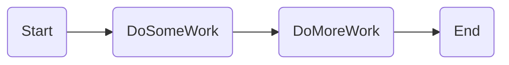
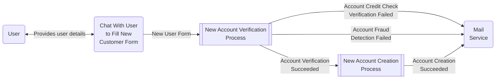
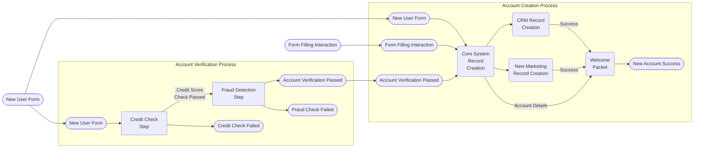
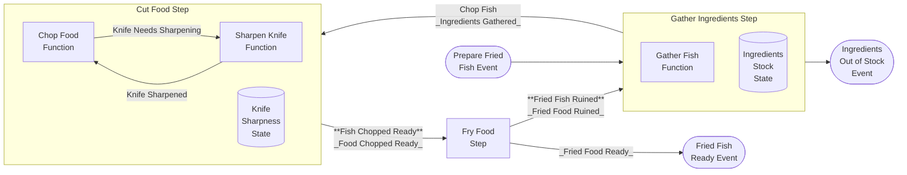

# Semantic Kernel Processes - Getting Started

This project contains a step by step guide to get started with  _Semantic Kernel Processes_.


#### NuGet:
- [Microsoft.SemanticKernel.Process.Abstractions](https://www.nuget.org/packages/Microsoft.SemanticKernel.Process.Abstractions)
- [Microsoft.SemanticKernel.Process.Core](https://www.nuget.org/packages/Microsoft.SemanticKernel.Process.Core)
- [Microsoft.SemanticKernel.Process.LocalRuntime](https://www.nuget.org/packages/Microsoft.SemanticKernel.Process.LocalRuntime)

#### Sources
- [Semantic Kernel Processes - Abstractions](https://github.com/microsoft/semantic-kernel/tree/main/dotnet/src/Experimental/Process.Abstractions)
- [Semantic Kernel Processes - Core](https://github.com/microsoft/semantic-kernel/tree/main/dotnet/src/Experimental/Process.Core)
- [Semantic Kernel Processes - LocalRuntime](https://github.com/microsoft/semantic-kernel/tree/main/dotnet/src/Experimental/Process.LocalRuntime)

The examples can be run as integration tests but their code can also be copied to stand-alone programs.

## Examples

The getting started with agents examples include:

Example|Description
---|---
[Step00_Processes](https://github.com/microsoft/semantic-kernel/blob/main/dotnet/samples/GettingStartedWithProcesses/Step00/Step00_Processes.cs)|How to create the simplest process with minimal code and event wiring
[Step01_Processes](https://github.com/microsoft/semantic-kernel/blob/main/dotnet/samples/GettingStartedWithProcesses/Step01/Step01_Processes.cs)|How to create a simple process with a loop and a conditional exit
[Step02a_AccountOpening](https://github.com/microsoft/semantic-kernel/blob/main/dotnet/samples/GettingStartedWithProcesses/Step02/Step02a_AccountOpening.cs)|Showcasing processes cycles, fan in, fan out for opening an account.
[Step02b_AccountOpening](https://github.com/microsoft/semantic-kernel/blob/main/dotnet/samples/GettingStartedWithProcesses/Step02/Step02b_AccountOpening.cs)|How to refactor processes and make use of smaller processes as steps in larger processes.
[Step03a_FoodPreparation](https://github.com/microsoft/semantic-kernel/blob/main/dotnet/samples/GettingStartedWithProcesses/Step03/Step03a_FoodPreparation.cs)|Showcasing reuse of steps, creation of processes, spawning of multiple events, use of stateful steps with food preparation samples.
[Step03b_FoodOrdering](https://github.com/microsoft/semantic-kernel/blob/main/dotnet/samples/GettingStartedWithProcesses/Step03/Step03b_FoodOrdering.cs)|Showcasing use of subprocesses as steps, spawning of multiple events conditionally reusing the food preparation samples. 
[Step04_AgentOrchestration](https://github.com/microsoft/semantic-kernel/blob/main/dotnet/samples/GettingStartedWithProcesses/Step04/Step04_AgentOrchestration.cs)|Showcasing use of process steps in conjunction with the _Agent Framework_. 

### Step00_Processes



### Step01_Processes


### Step02_AccountOpening

The account opening sample has 2 different implementations covering the same scenario, it just uses different SK components to achieve the same goal.

In addition, the sample introduces the concept of using smaller process as steps to maintain the main process readable and manageble for future improvements and unit testing.
Also introduces the use of SK Event Subscribers.

A process for opening an account for this sample has the following steps:
- Fill New User Account Application Form
- Verify Applicant Credit Score
- Apply Fraud Detection Analysis to the Application Form
- Create New Entry in Core System Records
- Add new account to Marketing Records
- CRM Record Creation
- Mail user a user a notification about:
    - Failure to open a new account due to Credit Score Check
    - Failure to open a new account due to Fraud Detection Alert
    - Welcome package including new account details

A SK process that only connects the steps listed above as is (no use of subprocesses as steps) for opening an account look like this:

#### Step02a_AccountOpening


#### Step02b_AccountOpening

After grouping steps that have a common theme/dependencies, and creating smaller subprocesses and using them as steps, 
the root process looks like this:



Where processes used as steps, which are reusing the same steps used [`Step02a_AccountOpening`](#step02a_accountopening), are:



### Step03a_FoodPreparation

This tutorial contains a set of food recipes associated with the Food Preparation Processes of a restaurant.

The following recipes for preparation of Order Items are defined as SK Processes:

#### Product Preparation Processes

##### Stateless Product Preparation Processes

###### Potato Fries Preparation Process


###### Fried Fish Preparation Process


###### Fish Sandwich Preparation Process


###### Fish And Chips Preparation Process


##### Stateful Product Preparation Processes

The processes in this subsection contain the following modifications/additions to previously used food preparation processes:

- The `Gather Ingredients Step` is now stateful and has a predefined number of initial ingredients that are used as orders are prepared. When there are no ingredients left, it emits the `Out of Stock Event`.
- The `Cut Food Step` is now a stateful component which has a `Knife Sharpness State` that tracks the Knife Sharpness.
- As the `Slice Food` and `Chop Food` Functions get invoked, the Knife Sharpness deteriorates.
- The `Cut Food Step` has an additional input function `Sharpen Knife Function`.
- The new `Sharpen Knife Function` sharpens the knife and increases the Knife Sharpness - Knife Sharpness State.
- From time to time, the `Cut Food Step`'s functions `SliceFood` and `ChopFood` will fail and emit a `Knife Needs Sharpening Event` that then triggers the `Sharpen Knife Function`.


###### Potato Fries Preparation With Knife Sharpening and Ingredient Stock Process

The following processes is a modification on the process [Potato Fries Preparation](#potato-fries-preparation-process) 
with the the stateful steps mentioned previously.


###### Fried Fish Preparation With Knife Sharpening and Ingredient Stock Process

The following process is a modification on the process [Fried Fish Preparation](#fried-fish-preparation-process) 
with the the stateful steps mentioned previously.



### Step03b_FoodOrdering

#### Single Order Preparation Process

Now with the existing product preparation processes, they can be used to create an even more complex process that can decide what product order to dispatch.


### Step04_AgentOrchestration

This tutorial demonstrates integrating the _Agent Framework_ with processes.
This includes both direct _agent_ interaction as well as making use of _AgentGroupChat_.


## Concepts

### Components

- **Process:** A sequence of steps designed to achieve a specific goal. These steps are interconnected in such a way that they can communicate by sending and receiving events. The connections between the steps are established during the process creation.
- **Steps:** Individual activities within a process, each with defined inputs and outputs, contributing to the overall objective. Existing processes can be utilized as steps within another process. There are two main types of steps:
    - _Stateless Steps_: These steps do not retain any information between executions. They operate independently without the need to store state data.
    - _Stateful Steps_: These steps maintain a state that can be persisted, allowing the state to be reused and updated in subsequent runs of the process. The state of these steps can be stored and serialized.

In general, both processes and steps are designed to be reusable across different processes.

### Versioning

Once stateful steps/processes have been deployed, versioning becomes a crucial aspect to understand. 
It enables you to tweak and improve processes while maintaining the ability to read step states generated by previous versions of the steps.

Stateful processes involve steps that maintain state information. 
When these processes are updated, it's important to manage versioning effectively to ensure continuity and compatibility with previously saved states.

There are two primary scenarios to consider when addressing process state versioning:

1. **Minor SK Process Improvements/Changes:**
    
    In this scenario, the root process remains conceptually the same, but with some modifications:

    - _Step Renaming:_ Some step names may have been changed.
    - _Step Version Updates:_ New versions of one or more steps used by the root process or any steps in a subprocess may be introduced.

    **Considerations:**

    - Ensure backward compatibility by mapping old step names to new step names.
    - Validate that the new step versions can read and interpret the state data generated by previous versions.

    **Related Samples:**

    - `Step03a_FoodPreparation.cs/RunStatefulFriedFishV2ProcessWithLowStockV1StateFromFileAsync`
    - `Step03a_FoodPreparation.cs/RunStatefulFishSandwichV2ProcessWithLowStockV1StateFromFileAsync`

2. **Major SK Process Improvements/Changes:**
    
    This scenario involves significant modifications to the root process, which may include:

    - _Step Refactoring_: Multiple steps may be refactored and replaced. However, some properties of the replaced steps can be used to set properties of the new steps.
    - _Custom Mappings:_ Custom equivalent mappings may be required to translate the previous stored state to the current process state.

    **Considerations:**

    - Develop a detailed mapping strategy to align old and new process states.
    - Implement and test custom mappings to ensure data integrity and process continuity.

## Running Examples with Filters
Examples may be explored and ran within _Visual Studio_ using _Test Explorer_.

You can also run specific examples via the command-line by using test filters (`dotnet test --filter`). Type `dotnet test --help` at the command line for more details.

Example:

```
dotnet test --filter Step01_Processes
```

## Configuring Secrets

Each example requires secrets / credentials to access OpenAI or Azure OpenAI.

We suggest using .NET [Secret Manager](https://learn.microsoft.com/en-us/aspnet/core/security/app-secrets) to avoid the risk of leaking secrets into the repository, branches and pull requests. You can also use environment variables if you prefer.

To set your secrets with .NET Secret Manager:

1. Navigate the console to the project folder:

    ```
    cd dotnet/samples/GettingStartedWithProcesses
    ```

2. Examine existing secret definitions:

    ```
    dotnet user-secrets list
    ```

3. If needed, perform first time initialization:

    ```
    dotnet user-secrets init
    ```

4. Define secrets for either Open AI:

    ```
    dotnet user-secrets set "OpenAI:ChatModelId" "..."
    dotnet user-secrets set "OpenAI:ApiKey" "..."
    ```

5. Or Azure Open AI:

    ```
    dotnet user-secrets set "AzureOpenAI:DeploymentName" "..."
    dotnet user-secrets set "AzureOpenAI:ChatDeploymentName" "..."
    dotnet user-secrets set "AzureOpenAI:Endpoint" "https://... .openai.azure.com/"
    dotnet user-secrets set "AzureOpenAI:ApiKey" "..."
    ```

> NOTE: Azure secrets will take precedence, if both Open AI and Azure Open AI secrets are defined, unless `ForceOpenAI` is set:

```
protected override bool ForceOpenAI => true;
```
