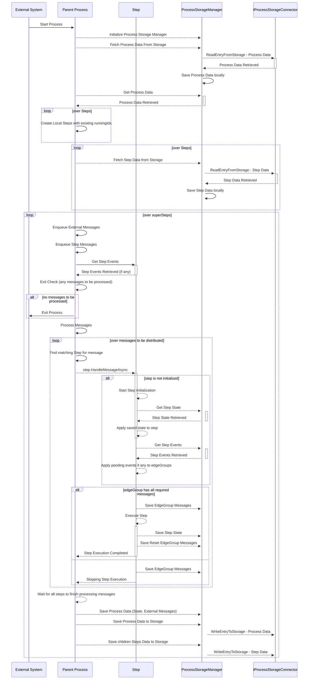

# Local Runtime

## Pregal Loop

## Pregal Loop

1. **Enqueue external events**: check `_externalMessages` and add them to current execution `messageChannel` queue.
2. **Enqueue Step Messages**: using `step.GetAllEvents()` get all events emitted by all steps in previous iteration and add them to current execution `messageChannel` queue.
3. **Exit check**:
    - No more messages in `messageChannel` queue.
    - No more external messages getting added to `_externalMessages`.
    - `!keepAlive`?

4. **Process messages**: process messages added to `messageChannel` queue and inject them to matching step event/edges with `step.HandleMessageAsync()`.

5. **Wait all step with new messages**: wait all steps with new messages to finish processing new messages. `Task.WhenAll(messageTasks)`.

## Requirements

- Should only save to storage at the end of pregal superstep iteration.
- Should allow saving intermediate state locally while superstep steps finish running.
- Should allow reading from storage only at process initialization.
- In other instances reading happens from local storage manager.
- For steps:
    - save/read step info (name, runningId, parentId, status[does not exist now])
    - save/read step events (edgeGroups messages)
    - save/read step state (if any)
- For process:
    - save/read process info (name, runningId, children name:running id mapping)
    - save/read process events (pending external messages)
    - save/read process state (does not exist now)

## Checkpointing

