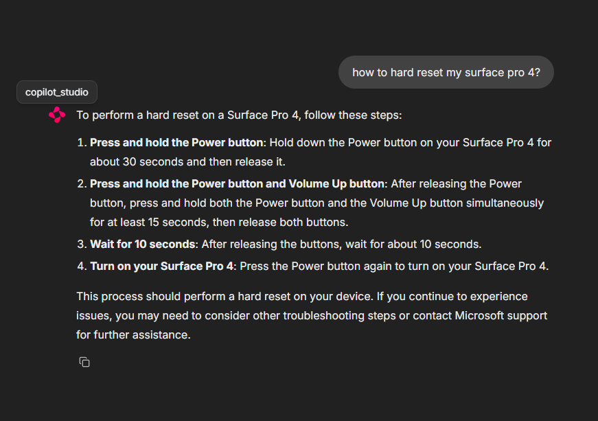

# Copilot Studio Agents interaction

This is a simple example of how to interact with Copilot Studio Agents as they were first-party agents in Semantic Kernel.



## Rationale

Semantic Kernel already features many different types of agents, including `ChatCompletionAgent`, `AzureAIAgent`, `OpenAIAssistantAgent` or `AutoGenConversableAgent`. All of them though involve code-based agents.

Instead, [Microsoft Copilot Studio](https://learn.microsoft.com/en-us/microsoft-copilot-studio/fundamentals-what-is-copilot-studio) allows you to create declarative, low-code, and easy-to-maintain agents and publish them over multiple channels.

This way, you can create any amount of agents in Copilot Studio and interact with them along with code-based agents in Semantic Kernel, thus being able to use the best of both worlds.

## Implementation

The implementation is quite simple, since Copilot Studio can publish agents over DirectLine API, which we can use in Semantic Kernel to define a new subclass of `Agent` named [`DirectLineAgent`](src/direct_line_agent.py).

Additionally, we do enforce [authentication to the DirectLine API](https://learn.microsoft.com/en-us/microsoft-copilot-studio/configure-web-security).

## Usage

> [!NOTE]
> Working with Copilot Studio Agents requires a [subscription](https://learn.microsoft.com/en-us/microsoft-copilot-studio/requirements-licensing-subscriptions) to Microsoft Copilot Studio.

> [!TIP]
> In this case, we suggest to start with a simple Q&A Agent and supply a PDF to answer some questions. You can find a free sample like [Microsoft Surface Pro 4 User Guide](https://download.microsoft.com/download/2/9/B/29B20383-302C-4517-A006-B0186F04BE28/surface-pro-4-user-guide-EN.pdf)

1. [Create a new agent](https://learn.microsoft.com/en-us/microsoft-copilot-studio/fundamentals-get-started?tabs=web) in Copilot Studio
2. [Publish the agent](https://learn.microsoft.com/en-us/microsoft-copilot-studio/publication-fundamentals-publish-channels?tabs=web)
3. Turn off default authentication under the agent Settings > Security
4. [Setup web channel security](https://learn.microsoft.com/en-us/microsoft-copilot-studio/configure-web-security) and copy the secret value

Once you're done with the above steps, you can use the following code to interact with the Copilot Studio Agent:

1. Copy the `.env.sample` file to `.env` and set the `BOT_SECRET` environment variable to the secret value
2. Run the following code:

```bash
python -m venv .venv

# On Mac/Linux
source .venv/bin/activate
# On Windows
.venv\Scripts\Activate.ps1

pip install -r requirements.txt

chainlit run --port 8081 .\chat.py
```
