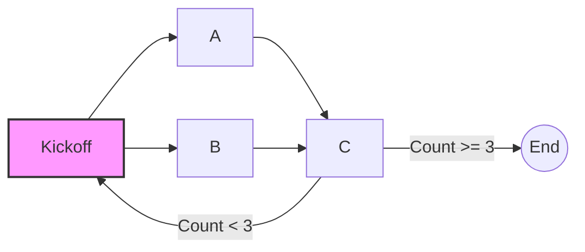

# Semantic Kernel Processes in Dapr

This demo contains a FastAPI app that uses Dapr to run a Semantic Kernel Process. Dapr is a portable, event-driven runtime that can simplify the process of building resilient, stateful application that run in the cloud and/or edge. Dapr is a natural fit for hosting Semantic Kernel Processes and allows you to scale your processes in size and quantity without sacrificing performance, or reliability.

For more information about Semantic Kernel Processes and Dapr, see the following documentation:

#### Semantic Kernel Processes

- [Overview of the Process Framework (docs)](https://learn.microsoft.com/semantic-kernel/frameworks/process/process-framework)
- [Getting Started with Processes (samples)](../../getting_started_with_processes/)

#### Dapr

- [Dapr documentation](https://docs.dapr.io/)
- [Dapr Actor documentation](https://v1-10.docs.dapr.io/developing-applications/building-blocks/actors/)
- [Dapr local development](https://docs.dapr.io/getting-started/install-dapr-selfhost/)

## Running the Demo

Before running this Demo, make sure to configure Dapr for local development following the links above. The Dapr containers must be running for this demo application to run.



1. Build and run the sample. Running the Dapr service locally can be done using the Dapr Cli or with the Dapr VS Code extension. The VS Code extension is the recommended approach if you want to debug the code as it runs.
   - If using VSCode to debug, select the `Pythonapp with Dapr` option from the Run and Debug dropdown list.
1. When the service is up and running, it will expose a single API in localhost port 5001.

#### Invoking the process:

1. Open a web browser and point it to [http://localhost:5001/processes/1234](http://localhost:5001/processes/1234) to invoke a new process with `Id = "1234"`
1. When the process is complete, you should see `{"processId":"1234"}` in the web browser.
1. You should also see console output from the running service with logs that match the following:

```text
##### Kickoff ran.
##### AStep ran.
##### BStep ran.
##### CStep activated with Cycle = '1'.
##### CStep run cycle 2.
##### Kickoff ran.
##### AStep ran.
##### BStep ran.
##### CStep run cycle 3 - exiting.
```

Now refresh the page in your browser to run the same processes instance again. Now the logs should look like this:

```text
##### Kickoff ran.
##### AStep ran.
##### BStep ran.
##### CStep run cycle 4 - exiting.
```

Notice that the logs from the two runs are not the same. In the first run, the processes has not been run before and so it's initial
state came from what we defined in the process:

**_First Run_**

- `CState` is initialized with `Cycle = 1` which is the initial state that we specified while building the process.
- `CState` is invoked a total of two times before the terminal condition of `Cycle >= 3` is reached.

In the second run however, the process has persisted state from the first run:

**_Second Run_**

- `CState` is initialized with `Cycle = 3` which is the final state from the first run of the process.
- `CState` is invoked only once and is already in the terminal condition of `Cycle >= 3`.

If you create a new instance of the process with `Id = "ABCD"` by pointing your browser to [http://localhost:5001/processes/ABCD](http://localhost:5001/processes/ABCD), you will see the it will start with the initial state as expected.

## Understanding the Code

Below are the key aspects of the code that show how Dapr and Semantic Kernel Processes can be integrated into a FastAPI app:

- Create a new Dapr FastAPI app.
- Add the required Semantic Kernel and Dapr packages to your project:

**_General Imports and Dapr Packages_**

```python
# Copyright (c) Microsoft. All rights reserved.

import asyncio
import logging
from contextlib import asynccontextmanager
from enum import Enum
from typing import TYPE_CHECKING, ClassVar

import uvicorn
from dapr.actor import ActorId
from dapr.actor.runtime.context import ActorRuntimeContext
from dapr.ext.fastapi import DaprActor, DaprApp
from fastapi import FastAPI
from fastapi.responses import JSONResponse
from pydantic import Field
```

**_Semantic Kernel Process Imports_**

```python
from semantic_kernel import Kernel
from semantic_kernel.functions import kernel_function
from semantic_kernel.kernel_pydantic import KernelBaseModel
from semantic_kernel.processes.dapr_runtime.actors.event_buffer_actor import EventBufferActor
from semantic_kernel.processes.dapr_runtime.actors.external_event_buffer_actor import ExternalEventBufferActor
from semantic_kernel.processes.dapr_runtime.actors.message_buffer_actor import MessageBufferActor
from semantic_kernel.processes.dapr_runtime.actors.process_actor import ProcessActor
from semantic_kernel.processes.dapr_runtime.actors.step_actor import StepActor
from semantic_kernel.processes.dapr_runtime.dapr_kernel_process import start
from semantic_kernel.processes.kernel_process.kernel_process_step import KernelProcessStep
from semantic_kernel.processes.kernel_process.kernel_process_step_context import KernelProcessStepContext
from semantic_kernel.processes.kernel_process.kernel_process_step_state import KernelProcessStepState
from semantic_kernel.processes.process_builder import ProcessBuilder
```

**_Define the FastAPI app, Dapr App, and the DaprActor_**

```python
kernel = Kernel()


def process_actor_factory(ctx: ActorRuntimeContext, actor_id: ActorId) -> ProcessActor:
    """Factory function to create ProcessActor instances with dependencies."""
    return ProcessActor(ctx, actor_id, kernel)


def step_actor_factory(ctx: ActorRuntimeContext, actor_id: ActorId) -> StepActor:
    """Factory function to create StepActor instances with dependencies."""
    return StepActor(ctx, actor_id, kernel=kernel)


@asynccontextmanager
async def lifespan(app: FastAPI):
    print("## actor startup ##")
    await actor.register_actor(ProcessActor, actor_factory=process_actor_factory)
    await actor.register_actor(StepActor, actor_factory=step_actor_factory)
    await actor.register_actor(EventBufferActor)
    await actor.register_actor(MessageBufferActor)
    await actor.register_actor(ExternalEventBufferActor)
    yield


app = FastAPI(title="SKProcess", lifespan=lifespan)
dapr_app = DaprApp(app)
actor = DaprActor(app)
```

- Build and run a Process as you normally would. For this Demo we run a simple example process from with a FastAPI method in response to a GET request. [See the FastAPI app here](./app.py).
