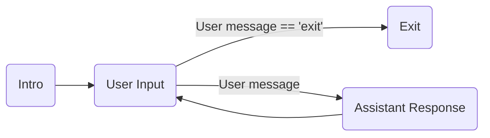

# Semantic Kernel Processes - Getting Started

This project contains a step by step guide to get started with  _Semantic Kernel Processes_.

#### PyPI:
- The initial release of the Python Process Framework was in the Semantic Kernel pypi version 1.12.0.

#### Sources

- [Semantic Kernel Process Framework](../../semantic_kernel/processes/)
- [Semantic Kernel Processes - Kernel Process](../../semantic_kernel/processes/kernel_process/)
- [Semantic Kernel Processes - Local Runtime](../../semantic_kernel/processes/local_runtime/)

The examples can be run as scripts and the code can also be copied to stand-alone projects, using the proper package imports.

## Examples

The getting started with agents examples include:

Example|Description
---|---
[step01_processes](../getting_started_with_processes/step01_processes.py)|How to create a simple process with a loop and a conditional exit

### step01_processes

## Configuring the Kernel

Similar to the Semantic Kernel Python concept samples, it is necessary to configure the secrets
and keys used by the kernel. See the follow "Configuring the Kernel" [guide](../concepts/README.md#configuring-the-kernel) for
more information.

## Running Concept Samples

Concept samples can be run in an IDE or via the command line. After setting up the required api key
for your AI connector, the samples run without any extra command line arguments.
