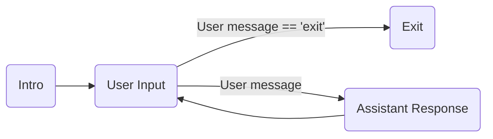
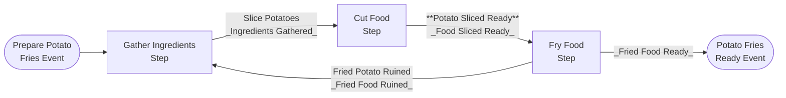
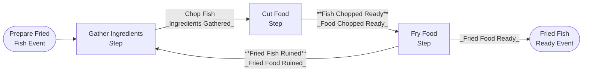
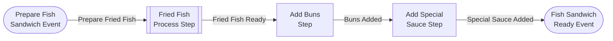
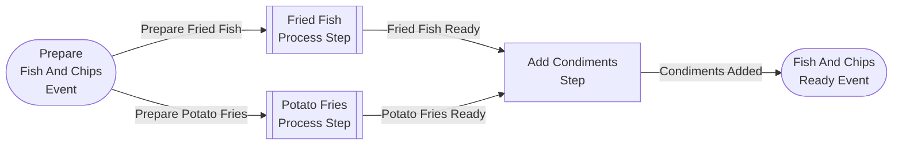
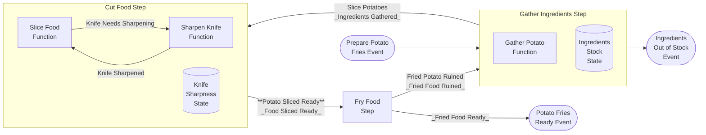
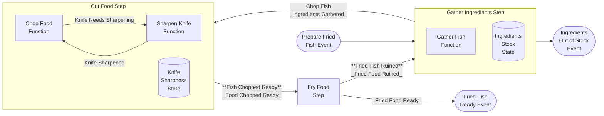
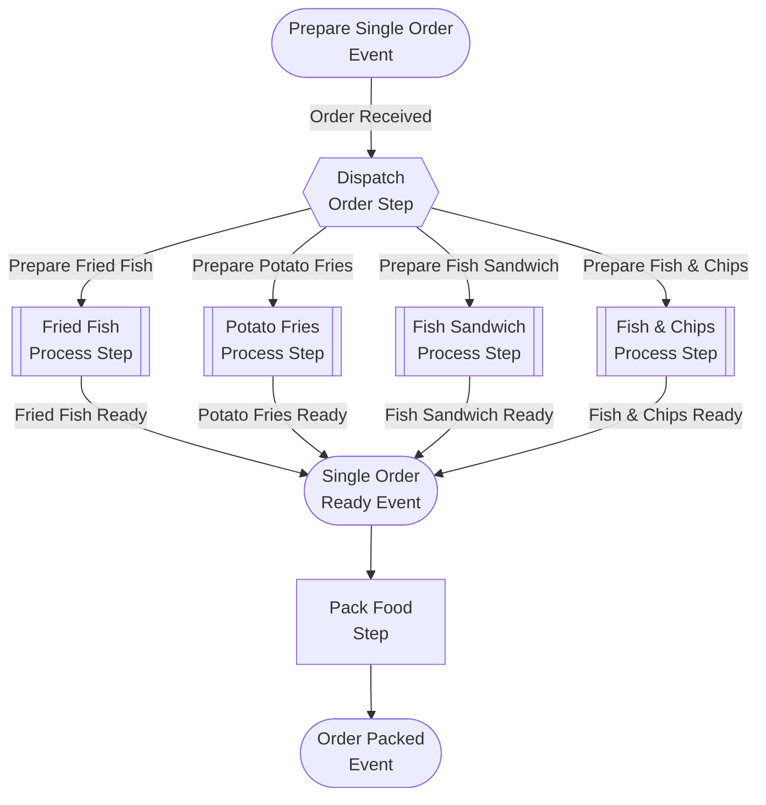

# Semantic Kernel Processes - Getting Started

This project contains a step by step guide to get started with  _Semantic Kernel Processes_.


#### PyPI:
- The initial release of the Python Process Framework was in the Semantic Kernel pypi version 1.12.0.

#### Sources

- [Semantic Kernel Process Framework](../../semantic_kernel/processes/)
- [Semantic Kernel Processes - Kernel Process](../../semantic_kernel/processes/kernel_process/)
- [Semantic Kernel Processes - Local Runtime](../../semantic_kernel/processes/local_runtime/)

The examples can be run as scripts and the code can also be copied to stand-alone projects, using the proper package imports.

## Examples

The getting started with processes examples include:

Example|Description
---|---
[step01_processes](../getting_started_with_processes/step01/step01_processes.py)|How to create a simple process with a loop and a conditional exit|
[step03a_food_preparation](../getting_started_with_processes/step03/step03a_food_preparation.py)|Showcasing reuse of steps, creation of processes, spawning of multiple events, use of stateful steps with food preparation samples.
[step03b_food_ordering](../getting_started_with_processes/step03/step03b_food_ordering.py)|Showcasing use of subprocesses as steps, spawning of multiple events conditionally reusing the food preparation samples. 

### step01_processes



### step03a_food_preparation

This tutorial contains a set of food recipes associated with the Food Preparation Processes of a restaurant.

The following recipes for preparation of Order Items are defined as SK Processes:

#### Product Preparation Processes

##### Stateless Product Preparation Processes

###### Potato Fries Preparation Process



###### Fried Fish Preparation Process



###### Fish Sandwich Preparation Process



###### Fish And Chips Preparation Process



##### Stateful Product Preparation Processes

The processes in this subsection contain the following modifications/additions to previously used food preparation processes:

- The `Gather Ingredients Step` is now stateful and has a predefined number of initial ingredients that are used as orders are prepared. When there are no ingredients left, it emits the `Out of Stock Event`.
- The `Cut Food Step` is now a stateful component which has a `Knife Sharpness State` that tracks the Knife Sharpness.
- As the `Slice Food` and `Chop Food` Functions get invoked, the Knife Sharpness deteriorates.
- The `Cut Food Step` has an additional input function `Sharpen Knife Function`.
- The new `Sharpen Knife Function` sharpens the knife and increases the Knife Sharpness - Knife Sharpness State.
- From time to time, the `Cut Food Step`'s functions `SliceFood` and `ChopFood` will fail and emit a `Knife Needs Sharpening Event` that then triggers the `Sharpen Knife Function`.


###### Potato Fries Preparation With Knife Sharpening and Ingredient Stock Process

The following processes is a modification on the process [Potato Fries Preparation](#potato-fries-preparation-process) 
with the the stateful steps mentioned previously.



###### Fried Fish Preparation With Knife Sharpening and Ingredient Stock Process

The following process is a modification on the process [Fried Fish Preparation](#fried-fish-preparation-process) 
with the the stateful steps mentioned previously.



### step03b_food_ordering

#### Single Order Preparation Process

Now with the existing product preparation processes, they can be used to create an even more complex process that can decide what product order to dispatch.



## Configuring the Kernel

Similar to the Semantic Kernel Python concept samples, it is necessary to configure the secrets
and keys used by the kernel. See the follow "Configuring the Kernel" [guide](../concepts/README.md#configuring-the-kernel) for
more information.

## Configuring Max Supersteps

Process execution is run with a configuration of `max_supersteps`. By default, the `max_supersteps` is configured at `100`. 

To adjust the value, pass the `max_supersteps` keyword argument to the `start` method for the given runtime:

```python
from semantic_kernel.processes.local_runtime.local_kernel_process import start

async with await start(
    process=kernel_process,
    kernel=kernel,
    initial_event=KernelProcessEvent(id=CommonEvents.StartProcess),
    max_supersteps=50,  # Configure the max number of supersteps for process run
) as process_context:
    process_state = await process_context.get_state()
    # Handle process state...
```

## Running Concept Samples

Concept samples can be run in an IDE or via the command line. After setting up the required api key
for your AI connector, the samples run without any extra command line arguments.
