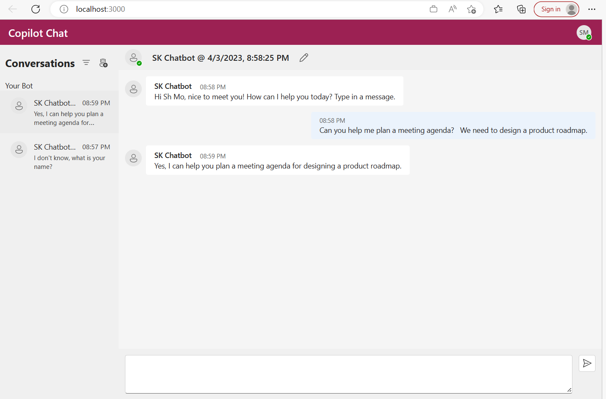
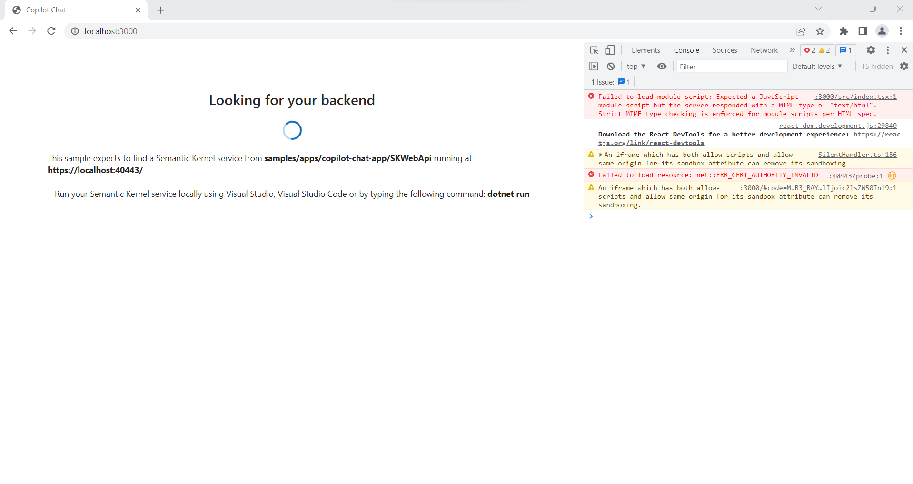

# Chat Copilot Sample Application

> **IMPORTANT:** This sample is for educational purposes only and is not recommended for production deployments.

This sample allows you to build your own integrated large language model (LLM) chat copilot. The sample uses two applications: a front-end web UI app and a back-end API server. 

These quick-start instructions run the sample locally. To deploy the sample to Azure, please view [Deploying Chat Copilot](https://github.com/microsoft/semantic-kernel/blob/main/samples/apps/copilot-chat-app/deploy/README.md).

> **IMPORTANT:** Each chat interaction will call Azure OpenAI/OpenAI which will use tokens that you may be billed for.



# Prerequisites
You will need the following to run the sample:

- An [Azure OpenAI](https://aka.ms/oai/access) resource or [OpenAI](https://platform.openai.com) account.
- Your `API key` for Azure OpenAI or OpenAI
- The endpoint address for an Azure Open AI resource (e.g., `http://contoso.openai.azure.com`). This is not needed if using OpenAI.
- An Azure Active Directory (AAD) [application registration](https://learn.microsoft.com/en-us/azure/active-directory/develop/quickstart-register-app).
- The `Application (client) ID` of your registered application. (See [application registration](https://learn.microsoft.com/en-us/azure/active-directory/develop/quickstart-register-app) instructions.)

# Setup Instructions
## Windows
1. Open PowerShell as an administrator.
2. Configure environment:

    ```powershell
    cd <path to semantic-kernal>\samples\apps\copilot-chat-app
    .\scripts\Install-Requirements.ps1
    ```

3. Configure Chat Copilot: **TO DO: link/instruction on where to find application id and endpoint, api key too?
      
    ```powershell
    .\scripts\Configure.ps1 -AIService {AI_SERVICE} -APIKey {API_KEY} -ClientId {AZURE_APPLICATION_ID} -Endpoint {AZURE_OPENAI_ENDPOINT} 
    ```

    - `AI_SERVICE`: AzureOpenAI or OpenAI
    - `API_KEY`: The API Key for Azure OpenAI or for OpenAI.
    - `AZURE_APPLICATION_ID`: The application ID associated with the Azure Active Directory [application registration](https://learn.microsoft.com/en-us/azure/active-directory/develop/quickstart-register-app).
    - `AZURE_OPENAI_ENDPOINT`: The Azure OpenAI resource Endpoint address (e.g., `http://contoso.openai.azure.com`). Omit this parameter and associated `-Endpoint` flag if using OpenAI.


4. Run Chat Copilot locally:
   
    ```powershell
    .\scripts\Start.ps1
    ```

## Ubuntu/Debian Linux
1. Open Bash as an administrator.
2. Configure environment:
  
    ```bash
    cd <path to semantic-kernel>/samples/apps/copilot-chat-app/
    ./scripts/Install-Requirements-UbuntuDebian.sh
    ```

3. Configure Chat Copilot: **TO DO: link/instruction on where to find application id and endpoint, api key too?

    ```bash
    ./scripts/Configure.sh --aiservice {AI_SERVICE} --apikey {API_KEY} --clientid {AZURE_APPLICATION_ID} --endpoint {AZURE_OPENAI_ENDPOINT}
    ```

    - `AI_SERVICE`: AzureOpenAI or OpenAI
    - `API_KEY`: The API Key for Azure OpenAI or for OpenAI.
    - `AZURE_APPLICATION_ID`: The application ID associated with the Azure Active Directory [application registration](https://learn.microsoft.com/en-us/azure/active-directory/develop/quickstart-register-app).
    - `AZURE_OPENAI_ENDPOINT`: The Azure OpenAI resource Endpoint address (e.g., `http://contoso.openai.azure.com`). Omit this parameter and associated `-Endpoint` flag if using OpenAI.
    
4. Run Chat Copilot locally:
   
    ```bash
    chmod +x ./scripts/Start.sh
    ./scripts/Start.sh
    ```

## Other Linux/macOS
All steps must be completed manually at this time.
1. Configure environment. Install:

   - [.NET 7.0 SDK](https://dotnet.microsoft.com/download/dotnet/7.0)
   - [Node.js](https://nodejs.org/) 14 or newer
   - [Yarn](https://classic.yarnpkg.com/lang/en/docs/install) classic v1.22.19

2. Configure and run Chat Copilot backend locally

    - Open a terminal and set your Azure OpenAI or OpenAI key:
    
        ```bash
        cd <path to semantic-kernel>/samples/apps/copilot-chat-app/webapi/
        dotnet user-secrets set "AIService:Key" "MY_AZUREOPENAI_OR_OPENAI_KEY"
        ```

    - Install dev certificate:
  
        Linux:
        ```bash
        dotnet dev-certs https
        ```

        macOS:
        ```bash
        dotnet dev-certs https --trust
        ```

    - Update configuration settings:

        1. Open `appsettings.json`
        2. Find the `AIService` section and update:

            - `Type`: The AI service you will use (`AzureOpenAI` or `OpenAI`).
            - `Endpoint`: Your Azure OpenAI resource endpoint address (e.g., `http://contoso.openai.azure.com`). For OpenAI, leave this empty.
            - `Completion`, `Embedding`, `Planner`: The models you will use. 
                > IMPORTANT: For OpenAI, use a '.' in `gpt-3.5-turbo`.  For Azure OpenAI, omit the '.' (e.g. `gpt-35-turbo`).

    -  Run the backend locally:

        ```bash
        dotnet build && dotnet run
        ```

3. Configure and run Chat Copilot frontend locally

    - Open a terminal and create an `.env` file from the template:
    
        ```bash
        cd <path to semantic-kernel>/samples/apps/copilot-chat-app/webapp/
        cp .env.example .env
        ```

    - Update configuration settings:

        1. Open `.env`
        2. Update `REACT_APP_AAD_CLIENT_ID` with the AAD `Application (client) ID` associated with the Azure Active Directory [application registration](https://learn.microsoft.com/en-us/azure/active-directory/develop/quickstart-register-app).

            ```bash
            REACT_APP_BACKEND_URI=https://localhost:40443/
            REACT_APP_AAD_AUTHORITY=https://login.microsoftonline.com/common
            REACT_APP_AAD_CLIENT_ID={Your Application (client) ID}
            ```
      
    - Run the frontend locally:

        ```bash
        yarn install && yarn start
        ```


# Troubleshooting

1. **_Issue:_** Unable to load chats. 
   
   _Details_: interaction_in_progress: Interaction is currently in progress._ 

    _Explanation_: The WebApp can display this error when the application is configured for a different AAD tenant from the browser, (e.g., personal/MSA account vs work/school account). 
    
    _Solution_: Either use a private/incognito browser tab or clear your browser credentials/cookies.

2. **_Issue:_**: Challenges using text completion models, such as `text-davinci-003`

    _Solution_: For OpenAI, see [model endpoint compatibility](https://platform.openai.com/docs/models/model-endpoint-compatibility) for
    the complete list of current models supporting chat completions. For Azure OpenAI, see [model summary table and region availability](https://learn.microsoft.com/en-us/azure/ai-services/openai/concepts/models#model-summary-table-and-region-availability).

3. **_Issue:_** Localhost SSL certificate errors / CORS errors

    

    _Explanation_: Your browser may be blocking the frontend access to the backend while waiting for your permission to connect. 
    
    _Solution_:
    
    1. Confirm the backend service is running. Open a web browser and navigate to `https://localhost:40443/healthz`
       - You should see a confirmation message: `Healthy`
       - If your browser asks you to acknowledge the risks of visiting an insecure website, you must acknowledge this before the frontend can connect to the backend server. 
    2. Navigate to `http://localhost:3000` or refresh the page to use the Chat Copilot application.

4. **_Issue:_** Yarn is not working.

    _Explanation_: You may have the wrong Yarn version installed such as v2.x+.

    _Solution_: Use the classic version.

    ```bash
    npm install -g yarn
    yarn set version classic
    ```
