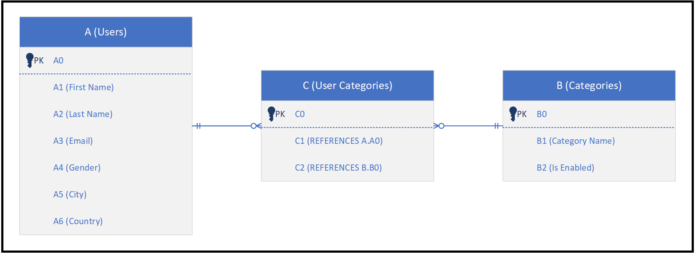

# Setup: DescriptionTest Database

`DescriptionTest` is a database designed to exercise the description semantics of the schema expression and is populated with synthetic data.  

The table and column names are completely devoid of meaning, forcing the model to rely on semantic description:

